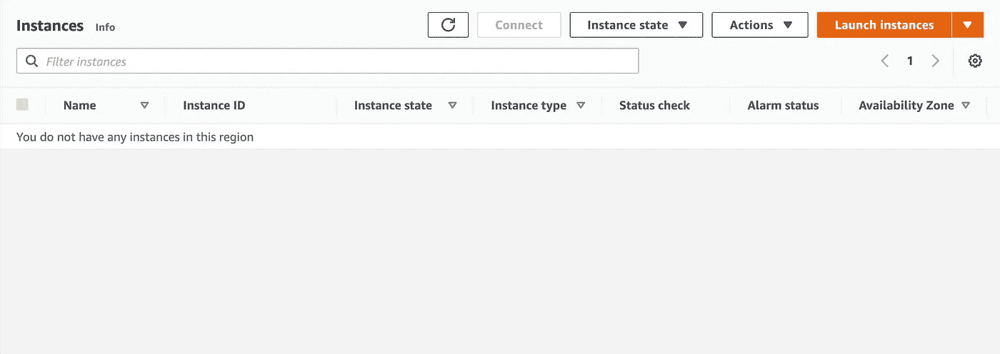
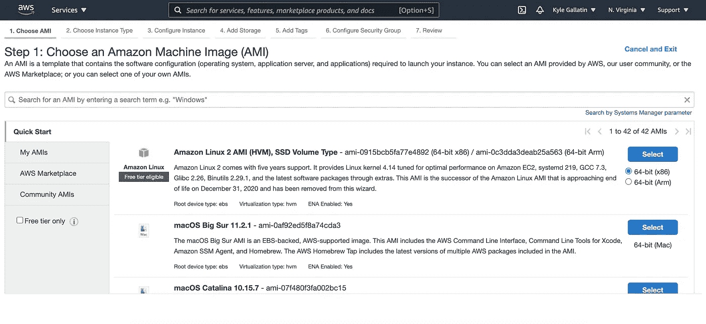
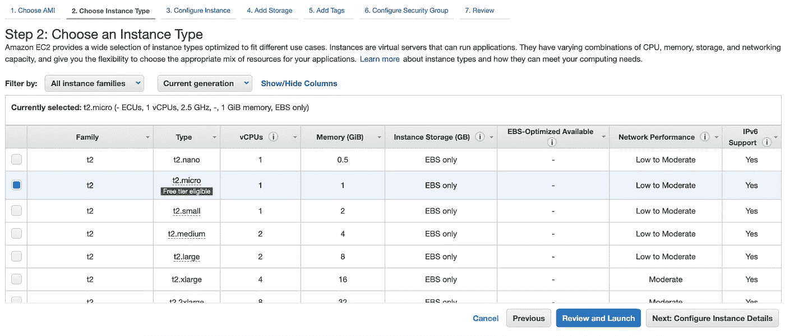
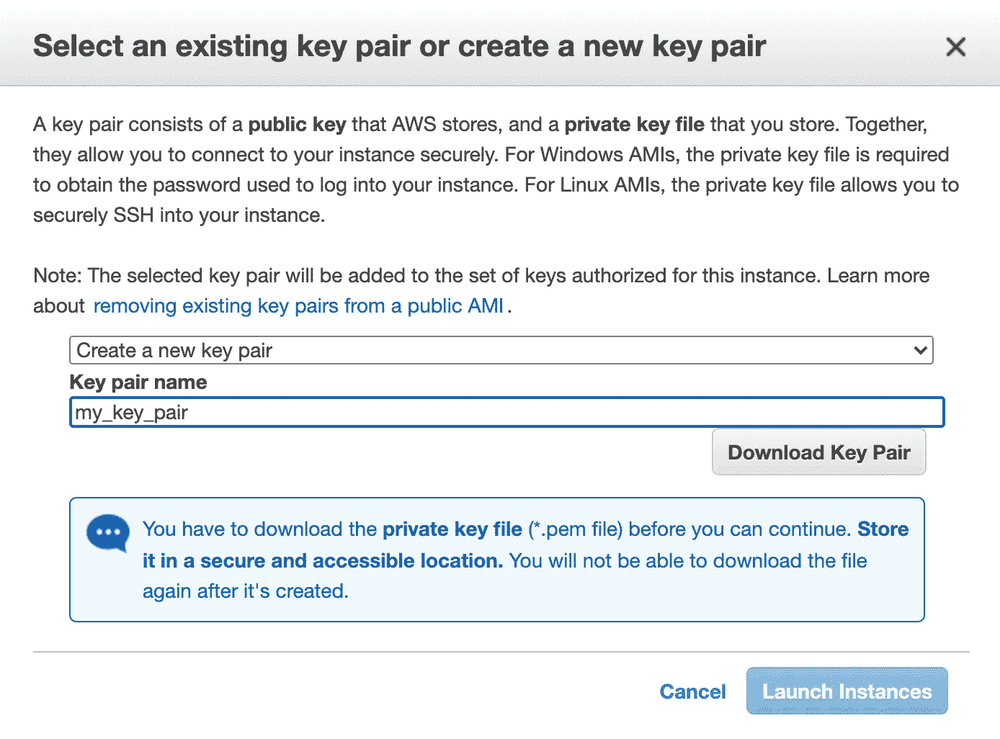
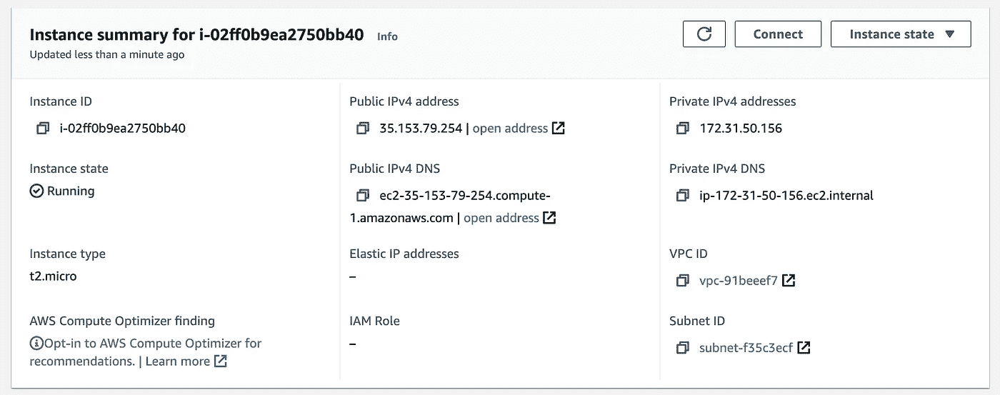
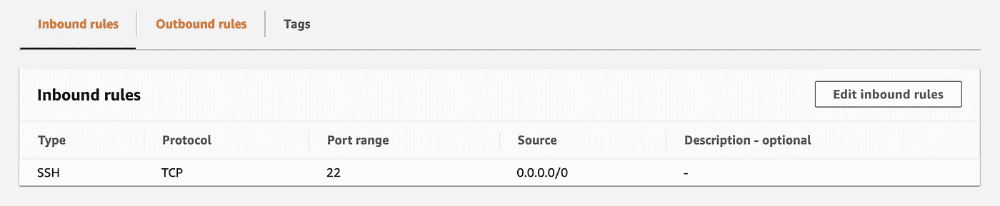
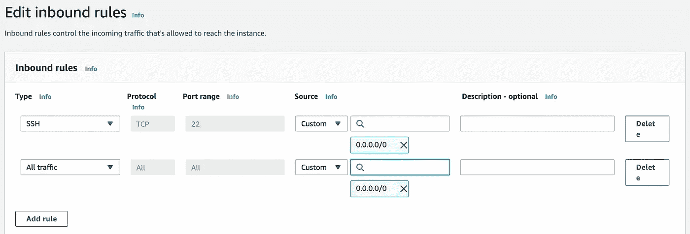
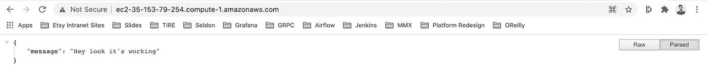
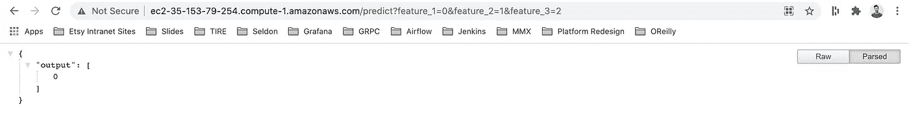

# 在 AWS 上部署 ML 应用的最快方式，无需最佳实践

> 原文：<https://towardsdatascience.com/the-fastest-way-to-deploy-your-ml-app-on-aws-with-zero-best-practices-df15c09eead7?source=collection_archive---------22----------------------->

## 在 15 分钟内将一个机器学习 API 发布到互联网上

您一直在开发您的 ML 应用程序，一个现场演示很快就会出现。你想把它推到 Github，添加 Docker，并重构代码，但是你昨天花了一整天在一些你仍然没有真正理解的愚蠢的`pickle`错误上。现在，在演示之前，您只有 1 个小时的时间，您的 ML 应用程序需要在互联网上可用。你只需要能够通过浏览器访问你的模型 15 秒钟，向一些高管展示。


照片由 [Unsplash](https://unsplash.com?utm_source=medium&utm_medium=referral) 上的[Braden colum](https://unsplash.com/@bradencollum?utm_source=medium&utm_medium=referral)拍摄

本教程是在 AWS 上为您的模型创建公共端点的“零最佳实践”方法。在我看来，这是创建模型端点的最短路径之一，假设您没有任何其他工具设置(SCM、Docker、SageMaker ),并且已经用 Python 编写了一个小应用程序。

你需要:

1.  AWS 控制台
2.  一个终端
3.  您的 ML 应用程序

如果你没有 ML 应用程序，只是想跟着做，这里有我今天早上写的。我的应用程序是用 FastAPI 构建的，因为它…很快…但这将适用于任何 Flask/Dash/Django/Streamlit/无论什么应用程序。

# 创建 EC2 实例

登录控制台，搜索“EC2”并导航到实例页面。



单击“启动实例”。现在，您必须选择一种机器类型。你很着急，就直接点你看到的第一个符合条件的(亚马逊 Linux 2 AMI)。



您决定保留默认设置(保留 t2.micro ),然后单击“查看并启动”。



创建新的密钥对，单击“下载密钥对”,然后启动实例。



# 打开端口 80

当我们在控制台中时，让我们打开端口 80 来访问 web 流量。导航回实例页面并单击您的实例。



我已经删除了这个

转到“Security”选项卡，在 security groups click 下应该有一个您可以点击的链接，看起来像是`sg-randomletters (launch-wizard-3)`。在下一页上，滚动到底部，然后转到“编辑入站规则”。



添加一个带有`0.0.0.0/0` CIDR 区块的所有交通规则，然后保存。



# 将文件复制到实例中

现在我们的实例已经准备好了，所以让我们把文件准备好。为了简单起见，我们可以设置两个环境变量。`KEY`是您之前下载的`.pem`文件的路径，`HOST`是您可以在实例页面上查看的公共 IPv4 DNS 名称。

编辑下面的示例以包含您的信息。这些命令假设 macOS/Linux，对于 Windows 检查出 [PuTT](https://www.putty.org/) Y。

```
export HOST=ec2-35-153-79-254.compute-1.amazonaws.com
export KEY=/PATH/TO/MY/KEY.pem
```

现在我们可以复制我们的文件了。同样，如果你没有 ML 应用程序，克隆我的一个，并`cd`到目录中。

```
git clone [https://github.com/kylegallatin/fast-bad-ml.git](https://github.com/kylegallatin/fast-bad-ml.git)
cd fast-bad-ml
```

现在复制一切。

```
chmod 700 $KEY
scp -i $KEY -r $(pwd) ec2-user@$HOST:/home/ec2-user
```

键入`yes`，你会看到文件正在被复制。如果你得到消息说你的权限在关键文件上过于开放，只要运行`chmod 700 $KEY`就可以了。

# 设置您的实例

现在是时候`ssh`进入并开始一个会话，这样我们就可以运行我们的应用程序了。

```
ssh -i $KEY ec2-user@$HOST
```

运行`pwd && ls`会显示你在`/home/ec2-user`中，之前目录的内容已经被复制。现在`cd`进入该目录并设置 Python(假设您有一个`requirements.txt`)。

```
cd fast-bad-ml
sudo yum install python3
sudo python3 -m pip install -r requirements.txt
```

# 运行并测试您的应用

现在一切都安装好了，使用主机`0.0.0.0`在端口 80(默认 web 流量)上启动您的应用程序(绑定到所有地址— `127.0.0.1`不起作用)。

下面的命令是我的 FastAPI 应用程序的`uvicorn`命令，但只要主机/端口相同，您可以替换该部分以适应您的应用程序。

```
sudo /usr/local/bin/uvicorn app:app --reload --port 80 --host 0.0.0.0 &
```

`&`在后台运行该进程，因此当您退出会话时它不会停止，并保持可用。添加`nohup`以重定向日志供以后阅读。

您现在可以从互联网访问该应用程序。使用与之前相同的公共 IPv4 DNS，并将其复制到浏览器中。我已经配置了`/`路由来返回一个简单的消息。



如果您已经公开了一个接受查询参数的`/predict`方法，那么您也可以通过 URL 传递这些参数来获得您的预测。格式为`$HOST/$ROUTE/?$PARAM1=X&$PARAM2=Y...`。



# 结论

我只想提醒一下，这和生产没有任何关系。即使我们引入了 Docker 和 Kubernetes 的规模，真正的“生产”还需要测试、自动化 CI/CD、监控等等。但为了让你准时参加演示？没有比这更好的了。祝你好运！