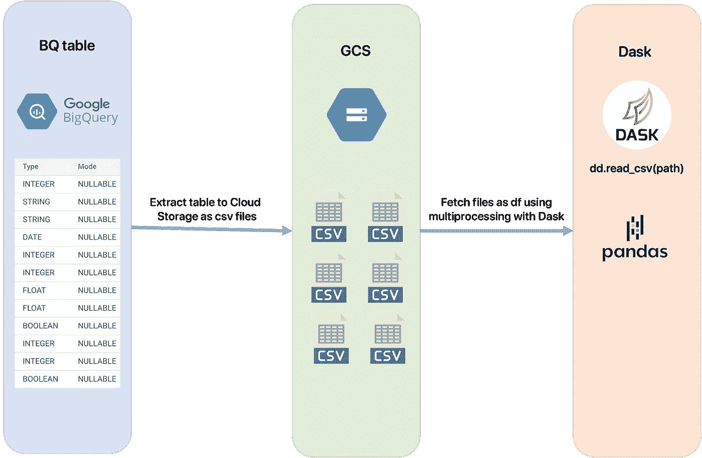
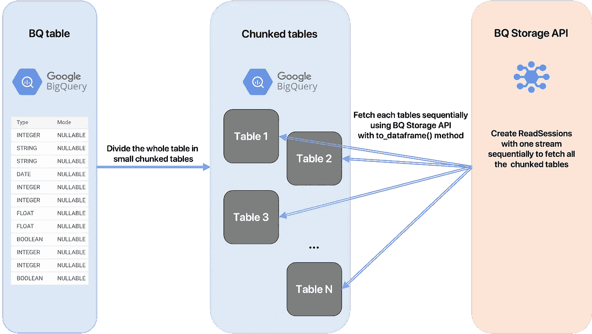
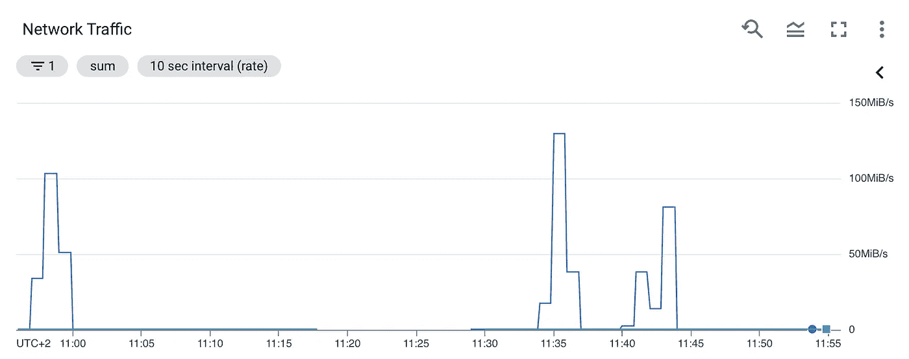
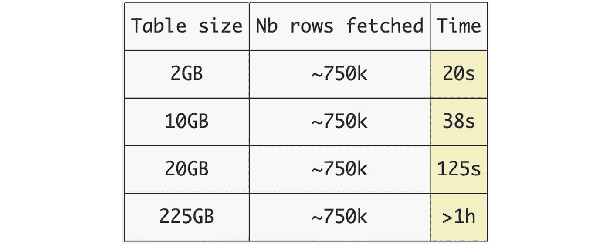

# 获取 BigQuery 表的最快方法

> 原文：<https://towardsdatascience.com/the-fastest-way-to-fetch-bigquery-tables-352e2e26c9e1?source=collection_archive---------6----------------------->

## 从 BigQuery 获取表的最快方法的基准。还介绍了 bqfetch:一个简单易用的快速抓取工具。

作者图片

作为一名数据工程师，我想尽可能快地从 BigQuery 获取表。我还需要获取这些表格作为熊猫数据帧。因此，我考虑了许多备选方案，我已经使用多个框架对许多实现进行了测试和基准测试，在本文中，我将向您展示我构建的一个工具，该工具允许我以数据帧的形式获取 BQ 表，并获得最佳性能。

> 以下所有建议都是基于在 Google Compute Engines (GCE)上测试的基准，根据您使用的机器和互联网带宽，可能存在一些更好的实现。

## 旧方法

使用 GCS 的提取方法和使用 dask 的多重处理

从 BigQuery 获取数据的一个众所周知的方法如下:

*   使用 GZIP 压缩将表提取到 Google 云存储中。它将创建多个 csv 文件，每个文件包含表中的一些行，使用 GZIP 格式压缩。使用 BigQuery API 时，此操作没有成本。
*   使用 [Dask](https://dask.org/) 框架，使用`read_csv(path_to_gcs_bucket)`方法获取桶中的所有文件，使用机器上所有可用内核的多处理。这个方法返回一个懒惰的 Dask。因为懒惰而适合内存的数据帧。如果您需要将完整的 df 加载到内存中，那么可以使用`compute()`方法。

这种方法可以获得合适的结果，但是有两个主要的瓶颈:

*   我们必须使用 GCS 来将表转换成多个文件，所以我们认为这不是获取数据的最合适的方法，我们应该有一个更简单和更快的方法。此外，表的压缩及其提取到 GCS 需要时间，所以我们肯定要删除这一部分。
*   使用这种方法，整个表被同时取出，如果不使用 Dask 的`compute()`方法，我们不能正确使用数据帧，如果使用它，df 必须适合内存。

## 新方法

通过 BQ 存储 API 使用分块表的新方法

尽管有其局限性， [BigQuery 存储 API](https://cloud.google.com/bigquery/docs/reference/storage) 具有直接获取表的优势，因此我们不必担心 GCS 部分，这使我们在使用第一种方法时感到恼火。

使用示例解释该方法:

*   假设我们有一台 16GB 可用内存的机器。为了有效地使用这个内存，我们希望获取最大可用空间的数据，然后处理它，并重复这个过程，直到表被完全获取。所以第一步是把整个表分成大小为<16Gb. However, a DataFrame object is greater than the raw fetched data (basically 1/3 bigger than the fetched data). We can now say that if we fetch ~10.7GB of data we’ll have a DataFrame of size 16GB that will fit into memory. So the idea is to chunk the whole table in N tables of size ~10.7GB. Ex: for a table of size 200GB we’ll create 19 tables of size ~10.7GB.
*   Once we have created all the chunked tables, we just have to fetch them sequentially using the BigQuery Storage API.

> But wait, why do we have do divide the main table in chunked tables? Why can’t we just use a filter with an “IN” SQL statement in order to select only some rows at each time? Here is the reason.

## The filter bottleneck

The following code uses BigQuery Storage API to fetch a table by applying a row filter (only select some rows that match a certain condition in the table). Thus, only the rows that match the SQL expression given in the TableReadOptions constructor will be fetched. The table is of size 220GB and the estimated size of the rows that match a product_id = 1 or 2 is ~2GB.

Demo of BQ Storage fetching using an “IN” SQL statement

Now when looking at the network usage of the compute engine, we figured out that when fetching this chunk of size 2GB from the table of 220GB, the bandwidth peak is only at **2MB/s** 的多个表。

获取整个表时，带宽峰值约为 8MB/s

但在取 22GB 的小表时，网络峰值 **130MB/s** 。

提取小块表时，带宽峰值约为 130MB/s

这是由于[对 BigQuery 存储读取 API](https://cloud.google.com/bigquery/quotas#storage-limits) 的限制。更准确地说，这是因为我们使用了一个过滤器(SQL 中的“IN”子句)，而 API 将这个过滤器的大小限制为 10MB，因此对于大表来说性能很差。

> 结论:当表很小(~≤4GB)时，使用这个 API 获取带有行过滤器的表要好得多。

**多个表中使用行过滤器提取 75 万行的时间基准:**

在不同大小的表中获取 75 万行的时间

这就是为什么我建议绕过这一限制的解决方案是将原始表分成可以更快获取的更小的表。使用这种方法，将表分成更小的表允许您使用相同的时间(在前面的例子中是 20 秒)获取所选的行。

## bqfetch 简介

希望我已经用以前的技术创建了一个工具，我正在我的新项目中使用它。

作者图片

> 我真的鼓励你访问 Github 页面查看文档。

该工具背后的思想与我们之前描述的相同，但有一些特殊之处:

*   从整个表中，选择一个具有最不同值的`index column`(我们可以很容易地将一列分成许多大小大致相同的块)。一个好的列可以是 ID 列，也可以是包含每个不同值的大约。相同的行数。
*   然后执行一个`SELECT DISTINCT index_column`来获得一个。表中元素个数的估计。
*   计算整个表的大小(以 GB 为单位),并应用一个公式来计算我们需要使用机器上的可用内存来划分表的块的数量。所有这些复杂的事情都是在后台完成的，你只需要指定一个 index_column 来将这个表按照这个列的块进行划分。
*   现在我们有了块的数量，算法返回一个块列表，每个块包含 index_column 的多个值。
*   通过循环这些块，我们只需要获取每个块。在每次读取之后，块被划分为在 BigQuery 中创建的最佳数量的表，这些表位于表使用的同一数据集中。然后，使用 BigQuery 存储 API(有或没有多重处理)获取表。最后，删除以前创建的表。
*   使用这种技术，**内存将得到最佳利用**，如果您指定正确的块大小，内存将不会溢出。

## 演示

*   首先，我们必须创建一个`BigQueryTable`对象，它包含存储在 GCP 的 BigQuery 表的路径。
*   创建一个获取器，在参数中给定 service_account.json 文件的绝对路径，该文件是必需的，以便在 GCP 中执行操作。
*   给定`column`名称和`chunk size`，将整个表分成块。在这种情况下，选择“id”列是完美的，因为该列的每个值都出现了相同的次数:1 次。关于块的大小，如果`by_chunk_size` =2，那么在机器上获取的每个块的大小都是 2GB。因此，它必须适合内存。您需要节省 1/3 的内存，因为 DataFrame 对象的大小比原始获取的数据大，正如我们前面看到的。
*   对于每个块，获取它。`nb_cores` =-1 将使用机器上可用的内核数量。`parallel_backend` = '台球' | 'joblib' | '多重处理'指定要使用的后端框架。如果`by_chunk_size` =2，那么返回的数据帧大小将是 2，66 (2+2*(1/3))(这在很大程度上取决于表的模式，所以请在此之前自行测试)。

## 多重处理

是的，这个工具使用台球、joblib 和多处理后端实现了多处理。您只需设置`nb_cores`，获取将使用`nb_cores`进程启动。每个区块将根据进程数量进行划分，每个进程将运行 BQ 存储读取会话，并应用包含每个区块中的值的行过滤器。

> 然而，**我强烈建议您**在开始使用之前，先阅读我之前的一篇关于使用多处理的 BigQuery 存储基准的文章。

**总之，这里有一个使用 bqfetch 的多处理实现的例子。**

## 结论

经过多次研究和基准测试，我发现使用分块表的 BigQuery 存储 API 实现是(对于我的用例)从 BigQuery 获取表的最有效的方式。我用我展示给你的工具将我的主要项目的获取时间除以 6，我希望它能帮助其他数据工程师的工作。我对 GitHub 上的改进建议或贡献请求非常开放，所以如果你想谈论这些，请不要犹豫与我联系。