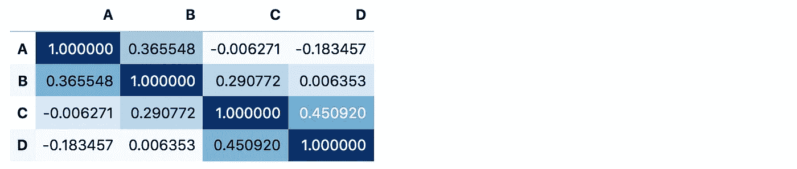
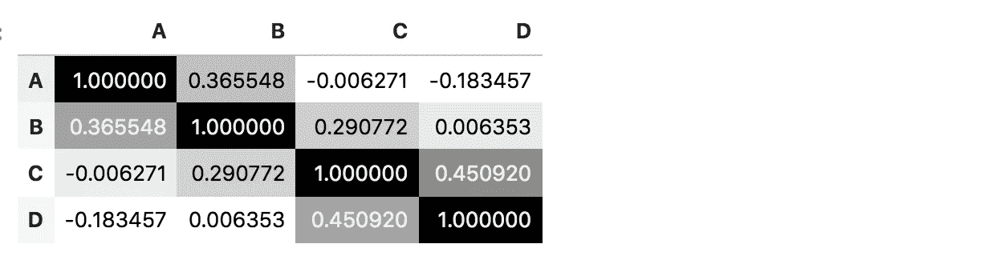
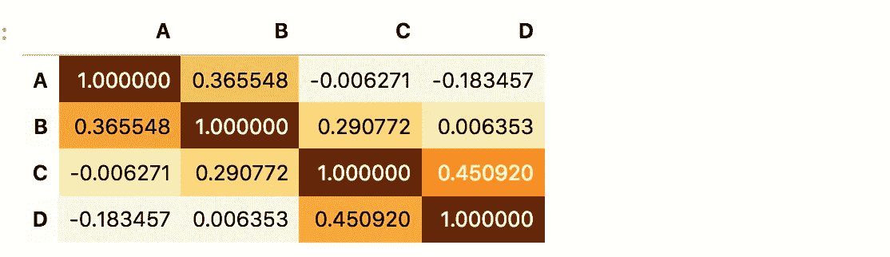
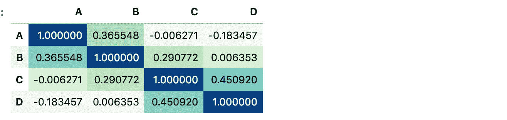

# 用 Python 可视化相关性的最快方法

> 原文：<https://towardsdatascience.com/the-fastest-way-to-visualize-correlation-in-python-ce10ed533346?source=collection_archive---------7----------------------->

## [入门](https://towardsdatascience.com/tagged/getting-started)

## 关于如何在没有第三方绘图包的情况下可视化与熊猫的相关性的简短教程。


[杰瑞米·托马斯](https://unsplash.com/@jeremythomasphoto?utm_source=medium&utm_medium=referral)在 [Unsplash](https://unsplash.com?utm_source=medium&utm_medium=referral) 上拍照

作为一名数据科学家，我经常使用相关性来计算和可视化特征之间的关系。

我以前都是从导入 matplotlib 和 seaborn 包开始，渲染出好看的剧情。但是，当从一个空的 Jupyter 笔记本开始时，导入这两个包只是为了可视化这种关联，这是很麻烦的。

## 有没有更好的办法？

我决定做一点研究，因为我经常使用这个命令——在 Python 中一定有更好(更快)的可视化相关性的方法。瞧，还有…

通过阅读这篇简短的教程，你将学会一种更快捷的方法来计算和可视化与熊猫的相关性。

**这里有几个你可能会感兴趣的链接:**

```
- [Complete your Python analyses 10x faster with Mito](https://trymito.io/) [Product]- [Free skill tests for Data Scientists & ML Engineers](https://aigents.co/skills) [Test]- [All New Self-Driving Car Engineer Nanodegree](https://imp.i115008.net/c/2402645/1116216/11298)[Course]
```

*你愿意多看一些这样的文章吗？如果是这样，你可以点击上面的任何链接来支持我。其中一些是附属链接，但你不需要购买任何东西。*

# 可视化与熊猫相关的最快方法是什么？

假设我们有下面的数据帧(它只有 4 列随机数):

```
import numpy as np
import pandas as pddf = pd.DataFrame(np.random.randint(0, 100, size=(15, 4)), columns=list("ABCD"))
```


带有随机数的熊猫数据框(图片由作者制作)

计算和可视化相关性非常简单(不需要其他第三方软件包):

```
df.corr().style.background_gradient(cmap="Blues")
```



与熊猫的关联(图片由作者制作)

# 不喜欢蓝色？



试试 cmap='Greys '(图片由作者提供)



试试 cmap='YlOrBr ' '(图片由作者提供)



试试 cmap='GnBu '(图片由作者提供)

# 有不同类型的相关性


由 [Deon Black](https://unsplash.com/@deonblack?utm_source=medium&utm_medium=referral) 在 [Unsplash](https://unsplash.com?utm_source=medium&utm_medium=referral) 上拍照

在我们深入研究其他类型的相关性之前，我必须承认，在实践中，除了皮尔逊相关性，我从未使用过其他任何相关性。不管怎样，很高兴知道其他人确实存在，熊猫支持其中一些开箱即用。

请在评论中告诉我，你是否在实践中使用过除皮尔逊相关之外的任何方法，以及用例是什么。

默认情况下，pandas 计算[皮尔逊相关](https://en.wikipedia.org/wiki/Pearson_correlation_coefficient)，这是两组数据之间线性相关的度量。

[**熊猫也支持**](https://pandas.pydata.org/docs/reference/api/pandas.DataFrame.corr.html) **:**

*   肯德尔相关性—与 df.corr('kendall ')一起使用
*   Spearman 关联—与 df.corr('spearman ')一起使用

## 斯皮尔曼相关用于什么？

> [来自 minitab:](https://support.minitab.com/en-us/minitab-express/1/help-and-how-to/modeling-statistics/regression/supporting-topics/basics/a-comparison-of-the-pearson-and-spearman-correlation-methods/)
> 
> Spearman 相关性通常用于评估涉及顺序变量的关系。例如，您可以使用 Spearman 相关性来评估员工完成测试练习的顺序是否与他们受雇的月数有关。

## 肯德尔相关用于什么？

> [从统计数据直接:](https://www.statsdirect.com/help/nonparametric_methods/kendall_correlation.htm)
> 
> Spearman 的秩相关对于检验两个变量之间独立性的零假设是令人满意的，但是当零假设被拒绝时就很难解释了。肯德尔的等级相关性通过反映被比较的变量之间的相关性的强度对此进行了改进。

不出所料，Spearman correlation 产生了与 Pearson 不同的值:

```
df.corr('spearman').style.background_gradient(cmap="Blues")
```


具有随机值的数据帧上的皮尔逊相关(左)与斯皮尔曼相关(右)

# 结论

在不使用其他包的情况下可视化相关性是一个巧妙的技巧，这使得实践数据科学变得更加有趣。

一个这样的命令可能看起来不多，但是在您的工具箱中添加 10 个这样的技巧可以产生很大的不同。

将**style . background _ gradient**应用于关联结果只是冰山一角。这个概念对我已经描述过的很多事情都很有用:

[](/how-to-color-a-pandas-dataframe-41ee45db04f6) [## 如何给熊猫数据框上色？

towardsdatascience.com](/how-to-color-a-pandas-dataframe-41ee45db04f6) 

# 在你走之前

在 [Twitter](https://twitter.com/romanorac) 上关注我，在那里我定期[发布关于数据科学和机器学习的](https://twitter.com/romanorac/status/1328952374447267843)消息。


康特尼·赫格尔在 [Unsplash](https://unsplash.com/?utm_source=medium&utm_medium=referral) 上拍摄的照片