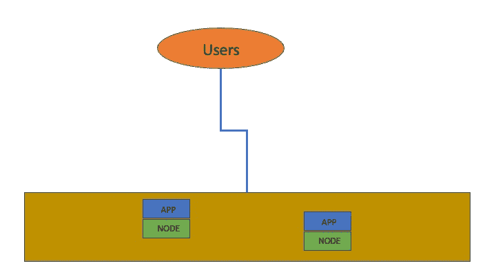
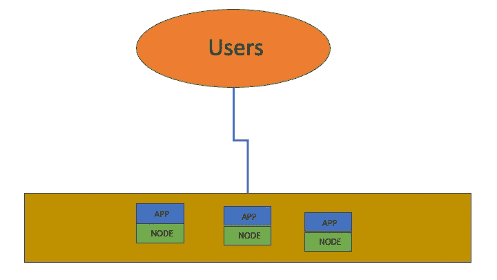
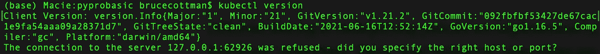
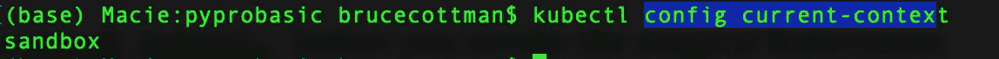
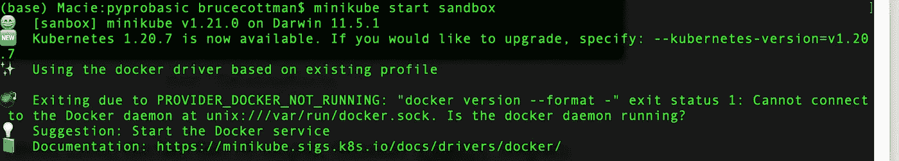
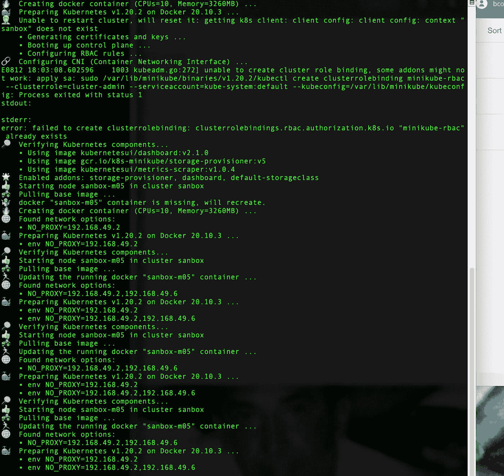
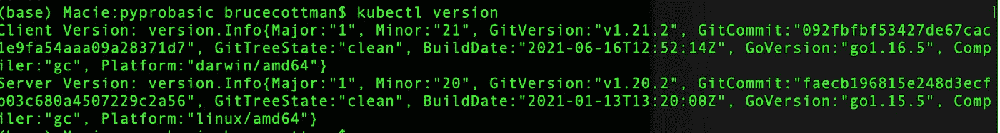

# 高效使用 Kubernetes 的前十个主要概念和代码示例

> 原文：<https://towardsdatascience.com/the-first-nine-primary-concepts-and-code-examples-for-using-kubernetes-productively-d2aabccc0380?source=collection_archive---------35----------------------->

Kubernetes 的解释和使用不应该讨论内部架构组件。相反，我用代码示例讨论 Kubernetes 的基本概念。最后，作为奖励，Kubernetes 在设计上有一个明显的漏洞。


Kubernetes 编排了一个由网络连接的虚拟机云或分布。在 [Unsplash](https://unsplash.com/s/photos/orchestra?utm_source=unsplash&utm_medium=referral&utm_content=creditCopyText) 上由[Manuel n Geli](https://unsplash.com/@gwundrig?utm_source=unsplash&utm_medium=referral&utm_content=creditCopyText)拍摄的照片

# 不使用 Kubernetes 部署和管理应用程序

无论是个人、初创公司还是大型企业，在你向公众推出应用的第一天，都会有少量用户。

第二天或者第三周呢？它会是一个哑弹还是会被广泛传播？

病毒意味着大量的用户。您必须开发和测试软件，以便将不断增加的用户负载分散到您正在交换的计算资源中。



可扩展性意味着计算资源(节点)随着用户负载的增加而增加，模式随着用户负载的减少而闲置——作者的动画。

如果你有负载平衡软件就最好了。

添加计算机节点时，一些早期安装的计算机节点会出现故障。

您必须开发和测试软件来检测、切换、恢复和切换出故障节点。

如果有故障管理软件就最好了。



可扩展性意味着计算资源和应用程序副本(节点)代替了故障节点(红色)——作者的动画。

容错和可扩展性要求监控许多节点。我们需要知道哪些节点正在运行，哪些节点空闲，哪些节点出现了故障。

金发女孩寓言是关于云的使用和成本的一课。

您不希望分配太多的节点，也不希望分配太少的节点。您希望为您的应用程序分配“*恰到好处的*数量的节点。

您有一个从无用应用程序到病毒应用程序的最佳扩展解决方案——Kubernetes。

# 为什么使用 Kubernetes？

嗯，上面的讨论有一些使用 Kubernetes 的好理由。以下列举了更多的原因:

## 充足的理由

1.  Kubernetes 是免费的。
2.  Kubernetes 是[开源](https://github.com/kubernetes/kubernetes)。
3.  Kubernetes 有一个庞大的贡献者社区。
4.  Kubernetes 在谷歌积累了 15 年的经验，使用名为 [Borg](https://research.google.com/pubs/pub43438.html) 的系统大规模运行生产工作负载。
5.  云计算基金会管理着 Kubernetes ( [CNCF](https://www.cncf.io/about) )(不是谷歌)。

## 更好的理由

这些都是很好的理由，我还可以列举更多。然而，对我来说更重要的原因是什么呢？

1.  Kubernetes 实际上是唯一的云操作系统。云供应商提供的其他服务是黑盒软件即服务(SasS)或您必须通过网络连接的单个对象。
2.  Kubernetes 既可以是陈述性的，也可以是命令性的。

[](https://medium.com/payscale-tech/imperative-vs-declarative-a-kubernetes-tutorial-4be66c5d8914) [## 命令式与陈述式——Kubernetes 教程

### 有两种基本的方式部署到 Kubernetes:命令式的，使用许多 kubectl 命令，或者声明式的，通过…

medium.com](https://medium.com/payscale-tech/imperative-vs-declarative-a-kubernetes-tutorial-4be66c5d8914) 

# 我最好的理由

这些都是很好的理由，我还可以列举更多。然而，对我来说最重要的原因是什么？

1.  弹性和可伸缩性是 Kubernetes 的中心主题；
2.  在 Kubernetes 中，弹性(容错)和可伸缩性是声明性的；
3.  Kubernetes 根据用户工作负载进行扩展。
4.  Kubernetes 支持更改，例如图像更新，而不会给最终用户带来停机时间。
5.  我可以在我的沙箱或任何联网的计算资源集群上使用 Kubernetes 作为分布式操作系统。

[](https://alexellisuk.medium.com/walk-through-install-kubernetes-to-your-raspberry-pi-in-15-minutes-84a8492dc95a) [## 演练——15 分钟内将 Kubernetes 安装到您的树莓派中

### 掸掉你的树莓皮，是时候安装 Kubernetes 了，这一次，它将是无痛的——通过度量…

alexellisuk.medium.com](https://alexellisuk.medium.com/walk-through-install-kubernetes-to-your-raspberry-pi-in-15-minutes-84a8492dc95a) 

# 1.Kubernetes 是一个分布式计算操作系统

这个讨论有助于将 Kubernetes 看作是一个分布式计算资源云的操作系统。

Kubernetes 作为一个操作系统有很多部分，是一个复杂的框架。

不同经历和知识水平的人对 Kubernetes 的需求是不同的。我试着在我们都能分享的层面上解释 Kubernetes。

## 库伯内特生态系统(或护城河)

围绕着文档、教程、课程、认证、仪表板、操作方法博客文章、培训工具、持续集成(CI)工具、持续部署工具(CD)、混合云(不止一种云类型)工具和机器学习操作(MLOps)工具，有一个庞大的生态系统。

## Kubernetes 是开源的。

我需要再次提到，Kubernetes 是开源的、免费的，并作为托管服务在所有主要的云供应商(亚马逊、谷歌、IBM、通用微软、Paperspace、阿里巴巴、甲骨文等)上提供。

## Kubernetes 作为云管理服务( [SaaS](https://searchcloudcomputing.techtarget.com/definition/Software-as-a-Service) )。

安装、操作和维护您自己的 Kubernetes 的所有系统管理任务都是作为托管服务为您完成的。

***注*** *: Kubernetes 作为云厂商的托管服务不是免费的。*

## Kubernetes 建筑是美丽的，也是复杂性的最大来源。

除非您参与了 Kubernetes 的开源工作或者实现了一个定制工具，否则您不需要了解 Kubernetes 的架构和内部编排组件。

[](https://appfleet.com/blog/understanding-kubernetes-custom-resource-definitions/) [## 理解和构建 Kubernetes 自定义资源定义(CRDs)

### 比如说，你有一个构建在编排平台上的服务或应用，比如 Kubernetes。在…

appfleet.com](https://appfleet.com/blog/understanding-kubernetes-custom-resource-definitions/) 

我详细介绍了有效使用 Kubernetes 所需的基本概念，同时避免了 Kubernetes 内部架构的复杂性。

***注意****:*[*Octant*](https://octant.dev/)*不认为自己是仪表板。然而,“仪表板”使您能够可视化您的 Kubernetes 工作负载，而不是自上而下的 Kubernetes 集群视图*。*我稍后定义集群。现在，把 Kubernetes 集群想象成一个应用程序和计算资源的蜂巢。*

# 2.什么是云？

云是无数的异构计算设备。每台不同的计算设备都有自己的硬件、操作系统(裸机),用于托管您的应用程序，您希望复制这些应用程序(扩展)并在应用程序出现故障时重新启动(容错)。

***注*** *:我把应用作为一个微服务、应用、包、网络资源、存储服务的通称，或者说* [*应用即服务*](https://www.parallels.com/blogs/ras/aaas-application-as-a-service/)*(*[*AaaS*](https://www.parallels.com/blogs/ras/aaas-application-as-a-service/)*= = Saas)。*

云供应商意识到，计算资源是可以作为通用计算类型提供的商品。

云供应商联合起来

*   云计算引擎商品
*   应用程序

为您提供为不同类型的应用租用不同类型的计算资源的能力。

***注*** *:云厂商通过开源许可、免费许可和高带宽联网变得可行。想象一下管理许可支付的成本与云供应商的开源维护成本的对比。*

# 3.博格是什么？

考虑一个服务，您希望跨节点复制(扩展)该服务，并在该服务的节点出现故障(容错)时将该服务移动到另一个节点(计算资源)。

Google 在大约 16 年前为他们的内部应用和服务创建了 Borg，这些应用和服务运行在一个计算资源的 hive (Google 的内部云)上。

> 今天，我们揭开了传闻已久的谷歌内部面向容器的集群管理系统 Borg 的面纱，在学术计算机系统会议 [Eurosys](http://eurosys2015.labri.fr/) 上公布了细节。你可以在这里找到论文[。](https://research.google.com/pubs/pub43438.html)
> 
> Kubernetes 追溯其血统直接来自博格。许多在 Google 工作的 Kubernetes 开发人员以前是 Borg 项目的开发人员。我们在 Kubernetes 中融入了 Borg 的最佳创意，并试图解决用户多年来在 Borg 中发现的一些痛点。—2015 年 4 月 23 日， [Kubernetes 博客文章](https://kubernetes.io/blog/2015/04/borg-predecessor-to-kubernetes/)。

# 4.什么是 Kubernetes？

Kubernetes 是 Borg 的开源、净化版，增加了许多特性。

Kubernetes 概念深刻，难以理解，而且范围仍在扩大。Kubernetes 是第 n 代分布式操作系统。

我使用不同的方法来理解和直接使用 Kubernetes，不讨论 Kubernetes 的内部组件和架构。

然而，我用 [Minkube](https://minikube.sigs.k8s.io/docs/start/) 代码示例和参考详细介绍了 Kubernetes 的概念，因此:

*   我们在 Kubernetes 项目的使用和推广上立竿见影。
*   如果你愿意，你可以更深入地了解 Kubernetes 的概念。

***注意*** *: Minikube 是一个 Kubernetes 克隆，运行在您的本地机器上。我的团队用它来训练和测试 Kubernetes 的配置。需要安装 Docker 和* `[kubectl,](https://kubernetes.io/docs/tasks/tools/)` *才能使用 Minikube。*

## 5.Kubernetes 是二维的。

Kubernetes 基线概念存在于两个抽象维度上。第一个维度是节点——计算资源。第二个维度是容器图像—应用程序。

Kubernetes 与云无关，因为:

1.  将物理机引擎转变为虚拟机。然后将虚拟机映射到 Kubernetes 抽象节点*。*
2.  通过将应用程序放入[容器](https://www.cio.com/article/2924995/what-are-containers-and-why-do-you-need-them.html)映像中，将应用程序转换为一组虚拟应用程序。容器被映射到 Kubernetes 抽象*pod。*

Kubernetes 协调 pods，在*节点*上启动和初始化 *pods* ，如果它们变得不可达，则在不同的*节点*上重新启动 *pods* (容错、复制(扩展)pods)，并在 pods 上执行其他分布式操作系统操作。

## 安装 kubectl

在这篇博客文章中，我经常提到`kubectl`。

`kubectl`是您的本地命令行界面(CLI ),用于与单个 Kubernetes 集群交换声明性或命令性指令。Kubernetes 群集位于您的本地沙盒中；我们使用 Minikube 或通过网络远程操作。

下面这篇博客文章更详细地介绍了如何设置和改变哪个 Kubernetes 集群`kubectl`是针对 Minikube 的。

[](https://itnext.io/is-minikubes-profile-a-kubernetes-cluster-c0f134c5e684) [## Minikube 的配置文件是 Kubernetes 集群吗？

### 我讨论了导致 Minikube 表现得像 Kubernetes 的稀疏记录的桥接概念。

itnext.io](https://itnext.io/is-minikubes-profile-a-kubernetes-cluster-c0f134c5e684) 

在调用神奇的 Kubernetes 控制命令之前，你需要安装`[kubectl,](https://kubernetes.io/docs/tasks/tools/)`[。](https://kubernetes.io/docs/tasks/tools/)

您可以使用以下命令在本地沙盒上检查您的安装:

```
kubectl version
```



错误-“连接到…”

您会看到上面的错误，即输出的最后一行，因为`[kubectl](https://kubernetes.io/docs/tasks/tools/)`输出版本信息，并且试图连接到 Kubernetes 集群。

下面的`[kubectl](https://kubernetes.io/docs/tasks/tools/)`命令显示了哪个集群(`[kubectl](https://kubernetes.io/docs/tasks/tools/)`上下文):

```
kubectl config current-contex
```



kubectl 上下文(集群)被命名为“沙箱”。

使用 minikube，我们启动了一个名为“sandbox”的集群。



哎呀，我需要在本地运行 Docker。通常我们不必担心，因为 Docker 是 Kubernetes 服务的一部分(对于大多数云供应商来说)。

启动 Docker，然后:



现在试试

```
kubectl version
```

带输出:



`kubectl version`工作正常。

记住，你必须

1.  在本地运行 Docker
2.  您需要在本地运行一个 Minikube 集群。

有了 Minikube，你可以不用云就能完成 Kubernetes 实验。

# 6.Kubernetes 如何扩展？

缩放是 Kubernetes 的两个主要目标中的第一个目标。

记住 Kubernetes 的“集群”是沿着计算资源和应用程序两个维度配置的。

Kubernetes“集群”由计算资源和应用程序的自动创建副本组成。通过多路复用到副本，在 URL 或互联网协议(IP)地址上发送传入请求。

不同的共享(多路复用策略)是通过“负载平衡”算法实现的。这些“负载平衡”算法被选中，或者你放一个自定义的“负载平衡”算法。

***注*** *:我建议设置一个合理的节点上限。您或您的组织不希望因意外或恶意使用而收到巨额账单。*

# 7.Kubernetes 是如何实现容错的？

容错是 Kubernetes 的两个首要目标中的第二个目标。

我们再次利用了 Kubernetes 创建计算资源和应用程序副本的优势。

Kubernetes workload 管理副本，而不是您。任何不响应(失败)的拷贝都可以互换，并从拷贝池中替换。

我们是容错的，因为 *n-1* 个副本可能会失败，其中 *n* 是副本的数量，您仍然可以使用应用程序。

无故障时间应该与您使用的计算资源类型相对应。如果应用程序跟踪故障时间，那么您可能在应用程序中有一个或多个潜在的错误。

***注*** *:我把 bug 分为两类。“必须修复”应用程序在不到一天内失败的错误，以及“不要担心”应用程序在一天以上失败的错误。我正在利用 Kubernetes 固有的容错能力。*

# **8.你可以在你的本地沙盒上玩 Kubernetes，或者我在我的台式机或笔记本上用 Kubernetes 做严肃的工作。**

**当地 Kubernetes 使用包装应用。有些是:**

*   **[Minikube](https://minikube.sigs.k8s.io/docs/start/)；**
*   **[种类](https://kind.sigs.k8s.io/)(代表中的**K**ubernetes**D**ocker)；**
*   **[Docker 桌面](https://www.docker.com/products/kubernetes)安装包括 Kubernetes。**

**Minikube 是我安装在本地机器上的一个程序，用于培训或测试 Kubernetes。**

**和 Kubernetes 一样，Minikube 使用客户端命令行工具`[kubectl](https://kubernetes.io/docs/tasks/tools/)`。然而，Minikube 还需要一个名为`minikube.`的独立命令行工具**

**我在这篇博客文章中展示了 Minikube 的例子，**

**我们中的一些人在将 Kubernetes 配置推送到云端之前，会在本地沙箱(工作站)上使用 [Minikube](https://kubernetes.io/docs/setup/learning-environment/minikube/) 。**

## **安装 minkube 和 kubectl**

**在调用神奇的 Kubernetes 控制命令之前，你需要安装 `[kubectl,](https://kubernetes.io/docs/tasks/tools/)`。**

**接下来我建议[安装 Minkube](https://minikube.sigs.k8s.io/docs/start/) 。使用 Minkube，您可以在本地计算机上使用 Kubernetes，从而避免使用 Kubernetes 云服务的潜在高成本。**

**Minikube 和`[kubectl](https://kubernetes.io/docs/tasks/tools/)`的关系在以下章节中有详细说明:**

**[](https://itnext.io/is-minikubes-profile-a-kubernetes-cluster-c0f134c5e684) [## Minikube 的配置文件是 Kubernetes 集群吗？

### 我讨论了导致 Minikube 表现得像 Kubernetes 的稀疏记录的桥接概念。

itnext.io](https://itnext.io/is-minikubes-profile-a-kubernetes-cluster-c0f134c5e684)** 

# **9.您可以在大多数云供应商上部署 Kubernetes 即服务(SaaS)**

**大多数主要的云供应商都有自己的 k8s 版本( [SaaS](https://searchcloudcomputing.techtarget.com/definition/Software-as-a-Service) )。其中包括:**

1.  **Azure Kubernetes 服务**
2.  **[亚马逊弹性 Kubernetes 服务](https://aws.amazon.com/eks/?whats-new-cards.sort-by=item.additionalFields.postDateTime&whats-new-cards.sort-order=desc&eks-blogs.sort-by=item.additionalFields.createdDate&eks-blogs.sort-order=desc) (EKS)**
3.  **[谷歌 Kubernetes 引擎](https://cloud.google.com/kubernetes-engine) (GKE)**
4.  **国际商用机器公司**
5.  **图纸空间**

*****注*** *: k8s 是 K****ubernete****s，其中 8 是中间字的个数。请不要杀信使。***

# **10.额外收获:Kubernetes 的主要不足是**

**Kubernetes 和云存在一个明显的漏洞——安全性。云供应商提供的仅仅是登录账户的安全性。**

**另一个很容易解决的突出问题是 dockerfiles 用于创建 Kubernetes 容器映像，在它们的混合命令中使用:**

```
USER root
RUN apt-get updat.
.
.
```

**安全问题是容器以`root`特权运行。简单的解决方法是:**

```
USER root
RUN apt-get updat.
.
.USER $USER
```

**另一个安全问题是，容器用新的图像更新，包括带有病毒的图像。**

**为 Kubernetes 寻找安全工具。**

# **摘要**

**这篇文章过去的版本有 8000 字，并且还在增加。我觉得它太长了，不适合在媒体上发表。**

**然而，作为参考，它需要留在一起。**

**我通过反向链接以前发表的文章解决了“*待在一起*”。另外，每篇文章都可以单独阅读。**

1.  **这篇博客文章是第一部分；**
2.  **下一篇博客文章将介绍 Kubernetes 集群、节点、pod、容器映像、端点和入口对象的七个概念。最后，对调试容器进行了简要描述。**
3.  **下一篇博客文章将介绍 Kubernetes 的九个概念——种类、部署、服务和其他六个概念。**
4.  **我计划写一篇博客文章，详细介绍我们使用的丰富的工具生态系统。**

**每个博客都有你可以使用的代码。**

**快乐高效地编码！**