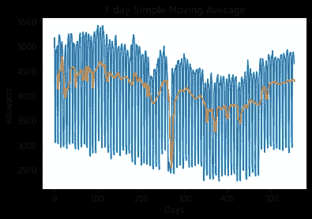
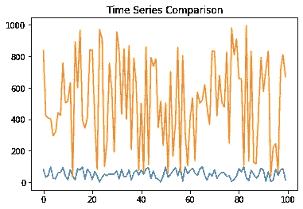
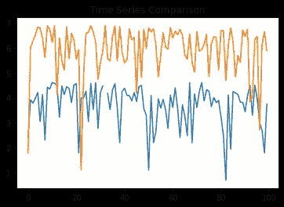

# 在分析时间序列时，我做的前三件事

> 原文：<https://towardsdatascience.com/the-first-three-things-i-do-when-analysing-a-time-series-56936d240d89?source=collection_archive---------32----------------------->

## 理解数据是最重要的

来源:图片来自 [Pixabay](https://pixabay.com/photos/pocket-watch-time-of-sand-time-3156771/)

对于那些缺乏时间序列分析经验的人来说，试图“本末倒置”是很常见的，即在没有正确理解时间序列的情况下建立一个模型来分析时间序列。

时间序列与许多其他数据集的行为不同，因为在序列中通常存在**自相关**——即不同时间段内相关变量的观测值之间的相关性。

抛开预测不谈，分析时间序列的最重要的组成部分之一是能够将**信号**与**噪声**分开——即能够从随机波动的数据中辨别出有意义的模式。

为了实现这个目标，在分析一个时间序列时，我做了以下三件事。

# 1.生成移动平均值

移动平均值是所讨论的变量的一定数量的观察值的平均值。

例如，让我们以数组[1，2，3，4，5]为例。假设这是一个时间序列。我们希望计算该数组的三期移动平均值。

*   1，2，3 的平均值= 2
*   2，3，4 的平均值= 3
*   3，4，5 的平均值= 4

以这种方式计算移动窗口的平均值有助于消除序列中的噪声，并识别出用肉眼很难发现的模式。

例如，让我们以下面的时间序列为例，测量一段时间内的耗电量，单位为千瓦。有问题的数据来自 data.gov.ie。

来源:Jupyter 笔记本输出

使用 7 天移动平均线(橙色线)，我们可以更容易地在图表的第一部分看到下降趋势，在第二部分看到上升趋势。

更具体地说，我们可以看到在时间序列的中间，千瓦消耗突然下降(橙色线显示暂时急剧下降)。

如果我们观察时间序列本身(蓝线)，这种下降 1)不会立即显现出来，2)在更长的时间段内，这种千瓦消耗的下降是否显著，这一点并不清楚。

这只是移动平均线如何帮助理解时间序列数据趋势的一个例子。这是为什么人们经常看到这些被金融市场中的交易者使用的原因之一，例如，当 30 天移动平均线穿过 180 天移动平均线时，这表明时间序列中趋势的长期变化，并作为一个重要的视觉信号。

# 2.生成自相关图

回到关于自相关的观点，时间序列不同组成部分之间的相关性也提供了关于时间序列中**季节性**模式的重要信息。

季节性描述的是时间序列的模式有规律地重复出现的情况。

例如，假设有人正在分析北半球某个国家的温度数据。人们最有可能遇到每年一次的季节性模式，因为每 12 个月就会注意到温度之间最强的相关性。

例如，2020 年 1 月的气温可能与 2019 年 1 月的气温表现出最强的相关性-当将 2020 年 7 月与 2019 年 7 月进行比较时也是如此，等等。

有了这个认识，我们再来回顾一下用电的例子。这是上图中观察到的每日数据的自相关图:

来源:Jupyter 笔记本输出

我们可以看到，相关性的峰值每隔一段时间就会重复出现一次。这意味着电力消费存在每周的季节性，由此消费模式倾向于每周重复。

# 3.确定是否应该使用对数转换的时间序列

时间序列的对数变换大致近似于该时间序列中各值之间的百分比变化。这可以实现两件事:

a)它可以对两个具有显著不同尺度的时间序列进行视觉比较。

b)它有助于消除时间序列中不提供任何有意义信息的过度变化。这使得时间序列更容易与 ARIMA 等预测模型一起工作，因为它有助于降低时间序列的波动性。

例如，我们来看两个时间序列——一个的标度为**0–100**，另一个的标度为**0–1000**。

为每个生成 100 个随机数的数组:

来源:Jupyter 笔记本输出

我们可以看到，从视觉的角度来看，没有办法能够比较这两个变量，因为它们在不同的规模上运作。

现在，让我们为这两个标度生成另外 100 个随机数——但这一次这两个序列将进行对数变换。

来源:Jupyter 笔记本输出

我们现在看到，这两个序列在视觉上(以及统计上)更具可比性，这也是为什么各国的时间序列通常是对数转换的原因之一。例如，将美国一段时间内的国内生产总值数字与比利时等国家直接进行比较毫无意义——两国国内生产总值的绝对规模差异很大，因此比较变化率更有意义。

# 结论

在尝试对时间序列进行建模预测之前，了解该时间序列的性质非常重要。如果时间序列背后的假设是错误的，那么预测输出也将是错误的。

在本文中，您已经看到:

*   移动平均线在识别时间序列的总体趋势中的应用
*   自相关图在确定季节性模式中的应用
*   对数变换在检测时间序列的变化率和消除波动中的作用

非常感谢您的参与，您可以在[michael-grogan.com](https://www.michael-grogan.com/)找到更多我的数据科学内容。

*免责声明:本文是在“原样”的基础上编写的，没有担保。本文旨在提供数据科学概念的概述，不应以任何方式解释为专业建议。*