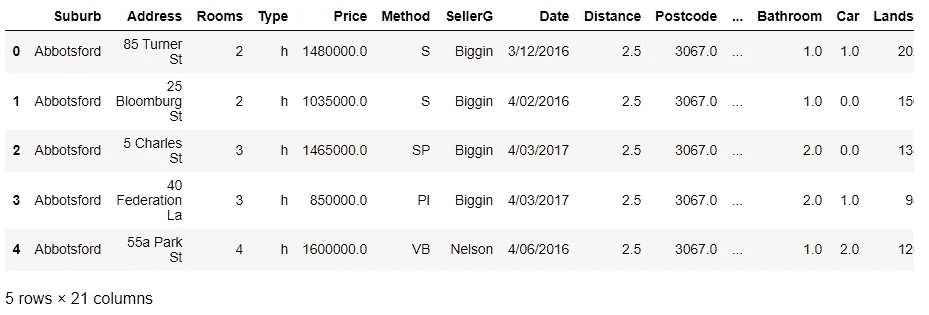
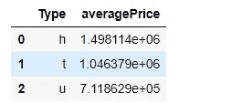
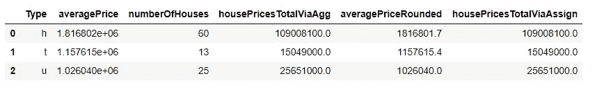
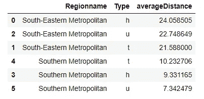
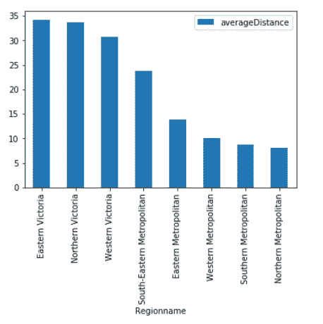
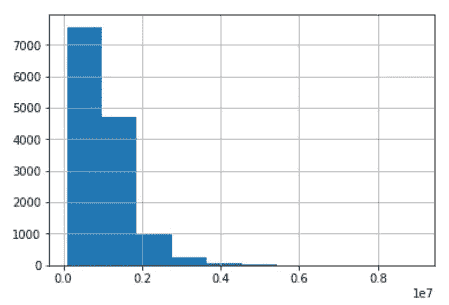

# 蟒蛇/熊猫的完美管道

> 原文：<https://towardsdatascience.com/the-flawless-pipes-of-python-pandas-30f3ee4dffc2?source=collection_archive---------0----------------------->

## [*招数*](https://towardsdatascience.com/tagged/tips-and-tricks)

## *在这篇文章中，你将学习如何使用 Python 和 Pandas 中的一个伟大概念来使你的代码更有效、更易读(甚至对你未来的自己而言)*


照片由 [JJ 英](https://unsplash.com/@jjying?utm_source=medium&utm_medium=referral)在 [Unsplash](https://unsplash.com?utm_source=medium&utm_medium=referral) 上拍摄

# 介绍

就职业而言，我是一个机器人。特别是 [Tidyverse](https://www.tidyverse.org/) 就是这样一个强大、干净、易于理解、文档完善的数据科学平台。我向每位初学者强烈推荐免费的数据科学在线书籍。

然而，我的团队选择的编程语言是 Python/Pandas——这也是一个非常棒的数据科学平台。一个主要的区别(至少对我来说)是我们如何编写 Python 代码，这与 R 代码非常不同——这与语法本身无关。

R 的一个优雅之处是使用了*管道*功能性编程隐喻。这允许您编写更高效、可读性更强的代码。一个很好的例子是 Soner yld rum[Tidyverse](/the-flawless-pipes-of-tidyverse-bb2ab3c5399f)的《完美无瑕的烟斗》一文。

我想重现他的帖子，并向你展示如何为熊猫使用管道(或方法链接)。

# 什么是管道？

根据**r magritter package**[1】管道允许您编写代码，具有以下**好处**:

*   从左到右(与从里到外相反)结构化数据操作序列，
*   避免嵌套函数调用，
*   最小化对局部变量和函数定义的需求，以及
*   使得在操作序列中的任何地方添加步骤变得容易。

**R 不使用管道的示例**(参见【2】)

您在下面的代码中看到的是一个典型的例子。我们可以将函数调用的结果保存在一个变量中，例如`foo_foo_1`，唯一的理由是将它传递给下一个函数调用，例如`scoop()`。

这导致许多变量的名字可能没有意义，结果可能会增加代码的复杂性。

```
foo_foo_1 <- hop(foo_foo, through = forest)
foo_foo_2 <- scoop(foo_foo_1, up = field_mice)
foo_foo_3 <- bop(foo_foo_2, on = head)
```

**R 管道示例**(参见【2】)

R 中的管道与语法`%>%`一起使用。它允许你**链接**你的功能。在下面的例子中，试着以下面的方式阅读它:

1.  我想计算/操作变量 **foo_foo**
2.  我要 **foo_foo** *跳过森林*，然后，
3.  我要**foo _ foo**去捞一只田鼠最后，
4.  我要**foo _ foo**在它头上 bop

```
foo_foo %>%                  
  hop(through = forest) %>%
  scoop(up = field_mice) %>%
  bop(on = head)
```

请注意，数据集是一个名词，而函数是动词。您可能会了解它是如何增加代码的可读性的。

为了更好地理解管道代码是如何工作的，下面显示了解释版本:

```
bop(
  scoop(
    hop(foo_foo, through = forest),
    up = field_mice
  ), 
  on = head
)
```

## Python/ Pandas 中的管道(或者更确切地说是方法链)

**因为 Python 中没有 magrittr 包，所以它必须以不同的方式工作。我们将利用在 Pandas 中大多数数据框函数返回数据集本身的事实。这被称为**方法链接**。让我们继续使用 **foo_foo** 的例子。**

一个可能的 Python 代码可能如下所示:

```
foo_foo_1 = hop(foo_foo, through = forest)
foo_foo_2 = scoop(foo_foo_1, up = field_mice)
foo_foo_3 = bop(foo_foo_2, on = head)
```

链接看起来像这样:

```
foo_foo.hop(through = forest).scoop(up = field_mice).bop(on = head)
```

这是接近的，但不完全是。**添加一个小调整**，即**()代码**周围的括号，使其成为我们想要的样子。请查看下面的代码，它展示了这一点。

```
(
    foo_foo
    .hop(through = forest)
    .scoop(up = field_mice)
    .bop(on = head)
)
```

## 这一概念的好处

我喜欢使用这种编码方式。以下是我在使用这个编程比喻时看到的一些**好处**:

1.  您的代码对于团队中的其他数据科学家(以及您未来的自己)来说更具可读性
2.  您避免了对或多或少无意义的局部变量的需求
3.  您可以在数据评估中快速添加或删除函数
4.  在数据评估和分析期间，您的代码遵循您的思路(名词-动词-范式)

## R 的管道参考

[1] [马格里特包](https://magrittr.tidyverse.org/)
【2】[Pipes 章节在 R for Data Science book](https://r4ds.had.co.nz/pipes.html?q=pipe#pipes)

# Python 中完美的管道(即方法链接)

我将遵循 Soner y ldr RM 的文章[，以便您比较如何在 R 和 Python 中使用管道/方法链接。Soner 使用了关于](/the-flawless-pipes-of-tidyverse-bb2ab3c5399f)[墨尔本房产](https://www.kaggle.com/dansbecker/melbourne-housing-snapshot)的 Kaggle 数据集。你可以下载它，跟着我。

## 读取数据集并导入相关包

```
*# import libs*
**import** **pandas** **as** **pd**

*# read data*
melb = pd.read_csv("../01-data/melb_data.csv")*# Have a quick look at the data*
(
    melb
    .head()
)
```



作者图片

## 过滤、分组和创建新变量

下一个例子通过低于 2 的`Distances`过滤房屋，通过`Type`分组，并计算每个`Type`的平均值`Price`。然后做一些格式化。

```
(
    melb
    .query("Distance < 2") *# query equals filter in Pandas*
    .filter(["Type", "Price"]) *# select the columns Type and Price*
    .groupby("Type")
    .agg("mean")
    .reset_index() 
    .set_axis(["Type", "averagePrice"], axis = 1, inplace = **False**)
)
```



作者图片

在下一个例子中，我们将**使用多个标准进行过滤**和**计算附加特征**。请注意，可以使用功能`agg`(用于聚合)。我个人多是将`assign`与`lambda`结合使用。请在此处查看它的运行情况。

```
(
    melb
    .query("Distance < 2 & Rooms > 2") 
    .filter(["Type", "Price"]) 
    .groupby("Type")
    .agg(["mean", "count"])
    .reset_index() 
    .set_axis(["Type", "averagePrice", "numberOfHouses"], axis = 1, inplace = **False**)
    .assign(averagePriceRounded = **lambda** x: x["averagePrice"].round(1))
)
```



作者图片

# 整理

下一个示例显示了**如何按区域(仅从字符串 *South* 开始的区域)的平均距离对**房屋数据框进行排序。

```
(
    melb
    .query('Regionname.str.startswith("South")', engine = 'python') 
    .filter(["Type", "Regionname", "Distance"])
    .groupby(["Regionname", "Type"])
    .agg(["mean"])
    .reset_index()
    .set_axis(["Regionname", "Type", "averageDistance"], axis = 1, inplace = **False**)
    .sort_values(by = ['averageDistance'], ascending = **False**)
)
```



作者图片

## 使用柱状图按区域绘制平均距离

美妙之处在于，这一概念并不仅限于评估或操纵数据。您也可以将它与**绘图**一起使用。就个人而言，我**强烈推荐绘图库**[**plot nine**](https://plotnine.readthedocs.io/en/stable/)——python 中图形的*语法的一个伟大实现，它是精彩的 [ggplot2](https://ggplot2.tidyverse.org/) r 包的一个克隆。请在 Medium 上找到一篇关于 plotnine 的扩展文章。*

但是对于第一次看你的数据熊猫[剧情功能](https://pandas.pydata.org/docs/user_guide/visualization.html)是非常值得的。

```
(
    melb
    *#.query('Regionname.str.startswith("South")', engine = 'python')* 
    .filter(["Regionname", "Distance"])
    .groupby(["Regionname"])
    .agg(["mean"])
    .reset_index()
    .set_axis(["Regionname", "averageDistance"], axis = 1, inplace = **False**)
    .set_index("Regionname")
    .sort_values(by = ['averageDistance'], ascending = **False**)
    .plot(kind = "bar")
)
```



作者图片

## 使用直方图绘制价格分布

```
(
    melb
    .Price *# getting one specific variable* 
    .hist()
)
```



作者图片

# 结论

在本文中，我鼓励在 R 中使用管道，在 Python 代码中使用方法链接，以提高可读性和效率。我强调了一些好处，我们一起将这一概念应用于住房数据框架。我特别展示了如何读取数据框、过滤和分组数据、计算新变量以及如何绘图。**再次请务必查看**[**plot nine**](https://gscheithauer.medium.com/data-visualization-in-python-like-in-rs-ggplot2-bc62f8debbf5)**包，以获得更好的可视化效果**。

> 如果您有改进此解决方案的想法，请随时联系我！谢谢大家！

**点击此处查看我的更多文章**:

1.  [了解我如何为媒体设计文章](https://medium.com/technical-excellence/article-pipeline-management-with-notion-app-template-13e83635ed1)
2.  [学习如何使用链接(或管道)在 Python 中编写干净的代码](https://medium.com/technical-excellence/article-pipeline-management-with-notion-app-template-13e83635ed1)
3.  [学习如何使用 R](/nine-years-on-linkedin-in-data-b34047c77223) 分析你的 LinkedIn 数据
4.  [学习如何使用图形语法在 Python 中以描述性的方式创建图表](/data-visualization-in-python-like-in-rs-ggplot2-bc62f8debbf5)
5.  [了解如何在两分钟内用 python 数据科学代码设置日志记录](/how-to-setup-logging-for-your-python-notebooks-in-under-2-minutes-2a7ac88d723d)

Gregor Scheithauer 是一名顾问、数据科学家和研究员。他专门研究流程挖掘、业务流程管理和分析。你可以在 [**LinkedIn**](https://www.linkedin.com/in/gscheithauer/) ， [**Twitter**](https://twitter.com/gscheithauer) 上和他联系，或者在 [**Medium**](https://gscheithauer.medium.com/) 上这里。谢谢大家！

# 有用的资源

*   [墨尔本房屋快照| Kaggle](https://www.kaggle.com/dansbecker/melbourne-housing-snapshot)
*   [潮汐](https://www.tidyverse.org/)
*   Tidyverse 的完美烟斗。探索性数据分析变得简单|作者 Soner yld RM | 2021 年 3 月|迈向数据科学
*   [欢迎| R 参加数据科学(had.co.nz)](https://r4ds.had.co.nz/)
*   [18 Pipes | R for Data Science(had.co.nz)](https://r4ds.had.co.nz/pipes.html?q=pipe#pipes)
*   [用 Python 实现数据可视化，如 Gregor Scheithauer 博士的 R 的 gg plot 2 | Medium](https://gscheithauer.medium.com/data-visualization-in-python-like-in-rs-ggplot2-bc62f8debbf5)