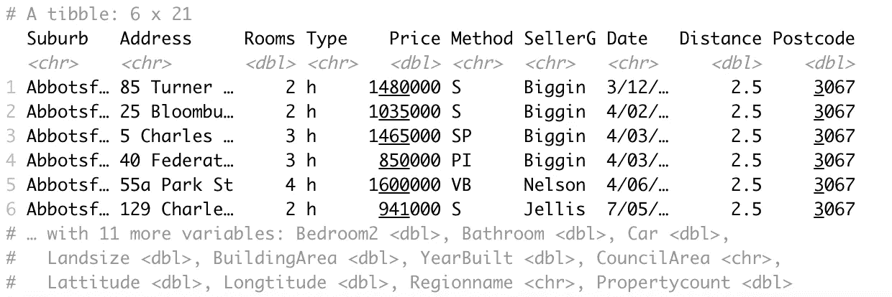
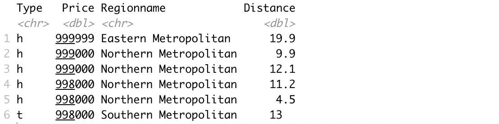

# Tidyverse 的完美烟斗

> 原文：<https://towardsdatascience.com/the-flawless-pipes-of-tidyverse-bb2ab3c5399f?source=collection_archive---------35----------------------->

## 探索性数据分析变得简单


由 [Unsplash](https://unsplash.com/s/photos/perfect?utm_source=unsplash&utm_medium=referral&utm_content=creditCopyText) 上的 [Vikas Gurjar](https://unsplash.com/@vikasgurjar?utm_source=unsplash&utm_medium=referral&utm_content=creditCopyText) 拍摄的照片

Python 和 R 是主导数据科学领域的编程语言。使它们如此高效和受欢迎的是那些简化和加速典型任务的包或库。

在本文中，我们将重点关注 [Tidyverse](https://www.tidyverse.org) ，这是一个用于数据科学的 R 包集合。Tidyverse 包含几个用于数据分析、操作和可视化的包。

我们将实现的管道实际上来自 magritte 包，但我们没有明确地安装它。Tidyverse 自动加载管道(%>%)。我们将通过几个例子来演示管道如何将数据操作和分析步骤结合起来。

我们将在 Kaggle 上可用的墨尔本住房[数据集](https://www.kaggle.com/dansbecker/melbourne-housing-snapshot)上做例子。让我们从读取数据集开始。

```
library(tidyverse)melb <- read_csv("Downloads/melb_data.csv")
head(melb)
```



(图片由作者提供)

数据集包含关于房屋的 21 个特征。其中的前 10 个显示在表格中，其余的列在底部。

管道基本上是一种执行一系列多重操作的方法。这些操作可以是过滤、选择、聚集、排序等形式。

以下管道计算的是到中央商务区距离小于 2 的每种房型的均价。

```
> melb %>%
      filter(Distance < 2) %>%
      group_by(Type) %>%
      summarise(avg_price = mean(Price)) Type    avg_price
 <chr>       <dbl>
1  h      1498114.
2  t      1046379.
3  u       711863.
```

管道用“%>%”表示。我们首先根据给定的条件过滤行。在下一步中，将根据“类型”列中的类别对行进行分组。最后一步中的 summarise 函数根据指定的函数对给定的列进行聚合。

我们可以基于多个条件进行筛选，也可以计算多个聚合。例如，以下管道根据距离和房间数量过滤观察值(即行)。除了平均价格，它还计算每个类别的房屋数量。

```
> melb %>%
      filter(Distance < 2, Rooms > 2) %>%
      group_by(Type) %>%
      summarise(avg_price = mean(Price), count = n()) Type    avg_price   count
  <chr>     <dbl>     <int>
1   h      1816802\.     60
2   t      1157615\.     13
3   u      1026040      25
```

我们还可以使用 mutate 函数在管道中创建新的列。例如，下面的管道创建了一个列来显示每个类别中房屋的总价值。

```
> melb %>%
      filter(Distance < 2, Rooms > 2) %>%
      group_by(Type) %>%
      summarise(avg_price = mean(Price), count = n()) %>%
      mutate(total_worth = avg_price * count) Type  avg_price   count   total_worth
  <chr>     <dbl>   <int>       <dbl>
1  h      1816802\.    60     109008100 
2  t      1157615\.    13      15049000.
3  u      1026040     25      25651000
```

可以使用排列功能对结果进行排序。以下管道首先过滤以“South”开头的区域，然后按照区域名称和类型对行进行分组。然后我们计算每组的平均距离和观察次数。arrange 函数根据平均距离按降序对结果进行排序。

```
> melb %>%
      filter(str_starts(Regionname, "South")) %>%
      group_by(Regionname, Type) %>%
      summarise(avg_distance = mean(Distance), count = n()) %>%
      arrange(desc(avg_distance)) Regionname                  Type    avg_distance   count
  <chr>                       <chr>        <dbl>     <int>
1 South-Eastern Metropolitan   h            24.1      388
2 South-Eastern Metropolitan   u            22.7       37
3 South-Eastern Metropolitan   t            21.6       25
4 Southern Metropolitan        t            10.2      425
5 Southern Metropolitan        h            9.33     2721
6 Southern Metropolitan        u            7.34     1549
```

我们还可以通过在管道中放置 select 函数来选择列的子集。假设我们需要创建一个子集，其中包含价格低于 100 万美元的房屋的类型、价格、地区名称和距离列。我们还想按价格列对行进行排序。

```
> subset <- melb %>%
      filter(Price < 1000000) %>%
      select(Type, Price, Regionname, Distance) %>%
      arrange(desc(Price))> head(subset)
```



(图片由作者提供)

通过书写列名来选择列。如果我们要选择的列数接近总列数，那么指定我们不需要的列会更方便。通过在其名称前添加减号(“-”)来排除列。

## 结论

感谢 Tidyverse 中丰富的函数选择，我们可以创建许多不同的管道。此外，Tidyverse 中的包提供了高效灵活的方式来过滤、转换、聚合、排序和选择数据。例如，我们可以利用 stringr 包中的函数来操作字符串。

在数据分析中使用管道的另一个优点是，它通过将连续或复杂的操作组合在一次执行中，使它们自动化。

感谢您的阅读。如果您有任何反馈，请告诉我。