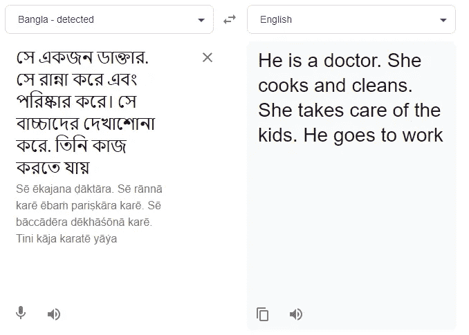
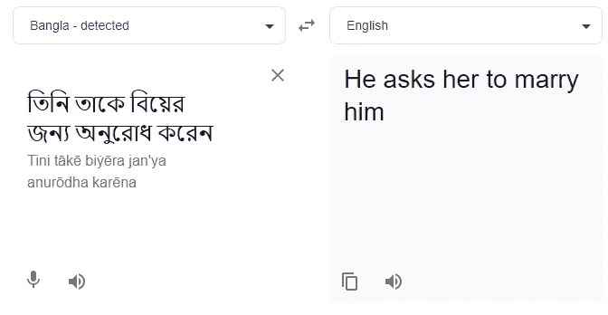
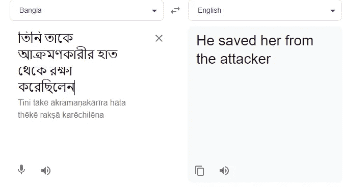

# 谷歌翻译对性别刻板印象的强有力和坚持不懈的应用

> 原文：<https://towardsdatascience.com/the-forceful-and-insistent-application-of-gender-stereotypes-by-google-translate-d6b79cbee48?source=collection_archive---------41----------------------->

## [公平和偏见](https://towardsdatascience.com/tagged/fairness-and-bias)

## 世界上最常用的语言翻译工具之一是如何延续偏见的？

**注:**本文由 [Sreyasha Sengupta](https://medium.com/@ssreyasha) 合著，他是数据科学家、钢琴家，也是一位老朋友。

作者图片

对于那些在过去十年左右的时间里一直沿着这些路线进行研究的人来说，算法偏见和成见并不新鲜。自然语言作为源数据的现实往往是主观的，也代表了特定的国家、文化、社会和口语因素——当然，还有偏见和刻板印象。在本文中，我们旨在从性别的角度探讨谷歌翻译这一世界上最常用的语言翻译工具所延续的偏见。

谷歌翻译[始于 2006 年的统计机器翻译(SMT)系统](https://ai.googleblog.com/2006/04/statistical-machine-translation-live.html)。基本上，这种系统读入大量数据(在这种情况下，是从源语言到目标语言的多语言文本数据)，尝试建立关系模式(在这种情况下，选取常见的源单词/短语及其翻译的对应物)，然后使用统计技术来预测结果(在这种情况下，翻译给定的单词/短语)。因此，这些翻译结果只是基于大量训练数据的数学决策的最佳教育猜测。训练数据是通过谷歌的[翻译社区](https://translate.google.com/intl/en_ALL/about/contribute/)通过[众包](https://thenextweb.com/google/2014/07/25/google-sets-community-site-help-improve-google-translate/)获得的，这意味着全球数百万人贡献数据供算法学习。这种众包可以导致各种不同的人类偏见被编码到数据中，从而编码到算法中。

一些研究人员已经表明，这一翻译过程[以英语](https://www.teachyoubackwards.com/extras/pivot/)为支点，即首先将语言 A 中的单词翻译成英语，然后将英语结果翻译成语言 B，而不是直接从语言 A 翻译成语言 B。这一过程可能并且很可能会导致重要上下文的丢失，从而赋予短语“在翻译中丢失”真正的含义。

谷歌翻译[利用](https://blog.google/products/translate/found-translation-more-accurate-fluent-sentences-google-translate/)一种神经机器翻译系统，旨在将句子作为一个整体来翻译，而不是它们的组合部分，类似于人类在语言之间手动翻译的方式。它旨在将更广泛的人类语境应用于翻译，这可能是其偏见编码的原因。由于这种系统是根据人类验证的数据进行训练的，因此人类对性别陈规定型观念的偏见和理解很可能深深植根于系统的工作中。这不仅导致创建一个在翻译层面上有偏见的系统，还通过继续主观知识的人机转移的恶性循环强化了它的存在，其中伦理和道德的基本概念在数学中丢失了。

我们将通过翻译成我们的母语来证明这一点:孟加拉语/孟加拉语。不用深究语言构成的细节，英语和孟加拉语的一个关键区别在于它们的代词用法。英语使用不同的性别代词(“他”/“她”)和中性代词(“他们”/“他们”)，孟加拉语只使用中性代词:সে(发音为“shey”)、ও(发音为“o”)等。因此，性别化和性别中立的英语文本可以容易地被翻译成孟加拉语而不丢失信息，并且翻译包含性别中立代词的文本可以容易地被翻译成性别中立的英语。然而，相反的情况往往是困难的，因为在我们的英语语法中，分配性别代词几乎是有条件的，即使是从性别模糊的语言翻译过来也是如此。

不幸的是，谷歌翻译也有这种区别。当从我们的母语翻译成英语时，它不仅将性别分配给性别中性代词，还通过强化大范围的性别刻板印象来做到这一点。下面是这项活动的几个例子。

示例 1:

作者图片

在这个例子中，在孟加拉源文本中没有额外的信息来推断所写的一个或多个人物的优选性别代词。但是，谷歌翻译附加了性别刻板印象，即医生和那些去工作的人必须是男性，而那些做饭，打扫卫生和照顾孩子的人应该是女性。从理论上看，这种翻译并没有错——NMT 给每个代词都指定了一个性别，而且有几种排列方式可以做到这一点。然而，合理的预期翻译可能是“他们是医生”。他们做饭和打扫卫生。他们照顾孩子。“他们去工作”——但这种社会意识的缺失使得模型(及其创造者)不太可能理解可量化的准确性并不能捕捉社会政治。

示例 2:

作者图片

和前面的例子一样，这个例子中的翻译再次强化了一种性别刻板印象:婚姻是一个男人和一个女人之间的事，男人在婚姻中向女人求婚。然而，在孟加拉语文本中，并没有关于被讨论的人的额外的上下文。孟加拉语中的句子可能很容易指的是一个女人问这个问题，或者性别非二元个体之间的问题。在生活的各个方面，包括人工智能，LGBTQ 代表的缺乏不应该在我们身上消失。

示例 3:

作者图片

在这个最后的例子中，翻译体现了性别刻板印象，即男性的角色是保护者，保护和照顾女性。现在你可能已经猜到了，孟加拉语的原句没有对保护者的性别做出这样的声明。公平地说，谷歌翻译学习的数据足以符合我们社会中确实存在的男女权力动态的参数。准确性和性能度量的概念可能需要比纯粹的数字更广泛、更复杂的技术。

谷歌翻译中的这种偏见可以并且已经被证明适用于各种具有类似性别代词缺失的语言:[芬兰语](https://twitter.com/johannajarvela/status/1369184338684874758?ref_src=twsrc%5Etfw%7Ctwcamp%5Etweetembed%7Ctwterm%5E1369184338684874758%7Ctwgr%5E%7Ctwcon%5Es1_&ref_url=https://scroll.in/article/991275/google-translate-is-sexist-and-it-needs-a-little-gender-sensitivity-training)、[土耳其语](https://twitter.com/alexshams_/status/935291317252493312)、[匈牙利语](https://twitter.com/DoraVargha/status/1373211762108076034?ref_src=twsrc%5Etfw%7Ctwcamp%5Etweetembed%7Ctwterm%5E1373211762108076034%7Ctwgr%5E%7Ctwcon%5Es1_&ref_url=https://theconversation.com/online-translators-are-sexist-heres-how-we-gave-them-a-little-gender-sensitivity-training-157846)、[菲律宾语](https://twitter.com/sofimi/status/1369587110139678724?s=20)、[马来语](https://twitter.com/fdbckfdfwd/status/1357633918069972996)和[爱沙尼亚语](https://www.reddit.com/r/pointlesslygendered/comments/m1hyh2/in_estonian_ta_or_tema_means_both_she_and_he/)等等。为了回应用户的这种发现，谷歌[在 2020 年宣布了](https://ai.googleblog.com/2020/04/a-scalable-approach-to-reducing-gender.html)性别中立的翻译，它声称可以更好地检测性别特定和性别中立的上下文之间的差异。然而，目前的这些结果表明，在解决这个问题之前，还有许多工作要做。

以这种想法结束文章也是谨慎的:创造无偏见、有道德和建设性的人工智能的责任在哪里——在数学上还是在人类自己身上？