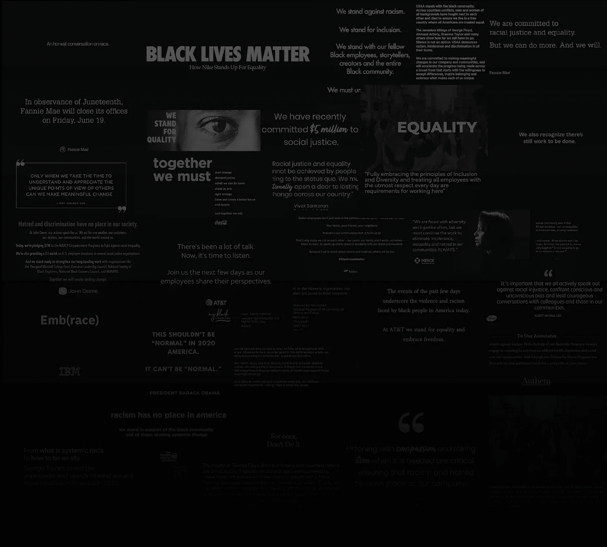
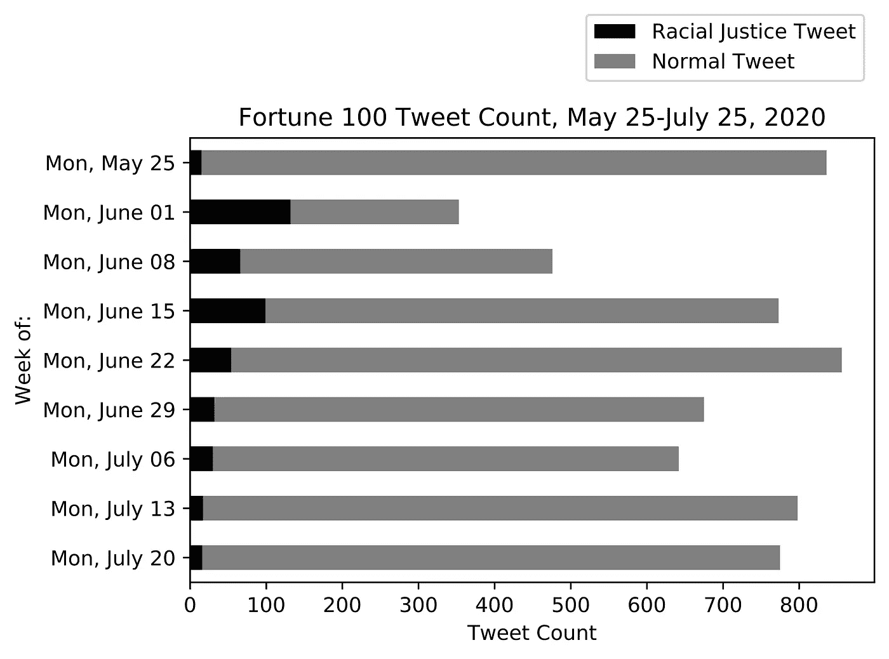
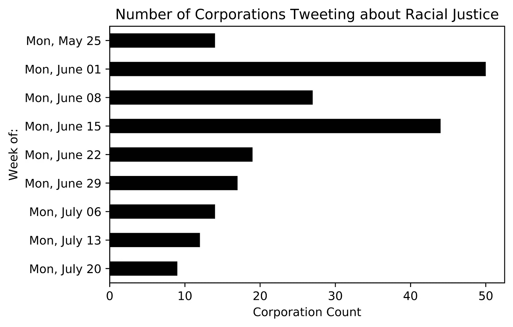
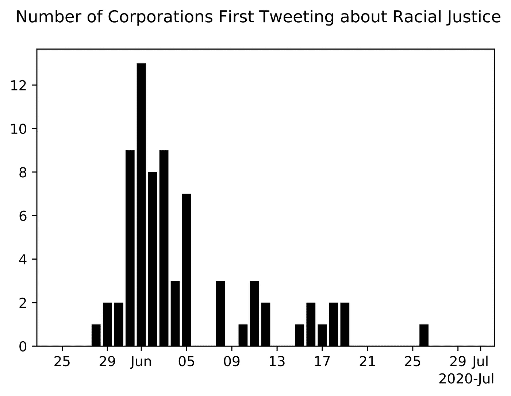
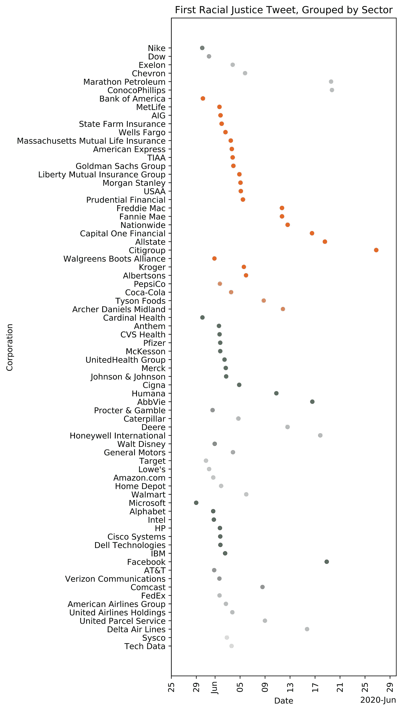

# 财富 100 强和黑人的命也是命

> 原文：<https://towardsdatascience.com/the-fortune-100-and-black-lives-matter-f8ef1084f7b6?source=collection_archive---------28----------------------->

作者图片

## 《财富》100 强在 BLM 抗议期间发布的一组推文揭示了美国企业与社会正义的尴尬关系。

企业使用 Twitter 主要是为了新闻发布、广告和客户服务。但由于与客户平等分享 Twitter，企业从未如此公开地对社会运动的力量负责，尤其是像黑人的命也是命这样的 Twitter 本土运动。

乔治·弗洛伊德于 5 月 25 日去世，随后的抗议活动在他去世后的两个周末达到顶峰，任何没有解决美国历史上最大规模抗议活动的推文往好了说是失礼，往坏了说是对现状的含蓄支持。“站在一边”有重大的商业含义，企业(尤其是那些与政府有合同或保守客户基础的企业)必须决定如何应对这一时刻(如果有的话)。

在这些独特的社会压力下，财富 100 强企业是如何反应的？企业使用“黑人的命也是命”这个词有多舒服？哪些部门最支持这场运动？在他们的行业中，哪些公司是第一个支持抗议者的？还有哪些公司决定若无其事地发微博？

我收集并分析了从 5 月 25 日到 7 月 25 日的财富 100 强推特数据集，希望回答这些问题以及其他关于美国企业与社会责任、种族公正和黑人的命也是命运动的关系的基本问题。

# 一些警告

本报告并不关注这些公司声明中所谓的虚伪。[的报告](https://www.bbc.com/worklife/article/20200612-black-lives-matter-do-companies-really-support-the-cause)紧接着[的报告](https://www.nytimes.com/2020/06/06/business/corporate-america-has-failed-black-america.html)显示，企业在过去曾做出类似的承诺改革的声明，但没有做出他们承诺的根本性改变。相反，这份报告只关注了每家公司在 Twitter 上回应的即时性、策略和内容，具体是从 5 月 25 日到 7 月 25 日。

最重要的是，一家公司解决种族平等的努力的实质不能仅凭他们在 Twitter 上发布的内容来判断，任何对这些数字的耸人听闻的反应都会被误导。一些公司决定在内部讨论这个问题，或者在其他社交媒体平台上发布他们的捐款。我试图在[的公司细分](https://kmcelwee.github.io/fortune-100-blm-report/site/corporate-summaries.html)中提供尽可能多的背景信息。本报告仅调查传播战略。

因为 9 家公司(包括苹果、好市多和摩根大通)没有活跃的 Twitter 账户，所以只收集和分析了财富 100 强中的 91 家公司的数据。围绕数据集管理的进一步微妙之处，如将 Twitter 句柄映射到企业，解决种族不平等的推文的特征，以及 Twitter 数据的局限性，在数据集的网页上[有详细解释。虽然这种分析主要集中在文本数据上，但我也让](https://github.com/kmcelwee/fortune-100-blm-dataset/)[下载了可用的媒体](https://github.com/kmcelwee/fortune-100-blm-dataset/tree/main/data/rj-imgs)。

# 安静的公司

正如人们所料，许多企业没有对抗议活动发表任何公开声明，也没有进行慈善捐赠。但这只是财富 100 强中令人惊讶的一小部分。91 家公司中只有 6 家似乎没有发表任何评论，无论是在 Twitter 上还是在 Twitter 外:洛克希德·马丁公司、瓦莱罗能源公司、菲利普斯 66 公司、能源转移公司和甲骨文公司。

当被问及缺乏公开声明时，Phillips 66 发言人 Allison Stowe 说，“在那段时间，公司的重点仍然是内部员工。”

福特汽车也没有发推特或发布新闻稿。想必他们试图保持中立，但当[错误地将](https://www.snopes.com/fact-check/ford-motor-company-defund-police/)与黑人的命也是命的捐款联系起来时，福特发布了一份[声明](http://archive.is/RQubl)，澄清“福特很自豪成为美国生产警用、应急和急救车辆的长期领导者。”福特[声称](https://media.ford.com/content/fordmedia/fna/us/en/news/2019/10/18/chicago-police-pick-hometown-favorite-ford.html)将供应三分之二的警车。当他们的员工质疑福特与警察部门的关系时，福特发布了一份内部备忘录(最终被泄露)。当时的首席执行官吉姆·哈克特回应道，“困扰警察信誉的问题与他们驾驶的车辆无关。”

在 Twitter 上的 91 家公司中，有 19 家没有发关于种族不平等的微博。航空航天和国防领域的《财富》100 强企业中，没有一家企业和一半的能源企业在推特上发布关于抗议的消息。这也许并不奇怪，因为这两个部门都依赖于政府合同和监管，而政府当时并没有明确支持 BLM 运动。

当被联系时，通用动力公司和雷神技术公司(两家航空航天和国防公司)解释说，他们主要使用 LinkedIn 进行交流。雷神公司发言人克里斯·约翰森说，“我们认为推特的字数限制了我们深思熟虑的交流能力。”

甲骨文是科技行业的异类，是财富 100 强中唯一一家没有在推特上报道抗议活动的科技公司。他们也没有发表声明。甲骨文董事长拉里·埃里森曾是前总统特朗普的支持者和捐助者(尽管并非没有来自员工的反对)，所以这种反应可能也不会太令人惊讶。记者无法联系到甲骨文置评。

一些公司向支持种族公正的组织进行慈善捐赠，但没有在 Twitter 上或甚至通过任何正式的公共渠道提及此事。例如，诺斯罗普·格鲁曼公司发布了一份声明,称他们将捐出 100 万美元，并为员工捐款 100 万美元。他们没有发微博。埃克森美孚加入了其他 30 家公司的“同舟共济”活动，为少数股权企业集体筹集了 10 亿美元。他们没有发表声明。[《华尔街日报》援引了 Progressive 公司首席执行官 Tricia Griffith 的话，他提到该公司承诺向“公平正义倡议”捐赠 100 万美元。《华尔街日报》的引用似乎是唯一一次提到它。通用电气的首席执行官概述了一项增加多样性的计划，包括来自通用电气基金会的“100 万美元资助经济包容性”。通用电气基金会](https://www.wsj.com/articles/brands-follow-anti-racist-statements-with-donations-whats-next-11591437600)[有自己的推特简介](https://twitter.com/GE_Foundation)，没有在推特上发布关于这项努力的消息。

显然，过于吹嘘自己的捐赠有时会显得很没品味。但是这些公司中的许多人过去并不羞于在推特上发布他们的慈善捐赠，这表明缺乏宣传不是谦逊，而是一种政治考量。

这一趋势揭示了企业奇怪的经济计算:向种族正义组织捐款对于支持内部员工的需求很重要，但过于公开捐款可能会有分裂客户群的风险。

最好的例子是 Publix Super Markets，尽管他们没有在他们的主页面上发布关于他们向全国城市联盟捐赠 100 万美元的推特，但当[直接回应批评 Publix 在种族正义问题上保持沉默的顾客](https://twitter.com/Publix/status/1270024132168728577)时，他们会提到他们的捐赠。同时[他们的员工不能戴“BLM”面具](https://www.nbcnews.com/news/us-news/publix-supermarkets-won-t-allow-black-lives-matter-garb-responds-n1231278)，因为它被定义为“非公开信息”记者无法联系到 Publix 置评。

一些公司没有采取一致的公开立场，而是似乎在实践一种双重思想，试图两全其美。从上面看，这当然很奇怪，但它可能是成功的。如果你的客户和员工有不同的需求和不同的媒体渠道，细分你的沟通策略并不困难。

# 长期利息

在为期两周的大规模抗议活动中，企业发推的频率减少了一半，其中大约三分之一的推文涉及抗议活动或乔治·弗洛伊德之死。正如人们可能预料的那样，随着时间的推移，企业对在推特上更多地谈论他们的产品、更少地谈论种族公正感到满意。下图中的双峰显示了对第一波抗议的回应，第二个高峰是 6 月 10 日那一周。

[查看代码](https://github.com/kmcelwee/fortune-100-blm-report/blob/main/explore-dataset.ipynb)

一些公司决定只发几条有意的推文。例如，迪士尼或百事可乐发出了谴责种族主义的第一份声明，第二份声明称他们正在向种族正义组织捐款，然后在 6 月底以正常速度发布了推文。这是迄今为止在 Twitter 上讨论黑人的命也是命最流行的方式。超过一半的企业在推特上发布了三条或更少的抗议信息。

与此同时，也有一些明显的例外，一些公司要么将这一运动作为其品牌身份的核心，要么一直在推特上谈论他们的公司将如何解决种族不平等问题。发推特最多的公司是美国电话电报公司和威瑞森通讯。两人都领导了持续的推特运动，[引用了](https://twitter.com/att/status/1274083798594973696)黑人雇员的话，[强调了](https://twitter.com/Verizon/status/1277662894163988480)黑人拥有的企业。

耐克和可口可乐等其他公司很少发微博，但当他们发微博时，他们会发微博表示对黑人的命也是命运动的支持。

# 即时响应

企业反应的即时性，尤其是明确支持黑人的命也是命的企业，尤为重要。这场运动最终提升了公众对黑人的命也是命的支持，但直到抗议活动后期才明朗起来。与那些等到抗议活动达到顶峰后才表态支持的公司相比，那些早早表态支持的公司在运营时获得的信息要少得多。

一些公司将 Twitter 的即时性视为公司沟通策略的核心。当被问及 Twitter 是否是传达企业价值观的有效媒介时，沃尔格林发言人苏珊娜·巴斯顿说:“绝对是。尤其是对于实时、紧急的通信来说，它是一个必不可少的工具——在危机时刻，展示你作为一家公司的价值观至关重要。”

[查看代码](https://github.com/kmcelwee/fortune-100-blm-report/blob/main/explore-dataset.ipynb)

在 Twitter 上，微软是反应最快的，其首席执行官[于 5 月 28 日在 Twitter 上发布了关于他们改革刑事司法系统的努力。但是耐克公司在 5 月 29 日是第一个更直接地表达抗议的公司，他们的视频](https://twitter.com/Microsoft/status/1266150746166366209)[“不要这样做。”](https://twitter.com/Nike/status/1266502116463370241)

大多数发布声明的公司都是在乔治·弗洛伊德(George Floyd)去世后的一周发布的，从 6 月 1 日周一开始，但也有一些公司等了几周才发表评论。一些公司能够将他们关于种族不平等的第一条推文与 6 月 19 日(星期五，2020 年 6 月 19 日)配对。如果一家公司在 6 月初犹豫是否要在推特上发布关于黑人的命也是命的消息，Juneteenth 提供了第二次机会来解决这个问题。例如，Capital One 在 6 月 5 日发布了一份声明，承诺向各种种族正义组织捐赠 1000 万美元，但决定在 6 月 10 日之前不在 Twitter 上分享该新闻稿。其他使用这种策略的公司有康菲石油公司、马拉松石油和脸书。

脸书是科技行业中最后一个在推特上谈论种族公正的人(不包括甲骨文，甲骨文没有发表任何评论)。但是公司很早就被卷入了种族公正的争论。5 月 29 日，总统在推特上写道“当抢劫开始时，枪击开始。”该推文因“美化暴力”在推特上被删除，但脸书首席执行官马克·扎克伯格决定不审查该帖子，尽管[一再](https://twitter.com/donie/status/1266416129448255489?lang=en) [承诺](https://about.fb.com/news/2019/10/mark-zuckerberg-stands-for-voice-and-free-expression/)删除煽动暴力的政客的帖子。经过一周的员工抗议，扎克伯格在 6 月 5 日发表了一篇脸书邮报，概述了脸书将如何审查其政策。两周后的 6 月 18 日，脸书在推特上发布了针对黑人企业的 1 亿美元拨款计划。

# “黑人的命也是命”禁忌

22 家财富 100 强公司在 5 月 25 日至 7 月 25 日期间使用了“黑人的命也是命”这个词。也就是说，#BlackLivesMatter 标签并不受欢迎，只有六家公司使用:英特尔、思科系统、辉瑞和可口可乐在推特上使用这个标签，然后耐克和美国电话电报公司在他们的推特个人资料中使用它。

按行业划分，科技行业最常提到“黑人的命也是命”，10 家科技公司中有 5 家在推特上提到它。四家金融公司也参与其中，但由于金融行业占据了财富 100 强中的 24 家公司，所以从比例上来说，其重要性较低。剩下的公司分布在许多部门。

理解这些数字的来龙去脉会有所帮助，但要获得财富 100 强与 Twitter 上的短语“黑人的命也是命”之间关系的完整历史并不简单。Twitter 限制了程序员可以访问的推文数量，当直接搜索时，Twitter [警告](https://developer.twitter.com/en/docs/twitter-api/v1/tweets/search/api-reference/get-search-tweets)“搜索 API 并不意味着是推文的穷尽来源”，因为他们不能保证所有推文都被索引。

无论如何，作为一个粗略的启发，我们可以使用 Twitter 的高级搜索来查找每个公司在 2020 年 5 月 25 日之前的完整历史中“#BLM”、“BLM”、“BlackLivesMatter”和“黑人的命也是命”的实例。

在 Twitter 上的 91 家财富 100 强公司中，自黑人的命也是命运动开始以来的 8 年里，Twitter 只发现了[两条](https://twitter.com/Google/status/614551995442143232) [推文](https://twitter.com/Google/status/751174648855928834)，均来自谷歌，一条来自 2015 年，一条来自 2016 年。尽管 Twitter 的搜索引擎存在局限性，但可以肯定地说，直到 2020 年夏天，财富 100 强企业都在犹豫是否要在 Twitter 上发布“黑人的命也是命”。

尽管有这种趋势，但很明显，企业仍然对采用这个短语犹豫不决:49 家企业在推特上发布了向种族正义倡议捐款的消息，而只有 22 家明确表示“黑人的命也是命”

# 对国会大厦袭击的反应

2020 年的黑人的命也是命抗议和 1 月 6 日对国会大厦的袭击是不一样的；然而，自 2020 年 BLM 抗议以来，1 月 6 日是 Twitter 上最悲伤的一天，这两天都引发了企业对社会和政治问题的行动。比较这两种反应会有所帮助。

最大的收获是，虽然 91 家公司中有 71 家对 BLM 的抗议做出了回应，但只有 21 家对国会大厦的暴民做出了回应。

此外，虽然有 49 人在推特上谈论为 2020 年的种族正义倡议提供资金，但有 6 人在推特上谈论停止为没有投票证明选举的共和党国会议员提供资金: [AT & T](https://twitter.com/ATTPublicPolicy/status/1348732435610169345) 、[波音](https://twitter.com/Boeing/status/1349440269574414337)、[思科](https://twitter.com/Cisco/status/1349448214714396673)、 [AIG](https://twitter.com/AIGinsurance/status/1349472823178387463) 、[甲骨文](https://twitter.com/Oracle/status/1350917060495347712)和[信诺](https://twitter.com/Cigna/status/1349016747572158468)。(尽管这个列表很可能会增长。)BLM 运动似乎更直接地呼吁企业解决种族不平等，但三倍的差异不仅表明了像黑人的命也是命这样的 Twitter 本土社会运动可以影响企业行动，也表明了去年夏天的抗议活动是多么强大和独特。

几乎每一个对国会大厦暴民发表声明的公司也对 BLM 的抗议发表了声明。但最有趣的是三家公司，它们没有谈论 BLM，但却谈论了国会大厦的暴民:波音、甲骨文和纽约人寿保险。

对于那些有兴趣对这两个事件之间的比较进行更深入分析的人，欢迎你使用财富 100 条回应国会大厦袭击的推特的[列表。](https://github.com/kmcelwee/fortune-100-blm-report/blob/main/supplementary-data/capitol-attack-tweets.csv)[流行信息也对财富 500 强公司的反应进行了很好的总结](https://popular.info/p/three-major-corporations-say-they)。

# 进一步研究

如需进一步的统计问题和详细说明数据收集和处理方式的文档，请访问[数据集的网页](https://github.com/kmcelwee/fortune-100-blm-dataset/)。我在[公司总结页面](https://kmcelwee.github.io/fortune-100-blm-report/site/corporate-summaries.html)上收集了一些公司的背景信息。同样，数据集只能回答针对该公司在 Twitter 上的行为的问题。仅使用该数据做出任何价值判断(即“公司是坏的”、“公司是好的”)都是不诚实的。

发推特的公司一定更“好”吗？美国电话电报公司在推特上谈论种族正义的次数比其他任何一家财富 100 强公司都多，但在国会大厦暴徒之前，他们也是众议员汤姆·科顿(Tom Cotton)最大的企业捐助者之一，汤姆·科顿鼓励对黑人的命也是命抗议者采取军事行动，在全美有色人种协进会的支持率为 6%。尽管将黑人的命也是命作为其品牌身份的核心，耐克仍然公布了糟糕的多元化数据。脸书在推特上很少提到黑人的命也是命(可能是因为他们有自己的社交媒体网站)，但捐赠了 1 亿美元支持黑人拥有的企业，这一金额比他们的同龄人的捐赠高出几个数量级。

我们才刚刚开始看到企业在社会运动中如何吸引和解决顾客问题。重要的是，在分析这种行为时，我们要记住，一家公司的影响力几乎来自所有东西，除了他们的 Twitter 平台。社交媒体活动可能是衡量企业价值观的粗略启发，但要全面理解美国企业与种族公正的关系，我们不能让推特和新闻稿分散对企业举措的实质、有效性和一致性的分析。

> 本报告的互动版本可在本项目网站上获得。