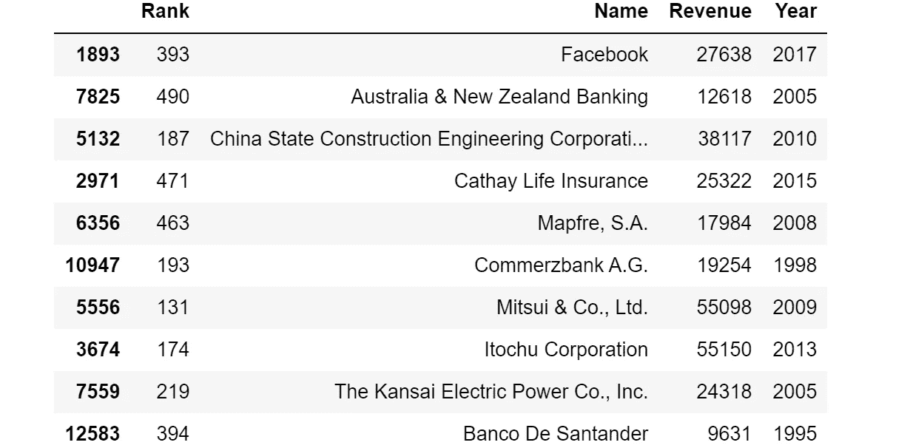
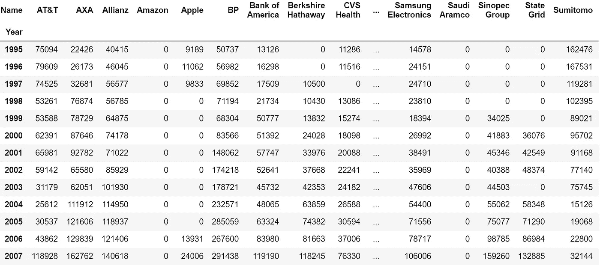
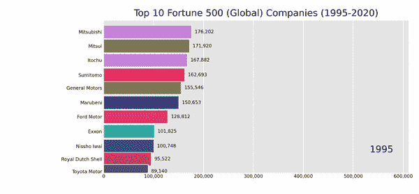
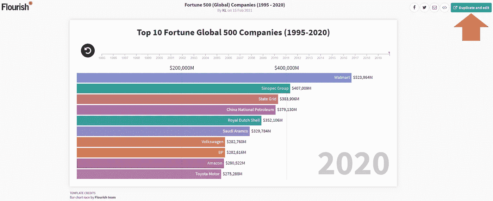
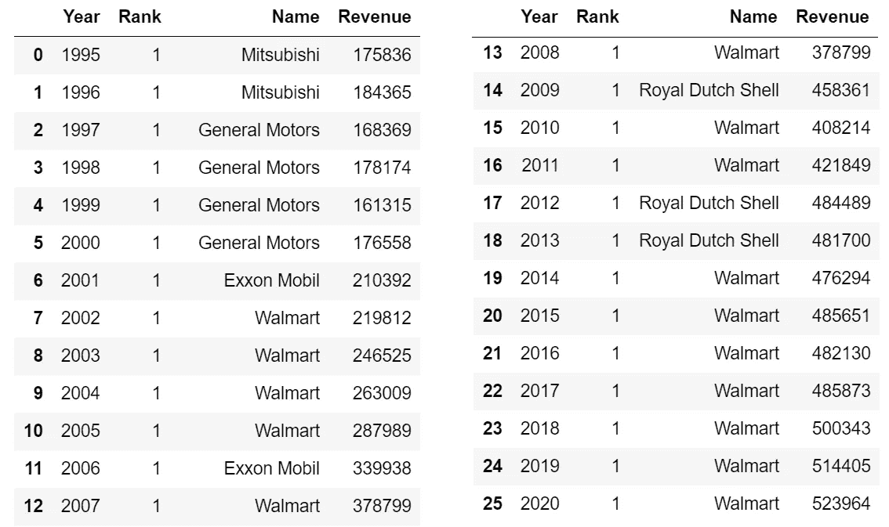
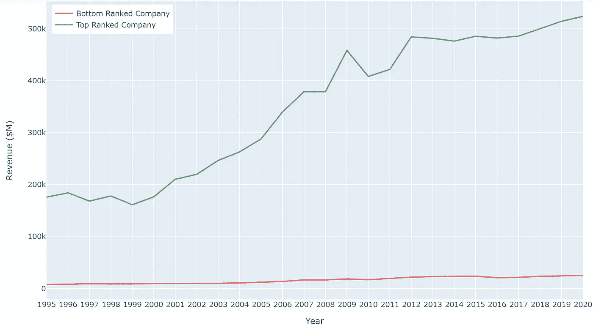

# 在条形图竞赛中可视化财富 500 强公司

> 原文：<https://towardsdatascience.com/the-fortune-500-bar-chart-race-9612dc9d0e63?source=collection_archive---------29----------------------->

## 使用 Python 和 fluorescent 可视化世界最大公司的排名和收入趋势


由 Vectorarte / [Freepik](http://www.freepik.com) 设计

公司在激烈和残酷的全球竞争中兴衰，因此，想象一下过去几十年中全球顶尖公司的进步将是非常有趣的。

《财富》**全球 500 强** 是按收入衡量的全球 500 强**企业的年度排名，它是运行可视化分析的良好数据来源。我认为使用代码(Python)和非代码(fluore)解决方案生成条形图比赛动画也是一种丰富的体验。我们开始吧！**

# **目录**

> **(1) [数据采集](#365a)
> (2) [数据准备](#9253)
> (3) [条形图竞用 **Python 条形图竞用**包](#0416)
> (4) [条形图竞用**兴盛**](#169c)(5)[附加见解](#6de4)**

# **数据采集**

**从[财富 500 强搜索页面](https://fortune.com/global500/search/)中检索到关于财富 500 强公司收入和排名的公开数据。数据是在没有任何形式的 web 抓取的情况下提取的，因为数据集的大小很小，并且将值复制粘贴到 Excel 表中的简单方法远比编写抓取代码更有效。**

**虽然最近的数据包含了有用的信息，如利润、资产和员工数量，但这些功能在本项目中被忽略了，因为它们仅从 2015 年开始可用。因此，该分析侧重于**收入(美元)**，该数据自 1995 年以来一直可用。**

**据此，我整理了一个数据集，其中包含 26 年来(1995 年至 2020 年)全球 500 强公司的年收入和排名的 13，000 个观察数据。**

***注意:财富 500 强的原始数据源中有一个错误，其中 2007 年和 2008 年的数据集是彼此重复的。***

# **数据准备**

## **1)数据预处理**

**我们首先将 Excel 表导入 Python Jupyter 笔记本(使用 **openpyxl** 包)并将它们连接成一个 Pandas 数据框架。**

****

**串联数据帧的随机样本(10 行)**

**预处理步骤至关重要，主要是因为我们需要为每个独特的公司提供一个**一致的标识符(即标准化名称),以便跟踪他们的进度。多年来，这一问题因几个问题而变得复杂:****

*   **合并和收购导致不同的公司名称
    (例如‘埃克森’+‘美孚’=‘埃克森美孚’)**
*   **公司名称因品牌重塑而改变
    (例如“Amazon . com”->“Amazon”)**
*   **公司名称格式不一致
    (如“沃尔玛商店”与“沃尔玛”)**
*   **缩写和非缩写名称产生的不同版本
    (例如‘英国石油’和‘BP’)**

**还采取了额外的努力(例如搜索财富 500 强网站)来了解这些公司的历史，以便准确地捕捉代表它们的名称。**

**我的最终目标是只显示条形图竞赛中排名前 10 的公司，因此我简化了数据清理过程，将重点放在曾经进入前 10 的公司上。进行了两轮预处理:**

****第一轮:**删除公司名称中的填充词，如“有限公司”、“公司”、“P.L.C .”、“公司”、“A.G .”等。
**第二轮:**识别公司名称的不同变体，用标准化的替换。这允许对这些公司多年来的数据进行准确的检索。下面是预处理代码的一个片段:**

```
master_df['Name'].replace('Apple Computer','Apple',inplace = True)
master_df['Name'].replace('Amazon.com','Amazon',inplace = True)
master_df['Name'].replace('American International Group','AIG',inplace = True)
master_df['Name'].replace('British Petroleum','BP',inplace = True)
```

## **2)数据帧格式**

**在验证预处理已经成功完成(通过手动检查输出)之后，我们需要将数据帧转换成宽格式，以便进行条形图比赛可视化。格式如下:**

*   **时间部分(即年份)作为索引**
*   **每一行都包含该特定年份的值(在索引中)**
*   **每一列都包含各个公司的值**
*   **数值代表公司的年收入(百万美元)**

**格式化的数据帧应该如下所示:**

****

**用于条形图比赛可视化的格式化数据帧的快照**

***注:“0”值表示该公司在当年的世界 500 强榜单中是* ***而不是*****

***既然数据集已经正确格式化，让我们探索两种可视化条形图竞赛的方法，即使用**Python**T0 和**flower**。***

# ***用 Python 进行条形图竞赛*条形图竞赛*包***

***Python *matplotlib* 库已经让我们可以相对容易地构建条形图比赛，如本文中的[所示。为了用更少的代码行更有效地完成它，我利用了构建在 *matplotlib 之上的`bar-chart-race`包。*它的官方文档可以在](/bar-chart-race-in-python-with-matplotlib-8e687a5c8a41)[这里找到](/bar-chart-race-in-python-with-matplotlib-8e687a5c8a41)。***

***这是用于生成条形图竞赛的 Python 代码(其中输出是. mp4 文件):***

***下面是条形图比赛输出(显示为低分辨率 gif):***

******

***Python 中的条形图比赛可视化(值代表年收入，单位为美元)***

****注意:要将动画保存为. mp4(以后可以转换为 gif)，我们需要* [*安装 FFmpeg*](https://medium.com/r?url=https%3A%2F%2Fwww.wikihow.com%2FInstall-FFmpeg-on-Windows) *和* [*将 FFmpeg bin 文件夹添加到路径*](https://www.thewindowsclub.com/how-to-install-ffmpeg-on-windows-10#:~:text=Navigate%20to%20Advanced%20button%20and,bin%5C%E2%80%9D%20and%20click%20OK.) *中。****

***虽然`bar-chart-race`包可以让我们创建基本的功能条形图比赛动画，但它仍然有很多需要改进的地方。一些缺点包括:***

*   ***需要进行多次代码更改，以便进行细微的美学更改(例如，颜色、位置等。)***
*   ***可用于动画定制的有限选项***
*   ***无法在更改后立即显示图表***

***至此，让我们来看看，通过允许我们无需任何代码就能轻松地生成漂亮的可视化效果，fluore 是如何克服这些问题的。***

# *****条形图竞赛与蓬勃发展*****

***是一个强大而灵活的平台，用于数据可视化和讲故事，让用户可以轻松地将电子表格转化为交互式可视化。它配备了一系列的功能和模板(包括条形图竞赛)，允许使用简单的点击选项进行轻松编辑。***

***将格式化的数据集导出为 Excel 文档后，将其导入到 fluore 平台上的新可视化中。只需几个步骤就可以生成下面的条形图竞赛:***

***在 fluore 中的条形图比赛可视化(值代表年收入，单位为美元)***

***虽然我从编写功能性代码中获得乐趣，但我更喜欢能够帮助我以更简单、更实用的方式完成任务的工具。繁荣当然符合这里的要求。***

***蓬勃发展提供了广泛的定制，包括一个**播放按钮**，供用户暂停或倒带条形图比赛(**尝试点击上面的交互图！**)。***

***这个漂亮的可视化是用[免费计划](https://flourish.studio/pricing/)完成的，唯一的缺点是数据和项目必须是公开的，并且图表的 HTML 版本不能在本地下载。***

***因为这个可视化是公开的，所以您可以随意复制[我的条形图比赛副本](https://public.flourish.studio/visualisation/5287940/)，并通过点击右上角的“**复制和编辑**”按钮在 fluore 上进行试验:***

******

***点击右上角的按钮复制繁荣可视化|作者图片***

# ***其他见解***

## *****排名靠前的公司*****

***通用汽车在 20 世纪 90 年代领先排行榜，但自 2002 年以来，沃尔玛一直是排名中的主导力量。事实上，在过去的 26 年里，沃尔玛令人难以置信地 15 次排名第一(没有减弱的迹象)。***

******

***按收入计算，沃尔玛经常是全球最大的公司***

## ***比较排名最高和最低的公司***

***多年来，全球 500 强公司中排名靠前和垫底的公司之间的收入差距越来越大。这主要是因为随着时间的推移，排名第一的公司的收入显著增加。***

******

***全球 500 强公司排名和收入趋势(可视化由 Plotly 完成)***

***1995 年的收入差额是 1679.92 亿美元，自 2020 年以来已经增长了两倍，达到 4985.78 亿美元。有趣的是，一家公司进入世界 500 强的“截止”收入保持相对稳定，大约在 170 亿到 220 亿美元之间。***

# ***结论***

***在这篇文章中，我分享了如何获取和预处理数据(用 Python ),以可视化财富全球 500 强公司的排名和收入趋势。我还讨论了如何使用代码(Python `bar-chart-race`)和无代码(fluore)解决方案创建条形图比赛动画。这个项目的 Python 代码可以在这个 [GitHub 页面](https://github.com/kennethleungty/Fortune-Global-500-Bar-Chart-Race)上找到。***

# ***在你走之前***

***欢迎您**加入我的数据科学学习之旅！**点击此[媒体](https://kennethleungty.medium.com/)页面，查看我的 [GitHub](https://github.com/kennethleungty) ，了解更多精彩的数据科学内容。同时，尽情享受使用 Python 的乐趣吧！***

***[](/enhance-your-python-codes-readability-with-pycodestyle-9838976077cb) [## 使用 pycodestyle 增强 Python 代码的可读性

### 基于 PEP-8 风格约定自动检查 Python 脚本的可读性和质量

towardsdatascience.com](/enhance-your-python-codes-readability-with-pycodestyle-9838976077cb)***