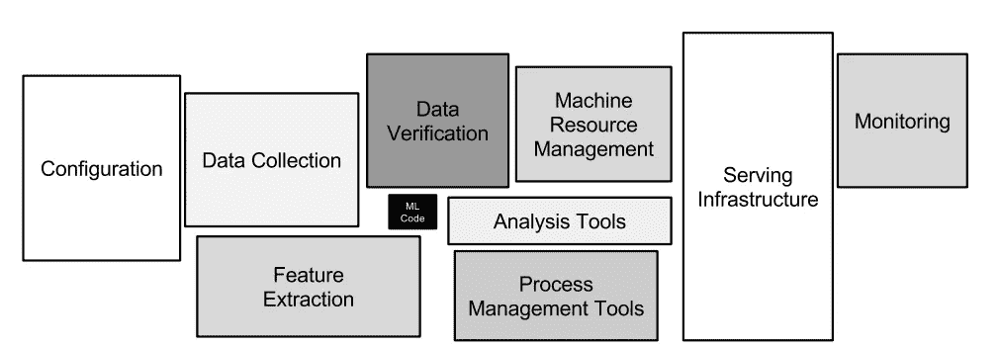

# ML 生产系统的四个成熟度等级

> 原文：<https://towardsdatascience.com/the-four-maturity-levels-of-ml-production-systems-94c4468e6b3?source=collection_archive---------31----------------------->

## [行业笔记](https://towardsdatascience.com/tagged/notes-from-industry)

## 训练模型只是开始

由[乔希·卡特](https://unsplash.com/@midwestiscool?utm_source=medium&utm_medium=referral)在 [Unsplash](https://unsplash.com?utm_source=medium&utm_medium=referral) 上拍摄的照片

和很多 ML 从业者一样，我是从 Kaggle 比赛开始我的 ML 之旅的。但是 Kaggle 的舒适设置，在那里你得到的是基本上干净的数据以及特征和标签，这与今天的 ML 从业者的现实相去甚远。事实上，模型构建过程本身只是开发 ML 解决方案并在生产中部署和维护它时需要完成的工作的一小部分。

根据各种成熟度**来谈论大规模生产系统**是很有用的，其中最不成熟的系统是一次性模型，最成熟的系统自动运行，在最少的人工干预下进行自我更新。在这里，我将 ML 系统大致分为四个逐渐成熟的级别，并讨论了每个级别所涉及的一些挑战。

*免责声明:鉴于媒体的选择(一篇博客文章，而不是一本书的一章)，这个列表肯定会不完整，我也不想这样。如果您发现缺少了某个重要的方面，欢迎您在评论区添加。*

## 第一级:“空白状态”

在第 1 级，您既没有标注也没有要素，因此您需要创建两者。

先说标签。你需要多少标签？这取决于标签分布、您想要测量的指标以及您对该指标的确定程度。

假设您有一个不平衡的二进制分类问题，每 100 个样本中有 1 个阳性样本，您需要开发一个召回率为 90%的解决方案。标记样本越少，召回测量的噪声越大:这种噪声被称为**散粒噪声**。对于这个问题，一个好的开始将是单独为测试集准备 100K 个标签，这样您在召回上的散粒噪声将不超过 0.1%。对于训练集，您可能还需要至少 100K，但越多越好。像主动学习或伪标记这样的高级技术可以进一步简化和加快标记过程，正如 Eugene Yan 在他的文章“[引导标签](https://eugeneyan.com/writing/bootstrapping-data-labels/)”中所讨论的那样。

接下来，功能。当今典型的业务问题包含许多不同类型的特征，数字、分类、文本，有时还包括图像。你需要决定你是要做你自己的特征工程，还是把原始数据扔进一个深度神经网络，它会隐式地学习数据表示。

在获得标签和功能后，现在是考虑正确模型的时候了。从我的个人经验来看，如果训练数据和特征是经过仔细选择的，那么简单的基线模型(线性/逻辑回归、基于树的集成)通常会提供很好的性能，并且应该始终作为一个起点。当实践者在没有首先对简单基线进行基准测试的情况下就直接跳到高级方法，如深度神经网络时，我经常感到惊讶。

## 级别 2:生产中的一次性模型

祝贺您，您的模型已投入生产！但是，令人惊讶的是，工作还没有完成，现在才刚刚开始。

最重要的是，你需要为你的模型的预测建立**审计**，以便随着时间的推移跟踪它的表现。审计集的设计取决于您想要跟踪什么指标，以及您想要该指标有多精确(同样，散粒噪声会限制您的测量)。

通常，对于不平衡的分类问题，如电子商务中的欺诈检测，社交媒体上的仇恨言论检测，或制造业中的缺陷检测，召回比精度更难审计。正如我在上面解释的那样，在不平衡率为 1/100 的情况下，您至少需要 100K 个审计样本，以便在散粒噪声不超过 0.1%的情况下测量召回率。精度更容易:假设您期望模型以 50%的精度运行。然后，只需 2K 个样本，就可以达到不超过 0.1%的散粒噪声水平。换句话说，由于不平衡率为 1/100，您的召回审核需要比精确审核大 50 倍。

级别 2 本身可以细分为各种成熟度:在最低级别，模型将简单地将具有高模型分数的样本搁置给人类专家，而不自己采取行动。在最高程度上，模型将自动对大量样本采取行动。这些动作(来自模型本身和人类)需要被记录在数据库中，以便它们可以在以后(在第 3 级)被重新用于模型重新训练。

## 级别 3:手动模型更新

通常，所有的 ML 模型都受到**概念漂移**的影响:在模型被部署后，我们周围的世界发生了变化，导致模型性能下降。根据领域的不同，这可能发生得非常快，如在欺诈检测模型中；也可能发生得比较慢，如在产品分类模型中。

由于概念漂移，您需要频繁地用最新的数据更新模型，或者在某些预定义的时间间隔，或者当性能下降到指定的阈值以下时。更新模型的训练数据可以通过以下三种方式之一收集:
1 .每次更新模型都可以收集一个全新的人类标注的训练集；
2。您可以使用现有审核标签的记录(来自人类专家)作为训练数据；
3。您可以使用记录的预测标签和审核标签的组合作为训练数据。

①可以说是最严谨，但也是最昂贵的着手方式。利用现有记录来更新模型更经济。(2)如果审计样本数量足够大，是一个很好的选择。(3)如果模型生成的标签的质量足够高，比如 95%以上的精度，则是一个好的选择。然而，(3)可能会引入危险的反馈循环:如果模型存在偏差，并且一直对特定人群做出错误预测，那么根据模型自身的标签重新训练模型将会放大该偏差。

## 第四级:自动驾驶

手动模型更新会造成流失，因此级别 3 不是理想的最终状态。如果一个 ML 团队部署了大量的模型，那么由手工模型维护引起的操作负担会变得难以承受，从而产生技术债务。幸运的是，这个过程可以并且应该通过 AWS Lambda 和 Step 函数等工具实现[自动化](https://aws.amazon.com/blogs/machine-learning/automated-model-refresh-with-streaming-data/)。最简单的解决方案是定期安排再培训工作。更复杂的解决方案可以在审计性能低于指定阈值时触发重新培训工作。

一旦你达到第四级，你就达到了成熟的最高水平。团队可以指派一名(轮流)待命人员，只需要在自动模型更新失败时采取行动，而不是让一名团队成员专门手动维护模型，从而腾出时间投入到改进模型的研究和部署中。

ML 代码本身只是一个成熟的 ML 生产系统的一小部分。图片鸣谢:斯卡利等人，机器学习系统中隐藏的技术债务([链接](https://papers.nips.cc/paper/2015/file/86df7dcfd896fcaf2674f757a2463eba-Paper.pdf))

## 结论:永远以第四级为目标

在商业环境中应用 ML 仍然是一个相对年轻的领域。根据我的个人经验，我见过的大多数工作都在 1 级和 3 级之间。我坚信四级自动驾驶系统应该永远是 ML 团队的最终目标，因为它们固有的可扩展性。因此，在从第 1 级到第 3 级的旅程中，应该始终牢记这最后一个阶段。

最后，还要考虑第 4 级之后会发生什么，即(很少讨论的)当不再需要 ML 模型时优雅地放弃它们的问题。在为不同目的服务的多个模型之间创建依赖关系时要小心，例如，通过将模型 A 的输入作为特性提供给模型 b。这起初听起来可能令人兴奋，但是一旦存在这样的依赖关系，一旦时机成熟，就很难甚至不可能放弃一个模型。最好有一个长远的想法，通过构建 ML 系统，在未来，可以优雅地弃用，而不会破坏业务的其他部分。