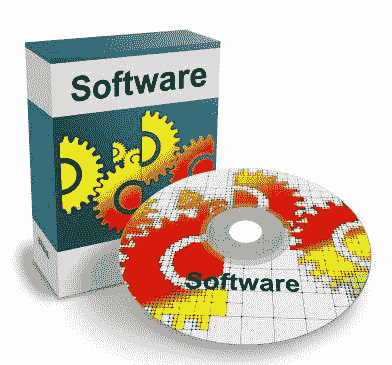

# 四个最常见的数据科学面试问题以及如何准备

> 原文：<https://towardsdatascience.com/the-four-most-common-data-science-interview-questions-and-how-to-prepare-for-them-2a39f7647ec5?source=collection_archive---------53----------------------->

图片来自[与岛](https://unsplash.com/photos/FX2QA0TMEYg)一起工作

面试一个[数据科学](https://ethno-data.com/what-is-data-science-and-machine-learning/)的职位可能是一项艰巨的任务，尤其是对这个领域的新手来说。我已经数不清这些年来我参加过多少次数据科学面试，但这里有我遇到过的四个最常见的问题和准备每个问题的策略。为这些问题做准备是发展你的故事论点的好机会，这是任何数据科学面试中最重要的部分。

最常见的数据科学问题:

1)说说你自己。

2)描述一份你从事过的数据科学工作。

3)你对杂乱的数据有什么样的体验？

4)你用过哪些编程语言和软件？

# 问题 1:说说你自己吧。

这可能是所有行业和领域中最常见的面试问题，而不仅仅是数据科学，因此这是数据科学面试中最常见的问题这一事实似乎并不令人惊讶。一个好的答案对建立良好的第一印象至关重要，并奠定你的主要故事或论点，你是谁，你会在整个面试中回来。

在数据科学采访中，我强调我对使用数据科学工具帮助组织解决以前令人烦恼的复杂问题的热情。如果你不确定你的论文是什么，我设计了[这个活动](https://ethno-data.com/the-job-hunt-part-4-self-reflection-activity/)来帮助人们解读它。下面是我描述自己的一个例子:

*“我爱上了数据科学，因为我喜欢帮助组织解决复杂的问题。在我过去的工作中，我综合运用了数据科学和社会科学技能来探索和构建复杂问题的解决方案，而组织内的典型工作方式对这些问题不起作用。打破复杂问题并使用数据科学来开发潜在的创新但有用的解决方案的智力刺激让我充满活力。你们遇到了什么样的问题，导致你们需要找到像我这样的数据科学家？”*

你的自我描述应该讲述你是谁，如何证明你是这个职位的合适人选，并对公司有所帮助。就像你的面试主题一样，如果你设计得很好，那么你回答的其他每一个问题都将简单地涉及充实你的自我故事的三个基本部分中的一个(或一个组合):1)你是谁，2)你的身份如何使你天生适合这个角色，以及 3)这将如何有益于公司。

图片来自[免费照片](https://pixabay.com/photos/glasses-reading-glasses-spectacles-1246611/)

关于我是如何讲述我的故事的，下面是另外四个需要注意的重要观察:

1.  我强调我是谁——一个为复杂问题开发独特解决方案的创新者——同时展示我的创新者身份自然与数据科学联系在一起，并可能对组织有所帮助。你可能不认为自己是一个“创新者”，但诀窍是根据什么让你充满活力和激情来确定你是谁，然后展示如何履行你申请的数据科学角色是你的天然选择。
2.  我用普通的语言讲述了这个故事，而不是专业术语。我发现，我的许多面试(如果不是大多数的话)，尤其是第一轮面试，都是与没有技术专长的员工进行的，由于你通常不知道面试官的技术专长水平，所以宁可错在非技术方面。
3.  我让我的故事保持正面，只提到我喜欢做的事情。有时，人们本能地试图通过描述他们不喜欢做的事情来说明他们想要什么:例如，“在之前的最后一份工作中，我知道我不喜欢做 Y，所以我想做 X”或“我正在做 Y，我讨厌它”。我想退出。”如果面试官问我，我会稍后描述我故事的这些方面，但我会一开始就坚持积极的方面:只提我想做的事情。
4.  我使用了强烈的、主观的、甚至是情绪化的短语，比如“爱上了”、“对……充满热情”和“被……激励着”乍一看，这些短语似乎过于非正式，但我发现它们有助于面试官记住我。不要做得太过分，但是更加生动和有风度通常会帮助而不是损害你的数据科学职位的面试机会。

# 问题 2:描述一个你参与过的数据科学项目。

这是我遇到的第二个最常见的问题，所以请确保你准备了一个范例项目来展示。他们可能会问你很多关于你的项目的问题，所以我会建议你选择一个你做得很棒的项目，一个你引以为豪的项目。除非有披露问题，将你的工作发布在 GitHub、博客、LinkedIn 或其他在线网站上，并在你的求职申请中包含一个链接。

如何解释这个项目取决于你的面试官的专业程度。我通常从非技术性的、高层次的解释开始，如果面试官继续提问，我会提供技术细节。这使得面试官可以自由选择他们在后续工作中想要的专业技术水平。一个称职的数据科学家面试官会很快将谈话引导到他/她希望了解的项目的更多技术方面，但即使如此，开始非技术方面的谈话也表明你知道如何有效地向非技术受众传达你的工作。

当描述你的项目时，你有效地讲述了项目的故事，大多数项目故事有以下核心组成部分:

图片来自 [geralt](https://pixabay.com/illustrations/questions-font-who-what-how-why-2245264/)

**谁:**你可能是故事的主角(毕竟这是你的采访，所以自然选择一个你是主要驱动力的项目或项目的一部分)，但你可能需要设置多个重要的次要角色，比如谁委托了这个项目，它是为谁做的，数据是关于谁的，等等。

**什么:**你的项目寻求解决的问题、需求或疑问通常会形成项目故事的“冲突”，所以一定要解释是什么导致了问题、需求或疑问(在故事中，称为煽动事件)。

**时间和地点:**项目发生的时间框架/背景(例如，您正在工作的组织或您参加的项目课程)。你需要多长时间来完成这个项目也很重要。

**如何:**你解决了什么问题。如果你在发现什么有效之前尝试了很多方法,“如何”包括你的方法论故事和你的最终解决方案(这是你如何克服项目的上升和下降行动的一部分)。这是你故事的核心。您需要技术和非技术方面的描述:

**技术方法:**一般来说，技术描述的两个核心部分是你使用的模型(以及你尝试过的任何模型，如果适用的话)和你如何确定你选择的特性/变量。另一个重要的部分可能是你如何清理和/或收集数据。

**非技术人员如何做:**我发现非技术人员通常不会从我结束使用的模型或我的特征选择过程中收集到太多信息。相反，我解释了我确保模型必须解决我刚刚设置的问题的功能类型:例如，“我建立了一个模型，它基于数据源 A、B 和 C 计算 X 现象的概率，测试各种类型的模型以确定哪种模型做得最好，然后辨别这些数据集中的哪些变量最好使用。”对于非技术观众来说，这已经足够了。对他们来说，核心组件是什么进入了模型(数据)，模型从中产生了什么结果，以及它如何通知问题、需求或驱动项目的问题。

最后，在你的 how 解释中，确保你使用了任何编程语言和软件:Python、R、SQL、Azure 等等。

**为什么:**确保你对为什么的非技术性解释与你对如何的非技术性解释一致。我经常看到数据科学家犯这样的错误，他们试图用技术上的“为什么”来解释非技术上的“如何”,而忽略了非技术人员。特别是，我不会在我的非技术解释中解释您用来比较模型或决定特征选择过程的度量或标准，因为这些可能会失去一个非技术人员。如果我的非技术性的“如何”描述关注的是模型使用了什么数据以及它用这些数据做了什么，那么我的非技术性的“为什么”关注的是为什么构建一个模型来做这件事很重要，以及它如何在现实世界中帮助他人和/或我自己。

这些是项目故事的基本组成部分。[这里的](https://ethno-data.com/show-rate-predictor/)是我最常用的项目，通读的时候，随意分析一下我是如何呈现故事的各个组成部分的。我写这篇博客是为了普通读者，所以我提供了我的非技术性的方法和原因。

图片来自[达尔文蔬菜](https://unsplash.com/photos/W_ZYCEUapF0)

# 问题 3:你对杂乱的数据有什么样的体验？

面试官问我这个问题的频率出奇的高。他们通常会先解释说，他们组织中有许多杂乱的数据，需要为他们未来的数据科学家清理/处理。这是展示您对数据科学和数据科学问题的熟悉程度的绝佳机会。

我通常会这样回答:

是的，我不得不一直整理和清理杂乱的数据。这在数据科学的课程中是正常的:数据科学家之间流传的笑话是，任何数据科学项目的 90%都是数据清理，而 10%实际上与数据清理有关。至少你们诚实地承认了你们的数据是混乱的。例如，当我作为顾问工作时，我与许多组织谈论潜在的数据科学项目，如果他们说他们的数据是干净的，随时可以使用，那么他们很可能是在对自己或对我撒谎，说他们的数据实际上是多么混乱和随意。事实上，你们坦率地承认自己的数据很乱，这告诉我，作为一个组织，你们正在现实地评估自己的现状和需求。”

这个答案不仅证明了我以前处理过混乱的数据，还把这个领域的问题正常化为可以由专家(比如我自己)解决的问题，并称赞他们的坦率。自信而积极地回答这个问题让我在一些面试中脱颖而出，成为最有希望的候选人。给出一个好的答案是一个让面试官喜欢你的绝佳机会。

# 问题 4:你用过什么编程语言和/或软件？

尽管技术面试官可能也会问这个问题，但我在非技术面试官中最常遇到这个问题。根据我的经验，数据科学家面试官有更多的内部方法来判断你是否真的了解数据科学，但对于非技术面试官来说，这个问题是他们探索这一点的最初方式。有时，他们会抓住一系列软件和/或语言来决定你是否合格。

现在，我相信，拥有使用你将加入的数据科学团队所使用的软件的确切组合的经验，通常不是工作成功的重要标准。对于一个优秀的数据科学家来说，在掌握了几十种软件系统或编程语言之后，再去学习另一种软件系统或编程语言并不是一件难事。但是他们的问题是完全自然和合理的，所以你必须回答。

图片来自[杰拉德](https://pixabay.com/illustrations/software-program-cd-dvd-disc-pack-417880/)

如果他们问你用过什么软件和语言，列出你用过的，也许从你最常用的开始。我通常从提到 Python 开始，因为它不仅是我最喜欢的数据科学语言(见[这篇文章](https://ethno-data.com/the-best-machine-learning-programming-languages/))，而且传达了我对编程很熟悉的信息。

然而，更多的时候，他们可能会问你以前是否使用过 X 软件，通常会问你是否使用过他们面前列表上的每个软件。我绝不会建议你撒谎，声称你有从未使用过的软件的经验，但是我会建议你提供一个与你使用过的软件相当的软件来重写一个“不”字。这里有一个例子:

“不，我没有用过 Julia，但那是因为我更喜欢用 Python 做别人可能会用 Julia 做的事情。Python 在复杂性方面是一种相当高功能的编程语言，我工作过的数据科学团队碰巧更喜欢它而不是 Julia。”

这不仅以更积极的方式传达了“不”,而且表明你熟悉他或她刚刚提到的软件，并有信心用它来匹配你的潜在团队。

# 问题 5:你对工作的期望是什么？

大多数情况下，这是面试官问我的最后一个主要问题，但我在一开始也遇到过。他们可能会把这个问题留到最后，因为这个问题很容易转移到面试的下一部分:要么他们描述这个角色，要么你提出你的任何问题。

如果你在第一个问题中很好地展示了你的论文故事，那么在这里你只需要从不同的角度重述它。你已经打好了基础，现在你只是把它带回家。如果他们在“说说你自己”这个问题之前，在面试一开始就问我这个问题，那么我就用这个问题从这个新的角度复述我的论文故事。

以下是我的典型回答:

*“就像我说的，我被如何帮助组织解决复杂的数据科学问题所激励。这些年来，我在一个组织中发现了两件具体的事情帮助我做到了这一点。首先，我在激励性的工作环境中茁壮成长，在这种环境中，我有空间和资源来创造性地思考问题。其次，我还需要能够与来自各种背景和学科的人一起工作，我可以向他们学习，并开发解决手头问题的创新方法。你们两个似乎都有。[然后，我会根据您在面试中对公司的了解，解释为什么他们似乎同时提供了这两种信息，或者如果我们还没有机会谈论他们，请在公司内部询问这些信息。]"*

请注意，第一句话引用了我对“说说我自己”问题的自我解释答案。如果他们在我演讲之前问这个问题，我会花大约 30 秒或 1 分钟做一个简短的自我介绍，然后继续回答剩下的问题。

图片来自 [jenoliver777](https://pixabay.com/photos/horses-dogs-groundwork-blaze-2888749/)

# 结论

以上是我遇到的最常见的五个数据科学面试问题，以及如何准备。我发现，当数据科学家就如何准备工作面试给出建议时，他们通常专注于准备高度技术性的事实性问题(例如，这里的和这里的)。尽管拥有坚实的数据科学基础可能很重要，但精炼你的整体故事主题——你是谁，你热衷于做什么，以及这与这份工作有什么关系——在面试过程中更重要。

我发现，人类，甚至被认为是“书呆子”的数据科学家，倾向于与人和故事联系起来，所以如果你能在那里吸引他们，他们通常会更好地记住你，更有可能雇用你。当你有一个引人入胜的故事时，所有其他的问题都会自然而然地到位，作为对整个故事的直观的进一步澄清。

【https://ethno-data.com/common-science-interview-questions/.】<https://ethno-data.com/common-science-interview-questions/.>**【原文发表于此】更多关于网站和其他文章的信息，请前往*[*https://ethno-data.com/*](https://ethno-data.com/)*。)**

**也感谢《数据科学》杂志发表这篇文章。关于他们工作的更多细节，见*</about-towards-data-science-d691af11cc2f>**。***