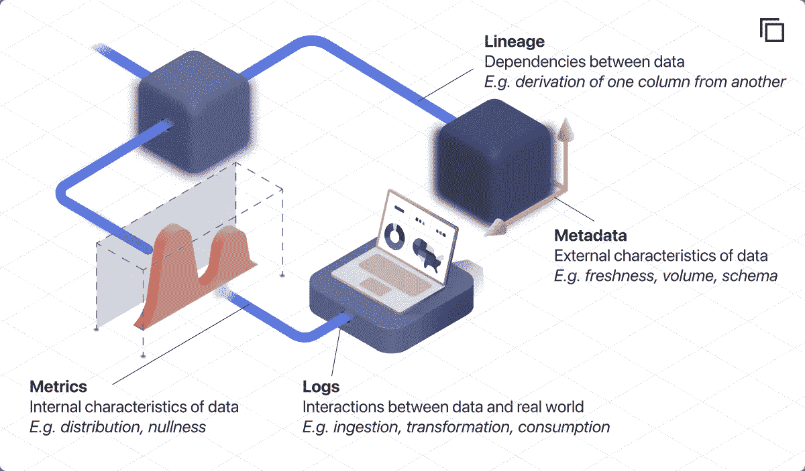
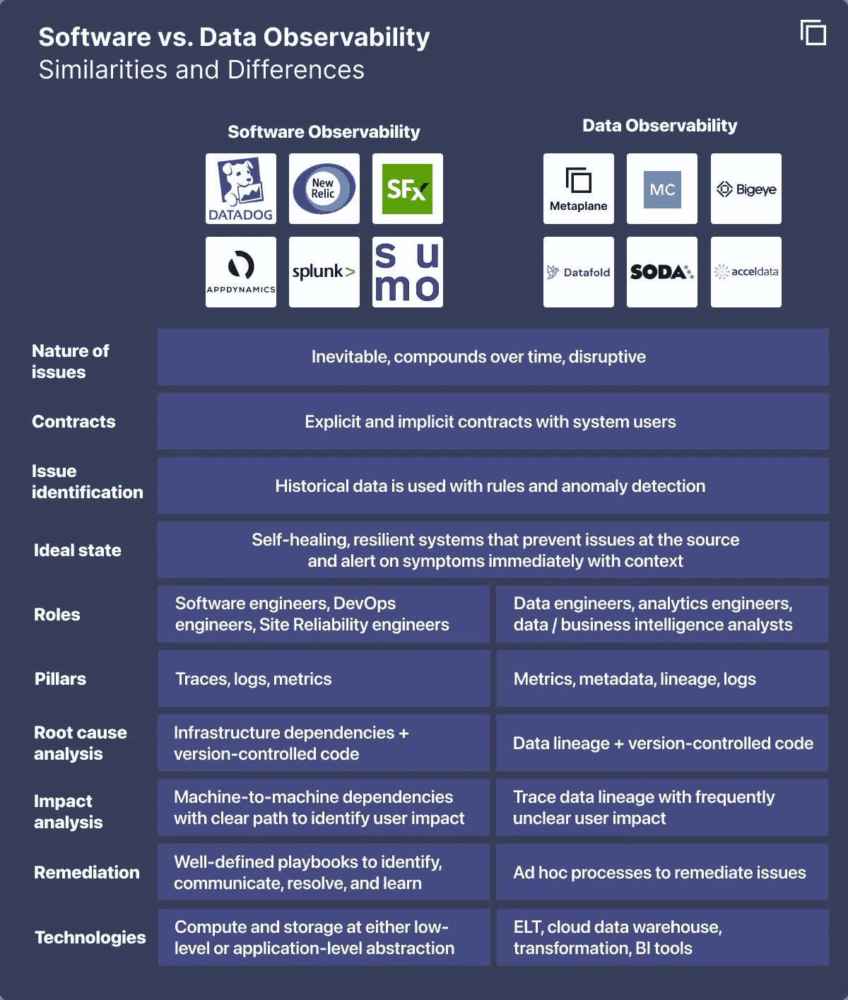
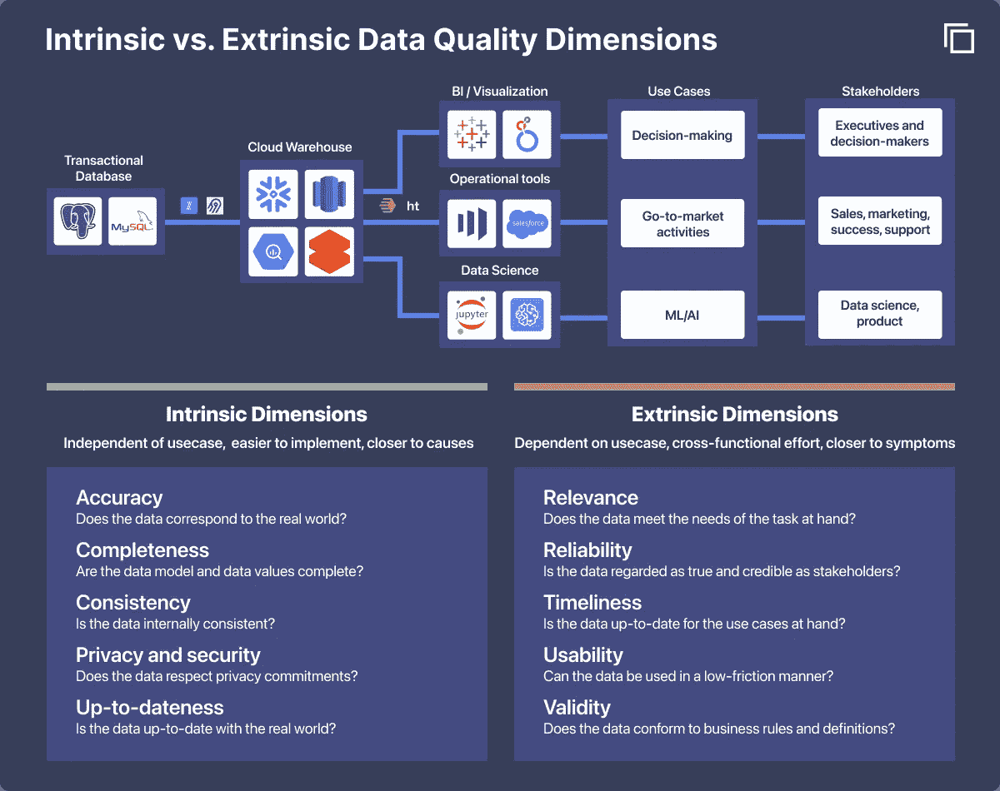
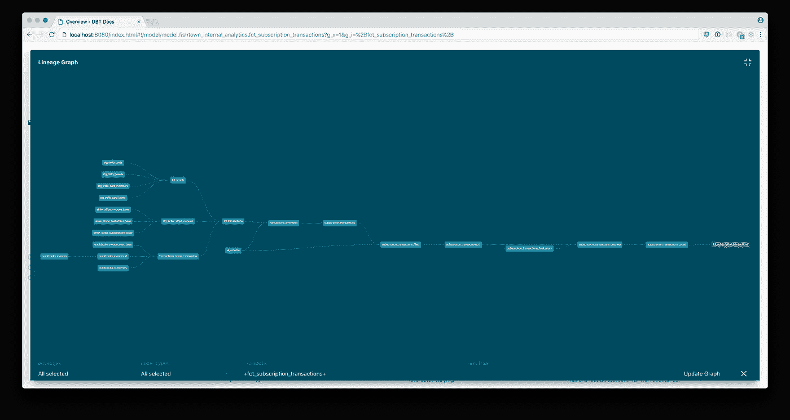

# 数据可观察性的四大支柱

> 原文：<https://towardsdatascience.com/the-four-pillars-of-data-observability-95a96a1a24e7?source=collection_archive---------16----------------------->

数据可观察性的四个支柱:指标、元数据、谱系和日志(图片由作者提供)

## 了解数据状态的必要和充分条件是什么？

回答诸如“我们的桌子是最新的吗？”以及“这种度量是反常的吗？”需要我们数据的历史知识。在存储数据的完整快照变得可行之前，我们只能捕捉近似值。

我们需要什么信息来重建我们数据的有用图像？这就是我们在这篇文章中试图回答的问题。描述我们的数据所需的信息类型与支撑新兴的数据可观察性类别的支柱相同。

# 为什么我们还需要另一个 X 柱？

[软件可观察性](https://www.metaplane.dev/blog/data-observability-vs-software-observability)建立在[的三个支柱之上，即度量、跟踪和日志](https://www.datadoghq.com/three-pillars-of-observability/)。指标是描述一段时间内软件系统组件的数值，如微服务的 CPU 利用率或 API 端点的响应时间。跟踪描述了基础设施之间的依赖关系，例如从 API 端点到数据库的应用程序请求的生命周期。日志是描述基础设施状态及其与外部世界交互的最细粒度的信息。

这三个支柱的目的是描述可用于重构的信息类别，尽可能详细地描述与用例相关的软件基础设施的状态。这与为什么术语“可观测性”是从控制理论中借用的密切相关，在控制理论中，可观测性被定义为“系统内部状态可以从其外部输出的知识中推断出来的程度的度量”。这些支柱一起让用户推断出系统在过去任何时间点的内部状态。因此，软件和 DevOps 工程师可以随时了解他们的基础架构。

数据可观察性从软件可观察性中获得灵感，尽管有[重要的差异](https://www.metaplane.dev/blog/data-observability-vs-software-observability)，比如数据片段和数据系统组件之间的谱系。由于这些差异，软件可观察性的三个支柱并没有完全满足数据团队的需求，无论他们是数据操作、数据工程、数据科学还是分析工程团队。最大的相似之处是随着时间的推移，他们的目标是增加对数据系统的可见性。

软件可观测性和数据可观测性工具的比较(图片由作者提供)

# 我们如何推导出四大支柱？

本着这种精神，我们要问:我们对数据了解多少才能推导出它在任何时间点的状态？我们添加了两个额外的约束:我们希望最大限度地精简支柱的数量，同时确保它们是正交的，以最大化每个支柱的信息价值。

这篇文章的灵感来自热力学的一个概念:材料的[密集和广泛属性](https://en.wikipedia.org/wiki/Intensive_and_extensive_properties)。密集属性不取决于材料的大小。例如，材料的温度、密度、压力和粘度不取决于材料的含量。一杯水的温度可以和整个海洋的温度一样。

# 度量:数据的内部特征

在数据世界中，与密集属性相似的是数据本身的属性。如果数据是数字，属性包括关于分布的汇总统计，如平均值、标准差和偏斜度。如果数据是分类的，分布的汇总统计可以包括组的数量和唯一性。

对于所有类型的数据，可以通过计算完整性、是否包含敏感信息以及准确性等指标来描述数据本身。这些都是不同的[数据质量指标](https://www.metaplane.dev/blog/data-quality-metrics-for-data-warehouses)，它们描述了汇总底层数据的某个方面，无论它们是针对仓库中的静态数据表计算的，还是针对数据管道中正在传输的数据计算的。

# 元数据:关于数据的外部特征

相反，广泛的属性与材料本身无关，如质量、体积和热容量。你可以拥有一磅或一升的水和黄金。请注意，这种类比并不准确，因为在热力学中，广泛的属性取决于物质的数量，而新鲜度和结构并不取决于此。

元数据通常被定义为“关于数据的数据”，但我们要补充的是，元数据是“关于独立于数据本身的数据的数据”与数据世界的直接类比包括数据量(行数)、数据结构(模式)和数据及时性(新鲜度)等属性。

虽然数据的容量、模式和新鲜度会对内部指标产生影响，但它们可以在保留统计特征的同时独立扩展。相反，数据的内部特征可以改变，而不会影响卷、模式或新鲜度。元数据可以和度量标准一起用于识别数据质量问题。

数据质量的高级维度(图片由作者提供)

# 沿袭:数据之间的依赖关系

使用度量和元数据，我们可以尽可能逼真地描述单个数据集。然而，现实世界中的数据集通常不是孤立存在的，它们位于数据仓库中，彼此之间没有关系。

我们可以从物理科学中得出另一个类比，系统可以在自身内部建模，但我们的理解可以通过建模交互来丰富。例如，热力学系统具有较小的具有内部相互作用的组件，并且还具有与外部环境的相互作用。

从 dbt 生成的表数据谱系示例([来自 dbt Labs](https://docs.getdbt.com/docs/building-a-dbt-project/documentation) 的图像)。

在数据世界中，主要的内部交互是从一个数据集派生另一个数据集。数据集源自上游数据，并可用于衍生下游数据。这些双向依赖被称为数据的*血统*(也称为*出处*)，以及整个系统之间(这个仓库依赖于那些来源)、表之间、表中的列之间以及列中的值之间的血统的抽象级别范围。

# 日志:数据和现实世界之间的交互

有了描述数据内部状态的指标、描述其外部阶段的元数据以及描述数据片段之间依赖关系的谱系，我们只缺少了一个部分:数据如何与外部世界交互。我们将这些交互分为机器-机器交互和机器-人交互。

机器与数据的交互包括移动，例如当数据通过 ELT 工具从数据源(如事务数据库或外部提供者)复制到分析仓库时。交互还包括转换，例如当 dbt 作业将源表转换为派生表时。日志还记录这些交互的属性，例如复制或转换所花费的时间，或者该活动的时间戳。

至关重要的是，日志捕捉数据和人之间的人机交互，如数据工程团队创建新模型，利益相关者使用仪表板进行决策，或数据科学家创建机器学习模型。这些人机交互有助于理解谁负责数据以及如何使用数据。

# 把所有的放在一起

有了描述数据内部属性的指标、描述外部属性的元数据、描述依赖关系的谱系以及描述交互的日志，我们就有了四个可以利用的杠杆，来全面描述数据在任何时间点的状态。

没有任何一个支柱，我们重建数据状态的能力都是不完整的。

**如果没有指标**，我们将无法了解数据本身的内部属性，从而无法基于指标的实时异常检测发出警报。如果我们只有元数据，我们会知道数据的形状、结构和时间，但不一定知道我们是否有坏数据。

**没有元数据**，我们就不知道数据的结构、构造或时序，这使得像模式变化检测这样的用例或通过跟踪停机来满足[服务水平协议](https://locallyoptimistic.com/post/data-warehouse-sla-p1/)(SLA)变得不可能。这些用例对于提高数据可靠性和减少数据停机时间至关重要。如果我们只有指标，我们将知道数据是否正确，但不一定知道它是否在适当的时间内被刷新。

**如果没有沿袭**，我们就不知道不同的数据是如何相互依赖的，这就很难分析数据质量问题的上游根本原因和下游影响。如果我们只有指标和元数据，我们会对数据的健康状况有一个整体的看法，但对问题之间的关系却不完整。

**没有日志**，我们不知道 ELT 和转换工具等外部系统如何影响我们的数据，以及外部用户如何受到我们的数据的影响。只有数据血统，我们知道数据是如何关联的，但不一定知道那些关系有多重要(有人使用这些数据吗？)或谁对上游变更负责(谁可能导致问题？).

# 让支柱发挥作用

开始建立这些支柱是一个项目，不要让完美成为好的方式。2021 年的大多数数据团队对他们的系统了解甚少，所以第一步就是开始。要开始收集指标，您可以从识别最重要的表和指标开始，定期查询这些指标的属性，如`nullness`、`mean`和`stddev`。

元数据通常由您的数据仓库提供，像 Snowflake 和 Google BigQuery 这样的仓库提供行计数、模式和表的最后更新时间的快照。您可以从将元数据存储到单独的表中开始。

血统和日志更具挑战性。推断表和列之间的谱系是一项困难的任务，但是有一些开源库提供了一个起点。如果您使用 dbt 或 Prefect 之类的转换工具，那么您很幸运，可以开始接收这些系统生成的元数据。存储和解析日志高度依赖于数据栈中的工具，尽管您的 ELT 和 BI 工具通常会提供访问这些日志的 API，并且您的仓库可能会存储查询历史。

如果您没有带宽来构建收集数据资产的指标、元数据、世系和日志的系统，那么这就是数据可观测性平台的用武之地。这是一个由商业和开源工具组成的[活跃生态系统](https://www.metaplane.dev/state-of-data-quality-monitoring-2021),可以自动收集这些信息，将其合成为可用的形式，并与您已经使用的工具集成。

# 摘要

1.  在随着时间的推移存储数据快照变得可行之前，我们依赖于存储数据的近似值，即有损压缩
2.  数据的四类特征构成了数据可观察性的四大支柱
3.  指标和元数据支柱描述了数据本身的内部特征及其外部特征
4.  沿袭和日志支柱描述了我们的数据内部的依赖性及其与外部世界的交互
5.  如果没有这四个支柱中的任何一个，我们在给定的时间点只能看到不完整的数据

***如果这篇文章引起你的共鸣，我们很乐意聊天！你可以联系到*** [***凯文***](https://www.linkedin.com/in/kevinzenghu/) ***，团队在*** [***元位面***](https://metaplane.dev) ***，或者*** [***在这里预定一个时间***](https://calendly.com/metaplane/metaplane-demo) ***。***