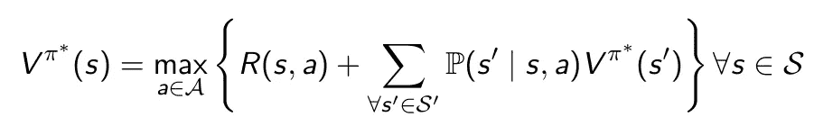
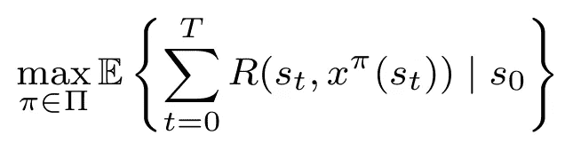
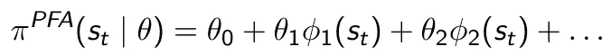
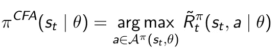
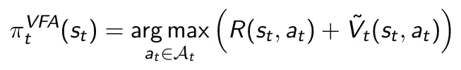
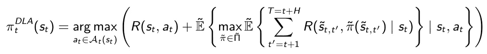

# 强化学习的四个策略类别

> 原文：<https://towardsdatascience.com/the-four-policy-classes-of-reinforcement-learning-38185daa6c8a?source=collection_archive---------12----------------------->

## [思想和理论](https://towardsdatascience.com/tagged/thoughts-and-theory)

## 强化学习解决策略的综合分类

图片由[汉斯·布拉克斯梅尔](https://pixabay.com/nl/users/hans-2/?utm_source=link-attribution&amp;utm_medium=referral&amp;utm_campaign=image&amp;utm_content=9241)通过[皮克斯贝](https://pixabay.com/nl/?utm_source=link-attribution&amp;utm_medium=referral&amp;utm_campaign=image&amp;utm_content=9241)拍摄

强化学习(RL)的政策笼罩在某种神秘之中。简单地说，策略 *π: s →a* 是返回问题可行行动的任何函数。不多也不少。例如，你可以简单地采取第一个想到的行动，随机选择一个行动，或者运行启发式。然而，RL 的特别之处在于，我们主动预测决策的下游影响，并从我们的观察中学习；因此，我们希望我们的政策中有一些智慧。在他的顺序决策框架[1]中，Warren Powell 认为 RL 有四个政策类别。这四类技术被广泛应用于各个领域，但还没有得到普遍认可。本文将对这种解决方案策略的分类做一个简短的介绍，这无疑是不完整的。

# 求解 MDP 模型

在继续强化学习之前，让我们先稍微回忆一下解析解。通常，我们的目标是将 RL 问题公式化为马尔可夫决策过程(MDP)模型。如果我们靠近 MDP，强化学习的目标将是求解相应的贝尔曼方程组，从而找到最优策略 *π** :

MDP 的贝尔曼方程。找到最优策略 *π** 产生最优值函数 *V(s)* ，反之亦然。

但是我们实际上并不需要贝尔曼方程。最终，我们只是试图最大化一个累积的回报；最优策略正是这样做的。它还消除了考虑价值函数*【v^π*(s'】*的需要，这是我们只在四个策略类之一中做的事情。因此，我们可以将我们的目标陈述如下:

时间范围内的报酬函数。最优策略 *π*使累积报酬最大化。*

要解决 MDP 模型的最优性，基本上有两种方法:(一)政策迭代和(二)价值迭代。*策略迭代*修复策略，计算相应的策略值，然后使用新值更新策略。该算法在这些步骤之间迭代，直到策略保持稳定。*价值迭代*实际上依赖于非常相似的步骤(见下图)，但是旨在直接最大化价值函数，并且仅在之后更新策略。注意，找到最优值函数等同于找到最优策略；任一个都足以求解贝尔曼方程组。

策略迭代(左)和价值迭代(右)的比较。请注意策略迭代的迭代特性和值迭代中的最大值运算符。改编自萨顿&巴尔托[2]

大多数(如果不是全部的话)RL 算法要么基于策略迭代，要么基于值迭代(或者两者的组合)。由于部署的模拟方法通常不能保证找到最优策略，在 RL 中我们分别谈到策略*近似值*和值*近似值*。鲍威尔指出，这两种策略可以细分为两类，总共产生四类，即将讨论。只需要一些基本的符号，我们就可以开始了:

*s* :状态(做出决策所需的信息)

*a* :动作(可行操作 on 状态)

*π* :策略(将状态映射到动作)

*ϕ* :基函数(从状态中导出特征)

*θ* :特征权重(策略的参数化)

*t* :时间点(离散时间点)

*R* :奖励功能(在状态下采取行动的直接奖励)

*V* :价值函数(某种状态的下游奖励)

# 策略近似

在策略近似解决方案中，我们直接修改策略本身。当策略具有清晰的结构时，这样的解决策略往往效果最佳。我们可以区分两类:PFA 和 CFA。

## 政策功能近似(PFA)

策略函数近似(PFA)本质上是策略的参数化函数。直接插入状态返回一个可行的动作。线性 PFA 可能看起来像:

政策功能近似(PFA)示例

这里的关键挑战是找到合适的基础函数*ϕ(s】*抓住决策过程的本质。要做到这一点，需要对问题的结构有很好的洞察力。通过选择更通用的功能表示，例如神经网络(演员网络)，使用状态作为输入并输出动作，可以减轻设计工作。这种 PFA 表示的缺点是参数调整变得更加困难，并且可解释性受到影响。无论如何，对问题结构的牢固理解仍然是必要的。

## 成本函数近似法

像 PFA 一样，成本函数近似(CFA)也直接搜索策略空间。然而，CFA 不直接返回动作，而是在受约束的动作空间中解决优化问题。一个示例配方是:

成本函数近似值(CFA)示例

PFA 直接返回一个动作，而 CFA 要求我们首先求解一个参数化的最大化函数。请注意，真正的奖励和价值函数已经被一个近似的奖励函数所取代。此外，动作空间 A^π受到策略 *π* 及其参数化 *θ* 的约束，通常产生比原始空间更小的动作空间。注意，CFA 的最简单形式仅仅是贪婪启发式，然而修改的奖励函数可以嵌入探索元素。每次迭代的计算工作量可能高于 PFA(由于最大化步骤)，但所需的设计工作量较少。

# 价值近似值

价值近似值明确考虑了当前决策的下游影响，考虑了整个决策范围。提醒最优价值函数等同于最优策略；它们都给出了贝尔曼方程的相同解。当政策结构不突出或我们不能恰当地监督当前决策的下游效应时，价值近似值可能是合适的。

## 价值函数近似(VFA)

价值函数近似值(VFA)将下游价值表示为一个函数。贝尔曼方程的一个问题是，在采取一个行动后，随机事件可能会把我们带到许多新的状态 *s'∈ S'* 。因此，对于每个动作，我们应该考虑所有可到达状态*s’*的值以及在那里结束的概率。vfa 通过用确定性近似函数 *V_t(s_t，a_t)* 代替随机期望项来规避这个问题。在规范形式中，VFA 看起来像:

价值函数近似值示例(VFA)

最简单的 VFA 是一个查找表，其中存储了每个状态-动作对的平均观察值。足够的迭代允许我们学习每一对的精确值，然而这在计算上很难处理。因此，我们通常求助于捕捉状态本质的特征，我们可以通过例如使用自动编码器来手动设计或提取这些特征。因此，我们在紧凑函数(例如，critic 网络)中捕获状态-动作值，并通过观察来调整特征权重。

## 直接前瞻近似(DLA)

设计 VFA 通常需要很好地理解问题结构，尽管神经网络在一定程度上缓解了这个问题(以额外的调整为代价)。直接前瞻逼近(DLA)只是对下游值进行采样，而不是导出显式函数。DLA 可由以下代表:

直接前瞻逼近的例子(DLA)

诚然，这个等式看起来很麻烦，但实际上可能是最简单的。预期项意味着我们对未来进行采样，并应用一些(次优)策略来估计下游值。尽管我们在当前时间 *t* 最大化所有可行的动作，但是对于未来时间周期*t’*，我们通常使用计算量更小的策略(例如，启发式)和/或简化的问题表示(例如，假设完全预见)。DLA 战略带来了自己的挑战(情景取样、汇总技术等)。)，但与其他三种策略不同，它不需要估计函数(因此，用“前瞻”替换“函数”不仅仅是语义上的)。因此，对于其他三种策略都失败的复杂问题，它通常是最后的手段。

# 混合班

如果不提到结合多个职业的策略的选项，那将是我们的失职。例如，经典的演员-评论家框架包含了 PFA(演员)和 VFA(评论家)的元素。然而，还有更多的组合，例如将 VFA 作为下游策略嵌入到直接前瞻算法中。与单一类别的解决方案相比，组合策略可能会消除彼此的弱点，通常会产生更好的结果。

# 外卖食品

根据 Powell 的说法，实际上任何解决方案策略都可以归为四个策略类别中的一个(或多个)。除此之外，从分类中还可以得出一些有趣的结论:

*   **没有一刀切。**虽然有一些经验法则，但多种策略可能会产生好的解决方案。在 Powell&Meisel[3]中可以找到这种说法的一个具体例子，展示了对同一问题的所有四种解决策略的实现。
*   学者喜欢优雅。PFA 和 VFA 似乎在学术界最受欢迎。毕竟，在一个函数中捕捉一个复杂的决策政策有一定的数学美。
*   **行业喜欢结果。当问题变得太大或太复杂时，CFA 和 DLA 可能会产生意想不到的好结果。尽管更多地依赖于蛮力和枚举，但设计工作量却大大减少了。**
*   **万物皆有价。**在便利性、设计努力、计算复杂性、可解释性等方面总是存在权衡。问题的本质决定了这些权衡的轻重。
*   **分类是关键。有许多 RL 社区，许多技术，许多符号风格，许多算法。为了简化领域并促进进步，需要一个清晰的总体框架。**

# 参考

[1]鲍威尔，沃伦 b .“随机优化的统一框架。”*欧洲运筹学杂志*275.3(2019):795–821。

[2]萨顿、理查德 s .和安德鲁 g .巴尔托。*强化学习:简介*。麻省理工学院出版社，2018。

[3]鲍威尔、沃伦·b .和斯蒂芬·梅塞尔。"能源中的随机优化教程——第二部分:能量存储图解." *IEEE 电力系统汇刊*31.2(2015):1468–1475。