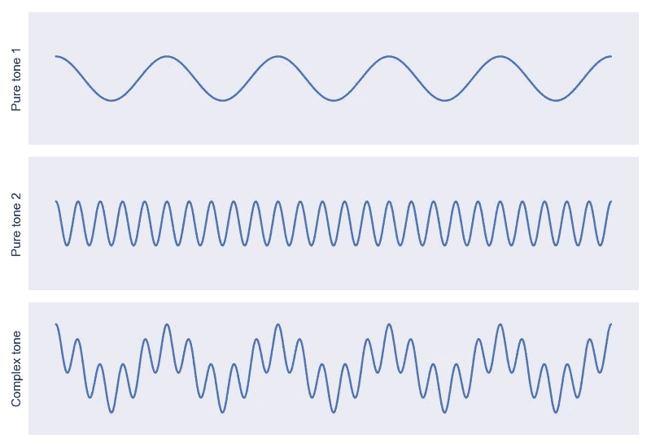
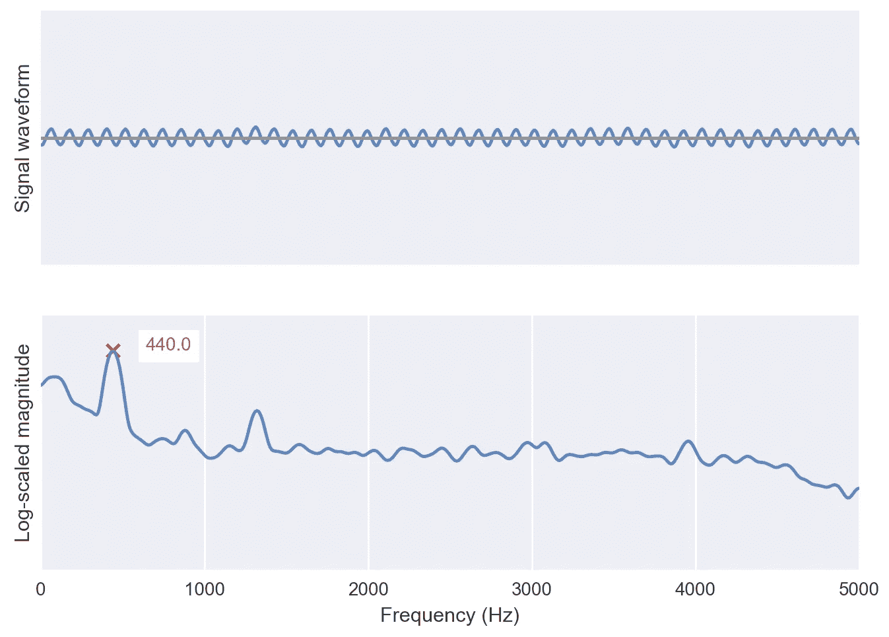

# 傅立叶变换，应用(1):频域介绍

> 原文：<https://towardsdatascience.com/the-fourier-transform-1-ca31adbfb9ef?source=collection_archive---------14----------------------->

## 了解 FFT 幅度的基础知识

我努力理解傅立叶变换，直到我把这个概念映射到现实世界的直觉上。这是一系列越来越技术性的解释的第一篇文章。我希望直觉也能帮助你！

声音是机械波，是空气或其他介质中的振动。音符对应波的*频率*。高频波对应高音(高低压之间变化较快)，低频波对应低音(高低压之间变化较慢)。

这些波随着时间在空间中传播。当声波到达麦克风时，它会摆动一种叫做振膜的结构。隔膜的运动产生电流，这使我们能够记录加压和减压的速率。

***图 1*** :对于一个纯音来说，压力随时间变化绘制出一个简单的正弦曲线。对于复杂的音调，即纯音的混合，压力随时间的变化是正弦曲线的总和。

如果我们考虑一个固定的麦克风，当一个波通过它时，记录的压力变化是时间的函数。这种在*时间域*中的表现与我们的直觉吻合得很好:随着时间的推移，压力以与频率相对应的速率周期性地增加和减少。更复杂的音调是多个频率的总和(*图 1* )。

信号在时域中的这种表示是 [*密集的:*对于大多数域来说是非零的](https://en.wikipedia.org/wiki/Sparse_matrix)。但是我们知道，我们可以更简洁地谈论音乐音调，而不是描述每个时间点的压力。相反，我们可以简单地命名一个音符，或者，等价地，用[赫兹(Hz)](https://en.wikipedia.org/wiki/Hertz) 表示频率:每秒的周期数。

在频域中，x 轴表示频率，y 轴表示信号中的频率量。对于*图 1* 中描述的简单音调，这种描述在频域中是*稀疏的:*在大部分域*中是零。*

> ***傅立叶变换是一种数学运算，它将时域或空域中的信号映射到频域中的函数。***

傅立叶变换正是我们想要的！它采用了我们在*图 1* 中绘制的密集时间信号，并给出了*图 2* 在频域中的稀疏描述。从图上看，每个分量频率都很明显。

**图 2** :对于图 1 中相同的三个信号，离散傅立叶变换的正频率项的幅度。x 轴值对应于窗口时间段内的周期数。

如果我们将来自*图 1* 的信号的持续时间视为一秒，则*图 2* 中的 x 轴值对应于赫兹。傅立叶变换恢复第一个曲线的 5Hz，第二个曲线的 25Hz，以及第三个复音调的组合。对于所有其他频率值，傅立叶变换近似为零值。现在，我们只考虑*的量级，*我们将在以后的帖子中探索更多！

**图 3** :使用 [my repository source](https://github.com/peterbbryan/Understanding-Fourier-1) 的音频图，同时使用 [Tone Gen app](https://apps.apple.com/us/app/tone-generator-audio-sound-hz/id1206449238) 播放 440Hz 音调！

我发现对实时音频数据进行傅立叶变换实验是最有价值的！我构建了一个小型 Python 库，对从计算机麦克风录制的简短片段进行傅立叶变换，并对其结果进行实验。

查看来源！尝试乐器和环境声音。

<https://github.com/peterbbryan/Understanding-Fourier/tree/master/fourier_1>  

如果回购或文本对你有价值，请为文章鼓掌！如果你遇到了其他帮助你理解数学概念的隐喻，请留下评论。

如果人们感兴趣，我期待着写越来越多的傅立叶变换的技术总结！感谢阅读！

查看本系列的下一篇文章！

</the-fourier-transform-2-understanding-phase-angle-a85ad40a194e> 