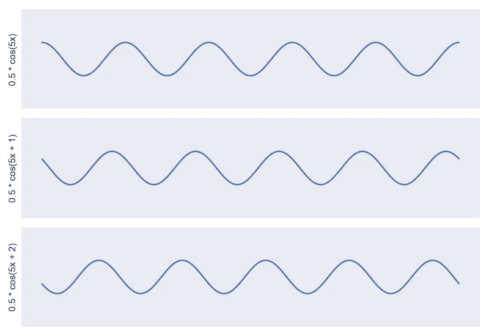
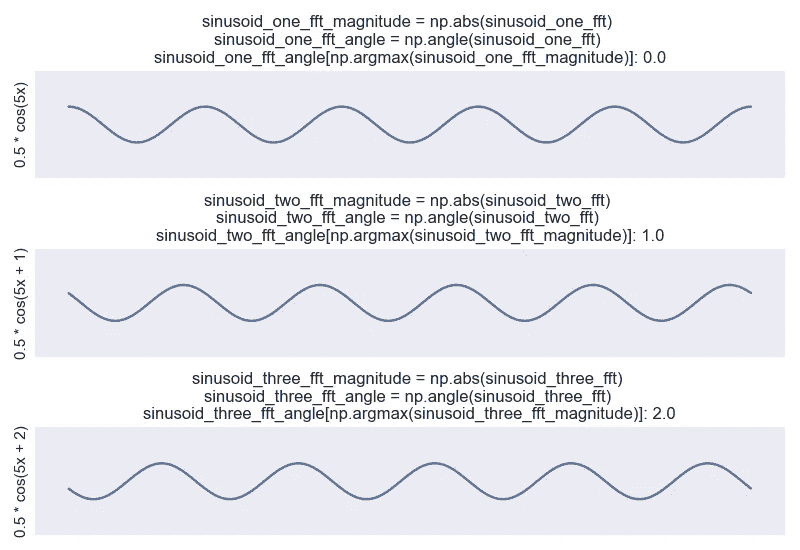

# 傅立叶变换，应用(2):了解相位角

> 原文：<https://towardsdatascience.com/the-fourier-transform-2-understanding-phase-angle-a85ad40a194e?source=collection_archive---------2----------------------->

## 了解 FFT 相位的基础知识

在前一篇文章中，可视化专门讨论了傅立叶变换的幅度。在这里，我们将扩展缺失的部分:阶段！

查看该系列的前几篇文章！

<https://peterbbryan.medium.com/the-fourier-transform-1-ca31adbfb9ef>  

在上一篇文章中，我展示了如何利用傅立叶变换的幅度来估计信号的频率成分。然而，仅仅依靠频率，我们无法完美地重建信号；我们需要相位！

**图 1** :三个相同的正弦波相位偏移。图片作者。

如果我们看一个纯音音频文件，但我们将信号从左向右移动，会怎么样？

在我们之前的音频示例中，这是一个挑战。左侧的所有三个信号(*图 1* )具有相同的频率。高压和低压之间的振荡速率是相同的。唯一不同的是起始位置，从左向右移动。

我们可以把这表示为“相移”这三个信号的频率相同，只是在振荡的起始位置有所偏移。查看三个生成等式，分别为 0.5 * cos(5x)、05 * cos(5x + 1)和 0.5 * cos(5x + 2)，该失调以余弦表达式中的和值表示，即 0、1 和 2。

**图 2** :使用傅立叶变换的 np.angle 恢复的近似相位。图片作者。

这种相位信息也用傅里叶变换表示，可以用 numpy“角度”函数恢复。如果我们在与幅度最大的频率相同的索引处查看相位值，就可以确定与该频率成分相关的相位偏移。在这里(图 2)，傅立叶变换从上面的等式中恢复 0、1 和 2！

<https://github.com/peterbbryan/Understanding-Fourier/tree/master/fourier_2>  

如果回购或文本对你有价值，请为文章鼓掌！感谢阅读！

查看本系列的下一篇文章！

</the-fourier-transform-3-magnitude-and-phase-encoding-in-complex-data-8184e2ef75f0> 