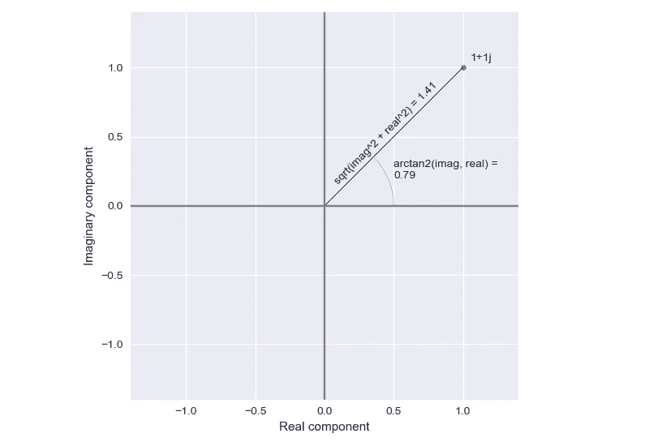

# 傅里叶变换，应用(3):复数数据中的幅度和相位编码

> 原文：<https://towardsdatascience.com/the-fourier-transform-3-magnitude-and-phase-encoding-in-complex-data-8184e2ef75f0?source=collection_archive---------8----------------------->

## 重新实现 np.abs 和 np.angle 以更好地理解 FFT

对于傅立叶变换的幅度和相位值可以告诉我们信号的复合频率，我们已经有了一个常识性的理解。现在，我们将停下来欣赏一下 np.abs 和 np.angle 函数是如何工作的。为了达到这个目的，我们还将引入复数的有效定义！

查看该系列的前几篇文章！

*   [https://towards data science . com/the-Fourier-transform-1-ca 31 ADB FB 9 ef](/the-fourier-transform-1-ca31adbfb9ef)
*   [https://towards data science . com/the-Fourier-transform-2-understanding-phase-angle-a 85 ad 40 a 194 e](/the-fourier-transform-2-understanding-phase-angle-a85ad40a194e)

## 复数基础

在本系列的后面，我们将在处理复数时接触更多的技术。不过现在，我们只需要认识到复数是由两部分组成的:一个*实数*分量和一个*虚数*分量。

我们将很快回到复数的一些神奇性质(并介绍一位名叫欧拉的特殊客人)，但为了讨论幅度和相位，我们可以将复数视为简单的二维值。每个复数都是一对实数值和一个虚数值。像任何二维一样，我们可以画出这些复杂的对。按照惯例，我们通常把实部放在 x 轴上，虚部放在 y 轴上。

**图 1** :可视化幅度和相位。图片作者。

我们复数的虚部是 *i* (或者 *j* ，看你问谁了): **√** (-1)。在左边，我看到了复数 1+1j。实数为 1，虚数为 1 的复数。同样，实部在 x 轴上，虚部在 y 轴上。正如所料，这使我们正好处于第一象限。

现在，我们不需要太担心为什么 y 轴被表示为一个系数 *j.* 只要你接受我们可以把这个虚值当作第二维度，几何直觉就会起作用。我们会回来的，我保证！

> 傅立叶变换返回的值是复数。对这些复数值调用 np.abs 可以得到每个复数值的大小。对这些复数值调用 np.angle 会给出每个复数值的相角。这样，幅度和相位被编码在傅立叶变换的复数值中。

## 重新实现 np.abs

一个复数的大小正好是到原点的[欧几里德距离](https://en.wikipedia.org/wiki/Euclidean_distance)(0+0*j*):平方和的平方根。如上图所示，对于 1+1 *j* ，这就是 **√** (1 + 1 )≈1.41(想想[勾股定理！](https://en.wikipedia.org/wiki/Pythagorean_theorem))。下面，我包含了任意复数的逻辑:

## 重新实现 np.angle

复数的相位是标准角度(从右顺时针)。如上图所示，对于 1+1 *j* ，这是 arctan2(1，1)≈0.79 弧度。对照度数检查(0.79 弧度* 180 / π弧度≈ 45)，该值正确反映了上图中的角度。如果反正切使你的血压升高，花一分钟回顾一下[反三角恒等式](https://en.wikipedia.org/wiki/Inverse_trigonometric_functions)，它允许我们恢复这个角度！

下面，我包含了任意复数的逻辑:

太好了！总结一下，我们现在对傅立叶变换的幅度和相位的含义有了很好的直观理解。我们对复数有一个基本的了解，并且知道如何从复数中恢复幅度和相位信息。

接下来，我们将看看逆傅立叶变换(IFFT ),并演示我们可以用迄今为止开发的工具包完成什么！

如果代码或文本对您有价值，请为文章鼓掌！感谢阅读！

查看本系列的下一篇文章！

</the-fourier-transform-4-putting-the-fft-to-work-38dd84dc814> 