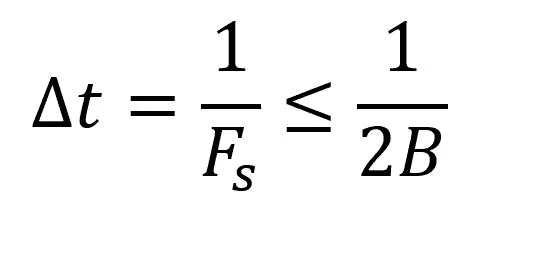
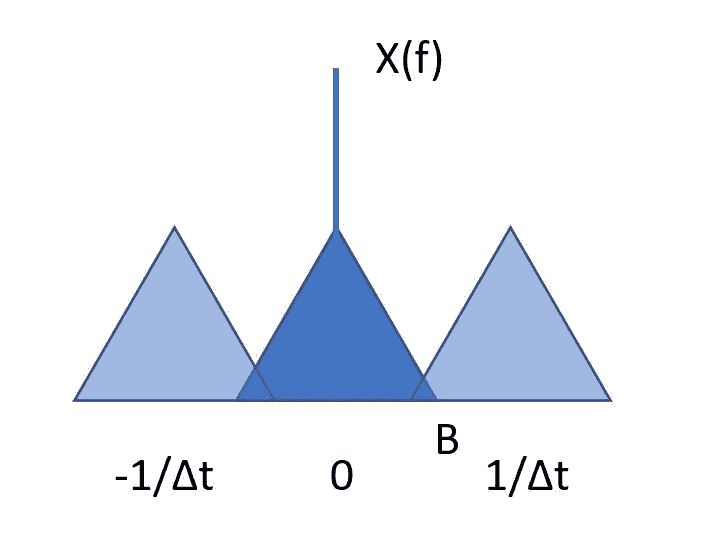
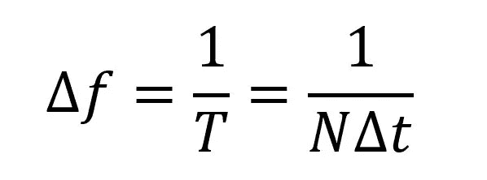
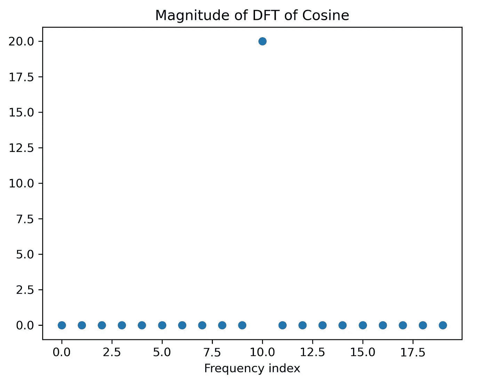
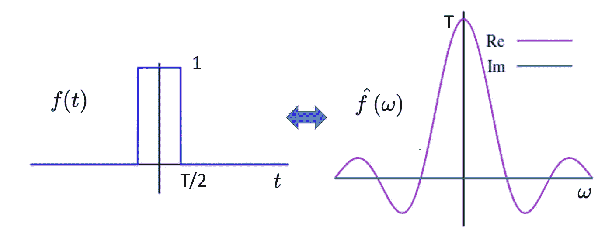
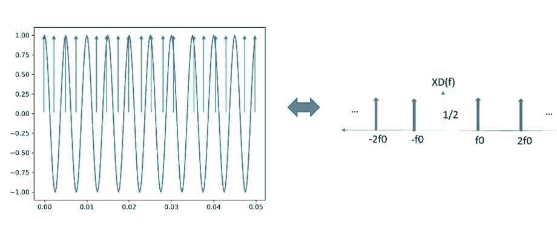

# 傅立叶变换，

> 原文：<https://towardsdatascience.com/the-fourier-transform-a-first-look-1bf17f956cdd?source=collection_archive---------13----------------------->

# 第一眼

克里斯蒂安·祖尼加博士

> 1822 年，约瑟夫·傅立叶出版了他的著作《热的解析理论》,在书中他指出许多信号可以分解成正弦和余弦的和。两百年后，傅立叶的思想在现代社会的很多地方都被使用，从密码学到收音机和 x 光机。正如令人惊讶的有趣的书《小波世界》中提到的，“傅立叶变换是一个数学棱镜，将函数分解成组成它的频率”[1]。傅立叶变换将信号 x(t)表示为正弦和余弦的叠加，或者更简洁地表示为复指数。为了获得表示为 X(f)的变换，信号与所有频率的指数相关。这是一个类似于调谐收音机的过程，其中某些频率可能更占优势。但是，在转换过程中不会丢失或获得任何信息。

一些函数有解析表达式，但一般来说，变换必须用数值计算。数字计算机只能计算 x(t)和 X(f)的离散值的变换。正如大多数学习数字信号处理的学生所证实的那样，实现的细节可能很复杂。使用梯形积分的上述积分的直接近似将表明傅立叶变换可以通过离散傅立叶变换(DFT)来近似。

DFT 只包括求和。为了逼近傅里叶变换，DFT 应乘以 t，信号必须在时间和频率上分别以 t 和 f 为间隔进行采样。这些区间是如何选择的？细节可以在几个参考文献[2][3]中找到。《快速傅立叶变换及其应用》是一本经典的参考书。重要的是要知道，一个域中的采样会在另一个域中引入周期性，其周期是采样间隔的倒数。如果以间隔 t 对 x(t)进行采样，频谱将变为周期为 1/，图 1 显示了时间采样后的样本信号频谱。如果信号受最大频率 B 的带宽限制，显然，为了避免副本重叠，采样频率 Fs = 1/∏t 应大于或等于最大信号频率 B 的两倍，如果信号不受带宽限制，副本之间会有重叠或混叠。通常，信号可以通过低通滤波器以限制其频率。此限制将采样时间间隔设置为。

图 1 采样信号的频谱。采样频率必须大于最大频率 B 的 2 倍，以避免混叠。(图片由作者提供)

或者，如果信号以频率 Fs 采样，则可分辨的最大频率为 Fs/2(也称为奈奎斯特频率)。

类似地，频率采样使时域信号以 1/∏f 为周期，时域信号从 0 开始，截断至持续时间 t，为了避免时域混叠，频率采样间隔是信号持续时间 t 的倒数。

傅里叶积分近似值中的乘积 t f 为 1/N，其中 N 为持续时间为 t 的信号中的样本数，图 2 显示了采样间隔的关系。

图 2 时域采样(左)和频域采样(右)。(图片由作者提供)

一切似乎都准备好计算近似值了，所以让我们用一个已知的傅立叶变换函数来试试。余弦是一个非常特殊的函数，在时间上具有周期性，在频率上具有带宽限制。虽然大多数信号不会有这种性质，但研究这种情况还是有指导意义的。频率为 f0 的余弦函数 x(t) = cos(2πf0t)，具有傅里叶变换 0.5(δ(f-f0)+ δ(f+f0))或两个δ函数，如图 3 所示。每个都有一个 0.5 的值，或者更确切地说，集成到。

图 3 余弦函数及其傅里叶变换(右图)。如图所示，时域信号每个周期最少可以有 2 个样本。使用的周期数可以不同，但最好设置 T=NTp，其中 Tp = 1/f0。(图片由作者提供)

该函数的采样频率至少应为 2xf0，或者每个周期至少两个样本，如图 3 所示。由于函数是周期性的，因此最好将截断间隔 T 设置为周期的整数倍或 T= N/f0。DFT 最方便的计算方法是快速傅立叶变换(FFT ),并且可以在许多数值包中完成。计算 DFT 并绘制幅度，结果如图 4 所示。余弦的频率为 f0 = 200 赫兹。采样频率为 Fs=2f0，T=10/f0。第一个画出这个结果的人很可能会觉得这个情节很神秘。它与图 3 中的预期转换有什么关系。

图 4 余弦级数的 DFT。f0=200 Hz，Fs=2f0，T = 10/f0 = 1/20。有 N=20 个样本。指数 10 对应于余弦的频率 200 Hz。DFT 的数值 20 和期望值不相等

首先，重要的是要记住指数代表什么。每个指数 k 代表一个频率 k f，频率分辨率 f 是 T 的倒数，因为 T 使用了 10 个周期，所以 f = 20 Hz。图 4 显示在索引 k=10 时只有一个非零值。这表示频率为 10x20 = 200 Hz，符合预期。

k=10 时的变换幅度是多少？该图显示 XD[10] = 20。将该值乘以 t=1/400 得到 1/20，这并不等于实际值 0.5。傅立叶变换的近似值出了什么问题？

理解差异的来源包括理解卷积运算。卷积给出线性时不变滤波器 h(t)对输入序列 x(t)的响应 y(t)。傅立叶变换可以简化这种运算，因为时间上的卷积变成了变换的乘法或 Y(f) = H(f)X(f)。类似地，时间上的乘法涉及频域上的卷积。

计算 DFT 间接涉及原始信号通过采样函数的乘法和卷积。信号 x(t)首先通过将 x(t)与矩形函数相乘得到 x(t)rect(T)而被截断为持续时间 T。图 3 已经显示了截断余弦的结果，余弦原本是无限的。时间上的乘法意味着相应的变换被卷积或 X(f)⊗ sinc(f)。rect 函数的傅里叶变换是 sinc，如图 5 所示。这种转换的细节可以在参考资料中找到。关键是 sinc 函数引入了原始频谱 X(f)的 T 倍缩放。

图 5 矩形函数及其傅立叶变换。图片来自维基百科[4]

如图 6 所示，信号的离散化涉及与一系列δ函数 d(t)的第二次相乘。δ函数由采样间隔 t 分隔。δ函数序列的傅立叶变换结果也是频率中的δ函数序列，但分隔 1/∏t。这一结果在频域中引入了周期性。然后，采样信号是 2 次乘法的结果，或者

xs[n] = x(t)rect(T)d(t)。

图 6 采样和截断余弦系列使频谱具有周期性，并以 2T/∏t = 2N 调整数值。

这一新的见解解释了连续版本的 DFT 结果的差异。DFT 实际上是计算 xs[n]的变换，而不是 x(t)。在这种情况下，它们之间的关系是 Xs(f)=(2T/𕐼t)X(f)=(2/N)X(f)。获得因子 2 是因为对于选定的 Fs 值，两个δ函数正好重叠。对于采样频率 Fs 的较大值，没有重叠，因子 2 消失。

为了获得傅立叶变换的值，将计算出的 DFT 除以 n，在上例中，将该值除以 2N 或 40 得到 20/40 =现在等于实际值！遗憾的是，对于其他类型的信号，没有通用的比例关系。然而，DFT 仍然给出了傅立叶变换的近似值。

**参考文献**

[1]哈伯德《小波的世界》第二版，A . K .彼得斯有限公司，版权 1998

[2] Brigham《快速傅立叶变换及其应用》Prentice Hall 1988

[3] Lyons《理解数字信号处理》第二版，Prentice Hall 2004

[4]https://en.wikipedia.org/wiki/Fourier_transform