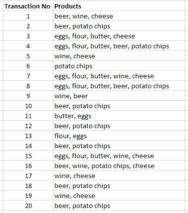
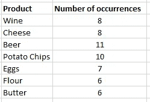
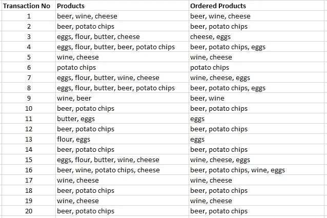
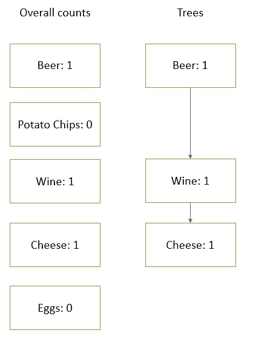
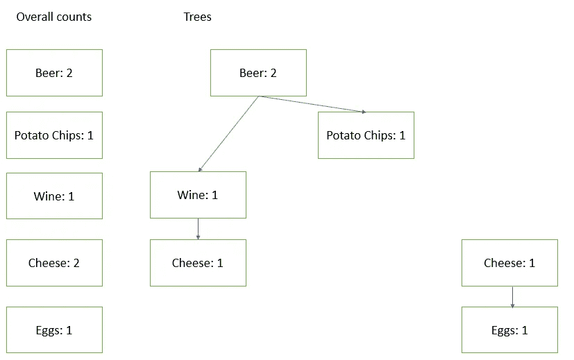
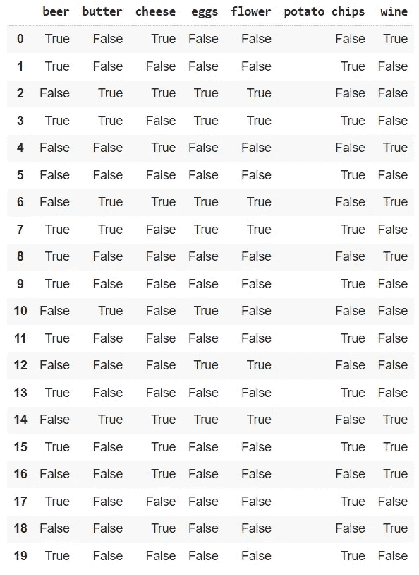
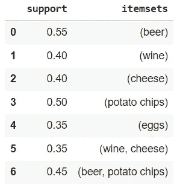
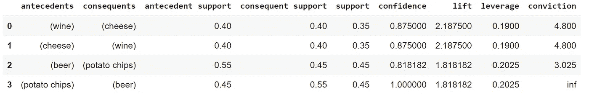

# FP 增长算法

> 原文：<https://towardsdatascience.com/the-fp-growth-algorithm-1ffa20e839b8?source=collection_archive---------0----------------------->

## [实践教程](https://towardsdatascience.com/tagged/hands-on-tutorials)

## 利用 Python 中的 FP 生长算法进行购物篮分析的频繁项集挖掘

FP 增长算法。由[玛丽-米歇尔·布沙尔](https://unsplash.com/@minusculemarie?utm_source=unsplash&utm_medium=referral&utm_content=creditCopyText)在 [Unsplash](https://unsplash.com/s/photos/grocery-shopping?utm_source=unsplash&utm_medium=referral&utm_content=creditCopyText) 上拍摄的照片。

在本文中，您将发现 **FP 增长算法**。它是用于**频繁项集挖掘(也称为关联规则挖掘)**和**购物篮分析**的最先进算法之一。

# 频繁项集挖掘和购物篮分析

让我们从介绍频繁项集挖掘和购物篮分析开始。

## 篮子分析

购物篮分析是对购物中的购物篮的研究。这可以是在线购物，也可以是离线购物，只要你能获得跟踪每笔交易产品的数据。

购物篮分析中一个被广泛研究的用例是研究经常一起购买的产品。这种类型的洞察力可用于向客户推荐网上购物，或重新安排常规商店中的产品，以便客户更容易将它们添加到他们的购物篮中。

## 频繁项目集挖掘

频繁项目集挖掘是寻找经常一起购买的产品组合的技术术语。您通常从事务列表开始，其中每个事务都表示为产品列表。

频繁项集挖掘的目标是用快速有效的算法识别经常出现的产品组合。这个有不同的算法。基础算法之一是[Apriori 算法](/the-apriori-algorithm-5da3db9aea95)。

FP 增长算法可以被看作是 **Apriori 的现代版本**，因为它在获得相同目标的同时更快更有效。

顺便说一下，频繁项集挖掘算法不是特定于域的:您可以将频繁项集挖掘用于篮子分析之外的其他领域。

# FP 增长算法的一个示例用例

让我们使用一个示例数据集，它包含一家夜店的交易列表。对于每笔交易，我们都有一份在交易过程中购买的产品清单。这个例子也用在了 [***这篇关于 Apriori 算法***](/the-apriori-algorithm-5da3db9aea95) 的文章中，这样就给我们提供了一个比较这两种算法性能的有趣基准。

您可以在下面的表格中看到交易列表。这是一个相当小的数据库，因为这使得在深入 Python 实现之前手动跟踪 FP 增长算法的步骤变得容易。

FP 增长算法。交易记录列表。

# FP 增长算法是如何工作的？

FP 增长算法背后的思想是在数据集中查找频繁项集，同时比 Apriori 算法更快。Apriori 算法基本上是在数据集上来回检查数据集中产品的同现。

[*关于我们必须击败的基准测试的更多细节，本文详细列出了 Apriori 算法的步骤。*](/the-apriori-algorithm-5da3db9aea95)

为了更快，FP 算法将数据的组织方式改为树而不是集合。这种树形数据结构允许更快的扫描，这也是算法赢得时间的地方。

## FP 增长算法的步骤

现在让我们看看如何使用上面介绍的例子中的事务数据，用产品集制作一个树。

**步骤 1 —统计单个项目的出现次数**

FP 增长算法的第一步是统计单个项目的出现次数。下表显示了每个项目的数量:

FP 增长算法。统计每个产品出现的次数。

**步骤 2—使用最小支持度过滤掉不常用的项目**

您需要决定**最小支持度的值:** *出现次数少于最小支持度的每个项目或项目集都将被排除*。

在我们的例子中，让我们选择最小支持度 7。这意味着我们要丢弃面粉和黄油。

**第 3 步—根据单个事件对项目集进行排序**

对于剩余的项目，我们将创建一个有序的表。该表将包含尚未被拒绝的项目，交易中的项目将根据单个产品的出现情况进行排序。

FP 增长算法。基于单个产品出现的项目集排序。

**步骤 4——创建树并逐个添加交易**

现在，我们可以从第一个事务开始创建树。每个产品都是树中的一个节点，如下所示:

FP 增长算法。仅添加第一个事务后的树。

请注意，我们还为每个产品添加了一个计数，稍后我们将使用它进行计数。

我们现在可以进入第二项交易:

FP 增长算法。添加前两个事务后的树。

现在让我们看看添加第三个事务时会发生什么:

FP 增长算法。添加第三个事务后的树。

与前两笔交易不同，第三笔交易不含啤酒。因此，不可能将其直接链接到第一棵树。它有一个单独的开始节点，您可以通过主 cheese 节点到达该节点。

一旦构建了 FP 树，遍历它并找到最频繁项目集的信息会快得多。[要了解更多的技术细节和遍历速度的基准，你可以看看这篇文章，](https://www.researchgate.net/publication/228913454_An_Implementation_of_the_FP-growth_Algorithm)，我觉得这篇文章很清楚。对于本文的其余部分，让我们继续讨论在 Python 中应用 FP Growth 算法的示例用例。

# Python 中的 FP 增长示例

现在让我们开始学习 Python 中的 FP 增长算法。为此，我们将使用`mlxtend`包，您可以使用下面的代码安装它:

FP 增长算法。安装 mlxtend。

正如代码中所提到的，如果你运行在 [Google Colab](/importing-data-to-google-colab-the-clean-way-5ceef9e9e3c8) 中，你必须升级软件包，因为这可以避免以后出现错误。

现在，您需要将数据作为交易列表输入。每个事务都是一个项目列表。注意:您不能像在其他实现中那样使用项目元组，因为这将导致错误。

FP 增长算法。以列表的形式输入数据。

不可能将 FP 增长算法直接应用于交易列表。你首先要用一个类似于一键编码器的编码器对它进行编码。`TransactionEncoder`是由`mlxtend`包提供的，您可以使用下面的代码来生成一个编码的数据帧:

FP 增长算法。创建编码数据帧。

您获得的数据帧应该如下所示:

FP 增长算法。编码数据。

下一步是计算频繁项集。您可以使用`mlxtend`中的`fpgrowth`功能，如下所示:

您将看到对每个项目集的支持。不在此处的项目会被过滤掉，因为它们没有达到最低支持级别。顺便说一下，注意这里的最低支持级别是用百分比表示的，而在手动示例中是用整数表示的。

FP 增长算法。显示频繁项集及其支持。

最后一步，我们需要使用`association_rules`函数将那些频繁项集转换成关联规则。这可以使用以下代码来完成:

FP 增长算法。计算关联规则。

使用 FP 增长计算的最终关联规则如下所示:

FP 增长算法。最终的关联规则。

# 解释 FP 增长算法的结果

我们现在进入本文的最后部分:解释由 FP 增长算法生成的规则和指标。

## 规则

首先，我们可以得出结论，有两个产品组合，这两个协会是双向的。买奶酪的人也买酒，买酒的人也买奶酪。另外，我们看到买啤酒的人也会买薯片，反之亦然。

## 规则的度量标准

第二件有趣的事情是规则的度量。总的来说，它们告诉我们一些规则的可靠性。以下三个指标非常重要:

*   **支持**告诉我们产品同时出现的次数或百分比
*   **置信度**告诉我们一个规则出现的次数。这可以不同地表述为给定左手边的右手边的条件概率
*   **电梯**给了我们团结的力量

## 总结衡量标准

不一定有一个总的度量标准，我们可以用它来决定“正式”接受或丢弃哪些规则。毕竟，方法更多的是一种探索的工具，而不是确认的工具。

在我们当前的案例中，我们最终得到了两个双向规则，根据数据，这两个规则看起来非常有效。如果我们有更多，例如太多要看，我们可能想要使用度量来制作对我们最有用的规则子集。然后我们也可以改变最小支持。

最后，要记住的重要事情是使模型适应您的特定用例。

# 结论

在本文中，您已经发现了 FP 增长算法。您已经看到了该算法的逐步描述，以及用 Python 实现的一个示例用例。

我希望这篇文章对你有用。现在，请不要犹豫，继续关注更多的数学、统计和数据内容！