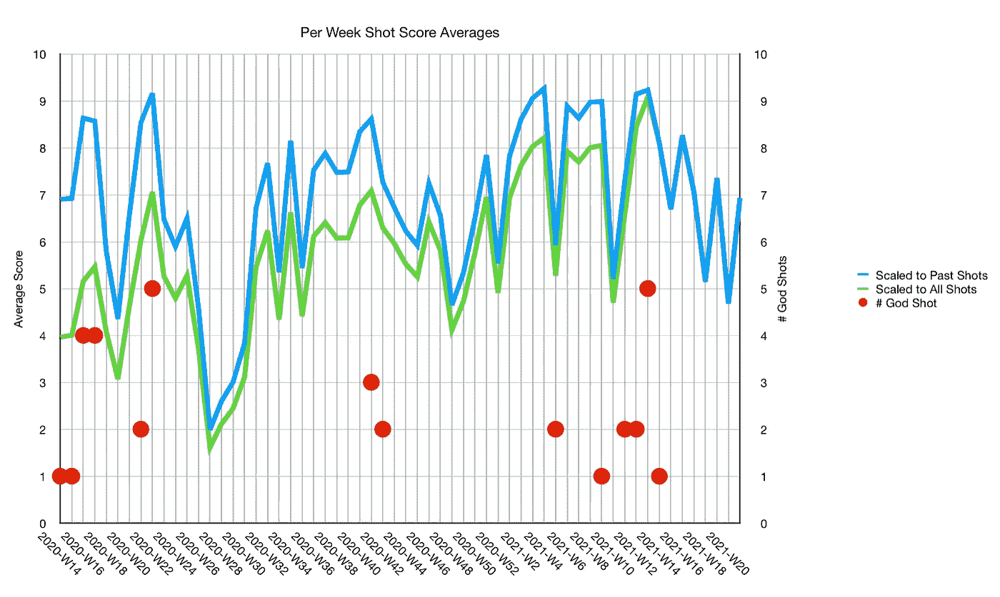
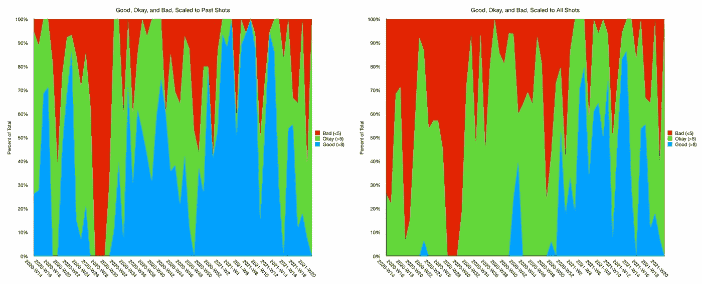
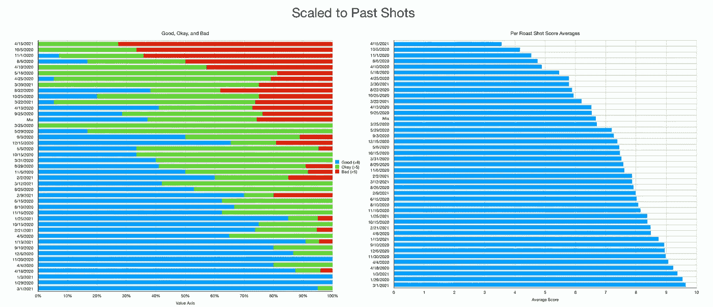
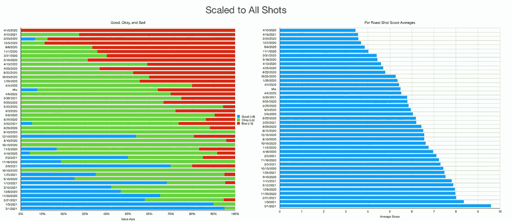
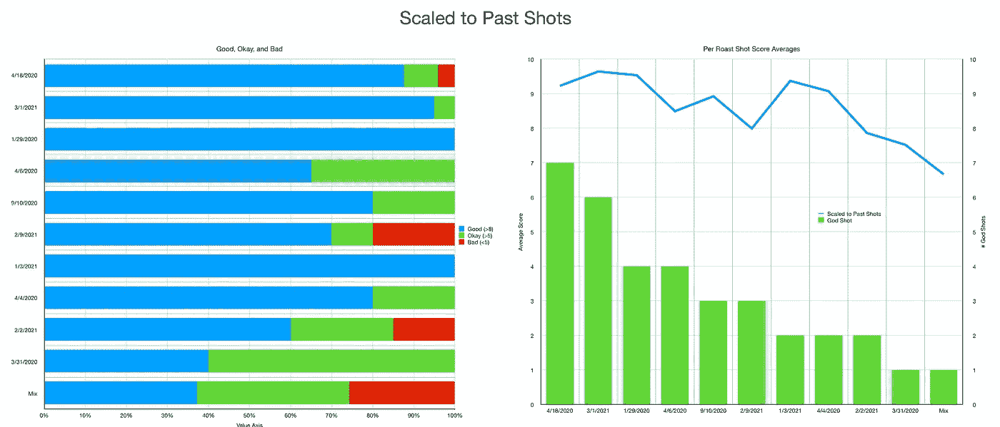
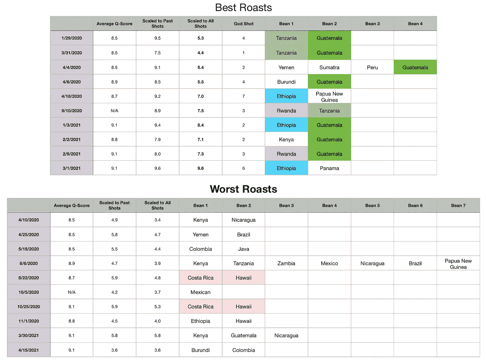

# 神射的频率

> 原文：<https://towardsdatascience.com/the-frequency-of-god-shots-f4b215b4d15c?source=collection_archive---------33----------------------->

## 咖啡数据科学

## 看看伟大的浓缩咖啡每周的变化

当人们被介绍到家庭浓缩咖啡时，他们经常会被吸进去。这有点像海洛因。会上瘾的。过程，香味，咖啡。所以，人们经常在寻找比你吃过的任何东西都好吃的神酒。神射是如此之好，你甚至不知道你在寻找它，直到你喝了它。这是一个超出你目前味觉体验的镜头。这是一个很好的镜头，它扩大了你的口味范围。

# 定义和数据

神射球的定义是:完美的球，比你以前的任何球都好。

在过去的几年里，我一直在收集大量的拍摄数据，大约一年前，我在数据表中开始了一个公式，以表明我是否比以往任何时候都更好地拍摄了一个镜头。从神枪手的定义来看，每次你比以前打得更好，那就是神枪手。我拿着这些数据，我观察了过去一年中这种拍摄的频率。

我称我的味觉得分为最终得分，它是 7 个指标(尖锐、浓郁、糖浆、甜味、酸味、苦味和余味)的记分卡的平均值。当然，这些分数是主观的，但它们符合我的口味，帮助我提高了我的拍摄水平。分数有一些变化。我的目标是保持每个指标的一致性，但有时粒度很难，会影响最终得分。

# 数据分析

首先，我可以把这些数据放在一起。许多变化是由于烘焙用的咖啡豆不同，所以我每周都看。我根据过去的分数和我看到的所有分数对数据进行了缩放。这最终会在最后收敛。通常，当我击中一些不可思议的烤肉并结合优化的技术时，神射发生在集群中，因为我的技术也一直在发展。

我们可以将镜头分为好的(> 8)、好的(> 5 &<8)和差的(< 5)。然后我们可以看到任何有趣的运动，无论是在时间上还是在全球范围内:

我用这些数据对我的咖啡烘烤品进行分类，寻找任何模式。

这是同一个图，但是是全球范围的:

一些有趣的趋势出现了。我看了最好的烤肉，有些比其他的好得多。他们拍摄了一系列精彩镜头。

我把烤肉分成最好的和最差的。最好的烤肉是中美洲的非洲咖啡豆。在这些最好的烘焙中，危地马拉豆和巴拿马豆是艺妓豆，所以它们的表现正如你所料。

最糟糕的烧烤似乎更加随机。有一种哥斯达黎加和夏威夷咖啡豆在两种情况下都不太好，它们被放在一起烘烤。

我过去的目标是在我的味觉尺度上达到一些数字。我记得打 10 分就像是一件了不起的事情，当时就是这样。但我也不知道 20 分的投篮会是什么味道。我不再那么关心击球了。准确地击中那种球是很困难的，因为它需要正确的烘烤、正确的准备和一些运气，但当它发生时，我当然很享受。

如果你愿意，可以在 Twitter 和 YouTube 上关注我，我会在那里发布不同机器上的浓缩咖啡视频和浓缩咖啡相关的东西。你也可以在 [LinkedIn](https://www.linkedin.com/in/robert-mckeon-aloe-01581595?source=post_page---------------------------) 上找到我。也可以关注我[中](https://towardsdatascience.com/@rmckeon/follow)。

# [我的进一步阅读](https://rmckeon.medium.com/story-collection-splash-page-e15025710347):

[浓缩咖啡系列文章](https://rmckeon.medium.com/a-collection-of-espresso-articles-de8a3abf9917?postPublishedType=repub)

[工作和学校故事集](https://rmckeon.medium.com/a-collection-of-work-and-school-stories-6b7ca5a58318?source=your_stories_page-------------------------------------)

[个人故事和关注点](https://rmckeon.medium.com/personal-stories-and-concerns-51bd8b3e63e6?source=your_stories_page-------------------------------------)

[乐高故事启动页面](https://rmckeon.medium.com/lego-story-splash-page-b91ba4f56bc7?source=your_stories_page-------------------------------------)

[摄影启动页面](https://rmckeon.medium.com/photography-splash-page-fe93297abc06?source=your_stories_page-------------------------------------)

[使用图像处理测量咖啡研磨颗粒分布](https://link.medium.com/9Az9gAfWXdb)

[改善浓缩咖啡](https://rmckeon.medium.com/improving-espresso-splash-page-576c70e64d0d?source=your_stories_page-------------------------------------)

[断奏生活方式概述](https://rmckeon.medium.com/a-summary-of-the-staccato-lifestyle-dd1dc6d4b861?source=your_stories_page-------------------------------------)

[测量咖啡磨粒分布](https://rmckeon.medium.com/measuring-coffee-grind-distribution-d37a39ffc215?source=your_stories_page-------------------------------------)

[咖啡萃取](https://rmckeon.medium.com/coffee-extraction-splash-page-3e568df003ac?source=your_stories_page-------------------------------------)

[咖啡烘焙](https://rmckeon.medium.com/coffee-roasting-splash-page-780b0c3242ea?source=your_stories_page-------------------------------------)

[咖啡豆](https://rmckeon.medium.com/coffee-beans-splash-page-e52e1993274f?source=your_stories_page-------------------------------------)

[浓缩咖啡用纸质过滤器](https://rmckeon.medium.com/paper-filters-for-espresso-splash-page-f55fc553e98?source=your_stories_page-------------------------------------)

[浓缩咖啡篮及相关主题](https://rmckeon.medium.com/espresso-baskets-and-related-topics-splash-page-ff10f690a738?source=your_stories_page-------------------------------------)

[意式咖啡观点](https://rmckeon.medium.com/espresso-opinions-splash-page-5a89856d74da?source=your_stories_page-------------------------------------)

[透明 Portafilter 实验](https://rmckeon.medium.com/transparent-portafilter-experiments-splash-page-8fd3ae3a286d?source=your_stories_page-------------------------------------)

[杠杆机维护](https://rmckeon.medium.com/lever-machine-maintenance-splash-page-72c1e3102ff?source=your_stories_page-------------------------------------)

[咖啡评论和想法](https://rmckeon.medium.com/coffee-reviews-and-thoughts-splash-page-ca6840eb04f7?source=your_stories_page-------------------------------------)

[咖啡实验](https://rmckeon.medium.com/coffee-experiments-splash-page-671a77ba4d42?source=your_stories_page-------------------------------------)