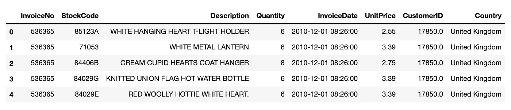
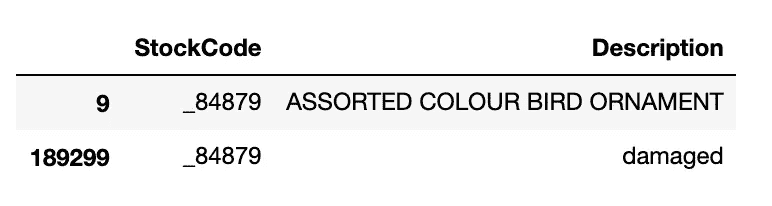
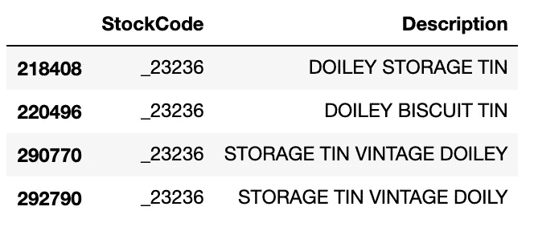
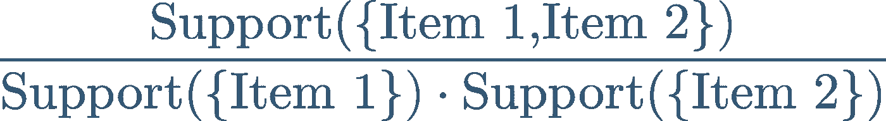
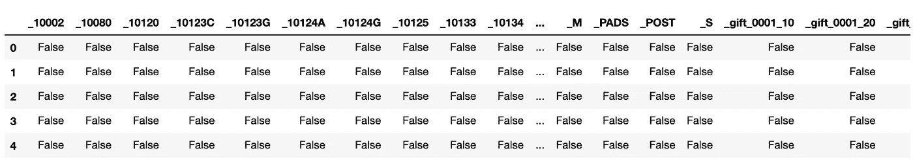
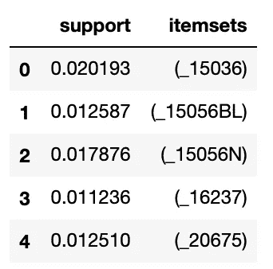
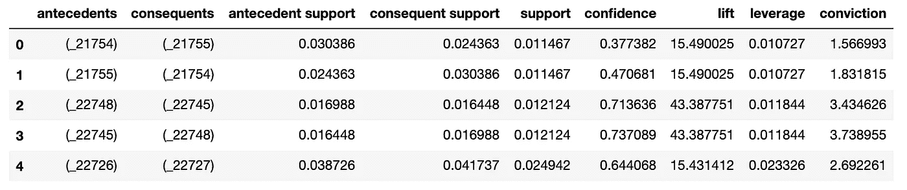
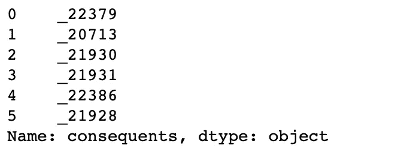
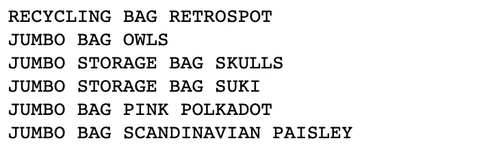
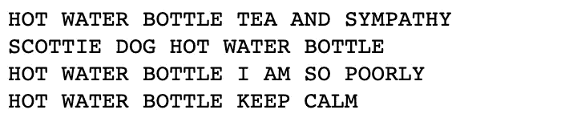

# “经常一起买”推荐系统

> 原文：<https://towardsdatascience.com/the-frequently-bought-together-recommendation-system-b4ed076b24e5?source=collection_archive---------5----------------------->

## [实践教程](https://towardsdatascience.com/tagged/hands-on-tutorials)

## 使用 Apriori 和 FP 增长算法以及`mlxtend`库的 python 演练


[马克·柯尼希](https://unsplash.com/@markkoenig?utm_source=medium&utm_medium=referral)在 [Unsplash](https://unsplash.com?utm_source=medium&utm_medium=referral) 上的照片

不是所有的推荐系统都需要机器学习；有些只是需要一点数据挖掘。

本文将介绍一个相对简单的*经常一起购买(*又名*经常一起购买)*推荐系统的实现。这种推荐系统的一个显著优点是，除了用户正在查看哪个项目之外，它不需要我们知道关于用户的任何信息。这很重要，因为今天大多数电子商务网站的大部分流量直接来自脸书、Twitter 或谷歌广告的产品页面。如果他们希望在这种流量上进行销售，他们不能要求新用户登录或选择他们喜欢的项目来帮助推动他们的推荐。

这种方法只依赖于在商店以相同的订单一起购买的商品的历史记录。它确实要求商店有足够长的交易历史来进行关联。一旦这一点得到满足，我们就可以向网站访问者推荐他们经常购买的商品以及他们正在查看的商品。

让我们开始吃吧。

# 数据

对于这个例子，我们将使用来自 UCI [机器学习库](https://archive.ics.uci.edu/ml/index.php)的[在线零售数据集](https://archive.ics.uci.edu/ml/datasets/online+retail)。描述如下:

> *这是一个跨国数据集，包含 2010 年 1 月 12 日和 2011 年 9 月 12 日之间发生的所有英国注册无店铺在线零售交易。该公司主要销售独特的适合各种场合的礼品。这家公司的许多客户都是批发商。*

该数据集在知识共享署名 4.0 国际许可(CC BY 4.0)下可用，该许可允许出于任何目的共享和改编数据集，前提是给予适当的信用。

我不知道“无店铺在线零售”是什么意思，但需要注意的是，许多客户是批发商，这可能会影响我们看到的推荐类型。

像大多数数据集一样，这个数据集相当混乱，我们必须做一些清理工作，以使数据可用。如果你想直接进入主题，请随意跳过。

# 数据清理

1)我们将首先加载数据集并查看它:

```
import pandas as pd# read the dataset in from the excel file
df = pd.read_excel('Online Retail.xlsx')# show the first few rows
df.head()
```



作者图片

2)我们会面临的一个问题是，`StockCode`的值有的是整数，有的是字符串。稍后，当我们将这些转换成一个列表并通过我们的算法运行它们时，我们会得到一个错误。让我们在 StockCode 前面加上一个字符，以确保它总是被解释为一个字符串。当然，还有其他方法可以做到这一点，但这很简单，而且可以节省以后的代码行。

```
# Prepend '_' to StockCode
df['StockCode'] = df['StockCode'].apply(lambda x: '_'+str(x))
```

3)然后，我们将数据分成两个数据帧，一个用于计算关联规则( *the what？不要担心，我们一分钟后会谈到这个问题*，另一个问题是查找要在我们的推荐中显示的描述。

注意，对于`products`数据帧，我们创建了一个副本。这是为了避免未来的`A value is trying to be set on a copy of a slice from a DataFrame`警告。

```
# DataFrame for building the recommendation system
orders = df[['InvoiceNo', 'StockCode']]# DataFrame for retrieving product descriptions
products = df[['StockCode', 'Description']].copy()
```

4)股票代码的字符大小写不一致。我们通过将所有股票代码全部大写来解决这个问题。

```
# Convert StockCode to uppercase
products['StockCode'] = products['StockCode'].str.upper()
```

5)我们需要从产品数据框架中删除重复的行。

```
# Drop duplicated products
products = products[~products.duplicated()]
```

5)一些股票代码仍然有多种描述，如下所示:



原来显示项目名称的描述都是大写的。我们将删除`Description`列中的值不是大写的所有行。

```
# Drop descriptions that are not uppercase
products = products[
    products['Description'].str.upper() == products['Description']
]
```

6)让我们像这样去掉其余的重复的`StockCode`:



```
# Keep only the first Description of each product
products = products[~products.duplicated(subset=['StockCode'])]
```

7)最后，我们将设置 StockCode 作为索引，并将我们的数据帧转换为 Pandas 系列，这样我们以后就可以很容易地查找描述了。

```
# Set the index to StockCode
products = products.set_index('StockCode')# Convert to Series for eve easier lookups
products = products['Description']
```

# 术语

这里有许多关于数据科学的优秀文章，深入解释了我们正在使用的算法。看一看[这里](/product-placement-pricing-and-promotion-strategies-with-association-rule-learning-d37f2b70d29e)，这里[这里](/fp-growth-frequent-pattern-generation-in-data-mining-with-python-implementation-244e561ab1c3)，这里[这里](/understand-and-build-fp-growth-algorithm-in-python-d8b989bab342)。我也发现这个 [youtube 视频](https://www.youtube.com/watch?v=yCbankIouUU)特别有用。我的目标是向您展示一个使用 Apriori 和 JP 增长算法的推荐系统的实际实现。我们将**而不是**从头开始编写算法。不过，有些事情你需要知道。

# 条款

*   **商品:**根据与其他商品的关联度，我们试图推荐的商品或事物。在杂货店，这些可能是产品，如牛奶，尿布和啤酒。
*   **项目集:**一起购买的一个或多个项目。
*   **关联规则:**我们将根据项目集计算的规则来确定推荐。一旦我们有了关联规则，我们就可以使用它们来推荐经常购买的商品以及客户正在查看的商品。

# 韵律学

*   **支持度:**以任意给定顺序找到一个项集的概率。这是包含特定项目集的订单的百分比。


作者图片

*   **置信度:**给定商品 1 在订单中，在订单中找到商品 2 的概率。这告诉我们一个商品与另一个特定商品一起被购买的可能性有多大。


作者图片

*   **Lift:** 一个项集中两个项的支持度与每个项独立时出现的期望概率之间的关系。关于 lift 需要知道的重要事情是， **1 的值意味着两个项目是独立的，**大于 1 的值**意味着这些项目比它们独立时更有可能一起出现**，小于 1 的值表示这些项目比它们独立时更不可能一起出现。



作者图片

# 算法

*   **Apriori:** 可能是数据挖掘关联规则最著名的算法，因为它的简单性。对大型数据集进行计算可能需要很长时间，因为它的时间复杂度为 O(n)或更低，具体取决于实现。
*   **JP Growth:** 一种**快得多的**算法，使用基于树的方法，将数据读取限制在两遍。这导致线性时间复杂度 O(n)，随着数据集的增长节省了大量计算资源。查看此视频以获得关于 JP 增长算法如何工作的详细描述。

# 履行

既然我们已经解决了所有这些问题，我们就来看最简单的部分:实现推荐系统。

这很容易，因为像所有流行的算法一样，python 库已经为我们处理了繁重的工作。我们将使用`mlxtend`库，在其[网站](https://rasbt.github.io/mlxtend/)上将其描述为“用于日常数据科学任务的有用工具的 Python 库”

**转换数据**

我们用来计算项目集的两种方法都需要一个一次性编码的 Pandas 数据框架，其中产品作为列，订单作为行。幸运的是，`mlxtend`还提供了一个方便的 TransactionEncoder，它负责从我们当前的数据帧到所需格式的大部分转换。

```
from mlxtend.preprocessing import TransactionEncoder# fit the TransactionEncoder
te.fit(orders['StockCode'])# do the transformation
orders_1hot = transform(orders['StockCode'])
```

`orders_1hot`是一个 NumPy 数组。mlxtend 函数需要 pandas 数据帧。我们可以很容易地将 NumPy 数组转换成 DataFrame，如下所示:

```
# convert orders_1hot to a DataFrame
orders_1hot = pd.DataFrame(orders_1hot, columns =te.columns_)# Inspect the first 5 rows of the DataFrame
orders_1hot.head()
```



作者图片

## 先验模型

我们可以对我们的数据运行 Apriori 模型，用一行神奇的代码来挖掘*项集。但是在我们这样做之前，我们需要决定一个最小的*支持*(还记得术语部分的*支持*吗？).这个最小*支持*值使我们不会只考虑订单中很小一部分一起购买的商品。这些关联是没有帮助的，会大大增加我们的计算开销。最小*支撑*因应用而异。我们将使用 0.01，这意味着模型返回的任何*项集*将在商店中至少 1%的订单中出现。*

我们还将使用可选参数`use_colnames`返回由*股票代码*标识的*项目集*，而不是列索引。这将有助于我们稍后解释我们的结果。

`max_len`将*项集*的大小限制为 1。因为我们只希望根据站点访问者查看的特定项目推荐单个项目的列表，所以我们只需要关注最多 2 个产品的*项目集*。

准备好了…

```
from mlxtend.frequent_patterns import apriori# the moment we have all been waiting for
ar_ap = apriori(df_ary, min_support=0.01, max_len=2,
                use_colnames=True)
```

哒哒！

你可能注意到这并不快。然而，在这个数据集上，它也不是无休止的。我笔记本电脑的运行时间是 2 分 15 秒。请记住，这只是一年半的交易。如果我们有更多的事务，并且考虑到 Apriori 模型的时间复杂性，这将花费相当长的时间。

让我们来看看结果。



作者图片

这是一个包含每个*项目集*及其*支持*的表格。完美，这正是我们最终计算*关联规则*所需要的。

# FP 增长

FP 增长算法(`fpgrowth`)的 *mlxtend* 实现是`apriori`的替代。要查看它的运行情况，我们将执行以下操作。

```
from mlxtend.frequent_patterns import fprowth# the moment we have all been waiting for (again)
ar_fp = fprowth(df_ary, min_support=0.01, max_len=2,
                use_colnames=True)
```

这给了我们一个数据帧，其中的项目与`apriori`算法相同(顺序不同),但耗时 5.2 秒！在我们的数据集上，Apriori 算法的计算时间是 FP Growth 算法的 33 倍以上。它的时间复杂度是线性的，所以当我们的商店变大时，这种差异会更加明显。

> *注意:itemsets 列中的值是 frozensets。这与用于实现 Apriori 算法的方法有关，并且它被带到 FP 增长，以便* `*fpgrowth*` *可以是对* `*apriori*` *的替换。这使得比较数据帧变得困难。然而，如果你想看到它们包含相同信息的证据，看看下面链接的与本文相关的笔记本。*

[](https://github.com/benbogart/frequently_bought_together) [## GitHub-benbogart/经常一起购买

### 在 GitHub 上创建一个帐户，为 benbogart/frequency _ buy _ together 开发做贡献。

github.com](https://github.com/benbogart/frequently_bought_together) 

# 计算关联规则

有了这些*项集，*我们现在可以很容易地计算出*关联规则*。同样，我们必须设置一个度量的最小阈值。我们可以从*支持、信心*、*提升*或其他几个我们没有讨论过的指标中进行选择。这里的目的是限制不太可能高度相关的结果。您设置的阈值将取决于您的应用。例如，如果您想在大多数时间显示一个推荐，而不管质量如何，您可以将`min_threshold`设置得很低。如果你只对向你的访问者展示高度相关的推荐感兴趣，你应该提高门槛来消除弱关联。

我们将使用*提升*，因为*提升*是两个项目之间关联的度量。如果 *lift* 大于 1，它告诉我们*项目集*中的项目被一起购买的次数比随机购买的次数多，这似乎是一个常见的选择。

```
from mlxtend.frequent_patterns import association_rulesar = association_rules(is_fp, 
                       metric="lift", 
                       min_threshold=10)
```

这给了我们一个 808 行 9 列的数据帧。



作者图片

这是我们的*关联规则*表，其中包含为我们计算的所有指标！大部分栏目都很清楚，但是让我们看看前两个。

*   前情:我们推荐的产品。
*   **结果:**我们根据*前因*推荐的产品。

# 提出建议

现在我们有了关联规则，我们只需从数据框架中提取正确的规则，返回一个*经常一起购买的*推荐。

我们将使用一个简短的函数来完成这项工作。我们将股票代码作为 python *集合*传入(关键字是 *frozensets，*但是 *frozensets* 和*集合*可以成功比较)。

predict 函数中有一个技巧值得解释。不能对 *frozenset* 进行索引，也不能用`pop`方法(或任何其他方式)从 *frozenset* 中移除项目。)要将`frozenset`转换成一个字符串，我们首先用`iter`将`frozenset`转换成一个*可迭代的*，然后用`next`从其中取出第一个也是唯一的元素。

规则已经按照我们在计算关联规则时选择的度量进行了排序，所以我们不需要再次排序。

```
def predict(antecedent, rules, max_results= 6):

    # get the rules for this antecedent
    preds = rules[rules['antecedents'] == antecedent]

    # a way to convert a frozen set with one element to string
    preds = preds['consequents'].apply(iter).apply(next)

    return preds[:max_results]
```

让我们试一试

```
preds = predict({'_20712'}, rules)
preds
```



作者图片

我们做到了！

但是我们怎么知道我们做到了呢？让我们看看这些预测代表了什么。

首先，让我们找出*股票代码* `_20727`指的是哪种产品。这将是我们的*前因。*

```
print(products['_20712'])
```


作者图片

现在我们来看看推荐产品或者*后果*的描述。

```
for stockid in preds:  
    print(products[stockid])
```



作者图片

一堆袋子。这是有道理的，考虑到我们是在和批发商打交道。

我们再试试另外一个:*股票代码* `_20719`。

```
print(products['_22112'])
```


作者图片

```
# get the predictions
preds = predict({'_22112'}, rules)# Display the descriptions of the predictions
for stockid in preds:  
    print(products[stockid])
```



作者图片

耶！水瓶！由于许多顾客是批发商，他们一起购买各种水瓶是有道理的。看起来我们成功了。

# 结论

当创建一个经常一起购买的推荐系统时，有相当多的东西需要理解。我们只是触及了表面，但重要的是，经常一起购买的推荐系统是基于创建一个静态表，称为关联规则。最后的推荐只是一个查找。这很棒，因为它很简单。但是这些关联规则需要定期重新计算。

有了 python 和`mlxtnd`库，为经常一起购买的*推荐系统生成关联规则只需要很少的代码。*

去做点好事吧。

# 资源

这里有一些我发现对本文写作有帮助的资源。

# 书

*   [*实用推荐系统*](https://www.amazon.com/gp/product/1617292702/ref=as_li_tl?ie=UTF8&camp=1789&creative=9325&creativeASIN=1617292702&linkCode=as2&tag=benbogart09-20&linkId=55f10672ca8a8e24ce93f00cf9f41592) 作者金·福克
    (这是附属链接。我得到一小笔钱，如果你通过这个链接购买，支持更多像这样的文章)

# 文章和网页

*   `mlxtend`文件:[https://rasbt.github.io/mlxtend/](https://rasbt.github.io/mlxtend/)
*   [关联规则完整指南(1/2)](/association-rules-2-aa9a77241654) 作者 [Anisha Garg](https://medium.com/@anishagarg?source=post_page-----aa9a77241654--------------------------------)
*   [通过](/understand-and-build-fp-growth-algorithm-in-python-d8b989bab342)[和](https://andrewngai9255.medium.com/?source=post_page-----d8b989bab342--------------------------------)理解并构建 Python 中的 FP-Growth 算法

# 录像

*   [关联规则挖掘的频繁模式(FP)增长算法](https://www.youtube.com/watch?v=yCbankIouUU)

# GitHub 知识库

[](https://github.com/benbogart/frequently_bought_together) [## GitHub-benbogart/经常一起购买

### 在 GitHub 上创建一个帐户，为 benbogart/frequency _ buy _ together 开发做贡献。

github.com](https://github.com/benbogart/frequently_bought_together) 

[1]陈大庆、赛梁赛恩和郭昆，“在线零售业的数据挖掘:使用数据挖掘进行基于 RFM 模型的客户细分的案例研究”，《数据库营销和客户战略管理杂志》，第 19 卷第 3 期，第 197-208 页，2012 年(印刷前在线出版:2012 年 8 月 27 日)。doi: 10.1057/dbm.2012.17)。

[2][https://archive-beta.ics.uci.edu/ml/donation-policy](https://archive-beta.ics.uci.edu/ml/donation-policy)(在撰写本文时，许可证声明网站测试版的 ssl 认证是无效的。)