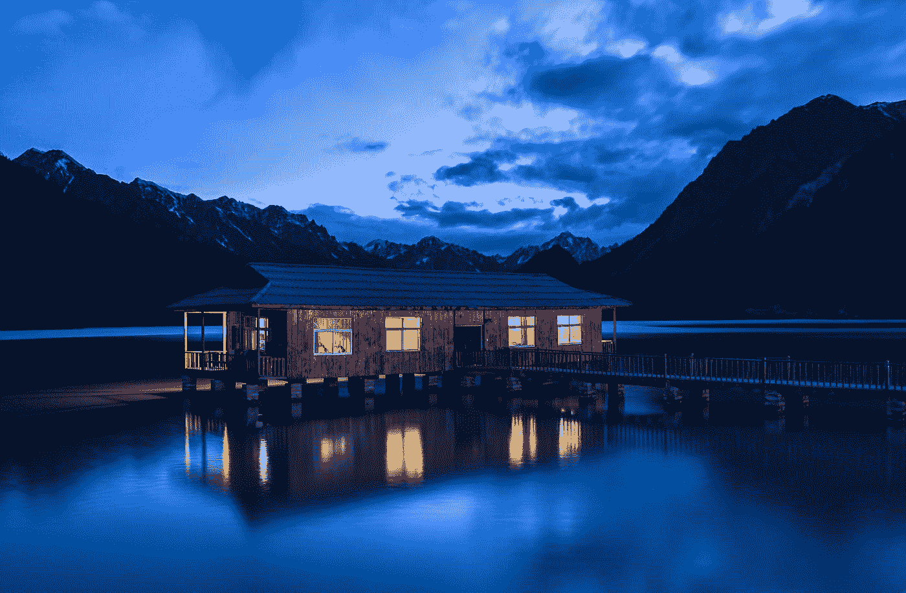
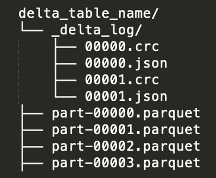
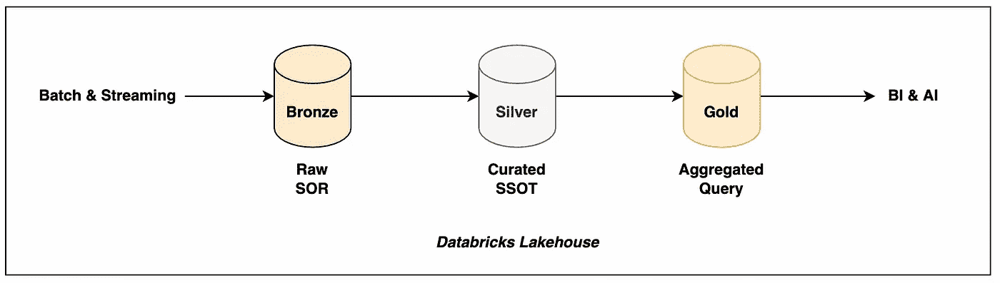
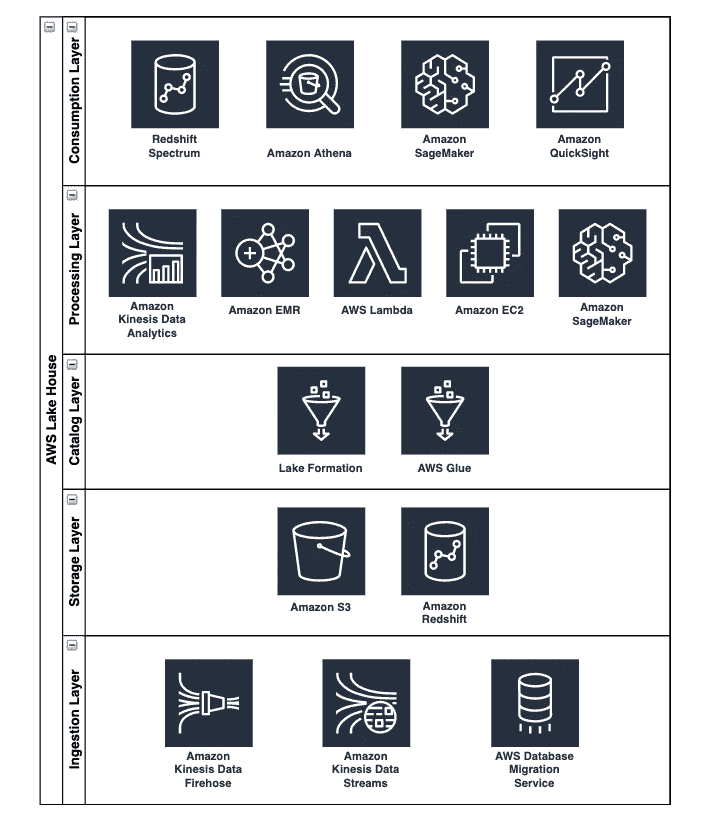

# 数据仓库+数据湖=湖屋的基础

> 原文：<https://towardsdatascience.com/the-fundamentals-of-data-warehouse-data-lake-lake-house-ff640851c832?source=collection_archive---------2----------------------->

照片由 [janer zhang](https://unsplash.com/@janerzhang?utm_source=medium&utm_medium=referral) 在 [Unsplash](https://unsplash.com?utm_source=medium&utm_medium=referral)

# 介绍

随着数据仓库和数据湖的发展，在过去的几年中，它们确实变得更加专业化，但是仍然各自为政。这两种数据管理技术都有自己的特性，最适合用于特定的任务和需求，但是它们在提供一些重要的功能方面也有困难。数据仓库的优势集中在分析结构化数据、OLTP、写模式、SQL 和交付符合 ACID 的数据库事务。数据湖的优势集中在分析所有类型的数据(结构化、半结构化、非结构化)、OLAP、读取时模式、API 连接性以及针对开放文件格式数据的低成本对象存储系统(即 Apache Parquet)。

值得注意的是，数据仓库尤其难以支持高级数据工程、数据科学和机器学习。例如，他们无法存储非结构化数据(即文本、图像、视频、特征工程向量等)。)进行机器学习开发。此外，专有数据仓库软件价格昂贵，并且难以集成开源+云平台数据科学和数据工程工具(即 Python、Scala、Spark、SageMaker、Anaconda、DataRobot、SAS、R 等)。)通过笔记本电脑、分布式计算处理、托管部署模型和存储推理管道结果进行探索性数据分析。在混合本地云环境中，系统集成、数据移动成本和数据陈旧性甚至会变得更具挑战性(尤其是在可供您选择的技术有限的情况下)。

不幸的是，另一方面，数据湖有时会与数据质量、事务支持、数据治理和查询性能问题发生冲突。没有关键技能、关键能力和专业技术的数据湖随着时间的推移将不可避免地变成*“数据沼泽”*。这种情况很难逆转，尤其是在数据量和速度持续增长的情况下。避免这种困境对于实现数据驱动的价值和为用户提供客户满意度是绝对重要的，这些用户依赖可靠的快速数据检索来为其利益相关者执行下游分析工作职责。

从战略上来说，集成和统一数据仓库和数据湖成为一种情况，在这种情况下，您需要两全其美，灵活而富有弹性地构建一个经济高效的弹性企业生态系统，无缝支持商业智能和报告、数据科学和数据工程、机器学习和人工智能，以及交付*“大数据”* 5 V(数量、多样性、速度、准确性、价值)。这是 Lake House 作为一个新的统一数据架构背后的想法和愿景，它将数据湖和数据仓库的最佳组件结合为一体。

Databricks 是湖屋建筑(即三角洲湖)的行业领导者和原创者。亚马逊网络服务(AWS)是另一个湖屋架构的先驱(即湖泊形成+ AWS 分析)。Lake House 架构的一些主要高级技术特性和解决方案包括:ACID 事务、upserts [update + insert] &删除、模式实施、文件压缩、批处理和流统一以及增量加载。3 种主要的开放数据湖表格式是 Delta Lake、Apache 胡迪和 Apache Iceberg。这三者都提供了与上述特性相似的技术。在这篇博客中，我将讨论 Databricks Lakehouse 和 AWS Lake House 的 ***基础*** 、 ***构建模块*** 和 ***解决方案架构*** 。

# 数据布里克斯湖屋

***基础***

Databricks Lakehouse 围绕着一项名为 Delta Lake 的技术，这是一个由 Linux 基金会管理的开源项目。Delta Lake 是通过 Apache Parquet 格式的存储层，它为数据湖提供了符合 ACID 的事务和额外的好处。Databricks 提到了 Delta Lake 可以帮助解决的 9 个常见数据湖挑战。它们是:

*   难以追加数据
*   工作中途失败
*   修改现有数据很困难
*   实时操作
*   保留数据的历史版本成本高昂
*   难以处理大量元数据
*   “文件太多”问题
*   很难获得出色的性能
*   数据质量问题

Lakehouse 体系结构和 Delta Lake 的内部设计消除了始终拥有数据仓库/数据湖双层体系结构设置的需要。对于数据湖中的 ACID 事务，在事务成功完成或完全失败之前，链接到外部表的底层数据文件不会被更新。因此，这简化了增量加载(即追加数据)，避免作业在过程中失败(即 ETL 恢复)，以及修改数据(即删除/更新/插入)。因此，由于 Delta Lake 为数据湖带来了 ACID 合规性和版本控制日志记录，元数据差异显著减少。

此外，组合(即 ETL 同步)批处理和流数据管道的能力为实时操作和历史回滚(时间旅行)提供了更多的一致性和合规性。因此，日期过期的频率较低，并且保留了历史表版本，因为 Delta Lake 总是为每个微批处理事务创建一个实时可用的新表版本日志。数据湖最明显的挑战之一是实现一致的高性能。一个常见的原因是少量数据分散在[数百万个]太多的文件中(即 KB 大小的文件)。实际上，对于技术最先进的专家来说，调优 ETL 作业可能也很困难。因此，Delta Lake 可以执行文件压缩命令来优化数据布局和分区，以获得更快的查询结果和数据质量检查。

***积木***

由 Delta Lake 提供支持的 Databricks Lakehouse 包含一些关键的内部设计，旨在确保数据的可靠性和一致性。它们是:

*   增量表
*   增量文件
*   增量事务日志
*   德尔塔发动机
*   Delta 存储层

增量表在 metastore(即 Apache Hive、AWS Glue)中注册，并包含数据的底层文件位置路径、表属性和模式定义。根据业务逻辑，增量文件作为普通数据文件(即 Apache Parquet)或分区文件夹(即年-月-日)存储在云对象存储(即 AWS、MS Azure、GCP)或文件系统(即 HDFS)中。delta 事务日志是一个非常重要的文件夹，名为 *_delta_log。*它本质上是理解 Delta Lake 的核心和关键，因为它[按顺序]跟踪执行的每一笔交易。它是事实的单一来源和增量表更改的集中存储库。例如，增量表上的每个原子提交都会创建一个新的 JSON 文件和 CRC 文件，其中包含各种表元数据和统计信息。这种机制通过原子性提供 ACID 事务，其中操作(即插入、更新)将不会在数据湖中执行，除非它们在增量事务日志中被记录和完全执行。从视觉上看，这是 Delta Lake 目录结构的高级文件系统分解图。

作者图片

Delta lake 与 Delta 引擎和 delta 存储层捆绑在一起，它们是通过 Apache Spark 和云对象存储集成的内部组件。该引擎提供动态文件管理修剪、增量缓存和许多性能优化优势。存储层跟踪元数据、模式更改、表版本控制和许多 ACID 合规性操作。

***解决方案架构***

Databricks Lakehouse 遵循一种设计模式架构，通过 3 个表格层 medallion 命名法提供多层数据质量和监管。它们是:

*   青铜
*   银
*   金色的

这些层在构建的 delta 架构管道中各有一个重要用途，以确保数据对多个下游用例高度可用。Bronze 存储原始运营数据(即 OLTP)，通常很少涉及数据处理，并充当记录系统。该层通常从上游流管道(即 Apache Kafka、Amazon Kinesis)或现有对象存储登陆区(即 Amazon S3)获取数据，并通过自动加载器+ Spark 结构化流将原始数据格式(即 JSON、CSV、XML)转换为 Delta 格式，模式演变或强制取决于获取的数据结构和下游要求。

Silver 存储干净的原子数据(即 OLAP)，通常涉及一些数据处理，并作为强调模式实施的单一数据源。这一层可能涉及连接青铜数据集、数据转换(清理和过滤)，以及按照某些业务逻辑重新划分数据，并执行文件压缩技术来提高查询性能。Gold 存储聚合的部门数据*“市场”*(即 OLAP)，通常涉及大量数据处理，并作为商业智能和数据科学查询的表示层。这一层提供了分区数据，可供个人用户通过 BI 工具、SQL、Python、Apache Spark 等执行特定查询和使用 OLAP 立方体。

有时，银层可以是机器学习和特征工程的主要来源，以构建特征存储、管理的数据仓库或推理管道。这很可能取决于所涉及的组织和用例。青铜、银和金层不是必需的。它们只是在整个治疗过程中获得可靠和一致数据的最佳实践和入门工具包。还要知道，对于通过 medallion 架构构建 Lakehouse 架构来说，拥有关于数据在云存储中如何存放(即分区、文件格式、路径结构)的可靠数据分类和本体将是非常重要和关键的。从视觉上看，这是 Databricks Lakehouse 增强 delta 架构的高级数据管道构建图。

作者图片

总之，Databricks Lakehouse 正在引领和创新提供一个平台环境，可以做到这一切。它减少了在企业中跨孤立系统移动和连接数据的现实挑战(例如，类比→在一个太阳系的不同星球之间旅行和通信)。持续起步并为 BI、AI/ML、大数据分析等提供价值。，我坚信 Lakehouse 架构将继续发展，教育和支持组织利用数据做出更好的业务决策。因此，确保诸如*“数据沼泽”*、肮脏的不道德数据差异、糟糕的 I/O 性能、缓慢的数据移动、工具集成问题和团队孤岛等挑战不会继续阻碍您解决客户问题和交付数据驱动的解决方案！

作为参考，这里是莱克豪斯和德尔塔湖的官方白皮书，以便向专家了解更多信息。

# 亚马逊网络服务湖边小屋

***基本面***

AWS Lake House 专注于串联使用许多 AWS 分析服务。具体来说，集成这些专门的服务来构建数据湖、数据仓库和系统间数据移动之间的无缝交互。AWS 坚信在正确的工作中使用正确的工具，这也是我个人所提倡的。您经常会看到项目失败或实施创可贴解决方案，因为没有或没有选择正确的工具。毕竟，当链锯是专门为手头的特定任务设计的最佳和推荐工具时，用刀子(甚至斧头)砍树既麻烦又可笑。如果走捷径，选择过时的技术，随着时间的推移，您的数据湖将崩溃，遭受性能损失，成为*“数据沼泽”*。因此，AWS Lake House 强调确保 AWS 服务之间的数据移动通过设计变得更容易是多么重要。因此，AWS 将 3 种数据移动场景描述为:

*   从里到外
*   由外向内
*   环绕周界的

例如，inside-out 是指从内部数据湖中收集数据，并将其复制到另一个系统中(即在 Amazon Elasticsearch 中聚合日志)。类似地，由外向内指的是将数据从外部数据仓库转移到内部数据湖或文件系统的相反方向(即在亚马逊 S3 &亚马逊 SageMaker 中执行特性工程)。有时，外部数据存储会在周边复制数据，以扩展更好的性能(例如，Amazon RDS 到 Amazon Redshift 集群迁移)和/或改善用户体验。所有这 3 种数据移动场景都有许多客户使用案例。

AWS 将数据增长和数据移动困难称为“数据重力”，这基本上与*“大数据”*阶段相关，在该阶段，数据存在和不断增加的数据量出现在许多 IT 系统中。导致需要一种能够满足客户需求、基础设施管理成本、数据局部性性能和数据&系统集成的数据架构。AWS 记录了由 5 个支柱组成的架构良好的框架，如下所示:

*   卓越运营
*   安全性
*   可靠性
*   性能效率
*   成本优化

这些支柱是实现数据架构的基础，可提供持续的可扩展性能、灵活的服务工具选择、数据和系统集成、安全的数据保护和基础架构弹性。湖边小屋建筑从采用这些基本的最佳实践开始。

***积木***

AWS Lake House 有 5 个数据架构元素。它们是:

*   可扩展的数据湖
*   专门构建的数据服务
*   无缝数据移动
*   统一治理
*   高性能且经济高效

每个元素都通过专门的 AWS 服务服务于一个目的，以提供一个有弹性、可伸缩、有弹性、安全和灵活的架构。AWS 湖形成是通过亚马逊 S3 构建安全和可扩展的数据湖的主要因素。一些新的 Lake Formation 特性包括 ACID 事务和受管表，通过文件压缩方法来提高查询性能。这些是非常相似的特征，就像这篇博文的数据块部分讨论的三角洲湖。

对于特定的数据需求，AWS 为您提供了许多数据服务:用于交互式 SQL 查询的 Amazon Athena，用于 Spark 数据处理的 Amazon EMR，用于搜索分析的 Amazon Elasticsearch，用于实时流的 Amazon Kinesis，以及用于数据仓库的 Amazon Redshift。这些服务对于构建高级分析工作流和拥有连接到湖边小屋生态系统的各种工具至关重要。

使用和集成这些服务将导致源系统和目标系统之间由内向外、由外向内和环绕外围的数据移动。AWS Glue 是一种无服务器的数据集成服务，专门从事 ETL、表目录、模式推理、作业调度，以及最近通过 SQL 将表虚拟化为跨数据库和数据存储的物化视图。这些无服务器视图称为弹性视图，提供自动化数据复制、连续监控和最新数据刷新，使数据移动和基础架构更易于管理和虚拟化。

Lake Formation 还为共享数据和控制访问提供了行级安全特性，从而消除了跨数据存储复制数据的需要。这有助于节省存储成本和额外的基础架构管道层，同时维护数据治理。最后但同样重要的是，AWS 努力通过 Amazon EC2 compute 提供顶级性能和成本节约，并提供多种购买选项(即按需购买、预约购买、现货购买、节约购买)来满足您的所有使用案例需求。此外，Amazon EMR 和 Amazon Redshift 也将继续发布更多优化的实例类型。总的来说，这 5 个关键要素引领着 AWS Lake House 架构的实施。

***方案架构***

AWS Lake House 遵循一个生态系统架构，通过 5 个层使用位于集中式数据湖外围的专业 AWS 服务来解决数据重力问题。这些柔性层是:

*   摄入层
*   存储层
*   目录层
*   处理层
*   消费层

摄取层通过批处理和流式方法执行数据迁移。主要的 AWS 产品包括用于 RDBMS 迁移的数据迁移服务和用于缓冲向亚马逊 S3 或亚马逊红移传输数据的亚马逊 Kinesis(即数据消防软管、数据流)。存储层包括作为数据湖的亚马逊 S3 和作为数据仓库的亚马逊红移。亚马逊 S3 对象存储提供了廉价的存储，并能够以开放的文件格式(即 Apache Parquet、Apache ORC、Apache Avro、CSV、JSON 等)存储不同类型的模式。)作为读取时模式。Amazon Redshift 提供了将数据存储在表中的结构化维度模式或非规范化模式，即写模式。

目录层涉及元数据管理和注册。Lake Formation 和 AWS Glue 作为中央目录服务来跟踪所有湖泊房屋数据集的元数据。功能包括表版本控制、模式和分区定义、数据位置、表权限以及保护业务和数据所有者信息。处理层将 ETL 作业构建到有组织的桶或前缀中，如着陆区、原始区、受信任区和管理区。这与 Databricks Lakehouse 的青铜、白银和黄金命名相同。大量的数据处理服务可用于执行这些任务。根据使用案例的不同，AWS 产品包括亚马逊 EMR(即 Apache Spark)、Kinesis Data Analytics(即 Apache Flink)、AWS Glue、AWS Lambda、亚马逊 SageMaker Processing、亚马逊红移 SQL(即红移光谱)以及针对较小数据集的单机亚马逊 EC2 实例。

消费层为特别 SQL 查询、商业智能和机器学习等分析用例提供了许多 Lake House 接口。对于 SQL，AWS 提供了亚马逊 Athena 和红移谱。对于商业智能，您可以通过 Amazon QuickSight 创建可视化和仪表板。对于端到端的机器学习，AWS 利用亚马逊 SageMaker 来构建、训练和部署模型和推理管道。

从视觉上看，这是一个 AWS Lake House 架构的高级分层生态系统构建图。请注意，一些 AWS 分析服务不包括在内。

作者图片

这 5 层中的每一层都发挥着各自的作用，在湖边小屋中实现无缝的数据流动。关键是技术上的灵活性，通过以可承受的价格(按使用量付费)为正确的工作使用正确的服务，可以进行相应的迭代扩展和调整。

作为参考，这里是 AWS 分析和 Lake House 最佳实践设计的官方 AWS 博客，以了解更多深入的细节。

<https://aws.amazon.com/blogs/big-data/harness-the-power-of-your-data-with-aws-analytics/>  <https://aws.amazon.com/blogs/big-data/build-a-lake-house-architecture-on-aws/>  

# 结论

总的来说，这两种架构提供了非常相似的解决方案。从文化的角度来看，Databricks Lakehouse 和 AWS Lake House 正在革新管理、存储、处理和消费数据的更好方法。从技术角度来看，Databricks Lakehouse 使用了 Delta Lake、Apache Parquet 和 Apache SparkAWS Lake House 利用了大量 AWS 服务，利用了本博客中提到的大量开源 Apache 项目。一些主要的技术焦点包括:

1.  计算和存储的分离—弹性计算、可扩展基础架构、廉价存储和高度可用的可重用数据
2.  可靠性和一致性—提高了数据质量，减少了损坏和重复数据，优化和压缩了文件大小，减少了模式/元数据不匹配，并保证了完整的事务和回滚选项
3.  实时流支持—随着新数据的到来，持续/即时增量更新和更改，同时保持出色的查询性能，跨业务线连接批处理和流数据，消除复杂的工作流(即 Lambda 体系结构→流作业的并行数据管道，可持续追加+批处理作业，可按照一定的节奏[每日]重新分区、更新和覆盖文件)

令人兴奋的是，这些数据解决方案可以在将承诺的工作文化与尖端的技术专业知识和能力相结合时得到解决和交付。我坚信 Lakehouse/Lake House 可以帮助组织和员工体验一种更加数据驱动的文化，提升技能/教育和促进人才成长，节省云[或减少内部供应商锁定]成本，简化现有和新的架构设计，并通过将数据固化为单一真实来源，更好地统一在组织孤岛中工作的团队进行类似的分析工作。天空才是极限！

感谢你阅读这篇博文。我对这种创新技术的出现非常着迷，并期待继续在技术实现、教育演示和咨询活动中贡献这些技术。快乐学习，解决问题，交付解决方案！