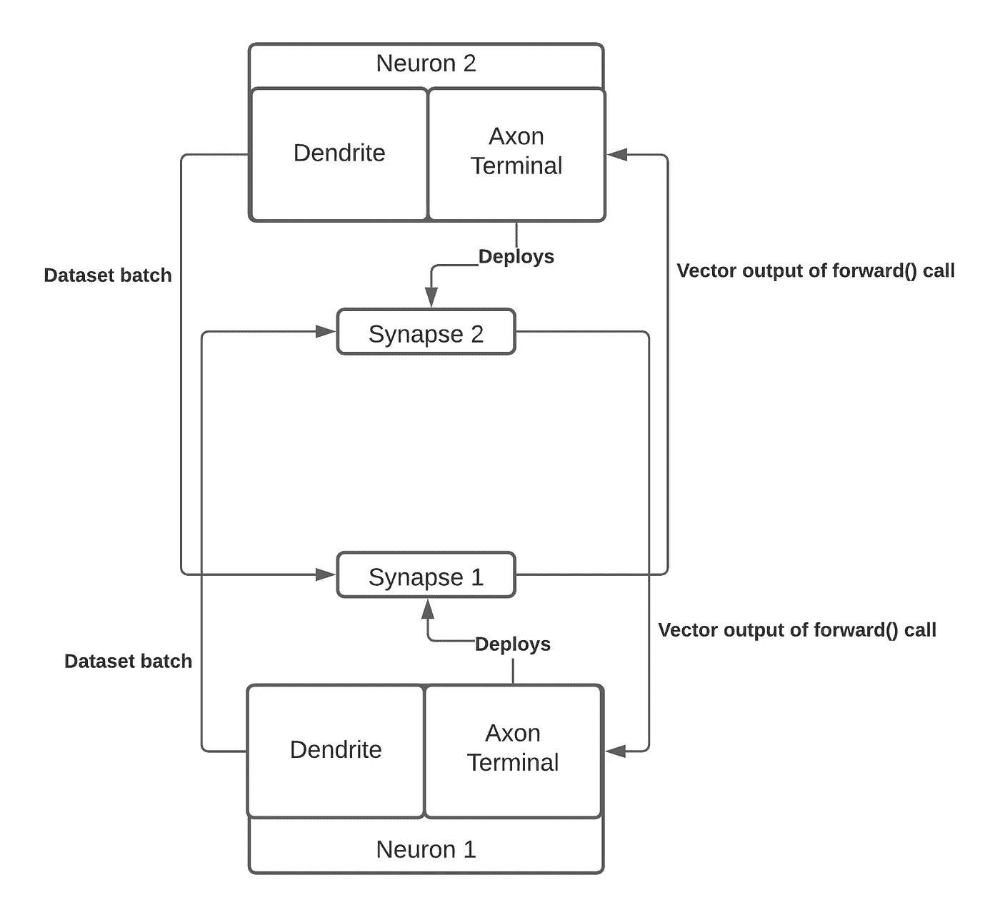
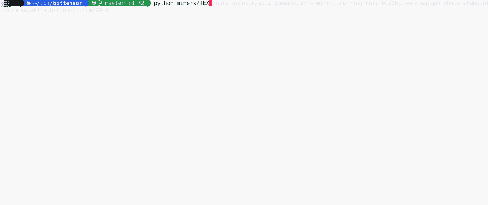
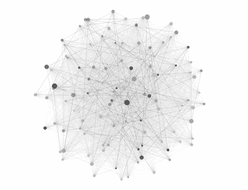

# 人工智能的未来是分散的

> 原文：<https://towardsdatascience.com/the-future-of-ai-is-decentralized-848d4931a29a?source=collection_archive---------6----------------------->

## 据报道，训练 GPT-3 单次训练就花费了 1200 万美元。那真的是训练一个模型最有效的方法吗？

[刘宇英](https://unsplash.com/@yuyeunglau?utm_source=medium&utm_medium=referral)在 [Unsplash](https://unsplash.com?utm_source=medium&utm_medium=referral) 上的照片

人工智能是一种*商品*。事实上，提取这种商品可以为谷歌、百度和脸书等公司带来数十亿美元的收入。因此，在过去 10 年中，它将计算成本提高了 300 倍，并将该领域的研究人员数量增加了 10 倍。

如今，每年都有关于 AI 化合物的研究。研究人员通过建立在以前的基础上，进行渐进式的改变，以创建更强大和更通用的模型。然而，这些模型产生的*智能*总是会丢失，因为用户必须在自己的系统上重新训练这些模型来复制它们。

此外，通过在同一设备上工作的模型组合找到的任何值(例如:文本数据、图像数据等。)也丢了。这是因为模型本质上是孤立于它们的环境的。他们不能彼此分享他们的知识，因此如果任何一个模型学到了对其他模型可能有价值的东西，它也不能与他们分享以加速他们的训练。

最后，今天的人工智能研究领域本质上是非合作性的。*“获取数据集、创建模型、击败当前最先进水平、冲洗、重复”*的研究方法使得新的研究人员和计算资源低的研究人员进入市场有很大的障碍。大多数研究人员无法为大型神经网络的开发做出贡献，因为进行必要的实验对他们来说太昂贵了。如果这种趋势继续下去，最终唯一能够进行人工智能研究的实验室将是那些拥有巨额预算的实验室。

> 人工智能(AI)的未来将由我们在协作中投入的权重决定。⁴ — *约翰·苏特(CTO)在* [*科达公司*](https://koda9.com/)

美国宇航局在 [Unsplash](https://unsplash.com?utm_source=medium&utm_medium=referral) 拍摄的照片

人类总是合作创造世界科技奇迹。阿波罗 11 号登陆月球是因为超过 300，000 人参与了阿波罗计划，从测量员到工程师，再到宇航员自己。为什么 AI 不能也是一种协作的方式？

也许这个问题需要重新措辞:*如何*我们可以把人工智能变成一种协作的方法？

答案很简单，就是权力下放。类似于人类大脑是数十亿相互连接的神经元如何相互发送信号，或者互联网是数十亿相互连接的计算机如何相互共享信息，那么人工智能应该以同样的方式构建。

# 输入位张量

分散式人工智能是一种范式，其中人工智能模型相互协作以实现其目标或解决一系列复杂的挑战。今天，由于其免费人工智能和模型之间知识共享的影响，分散式人工智能正慢慢成为协作智能的圣杯。最新的项目之一是[比特张量](https://www.bittensor.com/)项目。

Bittensor 是一个对等市场，奖励机器智能的生产。它利用最先进的技术，如[专家混合](https://arxiv.org/abs/1701.06538)和[知识提炼](https://arxiv.org/abs/1503.02531)，以创建一个对等网络，激励知识生产，生产者可以出售他们的工作，消费者可以购买这些知识，以使他们自己的模型更好。这为协作智能打开了大门，在协作智能中，研究人员受到激励，相互帮助产生更强大的模型。最终，这种“认知经济”有可能为人工智能的整体进步开辟一个新的前沿。

比特张量背后的核心思想是知识的个体贡献的集合。通过建立人工智能模型并在 Bittensor 网络上训练它来贡献知识的计算机将获得 bittensor 的货币 **Tao** 。其他希望简单地使用或消耗知识的人也可以使用道来获得它，并在这一知识上训练他们的模型。

# 位张量结构

Bittensor 的设计非常接近人脑的设计。每台运行 Bittensor 的计算机都被称为一个**神经元**。每个神经元包含一个模型、一个数据集和一个损失函数。这些神经元根据它们的输入数据和与它们通信的其他神经元来优化它们的损失函数。

两个位张量神经元之间的通信

为了保持人类大脑的并行性，每个位张量神经元都有一个**轴突末端**来接收来自其他神经元的输入，以及一个**树突末端**来发送输入给其他神经元。

简而言之，位张量神经元通过向其相邻神经元发送其数据集的一批输入来进行训练，并通过其自己的模型运行同一批输入。接收这一批的神经元将通过它们自己的本地模型运行输入，并发回输出。然后，我们的神经元将聚集这些输出，并根据远程神经元的损失和我们的局部损失来更新其梯度。

运行 Bittensor 就像几个命令行参数和一个数据集一样简单

Bittensor 中的每个神经元都在不断地从其他模型中挖掘**知识**。运行 Bittensor 模型相当简单，可以在一个 *yaml* 文件上或通过命令行进行配置。

# 最后的想法

人工智能的未来应该是去中心化的，句号。我们需要将人工智能创造的知识视为终极商品，相当于人类大脑中的认知过程。合作增加这种知识的广度和深度不仅是我们作为科学家的使命，也是我们作为人类的使命。

位张量网络。节点越暗，它贡献的知识越多。

Bittensor 网络于 2021 年 1 月启动，目前已经运行。您可以简单地安装并立即运行它，使用库中已经构建的[模型之一，或者](https://github.com/opentensor/bittensor/tree/master/miners)[创建您自己的模型](https://opentensor.gitbook.io/bittensor-1/getting-started/learn-by-example)。

Bittensor 库可以在[这里](https://github.com/opentensor/bittensor)找到，你也可以通读项目的[文档](https://opentensor.gitbook.io/bittensor-1/)和[白皮书](https://uploads-ssl.webflow.com/5cfe9427d35b15fd0afc4687/6021920718efe27873351f68_bittensor.pdf)。如果你想联系开发者、合作或为项目做贡献，开发者也活跃在 [Bittensor Discord server](https://discord.com/invite/3rUr6EcvbB) 上。

加入我们，人工智能的前沿也属于你。

# 参考资料:

[1]凯尔·威格斯“OpenAI 庞大的 GPT-3 模型令人印象深刻，但大小并不代表一切”(2020)。[https://venturebeat . com/2020/06/01/ai-machine-learning-open ai-GPT-3-size-not-everything/](https://venturebeat.com/2020/06/01/ai-machine-learning-openai-gpt-3-size-isnt-everything/)

[2]斯坦福大学哈尔。《艾指数报告》(2019)【https://hai.stanford.edu/research/ai-index-2019[。](https://hai.stanford.edu/research/ai-index-2019)

[3]艾伦人工智能研究所。《绿色 AI》(2019)。”【https://arxiv.org/pdf/1907.10597.pdf】T4

[4]大数据内幕。《各就各位:去中心化人工智能的潜力》(2020)。[https://inside bigdata . com/2020/12/31/everything-in-the-right-place-the-potential-of-decentralized-ai/](https://insidebigdata.com/2020/12/31/everything-in-its-right-place-the-potential-of-decentralized-ai/)

[5]位张量。“互联网规模的神经网络”。(2021)[https://www.bittensor.com/](https://www.bittensor.com/)