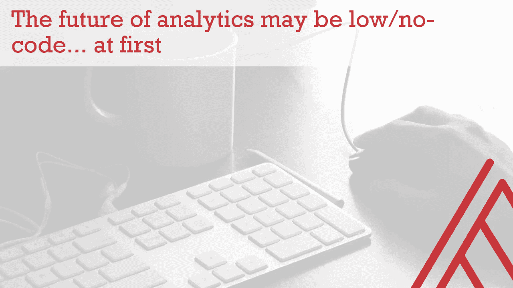
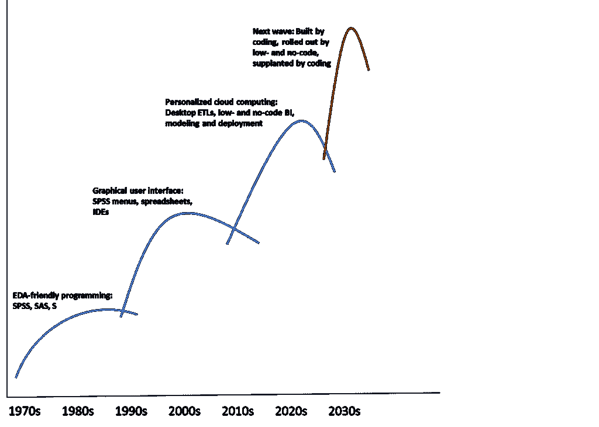
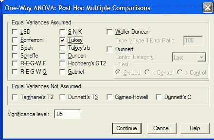

# 分析的未来可能是“低代码/无代码”

> 原文：<https://towardsdatascience.com/the-future-of-analytics-may-be-low-no-code-at-first-6c2b140e39f3?source=collection_archive---------35----------------------->

## …起初

图片来自[免费图片来自 Pixabay](https://pixabay.com/photos/office-keyboard-job-work-381228/)

如今，你不可能通过大量的数据滚动而不听说所谓的“低代码和无代码”数据工具的崛起。“它把数据带给人们。”典型的帖子是这样的。“您不再需要学习如何编写代码来执行复杂的*在此插入分析项目*。”

我完全看到了低代码和无代码数据解决方案的吸引力:在经历了多少轮乏味的`[import pandas as pd](https://www.dataindependent.com/pandas/import-pandas-as-pd/)`和`[object of type 'closure' is not subsettable](https://coolbutuseless.github.io/2019/02/12/object-of-type-closure-is-not-subsettable/#:~:text=A%20common%20error%20in%20R,or%20vector%20or%20something%20e.g.)`错误之后，你能不这样做吗？也就是说，我并不认为这种趋势像人们常说的那样具有革命性或持久性。原因如下。

# 这是采用周期的预期部分

举一个低代码和无代码数据产品的例子，直接从 Excel 构建 Azure 机器学习模型[的能力。这是疯狂的事情，毫无疑问，这是前所未有的民主化机器学习。但是没有问的是，在这个创新之前，接下来会发生什么。](https://youtu.be/jhtwO-JleBw)

[创新通常是一波一波地到来](https://transportgeography.org/contents/chapter3/transportation-and-economic-development/wavedev/)，一个趋势建立在下一个趋势之上，并最终取代下一个趋势。分析软件也不例外。每一波都是建立在代码之上，由低代码和无代码的图形用户界面(GUI)推出，然后又被代码取代。

作者制作的图像

这是一个大大简化的采用浪潮:公正地对待它需要一篇论文(我在博士阶段研究过创新，所以我不是在开玩笑)。结果是低代码和无代码在分析工具中来来去去；让我们看一些例子。

# 1.案例研究:SPSS

SPSS(社会科学统计程序)始于 20 世纪 60 年代末，在接下来的十年中，S 和 SAS 作为探索性数据分析和统计编程的新工具加入进来。

当时，计算机脚本通常需要首先被编译成机器可读的文件，然后运行；这使得实时操作、可视化和分析数据变得非常困难。这些工具是新颖的，因为它们允许立即执行和打印脚本的各个部分，这极大地支持了迭代。分析师现在可以专注于*数据分析*，而不是编译代码。

在某个时候(我无法找到确切的发布时间，所以如果有人知道，请联系我！)SPSS 更进一步，增加了菜单驱动的选项来编写程序。所有的菜单选项都生成了可以保存的语法，但是这个想法是分析师可以进一步减少对代码的关注，更多地关注数据，从而使分析民主化。精通技术的统计学家不再垄断数据处理。

SPSS 可以证明，低代码和无代码会变得混乱。(来源:[格雷戈·艾尔弗斯，代顿大学](https://academic.udayton.edu/gregelvers/psy216/spss/1wayanova.htm))

这种“无代码和低代码”实现的一个成果就是上面的菜单截图。处理数据没有放之四海而皆准的答案，所以试图在一个菜单中容纳所有需求会导致臃肿的界面。我在研究生院使用 SPSS，虽然能够通过点击来进行数据分析很棒，因此可以专注于工作的概念部分，但我很快发现编写代码比浏览菜单更容易。所以，SPSS 语法生成是一件幸事…但它不是全部。

SPSS 的菜单只是 GUI 驱动的计算革命的一个产物。作为点击式选项，GUI 向数据用户提供相对低代码或无代码的特性。这场革命的另一个成果是电子表格，在许多人看来，它是个人电脑的第一个“杀手级应用程序”。商业用户现在已经拥有了触手可及的计算能力，而不一定需要编码。

# 2.总是需要一些组件

让我们坚持使用电子表格，因为在我称之为“个性化云计算”的时代，它们面临着与 SPSS 相同的 GUI 困境:依赖云功能存储和处理数据的计算机应用程序。

Excel 的 Power Query 是一项引人注目的创新，允许用户直接从电子表格中构建提取、转换、加载(ETL)管道。(类似的低/无代码数据准备的工具还有 Alteryx、Tableau Prep 等。).虽然基于 M 编程语言，但它包括菜单驱动的语法生成，很像 SPSS。Power Query 本质上不是云应用*，而是微软更大的“Power Platform”的一部分，该平台主要作为[云(以及无/低代码)解决方案](https://powerplatform.microsoft.com/en-us/)进行营销。*

*它的菜单可以满足*用户的大部分*需求……但不是全部。事实上，对于 Power Query 用户来说，一个必经之路就是开始编写自己的代码:*

*最近在幂查询中尝试按子群添加一个索引号；这在超级查询菜单和 M 自定义编码之间花费了相当多的时间。最后，我问自己，*这真的比严格编码简单吗？*毕竟，Power Query 不像 R 或 Python 那样，提供一个带有包管理的专用集成开发环境。这是一个奇怪的 GUI 和代码的大杂烩，有点像 SPSS。*

*处理数据在很多方面都是混乱的，我们任何人都数不清。正是这种模糊性使得构建一套严格的菜单选项变得如此困难。我还没有见过一个 GUI 可以在简单的用户体验中轻松容纳我想用数据做的一切事情。能做到吗？可能考虑到未来的技术。但是对我来说，学习编码比任何图形用户界面都有更多的可能性。那么，为什么要等待一些理想化的 UX 呢？*

# *结论:代码和图形用户界面，应和杨*

*至少值得指出的是，许多人声称 R 和 Python 的兴起部分是因为它们是纯编程的应用程序。通过提供优秀的开发环境和大型开源代码库，用这两种语言做几乎任何事情都成为可能…如果你愿意学习编码的话。几乎没有争议的是，如果，也许不是作为用户交互的层，代码应该是如何进行分析的主要工件。*

*那么，为什么要转向低代码和无代码的分析解决方案呢？就像我前面说的，一次又一次地编写相同的调用并收到相同的小错误会令人沮丧。因此，我认为这些可能会被视为实现更大数据民主的障碍。图形用户界面在分析创新的浪潮中有自己的时间和位置，通常是当一些应用程序达到一定的成熟度时。代码也是构建应用程序的一部分，因此它们可以达到那个成熟度。*

*我不知道下一波会是什么，但我肯定当前这波低代码和无代码解决方案不会持续下去。可能需要更少的编码人员来对采用的低代码/无代码部分进行创新，并且产品可以真正做到用户要求的一切。*

*在此之前，我建议数据专业人员学习一点编码知识。可能不是每个数据方案都需要*；那很好。但是考虑到我们在数据世界中的发展，我不倾向于说未来都是低级的和没有代码的。**

**原载于 2021 年 1 月 16 日*[*【https://georgejmount.com】*](https://georgejmount.com/no-code-future-at-first/)*。**