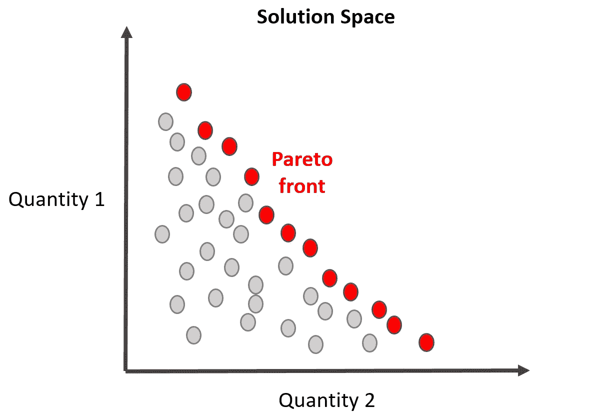

# 人工智能决策的未来

> 原文：<https://towardsdatascience.com/the-future-of-decision-making-in-ai-17576cdb6e66?source=collection_archive---------27----------------------->

## 如何不陷入天网，建筑师，奥创或 HAL9000 的情况

刘玉英和许在 Unsplash 上的照片

一般来说，我不是人工智能(AI)这个术语的粉丝。它太宽泛了，非技术头脑的人(吃了蓝色药丸的人)把人工智能想象成一个独立决策的单一实体。此外，因为人工智能是一个流行的术语，我见过一些公司宣传自己使用人工智能的例子，而他们实际上“只是”使用线性回归。在过去的 80 年里，由于所有的末日科幻故事和电影，这个词在流行文化中受到了不好的指责。无数次我们看到科幻小说变成了科学派别，随着 OpenAI 的[文本生成器 GPT-3 等技术的出现，看起来我们确实走上了正轨。那么，这里也会发生这种情况吗？](https://www.theguardian.com/commentisfree/2020/sep/08/robot-wrote-this-article-gpt-3)

没有。

至少现在不是。自动驾驶汽车的自主能力由[七个不同的自动化水平](https://www.aptiv.com/en/insights/article/what-are-the-levels-of-automated-driving)(或智能)来表征。人工智能被分为[三大类](https://codebots.com/artificial-intelligence/the-3-types-of-ai-is-the-third-even-possible):狭义、通用和超级人工智能。目前，公众可以获得的最高自动驾驶汽车级别是第 3 级(最大级别 5)，在特定情况下，驾驶员可以脱离驾驶行为。关于人工智能，我们只是在狭窄的人工智能类别中打转——尽管它有时看起来像更高级别的人工智能。

照片由[达米亚诺·林戈里](https://unsplash.com/@dendrolago89?utm_source=medium&utm_medium=referral)在 [Unsplash](https://unsplash.com?utm_source=medium&utm_medium=referral) 上拍摄

人工智能中的决策是通过三种媒介完成的:数据、建模和/或决策者。圣杯是将这三者都纳入决策过程，但有时你缺乏数据，而其他时候过程是如此复杂(或快速)，决策者最好被排除在外(例如，为什么电话运营商是过去的事情)。最主要的是要明白什么时候。

这个故事将集中在如何恰当地整合决策者，因为有大量伟大的故事，论文，书籍等。，讲述如何进行适当的建模和集成数据科学技术来支持决策。

## 决策者是如何影响人工智能决策的？

许多问题太复杂，我们无法立即找到解决方案。同时，我们天生懒惰，所以我们想找到一个更好(更容易)的方法来获得解决方案——进入“人工智能”方法。

决策者的偏好可以分为硬偏好和软偏好。硬偏好一般是指决策或解决方案必须服从的那些意见。在建模术语中，这些有时被称为约束——例如，在保持一定生产水平的同时，将工厂成本降至最低。请注意，硬约束和硬偏好是不一样的，因为一些物理限制(可用的工作时间、可用的资金)是无法超越的，但是在建模中它们通常被视为相同的。软偏好是“愿意”一类的意见，通常具有冲突的性质，有点不祥，也是大多数关于人工智能公司的决策者、经营者、管理层甚至董事会层面的讨论背后的原因。矛盾的是，硬偏好和软偏好之间的差异也是人类实施的决定——我认为最理想的是我们不应该区分这些，所有的偏好都应该被认为是软偏好。

但是这些软偏好是如何实施的呢？这里，我们区分了偏好何时被纳入决策过程:先验的、后验的或交互的。方法的选择在很大程度上与问题的复杂性、可用的计算能力以及何时做出决定的时间要求相一致。注意，对于这些问题中的一些，获得一个决定也是指获得一个解决方案的概念。

共同的目标是确定最能代表决策者偏好的解决方案。至少，如果决策者知道他们的偏好——通常他们的偏好非常不确定、模糊，一大群决策者必须同意，或者他们根本没有能力定义他们(Que 数据和建模方法)。

由[格雷格·拉科齐](https://unsplash.com/@grakozy?utm_source=medium&utm_medium=referral)在 [Unsplash](https://unsplash.com?utm_source=medium&utm_medium=referral) 上拍摄的照片

## 后验方法

对于偏好被非常具体地定义的多目标问题，通常创建具有非支配解的图，突出帕累托前沿。此后，决策者评估帕累托前沿的哪个解决方案最能反映他们的偏好。

该方法大体上包括计算大量的解决方案或模拟决策，以便随后评估结果并将它们与决策者的偏好结构进行比较，然后最终选择一个。该过程相当广泛，因为必须为不同目标设置之间的大量组合计算解决方案。对于多目标问题，几乎任何计算的解都是非支配解(对于单个目标，它是最优解)，因此该方法很快会遇到维数问题。但是对于较小的问题，它仍然是可行的，而且非常有用。

帕累托阵线的例子。作者插图。

在这些方法中，决策者拥有所谓的*“偏好的后验表达”*

## 先验方法

这种方法试图在开始寻找解决方案之前将多个目标组合成一个单一的目标。问题是，人们不知道问题对组合的影响，不确定性如何影响结果，以及最后，如何组合不同的偏好。

综合这些偏好，我们必须讨论标准是否相互独立，或者是否存在积极或消极的相互作用。例如，当决定步行到哪个公共汽车站时，两个标准“在公共汽车站的活动”(公共汽车在 x 分钟内到达的概率)和“到所述公共汽车站的步行距离”是相关的。较高的活动水平会使距离不再是一个问题。

此外，对某些标准的偏好不一定是恒定的，甚至可能不是线性的。在“到公交车站的步行距离”标准中，两个选择之间小于 10 米的差异不会影响一个人的选择——我们对这样的差异漠不关心。与此同时，超过 4 公里的差异将否决一个公交车站，迫使人们不选择该公交车站，无论其他标准有多高。

政治是一个很好的例子，说明了多个决策者如何试图走到一起，并通过先验的方法试图在不知道实际结果的情况下实施一个解决方案。由[弗雷德里克·科贝尔](https://unsplash.com/@internetztube?utm_source=medium&utm_medium=referral)在 [Unsplash](https://unsplash.com?utm_source=medium&utm_medium=referral) 上拍摄的照片

也就是说，先验方法包括评估价值函数的方法，引入“等级关系”，分析层次过程，或者甚至试图识别决策规则。在这些方法中，决策者拥有所谓的*“偏好的预先表达”*

也许，最广为人知的价值函数法是目标规划；这种方法包括对未达到预定目标的处罚，并寻求将处罚降至最低。从而将多目标框架转化为单目标框架。

重点是；当利用先验方法时，有许多要考虑的，但是它们是快速的并且适用于大型复杂问题。

## 那么，为什么我们最终不能复制《黑客帝国》、《我》、《机器人》、《奥创时代》、《终结者》或《2001:太空漫游》中的场景呢？

这项技术还不够远，人们正在进行广泛的研究，研究如何主动避免这种情况，并适当地纳入决策者，根据没有偏见的数据建模和适当地训练模型。

科幻作家艾萨克·阿齐莫夫提出了机器人和人工智能必须遵守的三条规则。即:

*   第一定律:机器人不能伤害人类，也不能坐视人类受到伤害。
*   第二定律:机器人必须服从人类的命令，除非这些命令与第一定律相冲突。
*   第三定律:机器人必须保护自己的存在，只要这种保护不与第一或第二定律相冲突。

但是如果它们不完美，超级人工智能应该能够找到它们的漏洞。新增的第零定律表达了这样一个固定的漏洞。因此，我们必须促进[研究和技术](/why-operations-research-is-awesome-an-introduction-7a0b9e62b405)，以改善人工智能决策的合作和理解。

*我希望你喜欢这个关于决策和人工智能的一般性故事。请注意，我没有详细描述问题的特征以及哪些方法适用于哪些问题，因此也省略了对评估问题和设计问题的必要讨论。如果你对其他研究领域感兴趣，运筹学就是一个很好的例子，我已经写了一个小故事:*

</why-operations-research-is-awesome-an-introduction-7a0b9e62b405> 