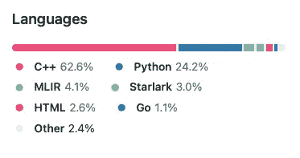
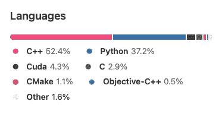

# 机器学习的未来以及为什么它看起来很像朱莉娅🤖

> 原文：<https://towardsdatascience.com/the-future-of-machine-learning-and-why-it-looks-a-lot-like-julia-a0e26b51f6a6?source=collection_archive---------3----------------------->


作者图片

TLDR；ML 的未来是[朱莉娅](https://julialang.org)。如果你正在寻找一个快速的答案，你有它。如果你想要一个合理的解释，留下来。不要只相信我的话:

<https://dev-discuss.pytorch.org/t/where-we-are-headed-and-why-it-looks-a-lot-like-julia-but-not-exactly-like-julia/276>  

*(上面的帖子总结道:PyTorch 开发者想要 Julia 提供的所有功能，但他们还不想在 Julia 中重写 PyTorch，因为生态系统还不够成熟)*

*编辑:我和我的合著者很高兴地告诉大家，我们的新书《茱莉亚速成班》已经开始预售了:*

<https://logankilpatrick.gumroad.com/l/juliacrashcourse>  

# 概观🌄

首先，让我指出房间里的大象:Julia 生态系统还没有 Python 生态系统成熟。这是目前的现实，但正如你可能在这篇文章中发现的那样，这并不意味着你不能在你的机器学习工作流中成功地使用 Julia。

下面，我将简要概述 Julia 机器学习和深度学习生态系统，然后谈谈为什么您可能希望为您的 ML 和 DL 工作流学习 Julia。我们将探讨以下想法，我认为这些想法使 Julia 成为 ML 领域的主要候选人:

*   你可以利用朱莉娅，所以你可以享受朱莉娅为🧑‍提供的所有好处🤝‍🧑
*   灵活且可扩展💪
*   它(实际上)是开源的👐
*   易于使用的内部构件🍳
*   ML +科学=突破性成果🧬🧪
*   还有更多！

如果你想在 Julia 做机器学习，有几个地方你应该看看:

*   Flux.jl，深度学习([生态系统概述](https://fluxml.ai/ecosystem.html))
*   MLJ.jl，[通用机器学习](https://github.com/alan-turing-institute/MLJ.jl)
*   Knet.jl，[深度学习](https://github.com/denizyuret/Knet.jl)
*   JuliaML， [GitHub org](https://github.com/JuliaML) 托管通用 ML 包
*   JuliaAI 主持 [MLJ 生态系统](https://github.com/JuliaAI)的回购
*   FastAI.jl，[Julia 深度学习最佳实践库](https://github.com/FluxML/FastAI.jl)

总的来说，在这篇文章中，我们将重点关注作为深度学习框架的 Flux.jl，但这并不是说 Knet 和 MLJ 不是制作良好或有用的软件包。我只是没有使用它们的经验，所以我将把我的印象留到以后的文章中。

# 用茱莉亚代表曼梯·里，因为，你可以用茱莉亚

作为一种语言，Julia 旨在提高开发人员的工作效率。从[包管理器](https://medium.com/@logankilpatrick/the-most-underrated-feature-of-the-julia-programming-language-the-package-manager-652065f45a3a)，到运行代码的速度，所有这些特性带来了一种开发者体验，这种体验带来了[大批新的开发者](https://juliacomputing.com/blog/2021/01/newsletter-january/)。

我在我的帖子中提到了这一点:

<https://medium.com/@logankilpatrick/why-you-should-invest-in-julia-now-as-a-data-scientist-30dc346d62e4>  

但是由于 Julia 处理类似[多维数组](https://docs.julialang.org/en/v1/manual/arrays/)的方式，您可以避免使用类似 Numpy(有时会在 Tensorflow 中看到)和 Tensors(在 PyTorch 中使用，基本上是一个重新命名的 Numpy 数组)的包。

这里我们可以看到使用 Julia 的好处是减少了精神负担。对于 Python，我们可以做到:

```
import tensorflow as tf
tf.ones([3, 4], tf.int32)<tf.Tensor: shape=(3, 4), dtype=int32, numpy=
array([[1, 1, 1, 1],
       [1, 1, 1, 1],
       [1, 1, 1, 1]], dtype=int32)>
```

然后在 Julia 中我们会做这样的事情:

```
julia> using Flux
julia> ones(Float32, 1, 2, 3)
1×2×3 Array{Float32, 3}:
[:, :, 1] =
 1.0  1.0[:, :, 2] =
 1.0  1.0[:, :, 3] =
 1.0  1.0
```

在后一种情况下，我们只处理基本的数组，至少在我看来，这使得代码更直观一些。

在上面的帖子中提到的另一点值得重复的是，你在数据科学/机器学习工作流中使用的其他包在 Julia 中运行得非常快。加载 CSV 的速度比 Python 和 DataFrames 快 10-20 倍。jl(类似于 Pandas)的速度和性能也是同类中最好的(特别是对于一个相当“年轻”的包，它在 2021 年才发布 1.0 版本)。

如果你还不相信朱莉娅的力量，它会让你更有效率，快速搜索“为什么我应该转向朱莉娅”，你会发现许多其他(希望令人信服)的文学作品，比我在这里想的更深入。

# 为什么是 Flux？🤔

我试图在这段 1 分钟的视频中回答这个问题:

我也鼓励你查看 [https://fluxml.ai](https://fluxml.ai) 以获得更高层次的概述。

# 简单、灵活且可扩展💪

> 可扩展系统是指其内部结构和[数据流](https://en.wikipedia.org/wiki/Dataflow)受新的或修改的功能影响最小或不受影响的系统……(通过维基百科)

在 Flux 的设计中，灵活性和可扩展性是最重要的。对于初学者来说，Flux 可以用来直接编写模型，但也可以用作 FastAI.jl 等软件包的后端。此外，Flux 试图保持一个最小但有用的 API，以便开发人员可以自由地使用所提供的内容，或在其上构建自己的自定义功能，这些功能可以自动集成到 Flux 生态系统中。

如果你曾经花了大量的时间探索过[https://www.tensorflow.org/api_docs/python/tf](https://www.tensorflow.org/api_docs/python/tf)，你会像我一样发现有很多事情正在发生(只要看一看左侧的所有模块)。相反，Flux 专注于保持 Flux 本身的代码和文档数量最少。如果你还没有看过这些文件，那就快速浏览一下:[https://fluxml.ai/Flux.jl/stable/](https://fluxml.ai/Flux.jl/stable/)

使用 Flux 是多么简单的一个例子:

```
using Flux
model = Chain(Dense(10, 5, σ), Dense(5, 2), softmax)
```

这里我们定义了一个简单的模型，有 3 层:2 个密集层(一个使用 sigmoid 激活函数)和一个 softmax 层。

在 Tensorflow 中，这将看起来像:

```
from keras.models import *                                                       
from keras.layers import *                                                       

model = Sequential([Dense(10, 'sigmoid'), Dense(5), Dense(2, 'softmax')])# Thanks to Stanisław Pitucha for the updated Keras / TF code
```

在 Tensorflow 的情况下，我们可以看到，因为我们使用了`Sequential()`模型，我们实际上并没有指定层的输出大小。模型的顺序性质将一层的输出设置为下一层的输入。

虽然像 PyTorch 这样的库确实给出了如何扩展库的说明，正如文档中提到的:[https://pytorch.org/docs/stable/notes/extending.html](https://pytorch.org/docs/stable/notes/extending.html)比起 Flux 有更多的限制。

# 它(实际上)是开源的👐

我不想在这个话题上喋喋不休太久，但是当大多数贡献者都集中在一个机构的时候，那些声称“开放”的项目总是让我担心。事实上，这是我们在[评估加入 NumFOCUS](https://numfocus.org/projects-overview)(Jupyter，Pandas，Numpy，Julia，Flux 等背后的非营利组织)的新项目时要看的东西之一。对我来说，Flux 的一个核心特征是它不是由谷歌(Jax 和 Tensorflow)或脸书(PyTorch)开发的。虽然有这种支持肯定有一大堆好处(比如付给员工很多钱😄)，如果我是一个用户，正在决定我想围绕什么框架来建立我的公司或项目，我的偏好将是一个我可以成为实际利益相关者的框架。就 Flux 而言，如果你想开始做出贡献并成为一名利益相关者，我们欢迎你的加入。你可以加入并开始为生态系统做出贡献:【https://julialang.org/community/#events】https://github . com/FluxML/flux . JL/blob/master/contributing . MD 或者参加两周一次的开发人员电话会议:。我将再次指出，这并不意味着对 Tensorflow 或 PyTorch 社区的轻视，因为我知道许多有价值的贡献来自主办机构之外，但从高层次来说，我认为这个想法值得记住。

# 易于使用的内部构件🍳

如果你想知道这里的表情符号选择，那是因为煮鸡蛋很容易，几乎和使用 Flux 的内部一样容易。既然我们已经解决了这个谜，让我们深入研究一下为什么 Flux 的内部如此易于使用。

剧透一下，就是因为他们是用朱丽亚写的。当我说用朱莉娅写的时候，我的意思是 100%用朱莉娅写的。如果你不相信我，就来看看:[https://github.com/FluxML/Flux.jl](https://github.com/FluxML/Flux.jl)。


图片由作者从 Flux.jl GitHub 获取

上图与 Tensorflow 和 PyTorch 形成鲜明对比:



图片由作者从 Tensorflow GitHub 获取



图片由作者从 PyTorch GitHub 获取

你的眼睛没有欺骗你，PyTorch 和 Tensorflow，如果你不知道的话，都主要是用 C++编写的，并为用户提供了 Python 包装。这意味着，如果你想一窥究竟，你不仅要熟悉 C++和 Python，还要熟悉它们的交互方式。对我来说，我仍然害怕在大学第一年使用指针，所以如果我能避免 C++，我会这样做。如果我们看一个例子的一些内部的通量，如前所述，这是朱莉娅，只是普通的老朱莉娅:

```
function onehot(x, labels, default)
  i = something(findfirst(isequal(x), labels), 0)
  i > 0 || return onehot(default, labels)
  OneHotVector{UInt32, length(labels)}(i)
end
```

在这里，我们看到的是[的一个定义，一个不断变化的热点编码](https://github.com/FluxML/Flux.jl/blob/master/src/onehot.jl)。我没有看到任何指示，这是一种解脱。我将避免在这里展示任何 C++代码，因为我不想吓跑你，但是如果你够大胆，去看看一些内部的东西。

易于使用的内部代码和 100% Julia 代码的副作用之一是，软件包的用户可以很快成为开发者和关键贡献者。在过去的几个月里，当我使用 Flux 时，我亲眼目睹了这种情况的发生。虽然做出贡献仍然很困难，但毫无疑问，这比使用其他框架要容易得多。

一个基本的例子是:[https://github.com/FluxML/Flux.jl/pull/1801](https://github.com/FluxML/Flux.jl/pull/1801)，我发现在一些代码上调用`gpu`函数并没有提供任何警告或指示代码实际上没有在 GPU 上运行，这很奇怪。

# ML +科学=突破性成果🧬🧪

Flux 擅长的一个领域是将它和其他软件包结合起来，创造出最先进的结果。这方面的一个例子是[https://github.com/SciML/DiffEqFlux.jl](https://github.com/SciML/DiffEqFlux.jl)，它提供:

> 具有 O(1)反向投影、GPU 和刚性+非刚性 DE 解算器的通用神经微分方程，展示了科学机器学习(SciML)和物理学信息机器学习方法

现在，除非你是克里斯·拉考卡斯，否则你可能会问自己这到底意味着什么。你并不孤单，朋友。当我第一次读到这本书时，我的大脑几乎永远关闭了。在高层次上，常微分方程用于模拟自然过程，如人口增长和衰退，身体对葡萄糖的吸收，甚至流行病的传播。神经 ODE 允许我们创建一个更健壮的系统，它不依赖于模型中固定数量的预设层。虽然这可能导致性能下降，但在许多情况下，结果是速度提高。你可以阅读这篇论文的详细内容:[https://arxiv.org/abs/1806.07366](https://arxiv.org/abs/1806.07366)或者这篇中篇文章:[https://towardsdatascience . com/differential-equations-as-a-neural-network-layer-AC 3092632255](/differential-equations-as-a-neural-network-layer-ac3092632255)

DiffEqFlux.jl 提供以下功能:

> -可以定义神经网络，其中“激活”是由微分方程描述的非线性函数
> 
> -可以定义神经网络，其中一些层是 ODE 求解的
> 
> -可以定义 ODEs，其中一些术语是神经网络
> 
> -常微分方程上的成本函数可以定义神经网络

另一个很好的参考资料是发布博客:[https://julialang.org/blog/2019/01/fluxdiffeq/](https://julialang.org/blog/2019/01/fluxdiffeq/)

我将诚实地说，我还没有用 DiffEqFlux 弄脏我的手。这是我的待办事项列表中的一件事，对我来说最重要的是，Flux 正在推动这种创新，我觉得这很有趣。

我建议你去看看克里斯就这个话题做过的很多精彩演讲中的一个:

我还建议查看:

在那里[达里亚·甘地](https://github.com/DhairyaLGandhi)经过了许多在科学界/生态系统中使用 Flux 的地方。

# 分布式和超级计算🔀

正在积极开发的是 [DaggerFlux.jl](https://github.com/FluxML/DaggerFlux.jl) ，它将提供模型并行性(在不同设备/节点上并行训练模型的能力)，这对于确保 Flux 在 ML 军备竞赛中保持竞争力至关重要。

也有很多积极的工作，让朱莉娅设置工作在 TPU 的(谷歌定制 ML 硬件):[https://github.com/JuliaTPU/XLA.jl](https://github.com/JuliaTPU/XLA.jl)虽然该项目目前似乎处于停滞状态。尽管如此，它仍然是一个可以使用朱莉娅的领域。

# 基准通量和张量流🪑

只是作为一个简单的比较点，我们来看看做一个通量 vs 张量流的基本梯度需要多长时间。在 Flux 中，我们将执行以下操作:

```
**julia>** using Flux**julia>** f(x) = 3x^2 + 2x + 1; # define our function**julia>** @time df(x) = gradient(f, x)[1]; 0.006222 seconds (995 allocations: 73.773 KiB, 44.35% compilation time) # longer time on the first run, Julia is compiled**julia>** @time df(x) = gradient(f, x)[1];0.000241 seconds (20 allocations: 1.234 KiB)**julia>** @time df(2)0.000001 seconds14.0**julia>** @time df(2)0.000000 seconds14.0
```

现在，让我们看看 Tensorflow [中使用梯度胶带](https://www.tensorflow.org/guide/autodiff)的一个例子:

```
import tensorflow as tf
import timestart = time.time()
x = tf.Variable(3.0)with tf.GradientTape() as tape:
  y = x**2# dy = 2x * dx
dy_dx = tape.gradient(y, x)
dy_dx.numpy()
end = time.time() - start
print(end) # 0.002371072769165039
```

我要指出的是，我必须在 Google Colab 上运行 Python 示例，因为我的 Tensorflow 安装在本教程中途中断，并且我在 M1 上安装它的正常操作导致整个终端缓冲区充满红色文本和错误。提到 Julia 在 M1 mac 和许多其他平台上运行的最佳时机:[https://julialang.org/downloads/#current_stable_release](https://julialang.org/downloads/#current_stable_release)

再次在高层次上，本教程似乎是相关的，因为在引擎盖下，机器学习只是采取梯度。

# Flux 需要改进的地方(以及如何提供帮助)🆘

Flux 落后于其他 ML 库的最大领域之一是社区书面内容。如果我想在 TF 或 PyTorch 中做一些事情，通常只需要一次搜索。这是我们在 Flux 社区中正在努力的事情。如果你有兴趣为这部值得注意的影响力极高的作品做出贡献，请查看:[https://github.com/FluxML/fluxml.github.io/issues/107](https://github.com/FluxML/fluxml.github.io/issues/107)

如果你想参与编写教程以外的内容，这里的投稿指南:[https://github . com/flux ml/flux . JL/blob/master/contributing . MD](https://github.com/FluxML/Flux.jl/blob/master/CONTRIBUTING.md)是一个很好的起点。

# 比较:迁移学习🧠

迁移学习是机器学习中最酷的事情之一。我们可以采用为特定用例构建的模型，并对它们进行微调以适应新的用例。我们来对比一下 Tensorflow 和 Julia 的迁移学习的代码。你可以在 GitHub 上找到 Julia 代码:

<https://github.com/logankilpatrick/DeepLearningWithJulia>  

在:[https://github . com/logankilpatrick/DeepLearningWithJulia/blob/main/src/transfer _ learning . ipynb](https://github.com/logankilpatrick/DeepLearningWithJulia/blob/main/src/transfer_learning.ipynb)下面还有一个 Tensorflow 的例子:[https://www . tensor flow . org/tutorials/images/transfer _ learning](https://www.tensorflow.org/tutorials/images/transfer_learning)

值得一提的最大区别之一是每个框架中处理数据(尤其是图像)的方式。在我看来，实际的机器学习很容易，在许多情况下相当琐碎。从编程的角度来说，挑战在于将数据转换成可以输入到机器学习模型的形式(并进行清理)。在这种情况下，我们可以看看张量流:

```
train_dataset = tf.keras.utils.image_dataset_from_directory(train_dir, shuffle=True, batch_size=BATCH_SIZE, image_size=IMG_SIZE)
```

对我来说，像这样的函数使得使用 Tensorflow 这样的框架变得如此容易。PyTorch 也有许多类似的函数，使得处理数据变得简单。我认为 Flux 可以从加载 ML 中的图像和其他常见数据形式的统一接口中受益匪浅。

如果我们看一下 Julia 的例子，我们实际上是从零开始编写加载代码，我已经记录下来了。同样，这实际上比迁移学习示例中使用的大多数其他代码更难。

```
const DOGS = filter(x -> occursin("dog", x), FILES)
const CATS = filter(x -> occursin("cat", x), FILES)function load_batch(batchsize = 10, imagesize = (224,224); path = PATH)
    if ((batchsize % 2) != 0)
      print("Batch size must be an even number")
    end imgs_paths = shuffle(vcat(sample(DOGS, Int(batchsize/2)), sample(CATS, Int(batchsize/2))))

    labels = map(x -> occursin("dog.", x) ? 1 : 2, imgs_paths)
    labels = Flux.onehotbatch(labels, [1, 2]) imgs = Images.load.(imgs_paths)
    imgs = map(img -> Images.imresize(img, imagesize...), imgs) imgs = map(img -> permutedims(channelview(img), (3, 2, 1)), imgs)
    imgs = cat(imgs..., dims = 4) Float32.(imgs), labels
end
```

我们看到的代码中的另一个区别是图像放大:

```
data_augmentation = tf.keras.Sequential([
  tf.keras.layers.RandomFlip('horizontal'),
  tf.keras.layers.RandomRotation(0.2),
])
```

这里我们可以看到 TF 代码做随机翻转和旋转。在茱莉亚的例子中，我们需要使用:[https://github.com/Evizero/Augmentor.jl](https://github.com/Evizero/Augmentor.jl)

```
julia> pl = FlipX(0.5) |>
            Rotate(0:20) |>julia> img_new = augment(img, pl) # here we apply the augmentation
```

再次，从可用性的角度来看，在我看来，将图像增强作为核心包的一部分是有好处的，但是将它提取出来以保持最小化的想法是可以理解的。

最后，让我们看看 Julia 中的模型定义本身:

```
model = Chain(
  resnet[1:end-2],
  Dense(2048, 1000, σ),  
  Dense(1000, 256, σ),
  Dense(256, 2),
  softmax        
);
```

这里，我们采用一个预训练的 Resnet，并抓取它的所有层，除了最后两层，我们将用我们新的微调层来替换。在 Tensorflow 中，我们会做一些事情，效果如下:

```
base_model = tf.keras.applications.MobileNetV2(input_shape=IMG_SHAPE,
                                               include_top=False,
                                               weights='imagenet')
inputs = tf.keras.Input(shape=(160, 160, 3))
x = data_augmentation(inputs)
x = preprocess_input(x)
x = base_model(x, training=False)
x = global_average_layer(x)
x = tf.keras.layers.Dropout(0.2)(x)
outputs = prediction_layer(x)
model = tf.keras.Model(inputs, outputs)
```

这是在 TF 中创建模型的方法之一(Flux 也有类似的方法),其中定义输入和输出，而不是模型层，但我更喜欢使用我们看到的 Julia `chain`函数的格式来创建模型。

# 将 Tensorflow 或 PyTorch 集成到 Julia 中🤯

虽然 [Tensorflow.jl 不再被积极开发](https://github.com/malmaud/TensorFlow.jl)，但你仍然可以在 Julia 中使用 Tensorflow(以及任何相关的 python 代码)。Torch.jl 也被积极维护:[https://github.com/FluxML/Torch.jl](https://github.com/FluxML/Torch.jl)它提供了 PyTorch 的 C++代码在 Julia 中的包装。

如果您有兴趣阅读更多关于将 Python 和 Julia 集成在一起的内容，请查看:

</working-with-flux-jl-models-on-the-hugging-face-hub-b95af2b80a47>  

# 总结想法🎬

我这篇文章的目标是说服那些不确定是否使用 Julia 进行机器学习的人，让他们相信尝试一下是值得的。我还希望我提到的 Flux 生态系统需要进一步发展的领域设定了正确的预期，即事情并不完美，但它们肯定是在你可以进行严肃科学和 ML 的点上。

如果你对这篇文章有什么意见，请联系我:[https://twitter.com/OfficialLoganK](https://twitter.com/OfficialLoganK)或者如果你想在 Flux 上有所帮助，我们非常欢迎你！