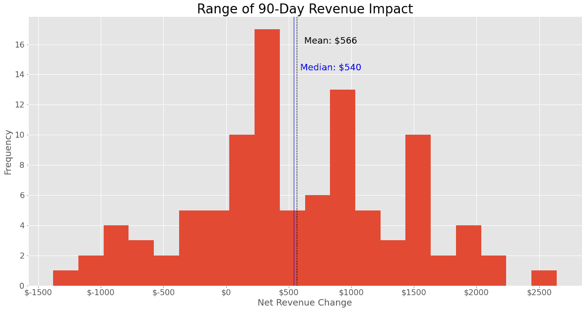

# 您的数据策略中的差距(第 2 部分)

> 原文：<https://towardsdatascience.com/the-gap-in-your-data-strategy-part-2-66dd6f731956?source=collection_archive---------26----------------------->

## [行业笔记](https://towardsdatascience.com/tagged/notes-from-industry)

## 跨越鸿沟的数据驱动解决方案

在这篇文章的第一部分[中，我认为企业需要问两个关键问题来更有效地实现数据驱动。](/the-gap-in-your-data-strategy-part-1-e078cc4be526)

> ***1。我们需要什么数据来解决这个问题？
> 2。这些数据值得收集吗？***

如果你还没有看过这篇文章，我建议你在阅读之前先看看。

在第 1 部分中，我展示了一个假想业务的场景，该业务管理数据科学相关内容的电子邮件列表。简单回顾一下，我的邮件列表遵循免费增值模式，任何人都可以注册，每周免费获得一篇文章。人们还可以订阅高级订阅，每周获得三篇有见地的数据相关文章，而不是一篇。

作为一名企业家，我被激励向更多的人提供更多的内容，并在这个过程中谋生，我希望获得尽可能多的优质订户。现在，我有这样一个场景，我的登录页面有 2%，或者说每 10，000 个访问者中有 200 个注册了我的电子邮件列表。还不错。

在这 200 名注册用户中，我让其中的 5%或 10 人在他们收到的前 3 封电子邮件中升级到 premium。我假设这些人会订阅 premium，而无需我进行任何额外的干预。我们现在将忽略这些人，因为我们认为不管我们在这里讨论的任何干预措施，他们都会注册。

Austin Distel 在 [Unsplash](https://images.unsplash.com/photo-1559526324-4b87b5e36e44?ixid=MXwxMjA3fDB8MHxzZWFyY2h8NDJ8fGZ1bm5lbHxlbnwwfHwwfA%3D%3D&ixlib=rb-1.2.1&auto=format&fit=crop&w=800&q=60) 上拍摄的照片

在注册后的前 3 封电子邮件中没有升级到 premium 的人中，3%的人会在收到的前 52 封电子邮件中订阅 premium(大约 1 年，假设我很努力！)所以，每 10，000 个访问者中，我会有大约 190 人注册，并且没有立即成为高级订阅者的打算。这意味着，在 10，000 名访问者中，我预计他们中的 6 人会暂时获得免费内容，最终看到我的内容的巨大价值，并转向溢价。

## 如何从 6 开始增加这个数字？

正如我在这篇文章的第一部分中所描述的，我认为我可以通过向免费读者发送我每周写的三篇文章中他们最感兴趣的一篇来实现这个目标。我的假设是，向每个用户发送最相关的文章将有助于他们看到我的电子邮件列表的价值。似乎很合理。

## 所以我问这个问题:我需要什么数据来解决这个问题？

为了了解我的用户对什么感兴趣，我想在我的注册流程中增加一个额外的步骤，要求人们选择他们最感兴趣的三个数据科学主题(*例如*机器学习、可视化、数据策略等)。)

然而，这个世界上没有免费的午餐。我有一个假设，如果我在我的注册流程中增加一个额外的步骤，我会观察到我的注册率下降，因为不耐烦的读者可能会被另一个在线表单阻止。

## 所以现在我提出这样一个问题:这些数据值得收集吗？

这个问题可以重新措辞，以很好地适应分析环境。收集这些数据的净收益是积极的吗？这类问题可以用 [**成本收益法**](https://en.wikipedia.org/wiki/Cost%E2%80%93benefit_analysis) 来解决。

进行成本效益分析的一个常见问题是，他们要求分析师做出许多静态的假设，这些假设可能是不现实的或不明智的。这些假设的不可靠性会破坏你的整个分析。我想积极主动地解决这个问题。

这就是为什么我将使用一个包含一些随机性的模拟来进行成本效益分析。我将介绍这个模拟的框架及其结果。如果你想看模拟的代码，你可以在我的 Github 页面上查看。

# 成本效益模拟

## 承认你的偏见，并牢记在心

在你开始任何编码之前，分析师应该采取的第一步是承认他们的任何偏见。例如，我可能会对收集读者偏好数据的想法感到非常兴奋，这可能会让我设计一个成本效益分析，并得出“是的——好主意！”

有这种偏见没关系。重要的是承认它，并在你做分析的时候记住它。当你做一个假设时，问问你自己，如果你持有与你目前倾向的完全相反的信念，这是否现实。这将保持你的诚实和你的分析稳健。

## **模拟设计**

这个模拟将有 3 个步骤，这反映了在我的电子邮件列表注册/转换过程中发生的关键事件。我选择模拟 90 天的活动，但这可以在[模拟代码](https://github.com/ncoleman15/data-strategy-sim)中轻松更改。

1.  **日流量:**基于历史数据我知道我平均一天有 1000 左右的访客，900 ~ 1000 ~ 95%的时间都在下降。我的每日流量分布接近正态，所以我假设它将继续遵循这种分布。
2.  **注册:**对于我的每次模拟运行，我假设我们继续看到 2%的注册率。然而，我们并没有假设向流程中添加新表单会对注册率产生固定的影响，而是允许有一些可变性，因为此时我们并不确定这种影响到底会是什么。
    我们最大的猜测是，增加这种形式会使我们的注册率从 2%下降到 1.9%，或者说阻止 200 个注册中的 10 个。同样，我们不能完全确定这种影响，所以我们允许一些可变性，但我们假设 95%的超时注册率影响将在 0 到 0.2 个百分点之间。
3.  **转换率:**类似于注册率效应，我们希望在我们的结果中加入一些可变性。我们认为，这种新的针对性练习将我们的转化率从 3%提高到 4%是合理的，因此提高了 1 个百分点，但如果 95%的情况下效果在 0 到 2 个百分点之间，我们也认为这是合理的。

请注意，对于注册率和转换率，我们假设它们将遵循正态分布。我们选择用正态分布来模拟这些比率，因为它具有使值更接近我们假设的平均值的属性，但它不排除意外值，例如我们有针对性的文章发送的负面影响。我们认为这种情况不太可能发生，但也不是没有可能，所以我们想对这种不确定性进行建模。

## **展示结果:将你的分析建立在业务背景下**

我经常听到有人呼吁数据科学家在展示他们的分析结果时，要设身处地地为观众着想。我认为这通常是一个好的实践，因为它迫使你把你的分析放在你试图解决的业务问题的背景中。然而，如果你围绕业务问题、你的利益相关者以及坦率地说，你公司的任何人来设计你的演示，而不是关注个人，那么你公司的任何人都将能够理解结果。

在这个例子中，我试图决定我是否会通过收集更多的用户数据和为用户管理我的内容来赚更多的钱，代价是可能阻止一些人注册。因此，我想以一种展示此提议解决方案的财务净收益的方式来框定我的结果。要做到这一点，我需要再加入一个假设，即付费用户对我来说值多少钱。

在这个例子中，假设我已经运行了这个分析，并且发现一个付费用户平均为我的企业创造了 60 美元。所以每月 5 美元。对于这种订阅，这意味着高级订阅用户的平均持续时间为 12 个月。

好吧，让我们来看看模拟结果。

我们可以用柱状图展示可能性的范围。平均 90 天的收入影响为正，约为 550 美元。中值影响也大致相同—这告诉我们，在我们的模拟中，一半的结果产生了 550 美元或更多的收入。

看到各种可能性是很重要的——根据我们的假设，我们可以看到从-1，500 美元到 2，500 美元的净收益。我在这里也要强调的是，在**中，80%的模拟运行返回了非负的净收入变化。**

这告诉我们，做出这种改变并不是没有风险的，但如果影响大小与我们假设的大致相同，我们通常会期望获得比其他情况下更多的收入。这足以说服我采取行动！

儿童马戏团在 [Unsplash](https://images.unsplash.com/photo-1520371764250-8213f40bc3ed?ixid=MXwxMjA3fDB8MHxzZWFyY2h8Mnx8bGVhcHxlbnwwfHwwfA%3D%3D&ixlib=rb-1.2.1&auto=format&fit=crop&w=800&q=60) 上拍摄的照片

**再现性和扩展性**

这个模拟练习的另一个重要特征是它很容易重复([见代码](https://github.com/ncoleman15/data-strategy-sim))并且它的假设很容易调整。如果您与对这些假设有不同信念的多个利益相关者一起工作，这一点尤其重要。很容易测试出不同的输入值。

## 概述

这篇文章展示了一个例子，说明我们如何使用基于模拟的成本效益分析来回答这个问题:**这些数据值得收集吗？**

这当然不是回答这个问题的唯一方法，而且很可能解决方案不会像我在这里提出的那样简单明了。但这就是为什么你的公司聘请了像你这样的智能数据科学家来解决这个问题！

说明我们是否应该收集数据是很重要的，但是如果不促进一种文化，让你和你的团队问这两个重要的问题，你甚至无法达到这个阶段。

> 1.我们需要什么数据来解决这个问题？
> 
> 2.这些数据值得收集吗？