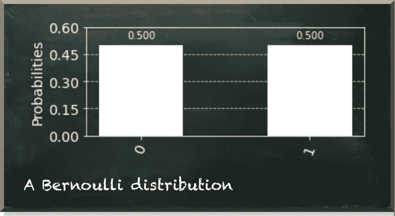
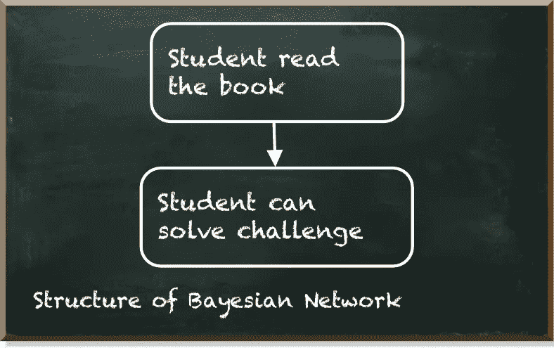
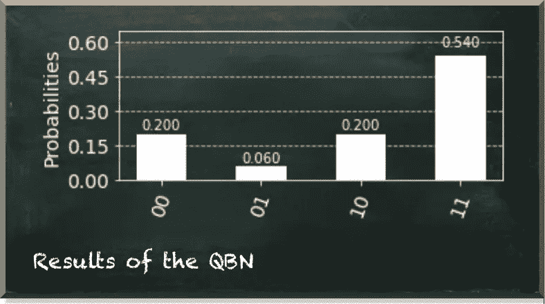

# 开始量子机器学习的温和方式

> 原文：<https://towardsdatascience.com/the-gentle-way-to-start-with-quantum-machine-learning-5e9ff61d886b?source=collection_archive---------21----------------------->

## 量子贝叶斯网络可能是你正在寻找的

量子机器学习要不要入门？看看 [**动手量子机器学习用 Python**](https://www.pyqml.com/page?ref=medium_entangled&dest=/) **。**

作者图片

如果你想开始学习量子机器，你会喜欢量子贝叶斯网络(QBN)。它们很直观，因此很容易理解。然而，他们使用基本的量子计算概念。因此，您可以亲自动手学习这些概念。

在我每周的量子机器学习挑战中，我问了一个简单的问题:*“一个学生能解决问题吗？”*

原来解决方案是量子贝叶斯网络。

*“什么？!"*你在想，*“这个挑战几乎不包含任何信息。更不要说一些把柄来决定如何解决它，并最终去解决它！”*

当然，你是对的。我在制定挑战时提供了更多信息。

但是，这篇文章不是关于挑战本身。如果你对挑战感兴趣，你可以在这里找到它[。相反，这篇文章是关于一个简单的量子贝叶斯网络如何教你量子计算和机器学习的基本概念。](https://pyqml.substack.com/p/what-are-the-chances-youll-solve)

当我问学生是否能解决这个问题时，你可能会说是或不是。两个答案都可能是正确的。这才是重点。除非学生尝试解决，否则我们不知道。

在此之前，我们只能推测。要回答这个问题，我们需要表达我们的信念。所以，充其量，我们的答案是概率性的。例如，可以是*“我相信这个学生能解决这个问题”*或*“她有 50%的机会解决这个问题。”*

贝叶斯网络和量子计算共享概率观点。

我们能想到的最简单的变量就是布尔。这是一个有两个可能值的变量。是真或假，1 或 0，或者学生解决问题与否。在贝叶斯网络中，我们使用[伯努利分布](/the-very-first-step-into-quantum-machine-learning-95efdf0d980c)来描述布尔变量。它表示任一值的概率。下图显示了示例性的伯努利分布。

作者图片

在量子计算中，我们使用量子比特(qubit)。当你看到它时，它要么是 0，要么是 1，每一个都有明显的概率，取决于不可见量子位的状态。

例如，如果量子位处于叠加态，比如|+⟩，测得它为 0 的几率是 50%。因此，量子位类似于我们刚刚谈到的伯努利分布。

除了变量，贝叶斯网络还包含它们之间的条件依赖。举个例子，如果学生读了我的书 [**用 Python**](https://www.pyqml.com/page?ref=medium_gentle&dest=/) 动手做量子机器学习，解决的几率增加到 90%。现在，我们有了一个双变量网络，如下图所示。

作者图片

在量子计算中，我们使用纠缠来模拟依赖性。纠缠量子位是强相关的。如果我们测量一个量子比特为某个值，纠缠的量子比特瞬间跳到与那个值对应的状态。下图显示了得到的测量概率。

作者图片

第一个量子位(右上角的数字)代表学生是否读过这本书。并且，第二个(左下角的数字)量子位代表学生是否能解决这个问题。如果我们只看第一个量子位为 1 的情况——这意味着她读过这本书——我们可以看到，她在 90%的情况下都解决了问题。

如果她没读过这本书，她有 50%的机会。在这种情况下，我们只看第一个量子位为 0 的状态。

她解决这个问题的总体机会是 74%。这是第二个量子位为 1 的所有状态的总和。

# 结论

贝叶斯网络是一个简单而强大的机器学习工具。而且，他们很容易开始量子机器学习，因为他们分享了量子计算中最重要的概率观点。

我们经历了伯努利分布如何代表叠加态的量子位。我们看到，我们可以使用纠缠来模拟贝叶斯网络中变量之间的依赖关系。

想了解更多关于量子机器学习和量子贝叶斯网络的知识吗？在我的书 [**用 Python**](https://www.pyqml.com/page?ref=medium_gentle&dest=/) 实践量子机器学习中，我们从零开始构建了一个 QBN，训练它解释缺失值，并使用它进行推理。

免费获取前三章[这里](https://www.pyqml.com/page?ref=medium_gentle&dest=/)。