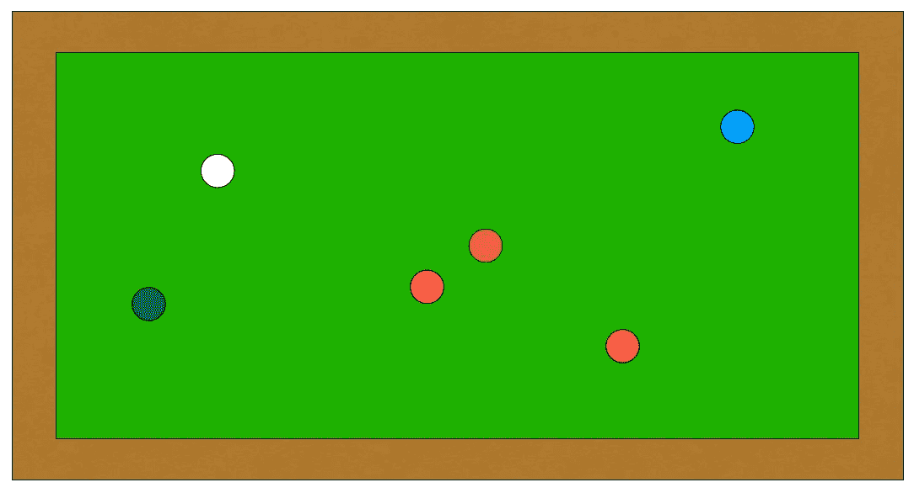
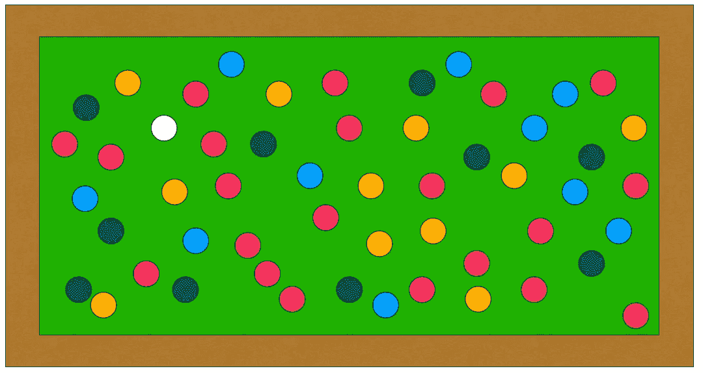
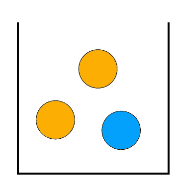
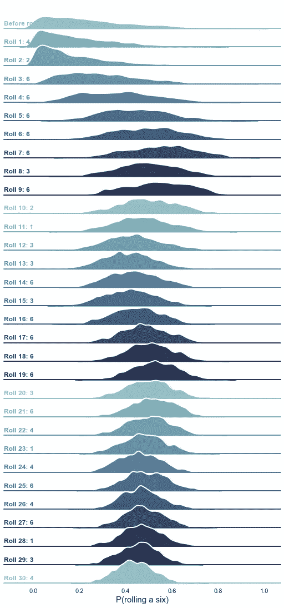

# 贝叶斯数据分析最温和的介绍

> 原文：<https://towardsdatascience.com/the-gentlest-of-introductions-to-bayesian-data-analysis-74df448da25?source=collection_archive---------10----------------------->

## 如何基于数据以自然的方式思考

肯尼斯·约翰·德拉·维加在 [Unsplash](https://unsplash.com?utm_source=medium&utm_medium=referral) 上拍摄的照片

如果你曾经上过大学的统计学课或在线课程，你可能会想起假设检验、置信区间或 p 值等术语。如果是这样的话，你所学的就是所谓的“经典”或“频率主义者”统计学，这是教授统计学 101 的主要方法。然而，还有另一个学派叫做贝叶斯统计，它建立了一种不同的思考数据和模型的方式。

贝叶斯方法经常在大学和在线课程中被忽视，因为它更难解释、理解和应用。我认为这样的品牌是不公平的。实际上，我认为贝叶斯思维方式更自然，并且比经典方法有更大的优势。在本文中，让我尽我所能为您提供贝叶斯统计的最温和的介绍。让我们开始吧！

# 用数据更新信念

想象我们在台球桌旁。你背对着桌子站着，这样你就看不见了。我把一个白球放在桌子上的某个地方，然后问你它在哪里:在桌子的右边，左边，还是中间？自然，你不知道任何事情，你所能做的就是猜测。然后，我开始在桌子上随机放置彩球，每次我这样做时，我会告诉你新的球是在白色球的左边还是右边。5 轮过后，桌子(你仍然看不到)可能看起来像这样:

台球桌后，随机放置白色和五色球。图片由作者提供。

根据我告诉你的，你知道四个彩球在白色球的右边，一个在左边。它告诉你白球的位置了吗？当然了！因为彩球是随机放置的，而且大多数都在白球的右边，你可能会得出结论，白球更有可能在桌子的左边。

花点时间思考一下刚刚发生的事情:*你根据数据*更新了你对白球位置的看法。最初，您对它的位置一无所知:从您的角度来看，它同样可能在表的任何部分。现在，有了五个数据点，你就知道了一些事情，尽管这个事情不是很精确:球更可能在左侧而不是右侧。

> 贝叶斯方法是基于数据更新一个人的信念。

现在，如果我在桌子上放上 50 个彩球，它会是什么样子？

台球桌后，随机放置在白色和 50 色球。图片由作者提供。

在这一点上，我会告诉你，50 个彩球中有 9 个(18%)在白色球的左边，而剩下的 41 个(82%)在右边。基于这些信息，你可以更新你对白球位置的看法:它很可能在离桌子左边缘五分之一的地方。你拥有的数据越多，你的估计就越精确。

简而言之，这就是贝叶斯推理:你开始时对感兴趣的量——白球的位置——有一些先验的信念。你之前的想法是它同样可能在桌子上的任何地方。然后，随着新数据的到来，你已经更新了你的信念，直到你拥有大量数据并能够精确定位球的位置——这被称为后验信念，这是基于数据进化后的先验信念。

> 贝叶斯思维方式是人类的天性。

我认为这种贝叶斯思维方式实际上就是我们的思维方式。考虑这个琐碎的现实生活中的例子。你要出门，不知道该不该带伞。最近天气很好，所以你认为你不需要——那是你以前的想法。然后你在电视上看到一个天气预报员预报有 50%的可能性会下雨，这让你更新了你的信念，考虑带上雨伞。当你向窗外望去，看到乌云向你逼近，你肯定这把伞可能有用——这是你的后见之明。但是这种更新信念的思维方式与数据、统计和模型有什么关系呢？

# 贝叶斯三步走

贝叶斯方法有三个特点，你需要弄清楚:

*   参数有分布，
*   概率是主观的，
*   贝叶斯公式很酷。

我们一个一个来看。

## 参数有分布

在统计学中，参数是一些我们感兴趣的未知量，例如桌子上白球的位置，或者花哨的神经网络中的权重。我们通常应用一些统计程序或拟合机器学习模型来从数据中估计它们。在经典统计学中，这种估计是固定值，是固定不变的数字。想想传统的线性回归:你运行它，得到回归系数。

在贝叶斯方法中，参数不是数字，而是随机变量。这意味着它们可以用给定的概率取许多不同的值，由它们的[概率分布](/6-useful-probability-distributions-with-applications-to-data-science-problems-2c0bee7cef28)描述。考虑下面的参数:白球到桌子左边缘的距离，以厘米为单位(桌子有三米长)。最初，你先前的想法是球同样可能在距离左边缘 0 到 300 厘米之间的任何地方。下图左侧面板中的分布反映了这一点。放置 5 个彩球后，你对白色球位置的后验信念(以概率分布表示)可能与中间面板中的信念相似。一旦所有 50 个彩球都在桌子上，你可以再次更新你的信念来表达你对白色球的位置更加确定。

图片由作者提供。

注意概率分布是如何捕捉到我们对参数的了解，以及我们对它有多确定。分布越窄，可能值的范围就越小，因此我们就越有把握。

> 概率分布反映了我们对参数的了解以及我们对参数的确定程度。

## 概率是主观的

在贝叶斯方法中，我们正在处理所谓的*主观概率*。不，这并不意味着它在某些方面不公平或有偏见。

关于概率定义的讨论是一个长期的数学和哲学争论。抛开所有这些争议，一个流行的定义是*频率主义概率*，它指出概率是重复试验的频率。为什么骰子掷出六的概率是 1/6？因为如果你滚动它 6 00 万次，你会得到大约 1 00 万个 6。如果你滚动它无限次，那么正好 1/6 次滚动将会是 6 次。这是 frequentist 的定义，整个 frequentist 统计数据都是基于这个定义，假设您的数据是一个单一的实现，或者说是一个试验，来自一组无限多的数据样本，这些样本都是您可以假设得到的。听起来奇怪还是不直观？因为事实如此。但这就是大多数经典统计学的工作原理。想想 95%置信区间的意义。如果您无限次地重新收集数据，获得稍微不同的数据样本，并对每个样本重复分析，则 95%的间隔将捕获感兴趣的参数。

相比之下，贝叶斯主义者将概率定义为*主观*，你可以认为是*直觉概率。*根据这个定义，你不需要重复试验。你可以根据自己的判断来定义概率。你可以自由地说:我认为切尔西有 80%的机会赢得本赛季的冠军联赛，这是一个完全有效的概率陈述。

> 贝叶斯主义者允许根据个人判断来定义概率。

你想知道为什么这个看似不重要的区别如此重要吗？请继续阅读，寻找答案！

## 贝叶斯公式很酷

贝叶斯推理的核心，是所谓的贝叶斯定理。听起来可能有点吓人，但这只是一个计算条件概率的简单公式。这些是什么？下面的例子借用了我在 DataCamp 上教的[贝叶斯数据分析课程](https://www.datacamp.com/courses/bayesian-data-analysis-in-python)。

盒子里有三个球:一个蓝色的，两个橙色的。图片来自作者在 DataCamp 讲授的 Python 课程中的[贝叶斯数据分析。](https://www.datacamp.com/courses/bayesian-data-analysis-in-python)

想象一个盒子，里面有三个球。一个是蓝色的，两个是橙色的。你随便抽一张。它是蓝色的概率是`P(blue)=1/3`，它是橙色的概率是`P(orange)= 2/3`。这些是*无条件的*概率。*另一方面，条件*概率是某个事件*的概率，假设*某个其他事件已经提前发生。比方说，你画了一个橙色的球，把它放在一边。现在，盒子里还有两个球:一个蓝色的，一个橙色的。你随机抽取两个中的一个。它是蓝色的概率有多大？我们用`P(blue|orange)`表示这个量，读作:假设第一个球是橙色的，*第二个球是蓝色的概率。在这种情况下，它等于 1/2。贝叶斯公式允许精确地计算这一点。它是这样说的:*

贝叶斯公式。

其中 A 和 B 是一些事件。将其转换为 balls 示例会产生

你可以把贝叶斯定理看作是一个成立的概率公理。在这个玩具的例子中，它并不那么有用，因为要计算`P(blue|orange)`，我们需要知道`P(orange|blue)`，这同样很难(或很容易)得到。但事实并非总是如此！

贝叶斯公式是基于数据更新信念的秘密钥匙。我们只需要一个小技巧:我们可以用*概率分布*替换公式中的*事件*(比如抽一个蓝球)，公式仍然成立！

> 贝叶斯公式是基于数据更新信念的秘密钥匙。

这意味着我们可以将其重写如下:

我把大写的 *P* 换成了小写的 *p* ，习惯上这样做是为了强调我们谈论的是概率分布而不是事件的概率。剩下的还是老样子。

我们感兴趣的左边的项是给定数据时参数的分布。这是我们的后验分布。为了计算它，我们需要三个量:

*   给定参数的数据分布。这被称为*可能性*，取决于我们用于数据的模型。
*   参数的分布。这是我们之前的分布。在之前的台球桌示例中，我们将使用 0 到 300 之间的均匀分布。
*   数据的分布。这个可能很难计算，但是因为整个分数需要加起来等于 1(因为它是一个分布)，你可以简单地把它想成一个归一化因子，使它等于 1。

因此，简而言之，为了得到参数的后验分布，我们需要得到先验分布，然后乘以基于我们选择的模型的似然性。但是如何将分布相乘呢？嗯，有几种方法可以做到:

*   你实际上可以写下概率密度函数的公式，并在纸上相乘，希望你可以将结果简化为简单的东西。在某些情况下，当先验和可能性很好地对齐时，这是可能的。如果是这样，我们称这样的先验*为相应可能性的共轭先验*。这样的案例已经有人研究过了，所以实际上你不需要自己做任何笔和纸的数学计算，你只需要使用[维基百科表格](https://en.wikipedia.org/wiki/Conjugate_prior)中的一个公式就可以了。
*   如果上述方法不起作用，你总是可以求助于模拟方法，简称为马尔可夫链蒙特卡罗或 MCMC。这些对于这篇介绍性的文章来说太复杂了，但是它们所做的只是从参数的后验分布中模拟绘制。

无论选择哪种方法，最终结果总是参数的后验分布。理论讲够了，让我们来看看贝叶斯推理在实际中的应用！

# 掷骰子

我有一个六面骰子。但这不是普通的死亡。我的面上可以有任意数量的点，而不是一个、两个、三个、四个、五个和六个点。我会掷骰子 30 次，你的工作是根据你看过的所有掷骰子，估计每掷一次后掷出 6 的概率。这个概率可以是零、一或介于两者之间的任何值。

让我们从频率主义者的方法开始。没有任何数据，我们无法估计掷出 6 的概率。然后，我们的第一次掷骰子是 4。就这一个数据点，我们只能估计得到 6 的概率为 0。接下来，我们有一个 2，这不会改变我们的估计，但在此之后，我们连续得到五个 6，这使我们的估计达到 5/7 或超过 0.7(因为五次掷骰子在迄今为止的 7 次尝试中出现了六次)。下面的图显示了在每次掷骰之后，常客估计值是如何变化的。最后，在 30 次掷骰子之后，我们得到 6 的概率大约是 0.47。

观察每次掷骰后掷出 6 的概率——频率主义者的估计。图片由作者提供。

现在，让我们用贝叶斯方法。我们需要一个参数的先验，在看不到任何数据的情况下，你认为掷出 6 的概率是多少？一个合理的做法是假设我在虚张声势，而我的骰子实际上只是一个普通的骰子。如果是这样的话，掷出 6 的概率是 1/6。因此，我们的先验分布应该在 1/6 或 0.17 附近达到峰值，但是它应该足够宽以允许其他可能性。一个好的选择是 Beta(1，3)分布，你可以在下面的图的顶部看到，标记为“在滚动之前”。该图显示了这种先验信念是如何随着数据(或滚动)的到来而更新的。滚动结果与之前相同。每掷一次，我们的分布——掷出六点的概率的贝叶斯估计——变得更窄，表明估计更有把握。一般来说，它也向右移动，表明我们所追求的概率可能大于 0.17。最后，在 30 次滚动后，后验分布峰值在 0.42 附近，可能值的范围大约在 0.25 到 0.65 之间。

观察每次掷骰后掷出 6 的概率——贝叶斯估计。图片由作者提供。

实际上，我的骰子的六个面分别有 1、2、3、4、6 和 6 个点，这意味着掷出六的概率是 2/6 或 0.33。我模拟过掷骰子，在 30 次掷骰子中得到 14 个 6。两种估算方法如何比较？

从这种频繁主义者与贝叶斯的比较中，我们可以学到一些东西:

*   在数据很少的情况下，frequentist 方法是非常不可靠的。它给你一个数字，创造一种虚假的安全感，但这个数字可能会有很大的偏差。这里，我们得到了一个频率主义者估计的 47%,而实际值是 33%。
*   贝叶斯方法为我们估计的参数提供了一个分布，而不是一个单一的数字。感谢这一点，你可以看到你的估计是多么确定。请注意，随着数据的增多，后验概率变得越来越窄，表明确定性越来越大。这里，33%的值可能不是最有可能的，但是在后验分布下仍然是非常有可能的。
*   如果数据很少，贝叶斯方法更依赖于先验知识。在没有数据的情况下，后验就是先验。数据越多，先验知识就越丰富。这可能是危险的(你可以选择一些非常糟糕的先验，这会扭曲结果)，但如果负责任地使用，它可能是有利的——下一节将详细介绍。

# 去贝叶斯是值得的

为什么要去贝叶斯？除了作为一种更自然的统计思维方式，贝叶斯方法还提供了一系列实际优势:

*   由于输出参数的分布而不是单个数字，它以自然的方式捕捉不确定性。
*   即使只有很少的数据，它也能工作，尽管它严重依赖于先验知识。因此，优先选择是一项重要而负责的任务。在实践中，人们通常基于先前的研究(例如，当估计药物的功效时，先前的功效率可以是类似药物的功效率或在相同药物的先前试验中发现的功效率)或基于常识(例如，当估计产品的价格弹性时，先前的弹性可以是仅允许负值的某种分布——通常需求随着价格增加而下降)。
*   贝叶斯方法使得[假设检验](/the-hypothesis-testers-guide-75f7db2e4d0d)更加容易和直观。例如，在 A/B 测试中，它允许直接计算变量 A 优于 B 的概率，而无需求助于 p 值或假设置信水平。

感谢阅读！如果你有兴趣了解更多，可以查看我在 DataCamp 的 Python 课程中的 [**贝叶斯数据分析。它从最基本的开始，通过贝叶斯 A/B 测试和决策分析，直到用 MCMC 模拟方法拟合和评估贝叶斯回归模型。**](https://www.datacamp.com/courses/bayesian-data-analysis-in-python)

如果你喜欢这篇文章，为什么不订阅电子邮件更新我的新文章呢？并且通过 [**成为媒介会员**](https://michaloleszak.medium.com/membership) ，可以支持我的写作，获得其他作者和我自己的所有故事的无限访问权限。

需要咨询？你可以问我任何事情，也可以在这里 为我预定 1:1 [**。**](http://hiretheauthor.com/michal)

你也可以试试 [**我的其他文章**](https://michaloleszak.github.io/blog/) 中的一篇。不能选择？从这些中选择一个:

 [## 6 有用的概率分布及其在数据科学问题中的应用

### 带有示例和 Python 代码的实用概述。

towardsdatascience.com](/6-useful-probability-distributions-with-applications-to-data-science-problems-2c0bee7cef28)  [## 蒙特卡洛辍学

### 用一个小技巧免费改善你的神经网络，获得模型不确定性估计作为奖励。

towardsdatascience.com](/monte-carlo-dropout-7fd52f8b6571)  [## 假设检验者指南

### 一个简短的关于为什么可以拒绝假说，但不能接受它们的入门书，有例子和视觉效果。

towardsdatascience.com](/the-hypothesis-testers-guide-75f7db2e4d0d)