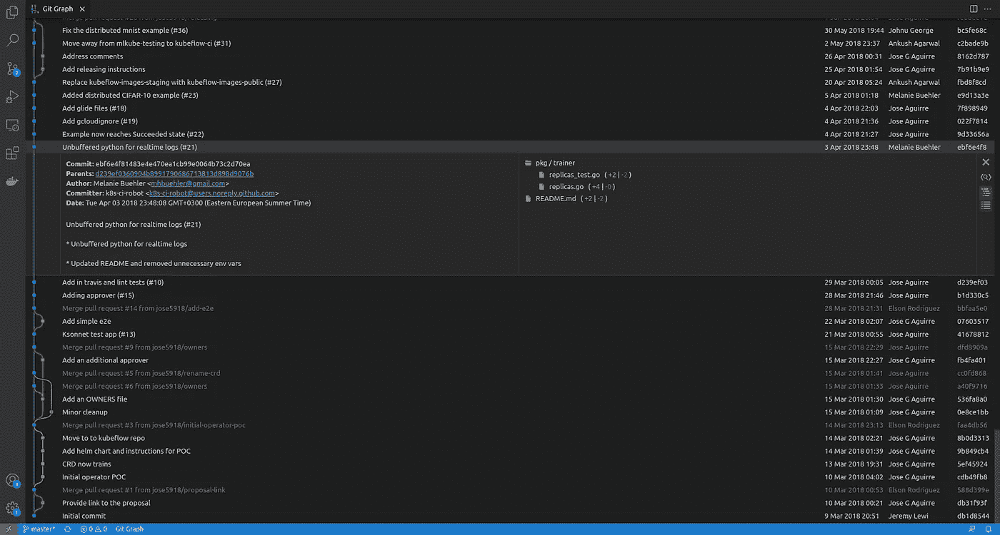

# 2021 年顶级 Visual Studio 代码 Git 扩展

> 原文：<https://towardsdatascience.com/the-git-cli-is-dead-are-you-still-using-git-from-the-command-line-2f4793d355ba?source=collection_archive---------1----------------------->

## 除了设计最精良的 CLI 工具之外，还有哪些替代工具？


照片由[扬西·敏](https://unsplash.com/@yancymin?utm_source=unsplash&utm_medium=referral&utm_content=creditCopyText)在 [Unsplash](https://unsplash.com/s/photos/git?utm_source=unsplash&utm_medium=referral&utm_content=creditCopyText) 上拍摄

我知道有些读到这些文字的人已经讨厌我了。你们中的一些人可以并且实际上把每一个工作时间都花在终端窗口前；你喜欢它。这没有什么不好，一些命令行界面(CLI)工具设计得非常好，即使您有一个图形用户界面，您也很可能永远不会使用它。

我听到了！实际上，我喜欢在终端窗口中工作。我喜欢 ViM 编辑器，我的工作站是一个 Ubuntu 服务器虚拟机，我每天都用 SSH 连接到它，直到最近，我还只通过它的 CLI 使用 Git。更重要的是，我坚信在终端窗口内工作通常会让你更有效率，并让你真正理解在引擎盖下发生了什么。

[](/dual-boot-is-dead-the-post-mortem-cee4db42d059) [## 双重引导已死:验尸

### 只需一个命令，就可以将任何机器变成开发人员工作站。

towardsdatascience.com](/dual-boot-is-dead-the-post-mortem-cee4db42d059) 

然而，当您真正知道自己在做什么时，将带有图形视图的工具集成到您的工作流程中可以简化流程并丰富您的体验。仅仅因为你必须使用鼠标和点击一些按钮就对一切说不，最终感觉就像一把老虎钳。

所以，让我们抛开固执，看看几个*免费的* Visual Studio 代码扩展如何增强我们的 Git 体验。

> [Learning Rate](https://www.dimpo.me/newsletter?utm_source=medium&utm_medium=article&utm_campaign=vs_code_git) 是为那些对 AI 和 MLOps 的世界感到好奇的人准备的时事通讯。你会在每周五收到我关于最新人工智能新闻和文章的更新和想法。订阅[这里](https://www.dimpo.me/newsletter?utm_source=medium&utm_medium=article&utm_campaign=vs_code_git)！

# Git 增压

[Visual Studio Code](https://code.visualstudio.com/) 是一个免费的、轻量级的、跨平台的代码编辑器。它可能不像 IntelliJ Idea 或 PyCharm 那样是一个成熟的 IDE，但它是一个强大的、不受干扰的工具，有一个专门的粉丝群和一个繁荣的生态系统。

此外，大量强大的附加组件可以使 VS 代码成为最终的开发环境。今天，我们讨论四个扩展，它们会动摇你的 Git 工作流程。

## GitLens | 5 ⭐

GitLens 是该领域无可争议的冠军。事实上，GitLens 并不像是一个扩展；它几乎就像是 VS 代码核心不可分割的一部分。所以，当安装一个新的 VS 代码副本时，首先要做的事情之一就是安装 GitLens。

没有什么是 GitLens 做不到的:惊人的修订导航、当前行责备、代码作者身份、丰富的工具提示、代码热图等等。

此外，GitLens 是高度可定制的，并与左侧栏中已经存在的 Git 图标相集成。因此，它实际上感觉像是核心 VS 代码体验的一部分。

## Git 图| 5 ⭐

你在 VS 代码里面寻找 GitKraken 或者 SourceTree 的体验吗？然后 [Git Graph](https://marketplace.visualstudio.com/items?itemName=mhutchie.git-graph) 为你覆盖，最重要的是，它是免费的！Git Graph 必须是 VS 代码中最漂亮的 Git 扩展。

最重要的是，Git Graph 只需一次点击就可以提供任何提交的详细视图，允许您查看文件中的更改，甚至执行代码审查！



Git Graph 是非常可定制的，允许您为 UI 元素设置个人风格，例如，改变图形样式或颜色。

## GitLive | 5 ⭐

[GitLive](https://marketplace.visualstudio.com/items?itemName=TeamHub.teamhub) 将代码协作带到了另一个高度。使用 GitLive，你可以看到谁在线，他们的代码更改(即使他们还没有提交！)，他们在做什么分支，或者什么问题。所有这些都是实时的！拜托，这太荒谬了！

此外，GitLive 对可能的冲突发出警告，并允许您直接在您的工作分支中挑选他人所做的更改。最后，您甚至可以进行视频通话，并与他人实时共享您的代码以进行协作，而无需来回发送代码片段！

## Git Automator | 4.5 ⭐

在我从事技术工作的日子里，我见过类似下面这样的提交消息:

```
Commit: ebf6e4f81483e4e470ea1cb99e0064b73c2d70ea
Parents: d239ef0360904b8991790686713813d898d9076b
Author: Lazyperson
Date: Tue Apr 03 2018 23:48:08 GMT+0300 (CEST)fix
```

这不是很好的描述，你不觉得吗？所以，这是为你，懒惰的开发人员准备的: [Git Automator](https://marketplace.visualstudio.com/items?itemName=ivangabriele.vscode-git-add-and-commit) 可以帮助你编写提交消息，提供更多关于发生了什么的细节。

Git Automator 可以暂存您的更改，预填充您的提交消息，提交，并通过快捷方式将所有内容推送到远程存储库。你所要做的就是使用它！真的，请使用它。

因此，您可以为简单的操作预填充提交消息，如*删除*或*创建*文件或创建您自己的模板来生成与您的例程匹配的提交消息。

# 结论

CLI 工具很棒。特别是 Git 有一个设计最好的 CLI 工具。但是，有些工具可以丰富您的 Git 体验，您现在就可以免费使用它们。

我知道改变你的习惯很难；我所要求的是保持开放的心态，至少尝试一下这些扩展。此外，如果你有任何你所信赖的 Git 工具，请在评论区留下链接和描述。我将非常感激！

# 关于作者

我的名字是[迪米特里斯·波罗普洛斯](https://www.dimpo.me/?utm_source=medium&utm_medium=article&utm_campaign=vs_code_git)，我是一名为[阿里克托](https://www.arrikto.com/)工作的机器学习工程师。我曾为欧洲委员会、欧盟统计局、国际货币基金组织、欧洲央行、经合组织和宜家等主要客户设计和实施过人工智能和软件解决方案。

如果你有兴趣阅读更多关于机器学习、深度学习、数据科学和数据操作的帖子，请关注我的 [Medium](https://towardsdatascience.com/medium.com/@dpoulopoulos/follow) 、 [LinkedIn](https://www.linkedin.com/in/dpoulopoulos/) 或 Twitter 上的 [@james2pl](https://twitter.com/james2pl) 。

所表达的观点仅代表我个人，并不代表我的雇主的观点或意见。