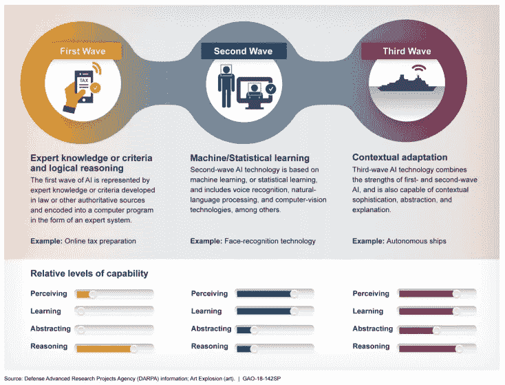
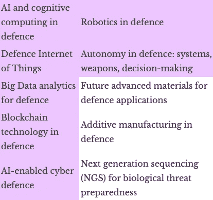

# 全球人工智能竞赛和战略平衡

> 原文：<https://towardsdatascience.com/the-global-artificial-intelligence-race-and-strategic-balance-which-race-are-we-running-e0176b2349e5?source=collection_archive---------29----------------------->

# 我们在跑哪场比赛？

作为第四次工业革命的一部分，人工智能(AI)有可能影响军事和民用生活的更多方面。各国正在争夺全球人工智能的主导地位，无论谁“赢”都将获得预期的经济和地缘政治实力。然而，人工智能增强技术可能会带来前所未有的新安全风险。

最后，本文认为，英国和欧盟应该谨慎对待关键通信基础设施的外包，并更认真地对待最近涉及中国的安全问题。

*[*英国核问题项目*](https://rusi.org/publication/conference-reports/2020-uk-poni-papers) *2020 论文可在此处***及录音可在此处***。我的博文可以在这里找到***。*****

# **当前人工智能能力**

**人工智能因其对经济的潜在变革性影响和对其他创新的支持而被比作电力。1 许多人预计人工智能开发竞赛的“赢家”将在未来几十年中在经济和地缘政治上占据主导地位，从而加剧国家之间的紧张局势并转变国家力量的要素。2**

**美国在大多数人工智能能力指标上保持领先，英国排名第三，落后于中国。3 其他来源使用不同的指标来产生他们的排名。4 应用于军事的人工智能在美国、中国、俄罗斯和以色列的议程上占据重要位置。5 这意味着无论哪个国家在人工智能发展方面领先，都将在网络战和传统战争方面具有军事优势。6**

**根据 John Launchbury 提供的框架，人工智能可以被概念化为具有三个波，每个波基于不同的能力，如图 1.7 所示。世界仍处于被称为“弱”或“窄”人工智能的领域，其中人工智能针对特定的窄任务进行了优化，如语音识别和执行重复功能。强人工智能，或人工通用智能(AGI)，即机器将具有类似人类的认知能力，仍然是一个重大的技术挑战。**

****

****图 1:** AI 概念化框架。
*图片 via 美国政府问责局，* [*【人工智能:新兴机遇、挑战和影响】*](https://www.gao.gov/assets/700/690910.pdf) *，提交给众议院科学、空间和技术委员会的报告，GAO-18–142 sp，2018 年 3 月，2020 年 5 月 16 日查阅。***

**目前的 AI 技术有两大局限:需要大量的标签化数据来训练系统；系统对环境仍知之甚少。8 未来五年，在构建关键数据集的同时，可能会看到大量现实世界的试验。9 关于 AGI 开发的时间表，意见不一。10 据预测，计算机将在 2029 年通过图灵测试，技术奇点将在 2045 年出现。11 然而，一些消息来源认为 AGI 开发在未来 20 年内不太可能实现，如果有的话。12 人们还认为，至少某些方面的决策能力可以在 2040 年实现。13**

# **第四次工业革命(工业 4.0)**

**工业 4.0 涉及智能和互联机器和系统的开发，其中将出现人工智能、物联网(IoT)、利用大数据和量子计算等领域的进一步突破。14**

**大数据是高容量、高速度和/或高多样性的信息，被称为 3Vs.15 物联网广泛涵盖了人与物之间不断增加的连接，已被视为可能影响美国实力的关键民用技术。16 物联网对象数量和类型不断增加的主要目的是产生关于我们周围环境的有用数据，使其更加智能。17 物联网预计将成为大数据的主要生产者，对大数据的融合和分析可以实现准确可靠的决策和对无处不在的环境的管理；这是一个巨大的未来挑战，人工智能在其中发挥着关键作用。18 人工智能和大数据已经改变了经济，提高了整个市场的生产力，思科预测，2021 年 94%的全球工作负载将在云中处理。19 人工智能正在成为管理大量数据的解决方案，特别是基于数据集进行预测。20**

# **防御中的人工智能**

**欧洲防务局(EDA)分析了它认为的 10 个最具颠覆性的关键创新(表 1)，与这些重点发展相关的连接技术是人工智能。**

****

****表 1:** 即将到来的 10 项最具颠覆性的国防创新。*来源:欧洲防务事务，* [*“前方颠覆性防务创新！”*](https://www.eda.europa.eu/webzine/issue14/%20cover-story/disruptive-defence-innovations-ahead) *，欧洲防务局杂志，2015 年第 14 期，2020 年 7 月 1 日获取。***

**增加武器系统的自主性可以在战场上提供优势，潜在地允许较弱的核武器国家重置力量的不平衡，但加剧了对较强国家可能进一步巩固其统治地位并参与更具挑衅性的行动的担忧。21 全球领导者之间的竞争可能导致武器化人工智能的扩散。22**

**此外，人工智能增强的核武器和战略非核武器的混合将通过破坏战略稳定而加剧意外升级的风险**

**美国、中国和俄罗斯都宣布了通过机器人和人工智能实现抵消优势的战略。24 C4ISR 已被确定为未来 20 年的潜在影响领域，其中人工智能支持的自主系统将被作战部队采用。25 众所周知，欧盟和北约都刚刚开始处理国防中的人工智能问题，而俄罗斯和中国已经开始从战略角度考虑这个问题。26**

# **5G、安全和政治稳定**

**5G 的引入将使收集数据的物联网传感器数量激增；5G 比 4G 快 20 倍，具有创纪录的低延迟，并允许开发人员创建近实时应用。27 然而，如果没有人工智能，这将是不可能的。28 大数据的使用在性能和隐私之间建立了一种平衡；如果运营商未能以道德的方式利用信息技术，大量敏感个人信息(姓名、身份证号、位置、密码)的数据保密性问题就会变得显而易见。29**

**面对人工智能和大数据可能被恶意/有偏见地使用，各国都面临着保护其公民甚至政治稳定的压力。30 因为 5G 网络是我们日益数字化的经济和社会的未来支柱，所以确保其安全性和灵活性至关重要。31 即使在当前的能力水平下，人工智能也可以用于网络领域，以增强对网络基础设施的攻击。32 没有完美的安全性这种东西， 只有不同程度的不安全性。33 这些“智能”技术依靠双向无线链路与设备和全球服务进行通信，这为网络威胁提供了更大的“攻击面”。34 因此，5G 网络可能会导致政治分裂和潜在的不可互操作的技术势力范围，其中一个势力范围由美国领导，另一个由中国领导，其他一些势力范围介于两者之间(例如欧盟、韩国和日本)。35**

**所有这些问题在专制国家的背景下都是最重要的，但也可能破坏民主国家维持真实公共辩论的能力。36 例如，“deepfake”(源于“深度学习”和“假”)算法可以创建假图像和视频，人类无法轻松区分这些图像和视频。如果使用 deepfake 方法传播错误信息，将威胁到全球安全。此外，他们是隐私和身份的巨大威胁。因此，提出能够评估数字媒体完整性的技术是不可或缺的。37**

**安全和控制也是人工智能需要监管的领域，一些人还呼吁禁止或严格限制人工智能领域的 R&D，如自主武器、超智能人工智能和进攻性网络能力。38 几乎所有的人工智能模型都包括软件的“黑盒”方面，即使是创作者也不能完全理解，这增加了保持算法开放性的重大挑战。39**

**人工智能对欧盟和英国的安全和国防的影响在现阶段基本上是未知的。40 欧洲落后于其他全球参与者。41 然而，连续的欧盟战略继续加强欧洲技术自主的愿望，甚至在关键战略重要领域的直接“主权”,包括 5G 和 6G.42 欧盟已经宣布在人工智能和机器人技术中需要高水平的数据保护、数字权利和道德标准，并坚持道德标准以及对人工智能引起的社会变化的准备。43**

**《中国 2025 战略》是关于让中国成为“主要的网络力量”，以及根据自身利益塑造网络空间国际治理的能力。有些人把正在进行的数字革命和日益加深的中美竞争称为新的军备竞赛**

# **中国是威胁吗？**

**尽管华为的产品和服务被评估为高度不安全，但中国最近有望成为 5G 技术的全球领导者。45 今年 1 月，英国宣布华为将被允许建设该国 5G 核心网络的一部分。美国引用华为设备对关键基础设施的高风险特性，以限制情报合作的威胁作为回应。46 英国华为网络安全评估中心监督委员会在 2018 年报告称，“各种产品中使用的安全关键第三方软件没有受到足够的控制”；华为回答说，它可能需要三到五年来缓解这两个缺陷，但到那时，有关 5G 合同的大多数决定都将做出，5G 网络的建设也将开始。47 一旦引入，它将成为英国基础设施中“不可分割”的一部分。48**

**可以说，中国大数据的普遍实践远不符合以人为本的方法所要求的社会、政治和道德含义。因此，中国的技术和政府政策吸引了越来越多的国际关注和审查。49 中国正在实施广泛的社会监控和基于人工智能的社会信用计划，这在其他国家会被认为是有争议的，并使用户行为数据的收集能够在以后潜在地给予或拒绝获得国家提供的一系列服务。该政权对其人工智能和大数据系统的日益依赖建立了一个数字专制政权。50**

**如果一个国家的 5G 基础设施的许多关键组件来自中国，这将使中国更容易监视或破坏该国的在线通信。51 英国需要了解如何降低外国设备带来的风险，因为即使是现在，人们也很少知道英国如何应对安装在伦敦各行政区的中国生产的监控设备可能带来的潜在安全漏洞。52《电讯报》的 Jeremy Warner 指出，英国有“在我们匆忙进行数据保护的过程中把未来留给中国”的风险。53**

**2019 年 6 月，中国发布了首个人工智能道德规范:《北京人工智能原则》。这是国内讨论人工智能伦理的第一个公开信号。54 2020 年早些时候，美国商务部发布了新法规，限制各种中国公司获得美国技术。55 未来法规的需求将在很大程度上取决于人工智能的技术进步，因为政策和法规可能会破坏其发展(反之亦然)。56 国际合作治理和新技术外交的潜力可能是在工业 4.0.57 期间实现稳定的关键**

# **结论**

**人工智能技术对国家安全的影响在现阶段仍基本未知。然而，英国最近的行动似乎是为了在战略上孤立自己的盟友，最初是反对美国禁止华为进入其 5G 基础设施的愿望，并决定离开欧盟，欧盟有自己的战略优先事项来证明地缘政治的相关性。直到最近，英国政府才决定在该国逐步淘汰华为的 5G 角色。58 然而，通过识别现有框架和执行机制中的潜在差距，英国充分了解已经在使用的监控设备仍然极其重要。59**

**欧洲国防管理局应与非传统的 R&D 国防团体和创新者合作，以加快获得新兴的和潜在的破坏性研究，并确定额外投资的领域，以充分满足未来的国防能力需求。60 还应考虑欧洲工业能力的发展**

**在人工智能方面落后的国家可能只有两个选择:加入竞赛并可能开发利基人工智能，或规范其使用以减少潜在的不良应用**

**国际政策协调仍然是解决人工智能的伦理和政治影响的必要工具，以促进人工智能政策和治理的全球协调。63**

# **参考**

**1\. US-China Economic and Security Review Commission, ‘Emerging Technologies and Military-Civil Fusion — Artificial Intelligence, New Materials, and New Energy’, 2019 Annual Report to Congress of the US-China Economic and Security Review Commission, US-China Competition, chapter 3, Section 2.
2\. Claudio Feijóo et al., ‘Harnessing Artificial Intelligence (AI) to Increase Wellbeing for All: The Case for a New Technology Diplomacy’, *Telecommunications Policy* (Vol. 44, №6, 2020), pp. 1019–88.
3\. Tortoise Media, [‘The Global AI Index’](https://blog.tiggalina.org/2020/11/06/ukponi2020/=), accessed 3 April 2020.
4\. Stanford University, ‘The 2019 AI Index Report. [Human-Centered Artificial Intelligence’](https://hai.stanford.edu/), 2019, accessed 30 June 2020; Oxford Insights, [‘Government Artificial Intelligence Readiness Index 2019’](https://www.oxfordinsights.com/), 2019, accessed 30 June 2020; Sarah O’Meara, ‘Will China Lead The World in AI by 2030?’, *Nature* (Vol. 572, 2019), pp. 427–28.
5\. Congressional Research Service, [‘Artificial Intelligence and National Security’](https://fas.org/sgp/crs/natsec/R45178.pdf), updated 26 August 2020, accessed 30 June 2020; Forrest E Morgan and Raphael S Cohen, ‘Military Trends and the Future of Warfare: The Changing Global Environment and Its Implications for the US Air Force’, RAND Corporation, 2020; Samuel Bendett et al., ‘Russian Unmanned Vehicle Developments: Syria and Beyond’, in Center for Strategic and International Studies (CSIS), ‘Improvisation and Adaptability in the Russian Military’, 30 April 2020, pp. 38–47; Vincent Boulanin and Maaike Verbruggen, ‘Mapping the Development of Autonomy in Weapon Systems’, SIPRI Publications, November 2017; Pax, [‘Don’t Be Evil?’](https://www.paxforpeace.nl/publications/all-publications/dont-be-evil), August 2019, accessed 30 June 2020.
6\. J Scott Brennen, Philip N Howard and Rasmus Kleis Nielsen, ‘An Industry-Led Debate: How UK Media Cover Artificial Intelligence’, Factsheet, Reuters Institute for the Study of Journalism, December 2018.
7\. John Launchbury, [‘A DARPA Perspective on Artificial Intelligence’](https://www.darpa.mil/attachments/AIFull.pdf), DARPA, 2016, accessed 1 July 2020.
8\. US-China Economic and Security Review Commission, ‘Emerging Technologies and Military-Civil Fusion — Artificial Intelligence, New Materials, and New Energy’.
9\. Congressional Research Service, ‘Artificial Intelligence and National Security’.
10\. Leopold Schmertzing, [‘Trends in Artificial Intelligence and Big Data’](https://espas.secure.europarl.europa.eu/orbis/%20sites/default/files/generated/document/en/Trends%20in%20Artificial%20Intelligence%20and%20Big%20Data%20-%20ESPAS%20Ideas%20Paper%20-%20Leopold%20Schmertzing.pdf), European Parliamentary Research Service (EPRS) Ideas Paper Series, 2019, accessed 4 August 2020.
11\. Roman V Yampolskiy, ‘Artificial Intelligence Safety and Cybersecurity: A Timeline of AI Failures’, *Artificial Intelligence*, 2016.
12\. D F Reding and J Eaton, [‘Science & Technology Trends 2020–2040: Exploring the S&T Edge’](https://www.nato.int/nato_static_fl2014/assets/%20pdf/2020/4/pdf/190422-ST_Tech_Trends_Report_2020-2040.pdf), NATO Science & Technology Organization, 2020, accessed 9 July 2020.
13\. Edward Geist and Andrew J Lohn, ‘How Might Artificial Intelligence Affect the Risk of Nuclear War?’, RAND Corporation, 2018.
14\. Klaus Schwab, ‘The Fourth Industrial Revolution’, World Economic Forum, 2016.
15\. Gartner, [‘Gartner Glossary’](https://www.gartner.com/en/information-technology/glossary/big-data), 2020, accessed 5 August 2020; Doug Laney, [‘Application Delivery Strategies’](https://blogs.gartner.com/doug-laney/files/2012/01/ad949-3D-Data-ManagementControlling-Data-Volume-Velocity-and-Variety.pdf), META Group Inc., 2001, accessed 5 August 2020.
16\. SRIC-BI, ‘Disruptive Civil Technologies: Six Technologies With Potential Impacts on US Interests Out to 2025’, National Intelligence Council Conference Report, SRI Consulting Business (SRIC-BI) Intelligence, 2008, p. 48.
17\. Furqan Alam et al., ‘Data Fusion and IoT for Smart Ubiquitous Environments: A Survey’, *IEEE Access* (Vol. 5, 2017), pp. 9533–54.
18\. *Ibid.*
19\. Schmertzing, ‘Trends in Artificial Intelligence and Big Data’.
20\. Daoqu Geng et al., ‘Big Data-Based Improved Data Acquisition and Storage System for Designing Industrial Data Platform’, *IEEE Access* (Vol. 7, 2018), pp. 44574–82.
21\. Franz-Stefan Gady, ‘Elsa B. Kania On Artificial Intelligence And Great Power Competition’, *The Diplomat*, 31 December 2019; Lora Saalman, [‘The Impact of AI on Nuclear Deterrence: China, Russia, and the United States’](https://www.eastwestcenter.org/publications/%20the-impact-ai-nuclear-deterrence-china-russia-and-the-united-states), East-West Center, accessed 14 May 2020.
22\. Amy Ertan, [‘What, Who, Where, How: The Impact of Recent Military AI Innovation in Security Terms’](https://cord.cranfield.ac.uk/%20articles/What_Who_Where_How_The_Impact_of_Recent_Military_AI_Innovation_in_Security_%20Terms/11536539/1), Defence and Security Doctoral Symposium (DSDS19), 2015, accessed 14 May 2020; James Johnson, ‘Artificial Intelligence in Nuclear Warfare: A Perfect Storm of Instability?’, *Washington Quarterly* (Vol. 43, №2, 2020), pp. 197–211.
23\. James M Acton et al., ‘Entanglement: Chinese and Russian Perspectives on Non-Nuclear Weapons and Nuclear Risks’, Carnegie Endowment for International Peace, 2017; James Johnson, ‘The End of Military-Techno *Pax Americana?* Washington’s Strategic Responses to Chinese AI-Enabled Military Technology’, *Pacific Review*, 2019; James Johnson, ‘VIII. The Impact of Artificial Intelligence on Strategic Stability, Escalation and Nuclear Security’, 2019 UK Project on Nuclear Issues (UK PONI) Annual Conference Papers, 2019.
24\. Ministry of Defence (MoD), [‘Joint Concept Note 1/18: Human-Machine Teaming’](https://www.gov.uk/government/publications/human-machine-teaming-jcn-118), 2018, accessed 6 July 2020.
25\. United States Government Accountability Office, ‘Artificial Intelligence: Emerging Opportunities, Challenges, and Implications’, Report to the Committee on Science, Space, and Technology, House of Representatives, GAO-18–142SP, 2018; James S Johnson, ‘Artificial Intelligence: A Threat to Strategic Stability’, *Strategic Studies Quarterly*, Spring 2020.
26\. Ulrike Esther Franke, [‘Not Smart Enough: The Poverty of European Military Thinking on Artificial Intelligence’](https://www.ecfr.eu/publications/%20summary/not_smart_enough_poverty_european_military_thinking_artificial_intelligence), European Council on Foreign Relations, 2019, accessed 14 May 2020; [EU-NATO Relations and Artificial Intelligence Conference](https://www.iss.europa.eu/content/eu-nato-and-artificial-intelligence-new-possibilities-cooperation), co-organised by the EU Institute for Security Studies (EUISS) and the Finnish Presidency of the Council of the EU at the Permanent Representation of Finland to the EU, Brussels, 14 November 2019, accessed 14 May 2020.
27\. Mark Howden, [‘5G Opportunities for App Developers’](https://insights.samsung.com/2019/10/28/5g-opportunities-for-app-developers/), Samsung Insights, 2019, accessed 3 August 2020; Moayad Aloqaily et al., [‘Design Guidelines for Blockchain-Assisted 5G-UAV Networks’](https://arxiv.org/abs/2007.15286), *Networking and Internet Architecture*, 2020, accessed 4 August 2020.
28\. Karen Hao, [‘DARPA is Betting on AI to Bring the Next Generation of Wireless Devices Online’](https://www.technologyreview.%20com/2019/10/25/102492/5g-ai-darpa-next-generation-of-wireless-devices/), *MIT Technology Review*, 25 October 2019, accessed 3 August 2020; Geng et al., ‘Big Data-Based Improved Data Acquisition and Storage System for Designing Industrial Data Platform’.
29\. Roxana Mihet and Thomas Philippon, ‘The Economics of Big Data and Artificial Intelligence’, *Disruptive Innovation in Business and Finance in the Digital World* (Vol. 20, 2019), pp. 29–43; Ying He et al., ‘Big Data Analytics in Mobile Cellular Networks’, *IEEE Access* (Vol. 4, 2016), pp. 1985–96.
30\. Feijóo et al., ‘Harnessing Artificial Intelligence (AI) to Increase Wellbeing for All’; Schmertzing, ‘Trends in Artificial Intelligence and Big Data’.
31\. European Commission, [‘Report On EU Coordinated Risk Assessment Of 5G: Member States Publish A Report On EU Coordinated Risk Assessment Of 5G Networks Security’](https://ec.europa.%20eu/commission/presscorner/detail/en/IP_19_6049), 2019, accessed 3 August 2020.
32\. Feijóo et al., ‘Harnessing Artificial Intelligence (AI) to Increase Wellbeing for All’.
33\. Yampolskiy, ‘Artificial Intelligence Safety and Cybersecurity’.
34\. James Hayes, [‘Hackers Under The Hood’](https://eandt.theiet.org/content/articles/2020/03/hackers-under-the-hood/), Institute of Engineering and Technology, 2020, accessed 6 July 2020; Idaho National Laboratory, [‘Cyber Threat and Vulnerability Analysis of the US Electric Sector’](https://www.osti.gov/%20biblio/1337873), US Department of Energy Office of Scientific and Technical Information, 2016, accessed 6 July 2020; European Commission, ‘Report on EU Coordinated Risk Assessment of 5G’.
35\. Paul Triolo, Kevin Allison and Clarise Brown, [‘Eurasia Group White Paper: The Geopolitics of 5G’](https://www.eurasiagroup.net/siteFiles/Media/files/1811-14%205G%20%20special%20report%20public1).pdf), Eurasia Group, 2018, accessed 5 August 2020; Feijóo et al., ‘Harnessing Artificial Intelligence (AI) to Increase Wellbeing for All’.
36\. Miles Brundage et al., [‘The Malicious Use of Artificial Intelligence: Forecasting, Prevention, and Mitigation Authors are Listed in Order of Contribution Design Direction’](https://img1.wsimg.com/blobby/go/3d82daa4-97fe-4096-9c6b-376b92c619de/%20downloads/1c6q2kc4v_50335.pdf), Future of Humanity Institute, 2018, accessed 5 August 2020.
37\. Gady, ‘Elsa B. Kania on Artificial Intelligence and Great Power Competition’; Thanh Thi Nguyen et al., [‘Deep Learning for Deepfakes Creation and Detection: A Survey’](https://arxiv.org/abs/1909.11573), Computer Vision and Pattern Recognition, accessed 5 August 2020.
38\. Schmertzing, ‘Trends in Artificial Intelligence and Big Data’.
39\. Feijóo et al., ‘Harnessing Artificial Intelligence (AI) to Increase Wellbeing for All’.
40\. Daniel Fiott and Gustav Lindstrom, [‘Artificial Intelligence: What Implications for EU Security and Defence?’](https://www.jstor.org/stable/resrep21476) EUISS, accessed 17 May 2020.
41\. *Ibid.*
42\. Andrés Ortega Klein, ‘The US-China Race and the Fate of Transatlantic Relations: Part II: Bridging Differing Geopolitical Views’, CSIS, 2020; EU-NATO Relations and Artificial Intelligence conference, co-organised by the EEUISS and the Finnish Presidency of the Council of the EU, Permanent Representation of Finland to the EU, Brussels.
43\. European Group on Ethics in Science and New Technologies, [‘Statement on Artificial Intelligence, Robotics and Autonomous Systems’](http://ec.europa.eu/research/ege/pdf/ege_ai_%20statement_2018.pdf), accessed 5 August 2018; European Commission, [‘Artificial Intelligence for Europe’](https://ec.europa.eu/transparency/regdoc/rep/1/2018/EN/COM2018-237-F1-EN-MAIN-PART-1.PDF), (COM2018) 237 final, accessed 5 August 2020.
44\. François Godement et al., [‘The China Dream Goes Digital: Technology in the Age of Xi’](https://www.ecfr.eu/publications/summary/the_china_%20dream_digital_technology_in_the_age_of_xi), European Council on Foreign Relations, 2018, accessed 5 August 2020.
45\. Elsa B Kania, [‘Securing Our 5G Future: The Competitive Challenge and Considerations for US Policy’](https://www.cnas.org/publications/%20reports/securing-our-5g-future), Center for a New American Security (CNAS), 2019, accessed 6 July 2020.
46\. Valentin Weber, [‘Making Sense of Technological Spheres of Influence’](http://www.lse.ac.uk/ideas/publications/updates/technologicalspheres-of-influence), London School of Economics and Political Science, 2020, accessed 6 July 2020.
47\. Valentin Weber, [‘Finding a European Response To Huawei’s 5G Ambitions’](https://www.jstor.org/stable/resrep19875), Norwegian Institute of International Affairs (NUPI), 2019, accessed 6 July 2020.
48\. Sarah Young, ‘UK Defence Committee to Probe Security of 5G Network on Huawei Concerns’, *Reuters*, 2020.
49\. Min Jiang and King‐Wa Fu, ‘Chinese Social Media and Big Data: Big Data, Big Brother, Big Profit?’, Policy & Internet (Vol. 10, Issue 4, 2018), pp. 372–92; Gaurav Shukla, [‘Google Removes Viral Indian App That Deleted Chinese Ones: 10 Points’](https://gadgets.ndtv.com/apps/%20news/remove-china-apps-google-play-store-removal-top-10-things-2239894), Gadgets360°, 2020, accessed 5 August 2020; Leo Kelion, [‘TikTok: How Would the US Go About Banning the Chinese App?’](https://www.bbc.co.uk/news/technology-53621492), *BBC News*, 3 August 2020, accessed 5 August 2020.
50\. Valentin Weber, ‘AI, China, Russia, and the Global Order: Technological, Political, Global, and Creative Perspectives’, Centre for Technology and Global Affairs, University of Oxford, 2019; Max Craglia et al., [‘Artificial Intelligence: A European Perspective’](https://op.europa.eu/en/publication-detail/-/publication/ed2148f3-0288-11e9-adde01aa75ed71a1/language-en), Publications Office of the EU, 2020, accessed 3 August 2020; Christina Larson, [‘Who Needs Democracy When You Have Data?’](https://www.technologyreview.%20com/2018/08/20/240293/who-needs-democracy-when-you-have-data/), *MIT Technology Review*, 20 August 2018, accessed 5 August 2020.
51\. Weber, ‘Making Sense of Technological Spheres of Influence’.
52\. *Ibid.*
53\. Brennen, ‘An Industry-Led Debate’.
54\. Feijóo et al., ‘Harnessing Artificial Intelligence (AI) to Increase Wellbeing for All’.
55\. Dieter Ernst, [‘Catching Up in a Technology War: China’s Challenge in Artificial Intelligence’](https://www.eastwestcenter.org/publications/catching-intechnology-war%E2%80%94chinas-challenge-in-artificial-intelligence), East-West Center, 16 June 2020, accessed 3 August 2020.
56\. Feijóo et al., ‘Harnessing Artificial Intelligence (AI) to Increase Wellbeing for All’; Schmertzing, ‘Trends in Artificial Intelligence and Big Data’.
57\. Feijóo et al., ‘Harnessing Artificial Intelligence (AI) to Increase Wellbeing for All’.
58\. Aishwarya Nair and Daniel Wallis, ‘UK PM Johnson to Phase Out Huawei’s 5G Role Within Months — The Telegraph’, *Reuters*, 4 July 2020.
59\. NIS, [‘EU Coordinated Risk Assessment of the Cybersecurity of 5G Networks’](https://ec.europa.eu/newsroom/dae/document.cfm?doc_id=62132), NIS Cooperation Group, 9 October 2019, accessed 6 August 2020.
60\. European Defence Matters, [‘Disruptive Defence Innovations Ahead!’](https://www.eda.europa.eu/webzine/issue14/cover-story/%20disruptive-defence-innovations-ahead), *Magazine of the European Defence Agency* (№14, 2017), accessed 1 July 2020; Loredana Ceccacci, [‘The Ethics of Big Data’](https://www.eesc.europa.eu/en/ourwork/publications-other-work/publications/ethics-big-data), European Economic and Social Committee, 2017, accessed 18 May 2020.
61\. NIS, ‘EU Coordinated Risk Assessment of the Cybersecurity of 5G Networks’.
62\. Yuval Noah Harari, ‘Who Will Win the AI Race?’, *Foreign Policy* (Winter 2019), pp. 52–55.
63\. Feijóo et al., ‘Harnessing Artificial Intelligence (AI) to Increase Wellbeing for All’.**