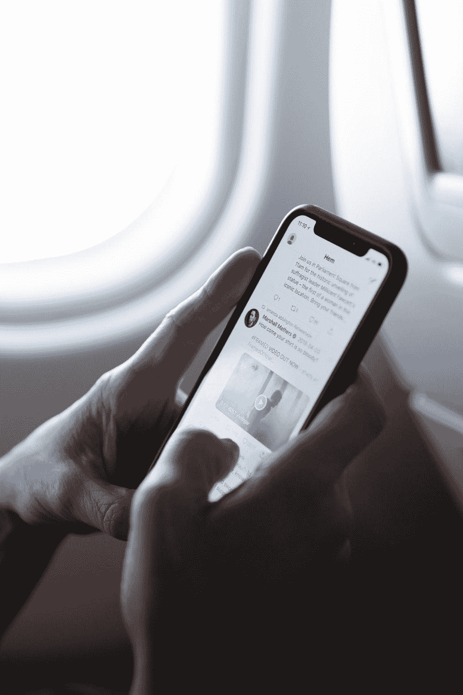
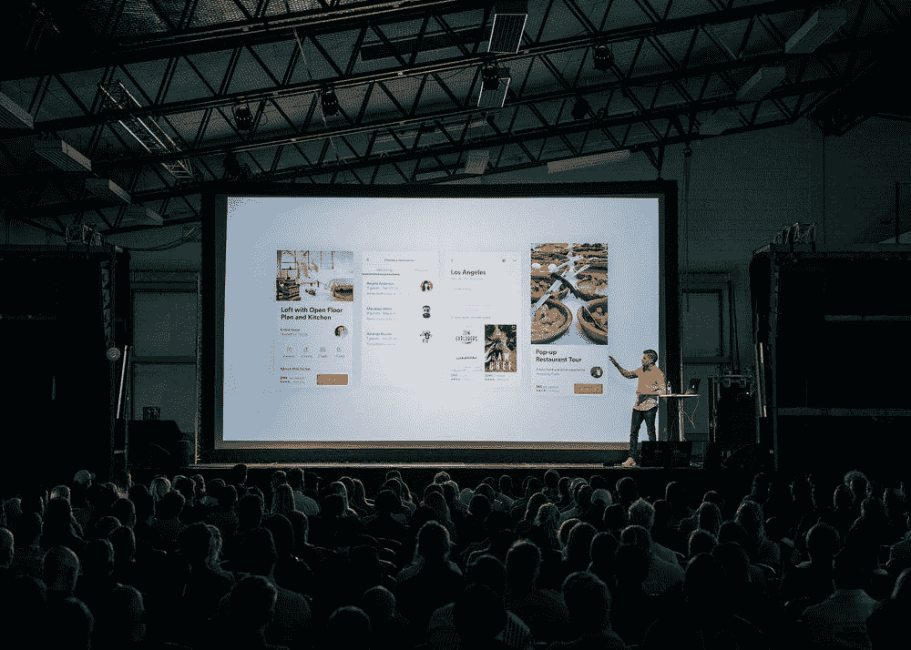
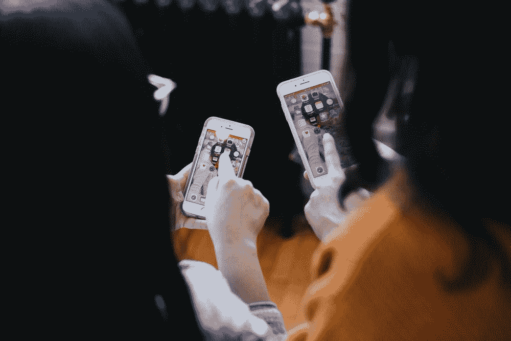

# 好的，坏的，和中立的

> 原文：<https://towardsdatascience.com/the-good-the-bad-and-the-neutral-87c4e94687?source=collection_archive---------42----------------------->

## [意见](https://towardsdatascience.com/tagged/opinion)

## 为 Twitter 情绪分析在当今世界的有用性提供商业案例

[马丁·比约克](https://unsplash.com/@martenbjork)在 [Unsplash](https://unsplash.com/photos/FVtG38Cjc_k) 上的照片

再过几个星期，我们将距离世界卫生组织宣布的全球健康疫情还有一年。毫无疑问，我们不得不适应一系列新的情况，并采取新的做法来确保我们的安全。

我们必须做出的改变之一是取消大型公众集会。新冠肺炎的发作使得人们无法亲自出席音乐会、体育赛事和电影。对于苹果和谷歌这样的公司来说，这意味着他们必须重新考虑如何举办像 WWDC 或谷歌 I/O 这样的活动。通常这些活动将为科技公司提供向特定观众推出新产品的机会，并提供关于他们公司如何处于科技创新前沿的信息。

然而，这些技术会议不仅仅是为了服务观众。现场观众可以提供即时反馈，并让公司判断他们的产品是否受欢迎。在一个新 iPhone 的演示结束后，像苹果这样的公司会为与会者提供演示设备，以检查和测试新功能。如果这款新 iPhone 真的是革命性的，值得谈论，那么我们可能会期待这些特定受众的成员转向社交媒体来分享他们的想法和意见，这使得围绕产品的讨论能够继续进行，并触及更广泛的受众。显然，由于没有现场活动，从活动参与者到更广泛的全球观众的典型信息传递被打破了。

[Teemu Paananen](https://unsplash.com/@xteemu) 在 [Unsplash](https://unsplash.com/photos/bzdhc5b3Bxs) 上拍照

尽管疫情切断了这一信息渠道的面对面部分，但社交媒体的存在和使用在整个 2020 年保持不变(如果不是放大的话)。因此，在这种情况下，社交媒体对产品的反应成为公司获得反馈的主要方式。随着社交媒体成为主要的反馈系统，评估这些社交媒体帖子对其产品的看法变得更加有价值。

# NLP 来救援了！

幸运的是，自然语言处理(NLP)领域将允许科技公司训练和建立一个模型来评估推文的情绪。鉴于我们可能会预计新产品的首次亮相会成为 Twitter 等平台上的热门话题，尽快分析这种情绪符合公司的最佳利益。根据 Twitter 的市场调查，四分之三的用户表示他们会向其他 Twitter 用户寻求更多关于某个话题的信息。Twitter 还从这项研究中发现，90%的用户“改变了对购买的看法，因为他们在 Twitter 上认识的人给了他们建议”。

[优 X 创投](https://unsplash.com/@youxventures)在 [Unsplash](https://unsplash.com/photos/NYMJYXfZG-g) 上的照片

这意味着好的推文可能对公司非常有利，而负面推文可能会损害公司的底线。一个训练有素的模型可以比一群人更快地浏览数千条推文，因此至少它提供了一种有效的方法来衡量社交媒体平台上的普遍情绪。让我们考虑几周前发生在 Xbox 和 Robinhood 身上的事情。

# 金子使人变成怪物。

## 艾琳·鲍曼，复仇之路

2021 年 1 月 22 日，Xbox 决定将 Xbox Live Gold 订阅的价格从每年 60 美元提高到 120 美元(除了 1 个月、3 个月和 6 个月的价格)。推特上和游戏媒体上迅速出现了对这一决定的强烈反对。Techcrunch 的一篇文章将其描述为“试图掩盖一些坏消息”。在疫情期间，视频游戏无疑成了许多人的一种逃避方式，并让人们有了另一种与朋友和家人保持联系的途径。当还考虑到许多个人(其中一些可能是 Xbox 游戏玩家)在疫情期间已经看到工资下降，许多人想知道为什么微软会提高价格。毕竟，当他们刚刚在 2020 年 11 月发布两款新主机时，为什么要提高订阅服务的价格？

可以肯定地说，公众舆论法庭没有做出有利于微软决定的裁决。事实上，在不到 24 小时的时间里，[微软通过 Twitter 宣布，他们“错过了目标”](https://www.gamesradar.com/microsoft-admits-it-messed-up-and-cancels-planned-xbox-live-gold-price-hike/)，它将改变其定价决定。这件轶事的意义是双重的:

*   对微软决定的负面情绪始于 Twitter，随后由知名游戏媒体渠道升级，最终通过 Twitter 结束，微软承认自己目光短浅。
*   提高订阅价格带来的潜在收益并没有超过现有黄金会员退订以及企业贪婪的负面印象带来的潜在损失。

# 你知道吗，罗宾。我只是在想，我们是好人还是坏人？

## ——小约翰，迪士尼的罗宾汉

就在我们看到微软颠覆了它的粉丝群的几天后，Robinhood 应用程序发现自己也在类似的地方。2020 年 1 月下旬，对冲基金决定做空 Gamestop 的股票，认为鉴于视频游戏行业越来越多的数字存在只会使 Gamestop 更难生存，Gamestop 的股价将会暴跌。然而，一些人通过 subreddit r/WallStreetBets 联合起来，决定他们将[与对冲基金交易，并通过购买 Gamestop 股票](https://www.cnn.com/2021/02/02/investing/wall-street-reddit-gamestop-hedge-funds/index.html)来寻求自己的利润。这些人中的许多人转向像 Robinhood 这样的应用程序购买他们的股票。对 Reddit 交易员来说不幸的是，Robinhood 决定停止 Gamestop 股票的交易，从而限制了个人获利的潜力，同时也防止了对冲基金彻底破产。

正如你可能已经猜到的，公众并不喜欢停止交易。Robinhood 因为错误的原因迅速成为 Twitter 上的热门话题，一些用户选择前往 Google Play 商店并对该应用程序留下负面评论。这款应用的评分跌至 1 星。这些评论随后从 Google Play 商店中删除，谷歌认为它们违反了服务条款。尽管如此，社交媒体对罗宾汉决定的反应很可能给他们的声誉留下了不可磨灭的印记。在撰写本文时，[SEC 正在调查罗宾汉停止交易的决定](https://www.barrons.com/articles/sec-is-examining-robinhoods-trading-halts-options-practices-51614370341)，因此社交媒体上表达的负面情绪似乎是未来反响的不祥征兆。

# 那么 NLP 模型有多必要呢？

值得注意的是，即使实现了可以分析和评估 Twitter 情绪的 NLP 模型，它也代表了一种被动的方法。在这种情况下，tweets 表示原始数据，这些数据必须经过转换并输入到模型中。这些推文只能基于公司的行动。对于上面的微软和罗宾汉的例子，该模型将是一个工具，帮助这些公司通知他们的即时和长期决策。看到像这样的模式已经在微软这样的科技巨头中使用一点也不奇怪，特别是当你考虑到他们在不到 24 小时内扭转价格上涨的决定时。我相信，尽管社交媒体情绪分析代表了一种被动的方法，但它仍然非常有价值。大型、盈利性的技术公司关心他们的品牌，并总是希望提高底线，因此情感分析模型的实施是一项值得追求的事业。

为了我在熨斗学校的数据科学训练营的一个项目，我使用 2011 年 SXSW 节日的推文建立了一个 Twitter 情绪分析模型。这与 iPad 2 的发布和社交媒体平台 Google+的发布不谋而合。你可以在这里找到这个项目的数据，这里是我的 [*Github 回购*](https://github.com/jeremy-lee93/nlp-brand-sentiment-analysis) *的链接。欢迎任何反馈！*

感谢阅读！请随时通过 [LinkedIn](https://www.linkedin.com/in/jeremyalee1/) 或 [Twitter](https://twitter.com/jalee93) 与我联系。