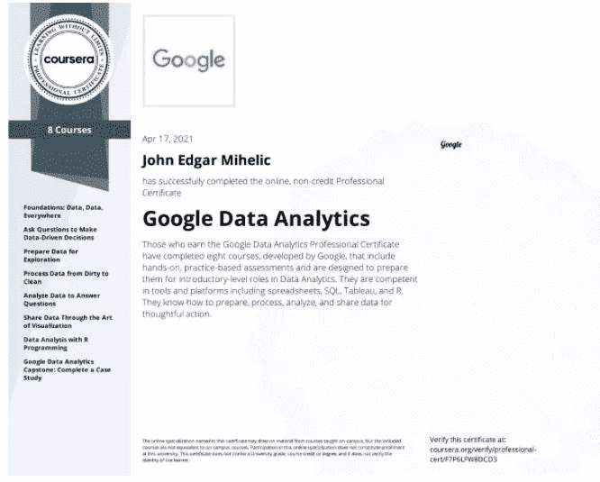

# 谷歌数据分析专业证书:反思

> 原文：<https://towardsdatascience.com/the-google-data-analytics-professional-certificate-a-reflection-5264982365f9?source=collection_archive---------22----------------------->

首先，我需要指出我是一个书呆子。我妻子开玩笑说我“学习是为了乐趣”我一直喜欢学习新东西。

图片由 [StockSnap](https://pixabay.com/users/stocksnap-894430/?utm_source=link-attribution&utm_medium=referral&utm_campaign=image&utm_content=2562325) 来自 [Pixabay](https://pixabay.com/?utm_source=link-attribution&utm_medium=referral&utm_campaign=image&utm_content=2562325)

我也有芝加哥地区学校的 MBA 和经济学硕士学位，但除非你来自你很可能没听说过的地区。当我在攻读经济学学位时，我意识到我缺少一些定量技能，如果我想提高自己的水平，或许申请经济学博士学位，这些技能是我真正需要的。我正在攻读的学位并不像我希望的那样侧重于量化方面，而且这个项目很小，所以没有很多课程。我联系了我的教授，并与一位在 r 做了大量工作的金融学教授成为了朋友。问题是，当你全职工作并上学时，很难积累新技能。

然后我写了一个愿望清单，至今还保存在我工作的电脑上。这是我想学和想做的事情的清单:“学编程；r *；SQL 更优秀；Python？；Stata 重新学习微积分；致力于诗歌。”你可以看到我的兴趣很广泛。我花了一些时间通过约翰霍普金斯大学在 Coursera 上学习 R 课程，但它对我不起作用。我从一开始就喜欢 MOOCS 的想法，但这是我的第一次尝试，课程和课程中的内容与评估的作业之间有太大的差距。没有谷歌，我无法着手解决这些问题，这感觉就像作弊。所以，整个夏天，我只上了几门课程。

但我没有放弃这个列表——我于 2020 年春天毕业，获得了经济学硕士学位，而且有足够的时间，所以我在 Coursera 上又开始了一个序列，这次是从 Excel 中的杜克到 SQL 轨道。我喜欢那份工作，因为它有很多实际操作的工作，而且作业也不会让我觉得自己很笨。唯一的缺点是，这个项目低估了每周课程需要的时间。

我正在学习 SQL 的第四门课程，这时我收到了来自谷歌的电子邮件，说他们正在提供数据分析课程。我登录了他们的网站，看了演示，我知道我想成为其中的一员。这似乎是显而易见的。课程安排是八门课程，可以在六个月内完成，你只需要支付 Coursera 的费用。

Via Coursera

课堂讲授的基本框架是数据分析过程的六个步骤:提问、准备、处理、分析、分享和行动。他们在每堂课和大多数小课堂上都强调这一点。有 bookend 类，但是中间的六个类都只关注其中一个步骤。他们会在课堂上教授一些软件程序。对于电子表格，他们会经过 Google Sheets 的步骤，但他们也会在 excel 中提供详细信息。在可视化过程中，浏览 Tableau 在线版本的步骤。在 SQL 课程中，你可以登录谷歌云平台 Big Query，摆弄可用的数据集，并浏览上传自己的数据。R 中有一个类，带你下载 R and R 工作室，用 ggplot2 创建你自己的精美图表。

总的来说，这些课程对我来说并不难。基于工作和学校的经验，我熟悉他们使用的软件和编程语言。让我能够快速浏览程序。我能在一个月内完成六个月的课程。他们在三月中旬发布了第一批六门课程，在大约三周的时间里，我完成了这些课程。他们直到四月份才发布最后两个课程，R 课程和顶点课程，只花了几天时间就完成了。我能够很快完成，但我确实投入了时间。我看了视频，写了日志。我参加了讨论板，并在 LinkedIn 上与参加该计划的人联系，建立了可能对我未来旅程有帮助的网络([加入我的网络！](https://www.linkedin.com/in/jedgarmihelic/))。评估没有那么难，是选择题，如果你失败了，你可以重考。

你可以从这个过程中获得很多。虽然这对我不是一个巨大的挑战，但我认为我真的从“询问、准备、处理、分析、分享和行动”框架中受益匪浅，因为这基本上是我现有的过程，但它给了你所做的事情一个名字。它也让我对数据分析感到兴奋，当我想了解更多的时候，它给了我很多跳跃的地方。这些课程应该是为初学者设计的，我认为这是可行的。这些视频通俗易懂，没有太多的术语，看起来也很有趣。实践活动不会让你放弃，就像我第一次尝试 R 编程时让你放弃一样。最重要的是，如果你完成了，你的 LinkedIn 和简历上有谷歌，他们有资源可供那些试图往上爬的人使用。对我来说这是值得的，我希望它能让其他人受益。我认为，在我目前的角色中，有很多东西需要我去成长。我很期待接下来的事情。