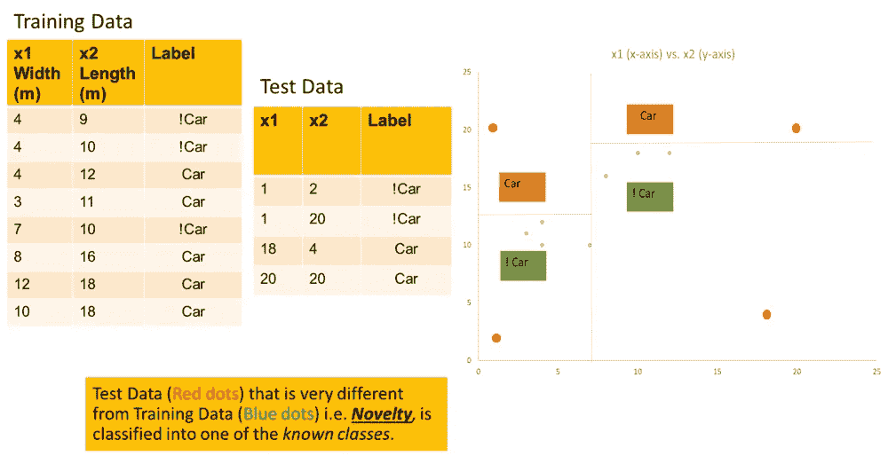
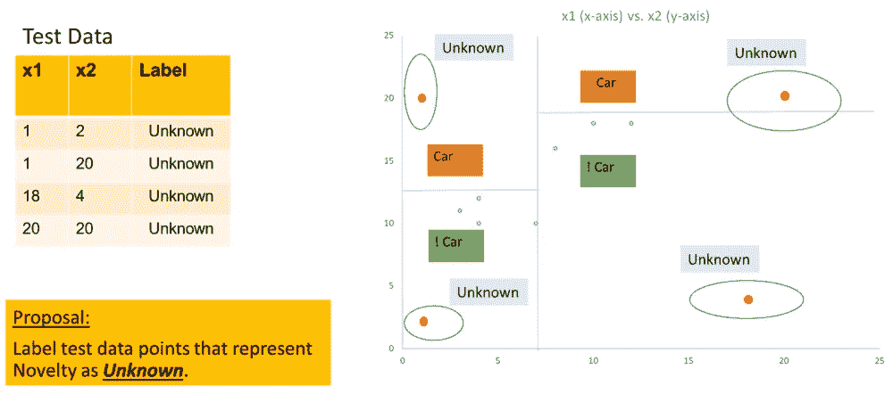

# 机器学习算法(MLA)最难说的是

> 原文：<https://towardsdatascience.com/the-hardest-thing-for-a-machine-learning-algorithm-mla-to-say-1f3d935fbc60?source=collection_archive---------61----------------------->

我不知道(保罗·尼科勒洛在 [Unsplash](https://unsplash.com/s/photos/doubt?utm_source=unsplash&utm_medium=referral&utm_content=creditCopyText) 上拍照)

**摘要:** *在这篇文章中，你将了解为什么机器学习算法很难检测到新奇事物，思考人类如何更擅长于此，找出为什么一些常见的方法达不到要求，并欣赏其好处，如果有一种方法可以让机器学习算法说——我不知道。*

# 思想实验

想象一个思维实验，你试图教一个孩子各种水果，如香蕉、苹果、橘子、西瓜等。你向孩子展示每种水果的一些图片(各种大小和形状)，以确保孩子熟悉这些水果。最后，当你现在给孩子看一个水果时，他能够根据所学的知识正确地识别它。

包含训练数据的水果图片(由[卡玛拉·萨拉斯瓦蒂](https://unsplash.com/@riosamba?utm_source=unsplash&utm_medium=referral&utm_content=creditCopyText)在 [Unsplash](https://unsplash.com/s/photos/apples-oranges?utm_source=unsplash&utm_medium=referral&utm_content=creditCopyText) 上拍摄)

让我们假设这个孩子从未见过狮子或大象的图片，而你现在给一个孩子看这样的图片，并让他辨认出同样的图片。一个可能的结果是，孩子要么很安静，要么说**我不知道**。当然，在某些情况下，孩子可能会把它认作是他最近熟悉的水果之一，但我想这不太可能。

# 处于困境中的 MLA

你认为用机器学习算法(MLA)做同样的实验会产生同样的结果吗？也就是说，MLA 能说**我不知道**或者用机器学习的说法，它能把它归类为新物体还是未知物体？

在这个实验中，MLA 可能会将狮子归类为橙色，因为颜色相似；将大象归类为香蕉，因为象鼻形状相似。

注意，MLA 学习图像中的模式，并将它们与适当的图像标签相关联。

# 可能不起作用的方法

有时候，知道什么行不通和知道什么行得通一样重要。这里有一些我们可能想到的方法，但它们在某个方面存在不足。

*用更多数据进行训练* —虽然机器学习中大多数事情的答案可能是用更多数据进行训练，但这是一个例外。无论您拥有多少数据，总会有一个映像不在分布范围内，即不在培训或测试数据范围内，但在实际部署中会遇到。训练有素的 MLA 仍然不能将脱离分布的对象识别为未知对象。

*引入更多的分类类别* —同样，仅仅通过增加类别并使其成为多类别分类问题并不能自动解决这个问题。尽管分类粒度可能会变得更好，但它并没有解决识别分布外对象的核心问题。

*添加负面类别* —一种方法是添加一堆与目标无关的随机对象，并将所有这些随机对象标记为训练数据中的未知对象。对于我们上面讨论的实验，添加不同的汽车、飞机、动物、鸟、宠物、家具等的图像。并将所有这些标记为未知。这里的问题是负类可以做到多详尽，即可以包括多少随机对象，以及对解决方案的成本和复杂性的影响。

*置信分数*—MLA 可以与它们的预测的置信分数相关联，该置信分数被表示为概率或百分比。例如，新图像可以被分类为置信度为 92 %的橙色。虽然这似乎是一种明智的方法，但请注意，置信度得分是基于在新图像中看到的与 MLA 已被训练的模式的相似度。对于未知的类别，分类模型可能返回非常高的分数，尤其是当这些类别共享共同的模式时。例如，一只狮子可能被归类为置信度为 78 %的橙色，因为在颜色上可能存在相似性。

# 那么什么是可行的方法呢？

让我们通过一个例子来了解可以做些什么。

考虑下面的样本代表性数据，该数据使用两个特征— *宽度* (x1 米)和*长度* (x2 米)将车辆标记为**汽车**或**非汽车**(类别标签)。

x 轴和 y 轴上绘制的表示数据边界的平行线将二维(2-D)空间分割成可以用适当的类别标签标注的区域。请注意，在另一个表中显示并以红色绘制在图表上的测试数据点被给予了它们所在区域的标签，即使它们离以蓝色绘制的训练数据点有相当大的距离。这就是为什么 MLA 会将任何新数据点归类到已知类别，而不是将其称为*未知*。

训练和测试数据绘制在带有分类区域的图表上(来源:youplusai.com)

我们需要的是一种机制来标记 2-D 空间中足够重要的区域，在这些区域中，训练数据没有被看作是未知的。如果这样做了，在这个例子中看到的测试数据点将落入*未知*区域，因此将被标记为*未知*而不是已知类别。

与标记为未知的训练数据相差甚远的测试数据点(来源:youplusai.com)

请注意，上面描述的是一种方法，而不是简单的解决方案。

*在机器学习中识别自己不知道的东西是一个尚未完全解决的难题*。

由于来自 [Aaron Chavez](https://twitter.com/aaron_j_chavez) 的参考，我在这个主题上读到的一篇有趣的研究论文的标题是— [*深度学习中的不确定性量化是否足以进行非分布检测？*](http://ceur-ws.org/Vol-2640/paper_18.pdf) 在本文中，作者就深度神经网络检测新输入的能力，比较了几种最先进的不确定性量化方法。总之，他们指出，目前的不确定性量化方法本身不足以进行全面可靠的分布外(与训练数据明显不同的数据)检测。

# 好处

在基于机器学习的解决方案的实际生产部署中，这种将非分布数据即*新颖性*作为*未知*类调用的能力可能有几个好处。

*   *小说*数据误分类的规避。
*   效用——在很难获得完全有代表性的训练数据的领域。
*   警报—如果被分类为*未知*类别的数据输入的百分比超过了设定的阈值(比如总分类输入的 10%)，则可能会发出警报。
*   再培训—如果大量数据输入被归类为*未知，则可能触发再培训。*

由于对数据科学的浓厚兴趣，我将在这个领域探索更多的主题。如果你对这样的努力感兴趣，请加入我的旅程，在推特上关注我，订阅 YouTube 频道。

非常感谢[*Madhusoodhana Chari*](https://www.linkedin.com/in/madhucharis/)*的宝贵反馈。*

*最初发表于*[*youplusai.com*](https://youplusai.com/hardest-thing-mla/)