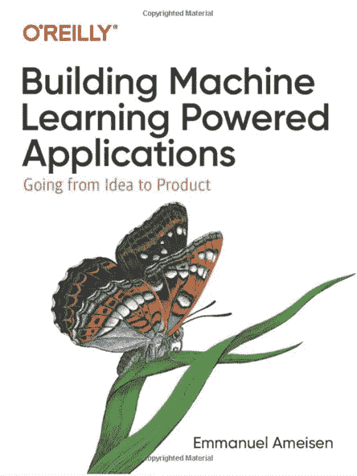
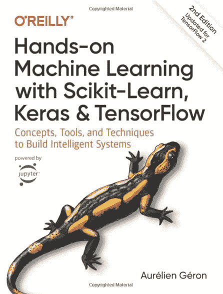

# “你好，世界！”ML 陷阱

> 原文：<https://towardsdatascience.com/the-hello-world-ml-trap-1cae6dccdf98?source=collection_archive---------55----------------------->

查尔斯·埃托罗姆在 [Unsplash](https://unsplash.com?utm_source=medium&utm_medium=referral) 上拍摄的照片

## 人们很容易被诱惑去做没完没了的*肤浅* ML 模型——不要回避深水区

# 介绍

机器学习的领域如此广阔，以至于很容易迷失其中。我学习机器的头几个月是在泳池的浅水区四处溅水，甚至没有意识到我在浅水区。我在那里结束的方式是通过文章和博客帖子的示例项目工作，并不断地转到下一个项目，展示不同风格的 ML。

简单的样本项目没有任何问题——典型的“Hello World！”project 是学习计算机科学新知识的悠久传统。但重要的是继续前进，并向池的更深处移动，看看行业领先的专家目前正在为值得生产的模型做些什么。

# 书

照片由 [Aaron Burden](https://unsplash.com/@aaronburden?utm_source=medium&utm_medium=referral) 在 [Unsplash](https://unsplash.com?utm_source=medium&utm_medium=referral) 上拍摄

先说房间里的大象:*书籍*。在一篇文章或 YouTube 视频中，不可能超越一定的深度。需要一本书来真正深入并详细阐述一个主题。本书要求读者清除*TL；DR* 的障碍——但是奖励他们的知识可以将一个 ML 模型带到一个全新的水平。

通读一本 ML 书籍需要奉献精神，这类似于为你的公司处理一个新项目。我发现买书比卷起袖子实际阅读要容易得多。我发现让自己保持动力的一个方法是在 *Azure* 中把每本书都设置成一个项目，并使用*看板*来跟踪我每章的进度。从 ***接任务到>做- >完成*** 绝对有一种极客的快感！

# 走在路上

我通常给自己几个星期的时间来完成一本书，有时一次做多本书(把东西混在一起)——但从来不会杂耍太多以至于丢失每本书的中心线索。我反复考虑是否要实际输入示例中的代码——我过去更热衷于这样做，最近我发现通过从 *GitHub* 下载代码，并和书一起阅读，我也能从中获得同样多的收获。对我来说最重要的部分是让每个模型运行起来，这样我就可以在 ML 项目中根据需要重用它们。

以下是我最近一直在研究的一些具体建议。他们都是我在 ML 书籍中寻找的例证:深厚的专业知识和值得生产的代码，以及大量 ML 项目生命周期的态度！

https://www.amazon.com/gp/product/149204511X

【https://www.amazon.com/gp/product/1492032646 

# 喜欢什么？

我喜欢上面两本书的地方在于，它们分享了一种实用的方法来构建 ML 解决方案。它们基于对 ML 特定领域的深入了解，并鼓励读者也深入了解。

我在每本书里增加了一些相关的文章、视频和在线课程——这些杂耍可以给有时看起来令人生畏的练习增添许多色彩。但是在一天结束的时候，我发现我在每一章中花的时间越多——并且真的把它放在心上——我带走的东西就越多。把它当成一项长期投资，在未来会不断获得回报。

# 结论

乔·奇恰雷利在 [Unsplash](https://unsplash.com?utm_source=medium&utm_medium=referral) 上拍摄的照片

*   **深入**
*   **看书**
*   **寻找成功秘诀**
*   **描绘终点线**

当你在 ML 泳池里嬉水并找到一个让你兴奋的地方后，不要犹豫，去深水区吧！找一本专注于你感兴趣的领域的书，并努力读完它——用类似的文章和博客丰富你的经验。

从别人的错误中可以学到很多东西——找到真正适合你的成功秘诀，并将它们作为你下一个项目的模板！

试着想象一下你正在开发的 ML 模型是如何插入到生产系统中的。退后一步，挑战自己，不要仅仅孤立地看待模型，而是要在为客户提供端到端解决方案的背景下看待它。你能想象一个能让客户满意的完整渠道吗？