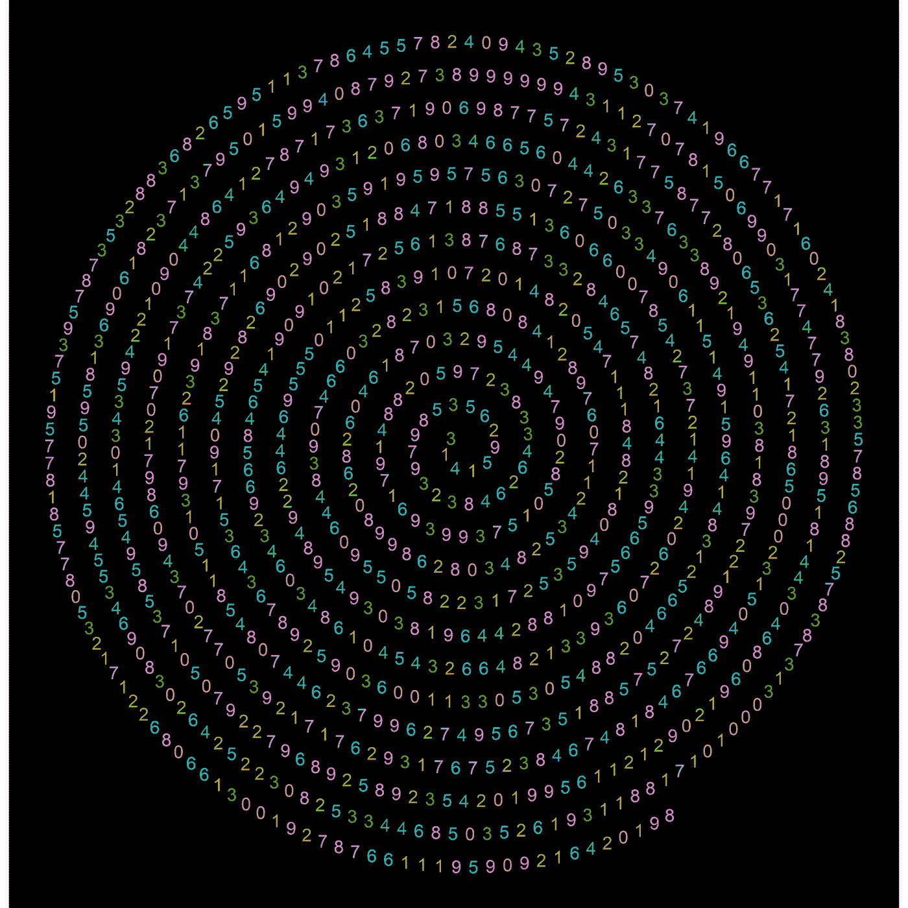
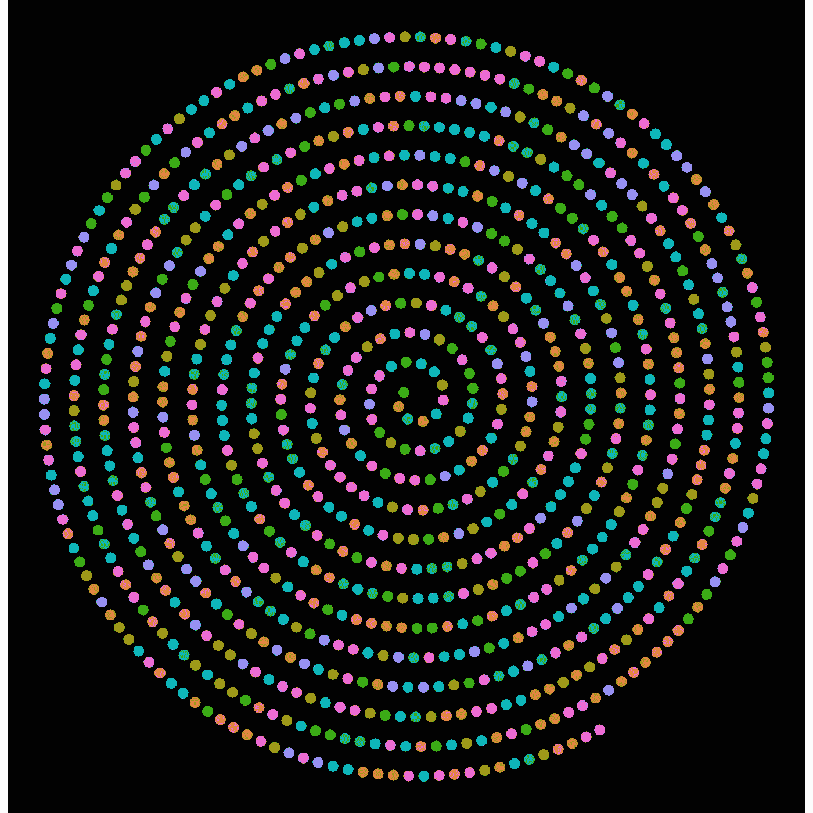
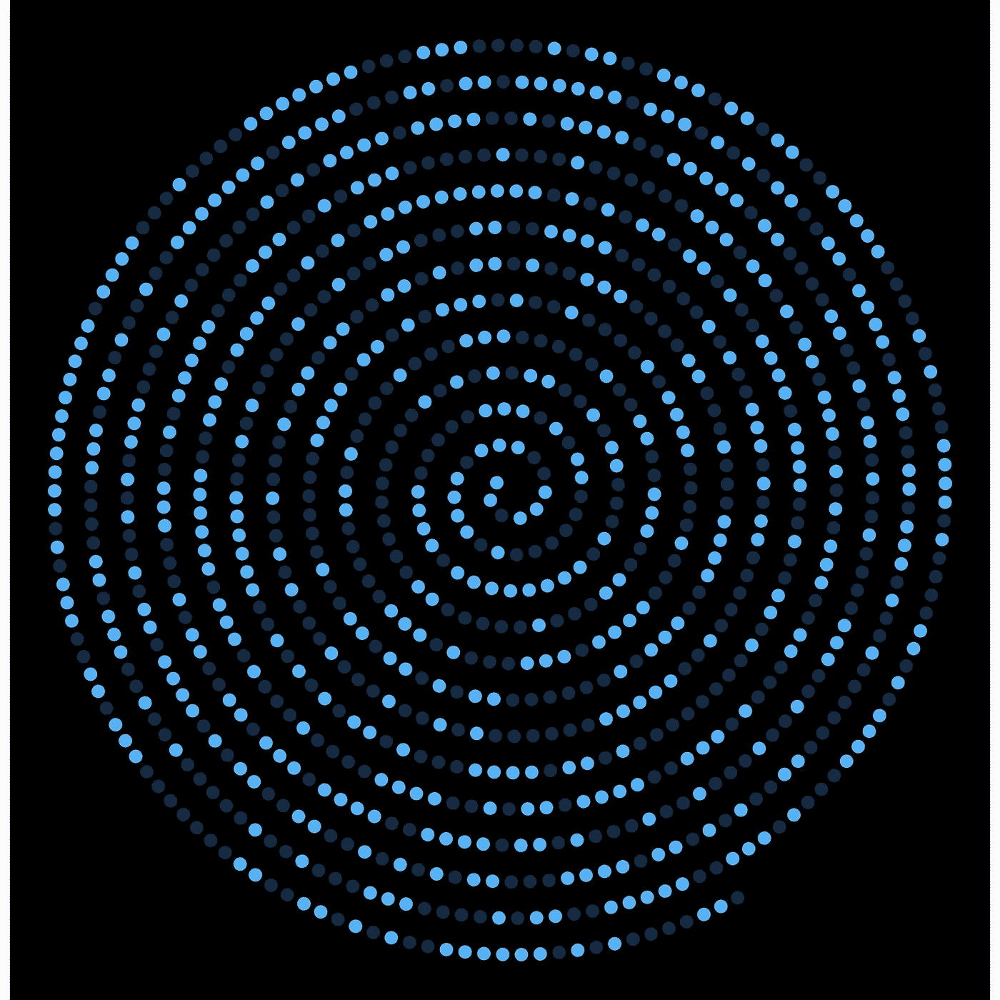
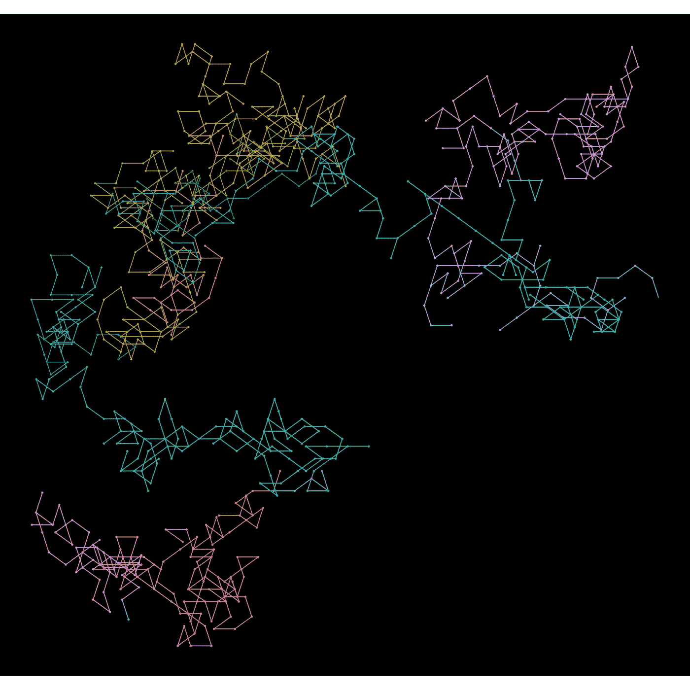
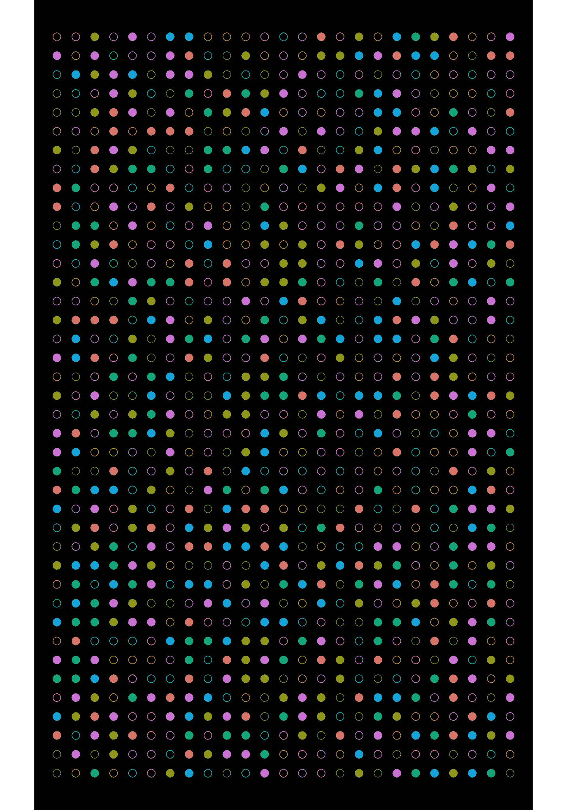
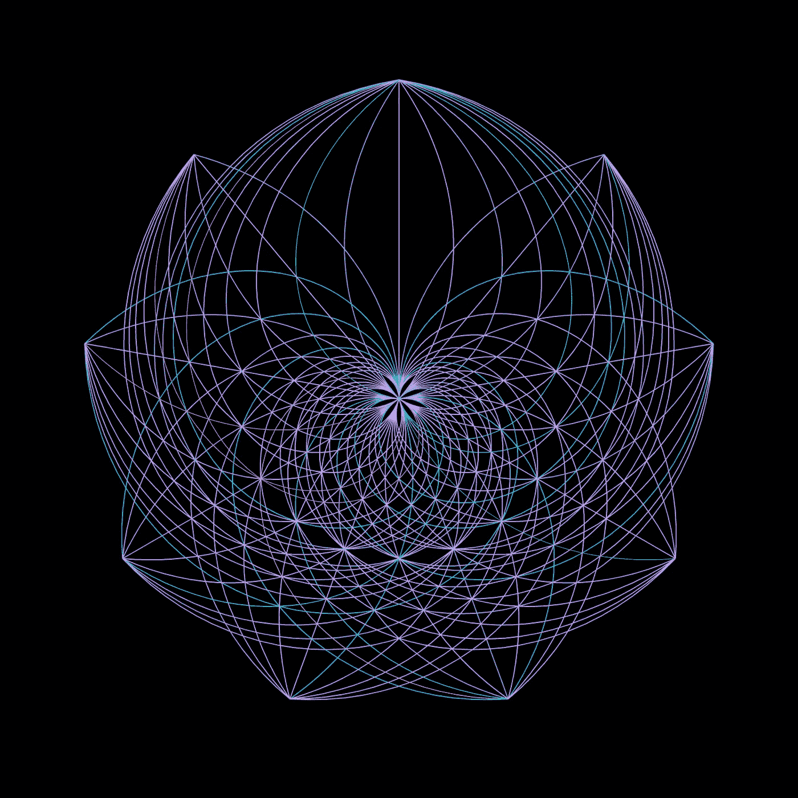

# 圆周率的隐藏之美

> 原文：<https://towardsdatascience.com/the-hidden-beauty-of-pi-a694422a0740?source=collection_archive---------16----------------------->

## 在圆周率日用圆周率的前 1000 位数字制作的图像。

照片由[谢里·西尔弗](https://unsplash.com/@sheri_silver?utm_source=medium&utm_medium=referral)在 [Unsplash](https://unsplash.com?utm_source=medium&utm_medium=referral) 上拍摄

3 月 14 日是阿尔伯特·爱因斯坦的生日，它有着特殊的意义。这一天还有一个奇怪的变化，它被写成 3.14，是圆周率常数的近似值，这一天被官方庆祝为 **π** 日。人们通常通过烘烤或吃馅饼来庆祝这一天。

数学常数是通过取圆的周长与其直径之比来计算的。2019 年，谷歌员工艾玛·相户爱 Iwao 通过将圆周率的值计算到 31 万亿位，打破了吉尼斯世界纪录。计算出的精确位数是 31，415，926，535，897(见相关关系)。使用 25 台虚拟机执行计算大约需要 121 天。

出于实际目的，我们不会使用精确到万亿分之一位的精度。在实际情况下，pi 近似值可能会限制到小数点后第 5 位，因为近似值导致的误差将趋于零。美国国家航空航天局局长兼首席工程师解释了美国国家航空航天局工程师使用的圆周率常数的精确度，精确到小数点后第 15 位。

那么，圆周率的这许多位数有什么用呢？有创造力的头脑发现了圆周率数字在数据艺术中的用途，这使得无穷级数变得有限，并被限制在数字画布上。这里是我在 R 中复制的一些马丁·克日温斯基创造的圆周率艺术。

为了创造视觉效果，我考虑了圆周率的前 1000 位。

## 圆周率螺旋上升

在这个画面中，圆周率从圆心开始，向外盘旋。第一个图像具有沿着螺旋轨迹绘制的 1000 个 Pi 数字，这些数字在第二个图像中变成点。每个数字都用一种颜色表示。在第三个可视化中，螺旋用偶数和奇数进行颜色编码。

作者图片

作者图片

作者图片

## 带 Pi 的随机游走

对于随机漫步，数字 0 到 9 被分配了方向，当数字出现在圆周率近似值中时，光标向相关方向移动一个单位，从而创建了一个漂亮的再现。

作者图片

## 船上码头

圆周率的数字用颜色编码，奇数用空心点表示，偶数用实心点表示。

作者图片

## Pi web

这是马丁·克日温斯克复制圆周率艺术的失败尝试，但产生了圆周率可视化的不同版本。为提出了一个全新的视觉效果而感到自豪(还没有见过这样的视觉效果)。

作者图片

这是我在数据科学之旅中急需的一次休息。我可以称之为突破，尽管我仍然使用了 ggplot2 包和所有可能在分析中使用的数据操作技术。这里的结果要漂亮得多。

我相信你们喜欢 Pi 的视觉效果。当你们厌倦了处理数据时，你们会做什么？分享你的激情？在下面的链接中查看更多酷炫的视觉效果。

## 寻找灵感:

1.  https://www . vice . com/en/article/qkwdbp/visualizing-the-infinite-data-of-pie
2.  https://www.visualcinnamon.com/portfolio/the-art-in-pi/
3.  【https://public.tableau.com/shared/QJ5PHW26D? :display _ count = yes&:show viz home = no

## 参考资料:

1.  [https://blog . Google/products/Google-cloud/most-calculated-digits-pi/](https://blog.google/products/google-cloud/most-calculated-digits-pi/)
2.  [https://fivethirtyeight . com/features/even-after-31 万亿-was-behind-no-closer-the-end-of-pi/](https://fivethirtyeight.com/features/even-after-31-trillion-digits-were-still-no-closer-to-the-end-of-pi/)
3.  [https://www . JPL . NASA . gov/edu/news/2016/3/16/how-many-decimals-of-pi-do-we-really-need/](https://www.jpl.nasa.gov/edu/news/2016/3/16/how-many-decimals-of-pi-do-we-really-need/)

链接到[代码](https://github.com/amalasi2418/Blog-post/tree/master/Pi%20day)。

您可以在 [LinkedIn](https://www.linkedin.com/in/abhinav-malasi/) 和 [Twitter](https://twitter.com/malasi_abhinav) 上与我联系，跟随我的数据科学和数据可视化之旅。