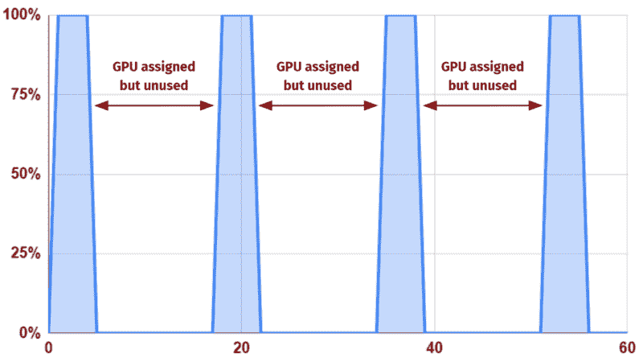
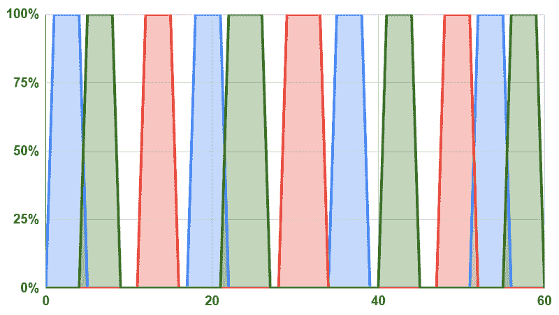

# GPU 低效的隐藏世界

> 原文：<https://towardsdatascience.com/the-hidden-world-of-gpu-inefficiency-776ae1c9cf5?source=collection_archive---------36----------------------->

## 一种重要、强大、珍贵的资源大多处于闲置状态。为什么？

在 [Unsplash](/s/photos/sleeping-lion?utm_source=unsplash&utm_medium=referral&utm_content=creditCopyText) 上[Duan veverkolog](https://unsplash.com/@veverkolog?utm_source=unsplash&utm_medium=referral&utm_content=creditCopyText)拍摄的照片

*就像一头沉睡的狮子，我们已经使用的图形处理器比看起来要强大得多*

本文是三篇系列文章中的第二篇。这里有 [*1*](https://medium.com/swlh/the-crisis-in-computing-how-a-looming-processing-pinch-could-make-or-break-the-global-economy-856956756df4) *和* [*3*](https://medium.com/geekculture/gpu-should-be-as-effortless-as-electricity-a7613df102d7) *。*

在 [的上一篇文章](https://medium.com/swlh/the-crisis-in-computing-how-a-looming-processing-pinch-could-make-or-break-the-global-economy-856956756df4)中，我们探讨了近期的业务转型如何受到 GPU 供应紧张的威胁。我们知道 GPU 是新兴技术的关键资源，费用已经成为许多组织的瓶颈，GPU(和相关新兴芯片设计)的需求和供应方面的宏观趋势都指向严重短缺。

然而[*超过 85%的 GPU 总容量闲置*](https://www.nextplatform.com/2020/11/17/counting-the-cost-of-under-utilized-gpus-and-doing-something-about-it/) *。*对于使用 GPU 的公司来说，这不仅在财务上非常低效，而且从环境角度来看也非常令人震惊— [全球计算的大部分排放、有毒化学物质和水消耗都是由制造过程造成的](https://www.sciencedaily.com/releases/2021/03/210302185414.htm)，如果我们能够以更少的资源做更多的事情，所有这些都会大幅减少。我们当然不会容忍我们生产的 85%的汽油被浪费掉。那么为什么我们会容忍 GPU 被如此低效的使用呢？

简短的回答是:因为(目前)我们几乎没有选择，由于我们如何将软件应用程序连接到他们需要的 GPU 的现状约束。

## GPU 已经被排除在分解和虚拟化趋势之外

几十年来，计算的趋势已经从集中式系统转向分散式服务。虚拟机、网络连接存储、软件定义的网络、容器—所有这些都促使当今的计算环境比以往任何时候都更加灵活和高效。

但是，尽管加速器在现代数据中心的重要性不断上升，GPU 却像一个疼痛的拇指一样突出，在其配置中保持顽固的静态。

## PCIe 皮带的物理束缚

当然，有一些复杂的因素在起作用，但有一个主要的限制迫使我们进入这种不灵活的模型:运行 GPU 密集型应用程序的操作系统通过一种称为外围组件互连快速(Peripheral Component Interconnect Express，简称 PCIe)的高吞吐量连接与 GPU 紧密相连。

简单来说，应用程序向其 GPU 发送大量数据。发送的数据类型在很大程度上取决于用例(纹理、网格、图形的命令缓冲区、机器学习的训练数据集等)。)，但一般来说，用网络术语来说，GPU 必须非常“接近”运行应用程序的操作系统(通常在同一台物理机器内)，从而使操作系统环境与 GPU 保持物理联系，通常是一对一的联系。

## 峰值工作负载和自私的利用率

当一个组织问“我们的 GPU 性能如何？”，他们可能会运行 GPU 基准测试。但基准测试旨在将 GPU 推向最大利用率——它们能告诉你的只是最佳情况下的性能场景。这就像你的汽车在下坡滑行时测量每加仑汽油的英里数一样——有趣，但不代表现实。你真正需要知道的是你在真实环境下行驶了多少英里。

正如我们在上一篇文章的[中提到的，在 GPU 上运行的大多数计算工作负载的真实环境非常“尖锐”——它们使用大量 GPU，然后做一段时间其他事情，然后回来要求 GPU 再次努力工作，然后再做一段时间其他事情。](https://medium.com/swlh/the-crisis-in-computing-how-a-looming-processing-pinch-could-make-or-break-the-global-economy-856956756df4)

一分钟内真实的 GPU 利用率模式可能如下所示:

大量空白=低利用率

因此，一个组织可能知道其 GPU 的*最高*性能，并且可能知道 100%的*数量*的 GPU 都在使用中。不太明显的是，每个单独的 GPU(平均而言)的运行效率低于 15%，因为它被一个物理上受限制的操作系统实例“自私地”使用，该实例呈现出一种峰值利用率模式。

**这就是 GPU 低效的隐藏世界。**

停下来思考一下这其中的含义:

出于某种目的，您的企业决定通过 GPU 在高性能计算方面进行重大(几乎肯定会不断增长)投资，无论是图形(可能是视频游戏开发或动画)还是纯计算(可能是深度学习)，并且已经购买或租赁了内部部署的 GPU 硬件，正在从云提供商处租赁，或者两者兼而有之。

但是，理所当然的现状自私的操作模式，通过物理束缚的一个操作系统实例到一个 GPU 模型服务的尖峰工作负载，*导致 85%的投资被浪费。*

## 今天，提高利用率的尝试非常有限

当然，有一些现有的提高 GPU 效率的策略，如果我没有提到它们，那将是我的失职。这里有助于对*分割*和*共享*进行关键区分:

**分割:**将 GPU 容量分割成更小的独立块(如 [MIG](https://www.nvidia.com/en-us/technologies/multi-instance-gpu/) )和/或预定时间块(使用类似 [Slurm](https://slurm.schedmd.com/overview.html) 的编排系统)，每个块仍然一次只能由一个消费客户端使用。

分割根本不能解决自私的问题——任何给定的块仍然会经历峰值利用率。

**共享:**共享 GPU 容量，以便多个消费客户端同时使用，客户端的工作负载在同一个共享 GPU 区块内重叠。

Nvidia 的 [vGPU](https://www.nvidia.com/en-us/data-center/virtual-solutions/) 可以做到这一点，但所有消费客户端都必须是与 GPU 位于同一物理机上的虚拟机，这也是物理共享问题，它严重限制了池的大小，从而影响了 GPU 的利用率。

## “真正的”GPU 共享填补了峰值，并提高了利用率

想象一下“真正的共享”——允许许多客户端系统远程和同时访问许多 GPU 块，当它们的工作负载达到峰值时，块的利用率高达 100%，但在需要时，将全部 GPU 容量留给其他客户端的峰值。像这样:

空白少=高利用率

就像我们的电网通过在一个广阔的区域汇集提供商和消费者来平衡容量，而不是在每个街区都建立一个发电站，极大地扩展客户端(GPU 的消费者)和服务器(GPU 的提供商)的池使给定的工作单元更有可能由合适大小的硬件单元来服务，让我们有效地匹配供应和需求。

由虚拟或物理 GPU 服务器(绿色)动态服务的大量虚拟或物理客户端(蓝色)

在这个世界中，GPU 加速看起来更像是一项简单的服务，甚至是一个实用程序，最重要的是，它的利用率接近 100%。

实现这一愿景需要两大飞跃。

首先，我们必须挣脱 PCIe 的束缚。尽管出现了增加 PCIe 范围以扩展池的解决方案，但池仍然是有限的，而且这些解决方案需要额外的专用昂贵硬件，并且不适合许多环境。

因此，第二，我们需要我们的解决方案是纯软件的。通过这种方式，我们可以针对任何加速器用例，在任何操作系统、任何设备和任何环境中无处不在地部署它，而不必担心太多的细节。与通过提高利用率创造的巨大价值相比，纯软件方法还可以轻松测试、轻松交付，并以较低的成本出售，因此各方都是赢家。

我们正在实现这两个飞跃。在我的下一篇文章中，我将解释这是如何做到的。

*史蒂夫·戈利克是* [*果汁实验室*](https://www.juicelabs.co/) *的联合创始人，这是一家初创公司，其愿景是让计算能力像电力一样容易流动。*