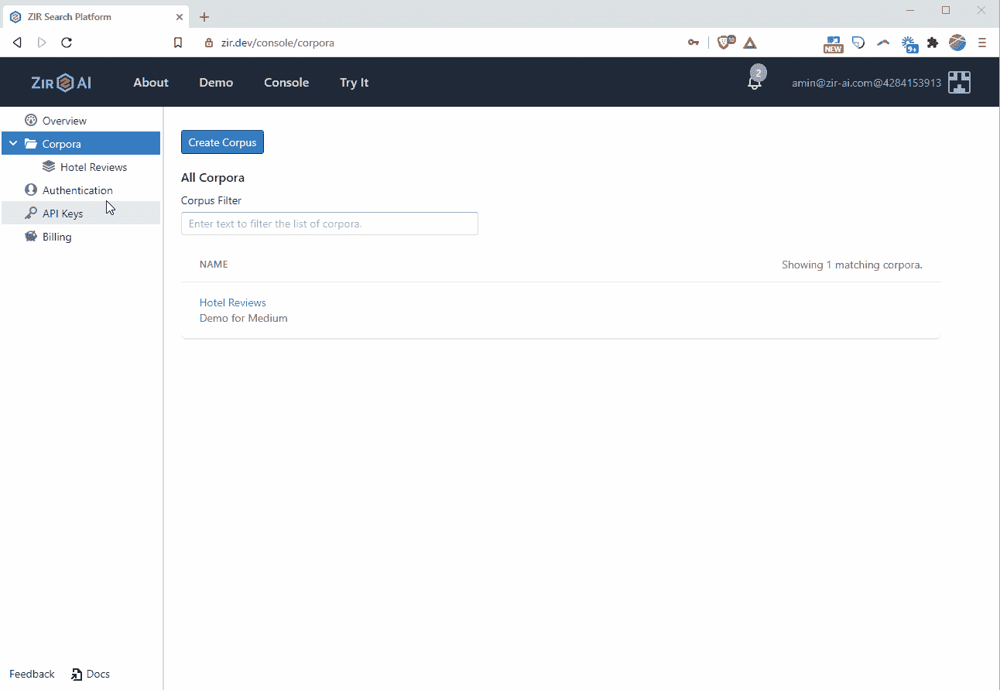
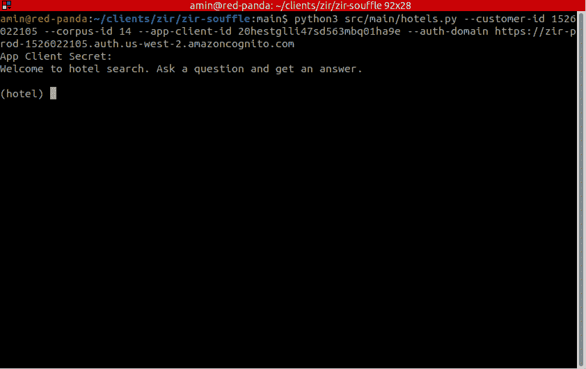

# 关键词搜索的高成本

> 原文：<https://towardsdatascience.com/the-high-cost-of-keyword-search-9b147d4b2452?source=collection_archive---------24----------------------->


艾米丽·莱文在 [Unsplash](https://unsplash.com?utm_source=medium&utm_medium=referral) 上拍摄的照片

## *基于深度神经网络的语义搜索正在改变信息检索。*

当大多数计算机科学家想到信息检索时，像 TF-IDF 和 BM25 这样的统计关键字算法可能会出现在脑海中。这些都部署在开源系统中，比如 Apache Lucene 和 Apache Solr。关键词搜索的云版本可以从 Elasticsearch 和 Algolia 等公司获得。

你可能不知道的是，自然语言处理(NLP)的进步，特别是 2017 年变形金刚的推出，已经带来了一种新的信息检索风格，被称为*神经信息检索*(简称神经 IR)和*语义搜索*。这些系统的定义特征是，它们应用神经网络在比关键字搜索更深的层次上理解语言。这使他们能够呈现更广泛的相关内容，同时更精确地显示结果。

神经信息检索系统还处于起步阶段，如果你有兴趣深入了解这个领域，我推荐 Mitra 和 Craswell 的[神经信息检索导论](https://www.microsoft.com/en-us/research/uploads/prod/2017/06/fntir2018-neuralir-mitra.pdf)。[2020 年初发布的亚马逊 Kendra](https://aws.amazon.com/kendra/) 是这种系统的第一个商业例子，而[2021 年 4 月发布的微软语义搜索](https://docs.microsoft.com/en-us/azure/search/semantic-search-overview)和 [Vectara 神经搜索](https://vectara.com/)则更近一些。

# 目标

在本文的其余部分，我们将构建一个针对一小部分
酒店评论的搜索。我将使用 Vectara 的神经搜索平台，因为它旨在轻松、经济地集成到 SaaS 和 PaaS 产品中，并且具有跨多种语言索引和搜索内容的独特能力。

你可以从 GitHub 下载这篇教程的源代码，网址是 [amin3141/zir-souffle](https://github.com/amin3141/zir-souffle) 。

# 酒店评论集

[OpinRank 数据集](https://github.com/kavgan/OpinRank/)包括来自全球主要城市的大量酒店评论。出于演示的目的，我们将对旧金山三家评论最多的酒店进行搜索:贝斯特韦斯特托斯卡纳酒店、喜来登渔人码头酒店和威斯汀圣弗朗西斯酒店。

数据文件具有简单的制表符分隔格式。第一列是审查的日期，第二列是标题，第三列是实际文本:

```
Nov 16 2009 The Prefect Hotel Have visited San Francisco several times and this…
Nov 15 2009 Great location and great hotel My friend and I…
Nov 13 2009 Perfect experience This hotel was perfect. It was a brilliant location…
```

首先，我们将每个评论分离到它自己的 JSON 文档中，并保存为一个单独的文件。我们将包括酒店的名称和评论的日期作为元数据(Vectara Neural Search 自动返回元数据和搜索结果。)

```
{
 “documentId”: 1036995557631769528072025822232699890,
 “metadataJson”: “{\”date\”: \”Apr 23 2005\”, \”hotel\”: \”best_western_tuscan_inn_fisherman_s_wharf_a_kimpton_hotel\”}”,
 “section”: [
 {
 “text”: “We spent six nights at the Tuscan Inn and have nothing but rave reviews for this hotel! The location was perfect. Walking distance to Cable Cars,Wharf, Bus 47 and F Line. Great restaurant with a friendly staff. Everyone was pleasant and very helpful. Nice clean rooms and a spaciousbathroom. We are anxious to return!Mary and Jack from Scituate MA”
 }
 ],
 “title”: “Great Hotel”
}
```

文档 ID 是全文审查的 [murmur3 x64 128 位哈希](https://en.wikipedia.org/wiki/MurmurHash#MurmurHash3)。当返回搜索结果时，会包含这个 ID，这使得查询系统可以轻松地检索整个文档。为了便于查找，
[opinrank2json.py](https://github.com/amin3141/zir-souffle/blob/main/src/main/opinrank2json.py) 程序实现了这个逻辑，它还创建了一个 SQLite 数据库，包含文件中的所有评论，以文档 ID 为关键字。

# 索引数据

就像 Algolia 和 Elasticsearch 这样的关键词搜索系统一样，你必须将你想要搜索的内容推送到平台中，这样它才能被索引。Vectara Neural Search 为此提供了基于 gRPC 的 API，以及支持快速原型制作的基于 UI 的拖放。

1.  [登录您的账户](https://zir-ai.com/login)。
2.  使用左侧菜单导航到语料库，并创建一个名为“酒店评论”的新语料库。语料库只是一个命名的文档和文本材料的集合，可以在以后查询。
3.  点击并打开酒店评论语料库。将包含评审 JSON 文档的文件夹拖放到语料库中。


登录您的帐户并上传客户评论。

在添加后的 5 到 10 分钟内，文档将变得可搜索。您可以通过在 Hosted UI 选项卡上运行查询并检查是否返回结果来验证这一点。

# 安全性

因为对平台的所有访问都是经过认证的，所以我们需要一个有效的用户来连接和运行查询。现在，为了方便起见，我们将使用 OAuth 2.0 客户端凭证流。通常，只有当客户端在受信任的环境中运行，并且凭据可以保持安全时，例如在运行的服务器中，才应该使用此流程。



创建一个应用程序客户端，并授权它读取*酒店评论*文集。

1.  使用左侧菜单，导航至认证→ [应用客户端](https://zir-ai.com/console/authentication/appclient)，并点击“创建应用客户端”按钮。
2.  为其命名(例如 hotels-cli)，将类型设置为客户端凭据，并输入任何用于回叫和注销的 URL(例如 https://auth.vectara.dev)。注意*客户端 id* 和*客户端秘密*，因为在连接和运行查询时都需要它们。
3.  点击返回语料库，点击*授权*选项卡，点击“创建角色”按钮。选择您在第二步中创建的应用程序客户端，并授予它查询语料库的权限。

# 语义搜索 CLI

信息检索的神经方法围绕着单词、句子和段落的矢量化。神经网络是以短语作为输入并产生高维向量作为输出的数学函数。这些向量以这样的方式表示短语的语义，即具有相关语义的短语共享向量空间中的几何结构。这些向量经常被称为*嵌入*。

由于这种抽象的性质，神经系统对拼写错误
和其他丢掉关键字系统的错别字是健壮的。相比之下，为了获得好的结果，关键字系统通常必须配置停用词移除、词干提取和拼写纠正。

为了使教程简单，我们将构建一个基于 Python 的命令行解释器，它接受查询并返回我们之前添加的客户评论中的最佳匹配结果。Vectara 神经搜索在每个结果中返回以下信息:

1.  文档 ID 和元数据。客户端使用该信息将结果连接到原始信息源，并在上下文中显示它。我们将使用文档 ID 来查找并显示完整的评论。
2.  相关片段。一个文档通常包含许多主题，因此搜索结果包括它认为最相关的部分。一般来说，在向用户显示这个代码片段时，显示一点周围的文本是有帮助的。
3.  一分。分数是与搜索结果的可信度相关的实数。重要的是，这个分数是*而不是*一个校准的概率，所以应该谨慎解读。然而，它可以安全地用于下游机器学习模型，如重分类器。

我已经在 [hotels.py](https://github.com/amin3141/zir-souffle/blob/main/src/main/hotels.py) 中实现了一个完整的客户端。下面的代码展示了如何使用[请求](https://pypi.org/project/requests/)库提交查询。

# 探索语义搜索

下面的动画 gif 展示了一个交互式语义搜索会话。第一个问题“房间宽敞吗”的结果表明，搜索理解单词*宽敞*的语义，因此可以返回类似“唯一的缺点是房间大小”的结果。

第二个查询询问“附近的餐饮”，搜索能够返回相关结果*，而没有*关键字重叠，例如“Alos[原文如此]，邻近餐馆的食物非常好！”



通过 hotels.py 命令行解释器运行三个查询。

最后，第三个查询故意拼错了一个关键词，“早餐自助”，但搜索仍然返回了*自助早餐*甚至*自助早餐的结果！*

# 结论

大量的研究已经证实了相关性在吸引和满足用户方面的重要性。例如，微软 2012 年的一项研究[展示了相关性降低和用户参与必应搜索的长期减少之间的因果联系。众所周知，谷歌在搜索结果排名中超越了关键词，加入了关于网页链接结构的信息，从而战胜了 Alta Vista、Lycos 和其他公司。](https://www.microsoft.com/en-us/research/wp-content/uploads/2016/02/pe072-songPS.pdf)

无论你的目标是提高用户参与度，或者你只是想帮助你的用户快速找到最相关的信息，你每天都要以丢失和不相关的搜索结果的形式支付关键字搜索的高成本。各种各样的应用程序，如电子商务、客户支持、企业搜索和法律电子发现，都将从语义搜索技术的出现中受益，语义搜索技术有望重塑信息检索的格局。