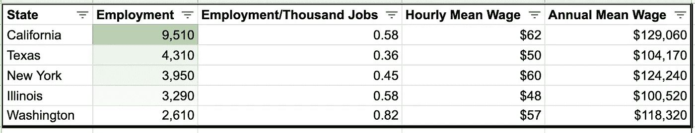
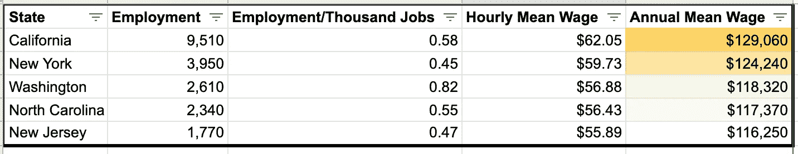

# 关于数据科学的最高工资，美国劳工统计局的数据能告诉我们什么？

> 原文：<https://towardsdatascience.com/the-highest-data-science-salaries-ef495645911a?source=collection_archive---------18----------------------->

## 深入探讨各州的数据科学就业水平和薪酬


[Jp 瓦列里](https://unsplash.com/@jpvalery?utm_source=unsplash&utm_medium=referral&utm_content=creditCopyText)在[Unsplash](https://unsplash.com/s/photos/cash?utm_source=unsplash&utm_medium=referral&utm_content=creditCopyText)【1】上的照片。

# 目录

1.  介绍
2.  就业水平
3.  州工资明细
4.  摘要
5.  参考

# 介绍

数据科学薪资各州不同，行业不同。本文讨论的职业、就业和工资统计数据来自美国劳工统计局。无论您是在计算机系统设计和相关服务行业，还是在公司和企业的管理层，您都可以期待数据科学的工资是劳动力中最具竞争力的工资之一。下面，我将分析某些州的就业水平，以及这些州的工资，同时也指出一些可能影响你总税后工资的关键因素。

# 就业水平


由 [Toa Heftiba](https://unsplash.com/@heftiba?utm_source=unsplash&utm_medium=referral&utm_content=creditCopyText) 在[Unsplash](https://unsplash.com/s/photos/office?utm_source=unsplash&utm_medium=referral&utm_content=creditCopyText)【3】上拍摄的照片。

科学家的数据量因州而异，我们将看到哪些州拥有最多。值得注意的是，是的，一些州的总人口比其他州多。另一个警告可能是远程工作。随着这种趋势的增长，我们可能需要研究远程水平与物理水平，以及这如何影响每个州的整体就业水平。

在下表中，你可以看到就业水平最高的州是加利福尼亚州，大约在`9,510`左右，然而，它并不是每千份工作中就业水平最高的州——哥伦比亚特区在`0.86`位居第一，而华盛顿州位居第二，在下表中位于`0.82`。



[BLS 就业数据](https://www.bls.gov/oes/current/oes152098.htm#(2))作者列表[4]。

*作为参考，最绿色是每千份工作中最高的就业率，按降序排列。

# 州工资明细


由[提莫·维林克](https://unsplash.com/@timowielink?utm_source=unsplash&utm_medium=referral&utm_content=creditCopyText)在 [Unsplash](https://unsplash.com/s/photos/map?utm_source=unsplash&utm_medium=referral&utm_content=creditCopyText) 上拍摄的照片。

薪水可能更有意思一点，因为有许多因素不仅可以提高数据科学家的薪水，也可以提高所有职业的薪水。话虽如此，它可能会被一些州的高得多的州所得税所否定，所以即使某个州的工资最高，它也可能不会最终取决于该州的税收和生活成本。

在下表中，你可以看到加州人的最高年平均工资是`$129,060`。你还可以看到，在这个排名中，从第一名到第五名有了显著的跃升，因此，即使是美国的平均水平也可能会被一两个生活成本更高、人口数量更多的州所扭曲。



[BLS 薪资数据](https://www.bls.gov/oes/current/oes152098.htm#(2))。作者列表[6]。

*供参考，最黄的是最高年平均工资，按降序排列。您还可以看到，每小时平均工资统计数据与“薪金”列直接相关。

总的来说，有许多因素会影响你一天结束时的实得工资……或工资期。

> 以下是一些我认为可能导致这一数字相对减少或增加的因素(如果有任何你知道的因素，请随意在下面评论):

*   州税
*   州生活费用(*住房、杂货等。*)
*   通勤或远程工作环境

其他一些警告是，这些数据在技术上由“*数据科学家和数学科学职业*”组成，因此仅对于数据科学，这些值可能不同。

# 摘要

如你所见，与其他职业相比，数据科学的工资较高，在未来 9 年左右的时间里，工作前景更好，看起来这一职位将会继续存在。根据你所在的行业和你工作的州，你可以期待略有不同的薪水。需要注意的一点是，随着工作场所变得越来越偏远，我们可能会问这样一个问题:

> 远程公司的薪资会有变化吗？

只有时间能证明一切。可以说，公司可能会减少或增加工资。如果你的公司大楼开始成为过去，也许这些运营资金可以转移到工资上。很难知道，大部分公司大概都会不一样。我问你一个问题:你在哪个州和哪个行业工作——你同意这个分类中的工资数额吗？你认为随着时间的推移会发生什么？

> 总而言之，我们讨论了数据科学职业的两个主要方面:

```
* Employment Level* State Salary Breakdown
```

感谢您的阅读！如果您有任何问题，请联系我，如果您有任何经验、同意或不同意上面看到的数字，请在下面评论。除了你在这份报告中实际看到的以外，你还能想到哪些因素会导致税后工资的增减？

# 参考

[1]照片由 [Jp Valery](https://unsplash.com/@jpvalery?utm_source=unsplash&utm_medium=referral&utm_content=creditCopyText) 在[Unsplash](https://unsplash.com/s/photos/cash?utm_source=unsplash&utm_medium=referral&utm_content=creditCopyText)(2019)上拍摄

[2]美国劳工统计局，[职业就业和工资统计](https://www.bls.gov/oes/current/oes152098.htm#(2))，(2021)

[3]照片由 [Toa Heftiba](https://unsplash.com/@heftiba?utm_source=unsplash&utm_medium=referral&utm_content=creditCopyText) 在[Unsplash](https://unsplash.com/s/photos/office?utm_source=unsplash&utm_medium=referral&utm_content=creditCopyText)(2018)上拍摄

[4] M. Przybyla， [BLS 就业数据](https://www.bls.gov/oes/current/oes152098.htm#(2))，表格，(2021 年)

[5]照片由 [Timo Wielink](https://unsplash.com/@timowielink?utm_source=unsplash&utm_medium=referral&utm_content=creditCopyText) 在 [Unsplash](https://unsplash.com/s/photos/map?utm_source=unsplash&utm_medium=referral&utm_content=creditCopyText) 上拍摄，(2020)

[6] M.Przybyla， [BLS 工资数据](https://www.bls.gov/oes/current/oes152098.htm#(2))，表格，(2021 年)