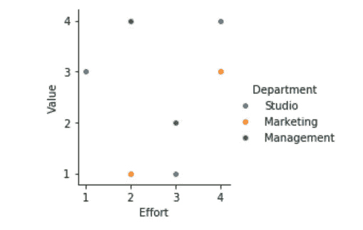

# 构建数据科学团队的搭便车指南

> 原文：<https://towardsdatascience.com/the-hitchhikers-guide-to-building-a-data-science-team-9b9c5630537b?source=collection_archive---------28----------------------->

## 失败通向成功:我们在建立数据科学团队时采取的 11 个步骤

作者图片

在过去的一年里，我的团队、我的经理和我集中精力在公司总部建立了一个数据科学团队。我们已经有几个团队的数据科学家，包括我的数据分析团队。然而，他们中的大多数人在不同的项目中单独工作，几乎没有机会分享他们的知识、经验和想法。

当我们开始建立我们的数据科学团队时，我们做出的一些决定不够好，或者当时没有经过深思熟虑。此外，我们没有一个人来自工程背景，这促使我们学习(艰难地)一些对于具有计算机科学背景的数据科学家来说可能显而易见的东西。然而，今天我们觉得我们已经发现了一些重要的构建模块，每个数据科学团队都应该确保将它们包含在他们的项目和实践中。

简而言之，这是我们列出的 11 个步骤:

*   *定义我们的客户*
*   *修建管道*
*   *优先考虑管道*
*   *管理任务(通过系统)*
*   *周会(分享想法，共同解决问题)*
*   *代码和模型评审*
*   *版本管理*
*   *编码测试*
*   *模型监控(生产中)*
*   *自动化培训流程*
*   *文献*
*   *与其他团队的合作*

所以，事不宜迟，我提出*建立数据科学团队的搭便车指南*。你需要眼睛里的火花，几个月的时间，还有——如果你是《搭车人》的粉丝——一条好毛巾！开始了。

# 定义我们的客户

我们做的第一件事是确定我们公司的每个潜在数据科学客户。我们与不同的经理和同事进行了交谈，以获取他们的意见。对于每个部门或单位，我们询问是否可以建立一个模型来实质性地提高他们的工作或价值。对于任何一个我们收集到好点子的单元，我们都把它们写下来，并把它定义为潜在客户。当这个过程完成后，我们的名单包含了几个部门和单位，包括高层管理人员，甚至人力资源。

# 建设管道

收集了项目第一步的所有想法，我们的团队建立了一个建议模型列表，为每个潜在客户提出的每个想法或问题创建了一个数据科学框架。然后我们将列表上传到我们的任务管理系统中(在我们的例子中，是吉拉),让我们的团队和同事可以得到所有的想法。

# 确定管道的优先顺序

在我们列出了所有的想法和可能的模型之后，我们不得不承认有些想法可能并不那么聪明。我们决定把长长的模型列表组织成我们都知道并且喜欢的东西——图表。我们将 *X* 轴定义为开发工作(考虑数据可用性和模型的复杂性)，将 *Y* 轴定义为价值(对公司而言)。需要最少努力和增加最大价值的模型被分配最高优先级，其次是需要更多努力和增加高价值的模型。优先级最低的模型需要付出巨大的努力，产生的价值很小，留给以后更快乐的日子。

自从我们创建这个列表以来，它已经改变了一百次。随着团队和我越来越了解我们的能力和局限性，模型的顺序也在不断变化。

# 管理任务

现在我们有了一个管道，并且它的项目被优先化了，我们需要弄清楚我们将在哪里与我们的队友协调，并且计划如何开发所选择的项目。这意味着将每个项目划分为高层次的阶段，定义每个阶段必须完成的任务，最重要的是，得出完成(DOD)的定义，也就是说，确定该模型的预期结果以及该模型要求的准确性度量水平。

在我们的组织中，R&D 团队使用吉拉。我们选择它作为我们的任务管理平台，主要是因为我们可能会发现自己在未来的任务中与 R&D 团队合作。我们为我们的团队打开了一个板，并开始上传每个项目的高级阶段。

让我的团队成员使用吉拉是一项稍微困难的任务，因为他们中的大多数人习惯于单独工作，并且以前从未使用过任务管理平台。当他们给我他们正在进行的任务的每周状态报告时，我会提醒他们也更新吉拉(有时我会自己添加任务，放入标题并让他们填写其余的)。最终，通过管理层的唠叨，更新吉拉成了一种习惯。今天，我们都了解吉拉的价值及其在任务协调、时间估计和文档编制方面的重要性。

# 每周会议

团队合作在很多方面都很有帮助。其中一种方式是通过每周的团队会议，每个人都谈论他们一直在做的任务，他们遇到的问题，以及他们计划解决这些问题的方式。

例如，我们中的一个人需要创建一个机制，当某个预测与实际结果相差很远时，可以在预测做出后的前 30 天内更新该预测。我们必须计划一种机制，将正在进行的结果与预测值进行比较，标记需要更新的预测，更新进行新预测所需的相关数据，并最终发送输出。一起思考这个过程帮助我们节省了很多时间，最终我们创建的过程是轻便高效的，而不是我们最初认为必须的非常复杂的过程。

这些分享可以演变成严肃的辩论，在辩论中，我们回顾数据和方法，并作为一个团队来解决问题。我们已经用这种方式解决了许多问题，包括我们遇到“硬墙”的问题——我们觉得无法解决的问题，例如在我们尝试了“一切”之后，准确性度量太低，或者各种性能问题。分享我们的知识，用一种全新的眼光看待一个问题，把具有不同专业知识的人聚集在一起，往往会带来一个新的视角，并最终找到一个明确的解决方案。

# 代码和模型评审

像每周的团队会议一样，同行评审可以提高我们的工作质量。一旦完成了一个模型，我们要求团队成员之一对它进行详细的审查，查看代码、它的设计、准确性度量、超参数、阈值以及过程的技术效率。评审者提供反馈，例如“您可以尝试这个功能，使流程更加优雅和高效”或者“添加这个功能可能会提高准确性。”

实现评审者的评论通常需要一点时间，偶尔会迫使我们推迟模型的部署，但是我们从不跳过评审。这样的输入是保持高质量结果的关键，它使我们避免犯错误或遗漏将来会回来咬我们的错误。

# 版本管理平台

在开发数据科学项目的漫长而艰难的过程中，我们做出了许多改变。这些可能是添加或删除一个功能，调整一个阈值，或者在我们完成模型后对我们的设计进行彻底检查(例如，如果我们意识到模型的计算顺序应该与我们最初的想法不同)。有时候我们后来会后悔这样的改变；对于某些类型的模型，我们不会立即理解变化的后果，直到为时已晚。因为一些模型像一个“黑盒”一样工作，一个改变可能无法撤销——这是我们从惨痛的教训中学到的事实。

出于这些原因以及更多原因，小心管理版本是极其重要的，始终保留返回到早期版本的选项。当进行重大更改时，我们通常只是将模型保存在单独的笔记本中。然后，按照 R&D 的建议(和两个团队教程)，我们转向了在 Git 版本控制软件中管理模型版本的更优雅的解决方案。这种做法也使我们的团队能够更好地合作。不要跳过版本管理——它可以节省您大量的时间和精力。

# 编码测试

数据科学家使用各种各样的工具来开展工作，从线性代数原理到统计方法。为了从所有这些技术和数据中创建一个学习模型，我们需要使用编码。虽然我们可能不是从程序员开始的，并且编码可能不是我们工作的主要焦点，但是编码(并且正确地做)是我们最重要的工具之一。

我们学会做的事情之一是向代码中添加测试。例如，检查我们正在使用的数据的有效性(垃圾输入，垃圾输出)以及确认代码的功能性(通过单元测试)。此外，在我们部署一个新版本之前，我们要确保我们所有的过程和包都能够正常工作(集成测试)；我们验证整个模型功能正确(端到端测试)；我们还会执行我们认为必要的任何其他可用性测试。

我们从糟糕的部署(让我们周末工作来发现和纠正问题)和错误中学会了如何做这些事情，这些错误是我们在没有意识到错误的情况下偶然插入到代码中的。

我们再次向 R&D 团队的同事寻求帮助。在与他们进行了几次会谈后，我们慢慢地开始在我们的代码中实现测试。对我们来说，这绝对是一项正在进行的工作，我们需要学习如何更好地计划和实现测试。

# 模型监控

测试是不够的。例如，一旦我们的团队处理一个或两个以上每天或每周运行的正在进行的过程，我们必须建立一个监控系统来确保它们正确运行。如果没有，系统会立即向我们发出警报。

我们在 R&D 的朋友(他们已经知道他们在和谁打交道了！)也帮助了我们。他们使用 Grafana 仪表板来监控他们的流程，并友好地提出为我们构建一个仪表板。我们将仪表板与 Slack 通信平台连接起来，为所有相关的技术人员启动了一个群聊，并对其进行了编程，以便在流程失败时向我们发送推送通知。

我们的大部分进程都是在晚上运行的，所以我们睡觉的时候会把 Slack 设置成静音。然而，当我们醒来时，我们可以看到是否发生了一些事情。如果是这样，我们可以立即调查问题，通常会保存流程，并在将输出发送给客户端之前将其恢复到正常工作状态。

# 自动化培训流程

在我们选择了一个项目，计划了它，构建了它，评审了它，部署了它，并开始监控它之后，我们的工作仍然没有完成。为了使机器学习能够执行其“学习”过程，我们必须将新数据输入到我们的模型中，然后根据新数据的趋势来校正和调整我们的预测。有时，趋势是持续的，并且足够强大，以证明模型的重新校准是正确的。

这个过程可以手动完成，但需要手动监控模型的质量，以确定何时需要校准。另一种方法是使过程自动化。我团队中的一位数据科学家决定为他的一个模型建立一个自动化的训练过程，它非常成功，以至于我们决定对所有模型都采用它。

训练过程是这样的:我们将一批新的训练数据加载到模型中，并对其进行重新训练。然后，我们比较最重要的准确性测量，并检查重新训练的模型是否在新的看不见的数据上产生更好的结果。如果模型改进，我们保留重新训练的模型。如果没有，我们丢弃它，继续前进。这个过程可以定期安排(比如一个月一次)，也可以在我们部署新的产品版本时应用。

# 证明文件

当规划一个项目时，我们记录一些高层次的设计，以表明模型应该如何工作，计算和测量过程的各个部分是什么，以及最终的输出应该是什么样子。这个文档是什么意思，它有什么用途？

通常，项目文档包括几个部分:

*   产生项目的业务目标以及通过数据科学模型实现目标的基本原理
*   对模型结构和所用数据的解释
*   审查项目的准确性目标和当前模型版本的实际准确性(可能会随着时间的推移而改变)
*   关于流程的详细信息(运行时间、输出形式和相关流程)
*   代码本身、笔记本和/或 Git 的链接

本文档的目的是为处理项目过程的任何人(如我们团队的成员、R&D 集团或客户)提供参考，并保存必要的信息以备将来使用。

在项目开始时准备设计文档，包括模型的最终输出和精度目标的描述，是一个重要步骤。然而，项目结束时的实际结果(有时需要长达一年的时间)往往与最初的设计大相径庭。虽然业务问题通常保持不变，但是我们解决它或提供最终输出的方式可能会有很大的不同。发现我们可以做得比我们最初认为的更好、更有效率是一个非常积极的过程的一部分。

那么为什么不跳过文档阶段，把它留到项目的最后呢？假设我们正在与另一个团队合作，该模型将被整合到他们的产品中。我们将被期望在计划期间规划模型的一般结构，并理解哪些部分将需要产品方面的开发工作，以便其他开发团队(通常以敏捷方法工作)能够计划他们的冲刺，并相应地估计所需的工作。

# 与其他团队的合作

我一遍又一遍地提到我们从 R&D 部门的同事那里得到的极好的帮助，从建立和维护我们的基础设施到帮助我们使用新的工具或我们需要的专业知识(例如在测试上)。虽然随着时间的推移可能会出现一些问题(如技术问题和偶尔的沟通失误)，但事实证明，与 R&D 团队的良好关系对我们至关重要。在本节中，我们将描述一个协作化险为夷的例子。

在过去的一年中，我们发现一个好的数据科学模型并不总是足够的。如果我们缺少一个愿意接受我们的模型输出并使用它的客户，那么这个模型是多么的惊人和精确都没有用。当预测到用户即将流失时；我们需要找到一种可以防止搅动的治疗方法(否则我们提前标记出来也没用)。运行某种分析或进行调查可能有助于我们理解用户流失的原因。然后，我们必须想出适当的解决方案，其中一个可能会改变用户的想法。不是所有的治疗都有效；测试可以帮助显示哪种治疗最有效。整个过程花费的精力和时间与开发数据科学模型本身一样多。

幸运的是，这项活动通常由公司的产品、分析和研究团队来执行。因此，我们必须与其他团队分享我们的项目，并在此过程中进行合作。通常，各方最终都会喜欢这种合作关系，这为其他团队了解数据科学团队的工作提供了一个令人兴奋的机会。

# 离别赠言

当然，如果没有我的团队一年来的辛勤工作和创造力，以上这些都是不可能的。你在这里读到的大部分内容都是他们的首创精神、工作成果，以及从我们做得不太好的地方吸取的经验教训。所以谢谢你们让这一切发生。

最后，如果你看完了这篇长文，我感谢你的时间，并希望这是对你有帮助的阅读。请伸出手来，让我知道你的想法，你在做什么不同，主要是，还有哪些未知是我不知道的！