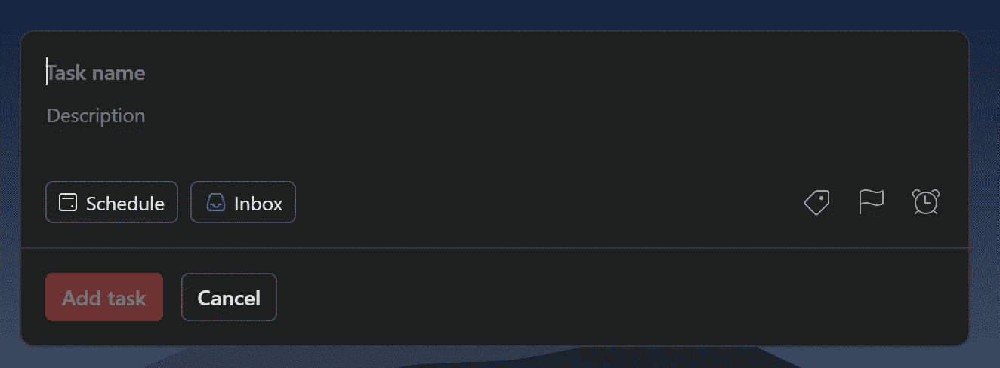

# 数据科学的搭便车指南🌌

> 原文：<https://towardsdatascience.com/the-hitchhikers-guide-to-data-science-bc8cae917fa7?source=collection_archive---------20----------------------->

由 [Unsplash](https://unsplash.com/) 上 [Greg Rakozy](https://unsplash.com/@grakozy) 拍摄的照片

## 我的数据科学知识综合指南

*如果您想复制本指南的部分内容供自己在 idea 中参考，您可以在此* *处访问指南的 idea 版本* [*。*](https://polished-map-33d.notion.site/The-Hitchhiker-s-Guide-to-Data-Science-512b0dc5af2649d0b488003829dee3f7)

# 目录📖

[**(1)简介**](#39b9)[**(2)工具讲解**](#5f1d)[**(3)基础 Python**](#b378)[**(4)熊猫**](#1747)[**(5)可视化**](#8fc4) **作品集构建**[**【10】简讯**](#acd1)[****【11】生产力****](#1eaa)[**【12】面试准备**](#4939)

# **1.介绍📝**

**[回顶*回顶*回顶](#90b7)**

## **1.1 什么是本指南？**

**这是我在过去 2 年中积累的所有数据科学知识的(正在进行中的)综合指南。它并没有涵盖数据科学的所有内容，只是我个人认为有趣和有用的主题子集。从本质上说，这是我希望在第一次开始数据科学之旅时就拥有的指南。**

**我喜欢读科幻小说，所以这本指南是以道格拉斯·亚当斯的书*命名的。***

## **1.2 我为什么要做这个指南？**

**我做这个指南有两个主要原因。首先，当我开始学习数据科学时，我没有太多的指导，因为我仍然没有找到任何接近“全面的数据科学指南”的东西，所以我认为我应该根据我的经验自己制作一个。该指南可以作为刚刚进入数据科学的人的某种起点，或者可以帮助更有经验的人学习新的东西。**

**第二，以我个人的经验来看，无论是独立学习还是在学校学习，学习新事物可能会非常缓慢，但如果有已经经历过的人的帮助，学习会变得非常有效。我第一次涉足数据科学是花了 40 个小时搜集和整理大学排球运动员的数据，然后意识到我还不具备对这些数据进行真正分析的技能。我花了无数个小时学习我并不真正需要的技能，还花了无数个小时低效地学习我确实需要的技能。这个指南将理想地防止其他人经历同样的时间浪费。**

**最终，我希望这本指南能让人们以一种比我学到的更有效的方式来学习我现在知道的东西。**

## **1.3 我是谁？**

**我是瑞安·布朗，这是我的[个人网站](https://ryan-brown.me/)和我的 [LinkedIn 个人资料](https://www.linkedin.com/in/ryan-b-brown/)。2020 年 1 月，我在德州大学奥斯汀分校的 MIS 专业的 Python 入门课上写了第一行代码。我还参加了其他课程来教授数据科学技能，但我的大部分技能(我估计 90%以上)都是自学的。**

**大一的夏天，我在奥斯丁的两家以数据为中心的初创公司实习，大二的夏天，我在戴尔实习数据科学，今年夏天，我将在 Meta(脸书)实习数据科学。**

## **1.4 我该怎么做？**

**我认为自己是一名分析型、专注于产品的数据科学家；我的工作包括收集、清理、分析、可视化以及偶尔建模数据，最终利用这些技能来创建数据驱动的叙述、推动决策并提供可操作的见解。我应用机器学习模型，但我对它们背后的数学或从头构建自己的模型并不特别感兴趣。我不写 SWE 级别的生产代码，主要工作环境一直是 Jupyter 笔记本。有些人可能认为我做的是“数据分析”而不是“数据科学”；我觉得没关系。**

**[Benn stan cil 的这篇文章](https://benn.substack.com/p/method-for-measuring-analytical-work)使用*的决策时间*作为衡量分析工作的标准，非常有见地，很好地总结了我对自己所做的事情以及应该如何衡量自己的感受。**

## **1.5 本指南的结构是怎样的？**

**每个技术部分都有三个子部分:“资源”、“我的观点”和“如何实践”。“资源”包含了一个我推荐用来学习该技能的资源列表，以及对该资源+如何使用它的描述。许多主要资源都是我创建的指南，它们汇总了我在该技能方面的所有经验。“我的视角”包含了我对该技能的资源、该技能整体的重要性以及它如何融入我的工具箱的想法。“如何练习”包含了帮助我学习技能的方法或者我*希望*我曾经用来学习技能的方法。这些方法没有特定的顺序。**

**第 2 部分以外的所有部分都是独立的；有些技能显然是相互依赖的，但是您可以只阅读“Pandas”一节(第 4 节)并理解资源、观点和实践，而不必阅读前面的“基础 Python”一节(第 3 节)或后面的“可视化”一节(第 5 节)。你也可以阅读“投资组合建设”或“时事通讯”部分，而不阅读任何其他内容，仍然可以获得价值。**

## **1.6 如何使用本指南**

**从开始到结束遵循这个指南(理论上)会导致一个模仿我自己的旅程和经历；不过，我不认为我的数据科学方法是“最好的方法”，所以模仿我不一定是我的目标。**

**Dan Luu 的这篇文章讨论了决定学习什么的困境，我完全同意他的观点。遵循“学我所学”的建议并不总是有效，因为每个人都有不同的天生优势和弱点——丹建议，除了经验中的明显漏洞，你应该专注于放大你的天生优势，而不是消除弱点。他提到的决定学什么(/提高)的两个“要素”是对某样东西有相对的天赋和有一个好的学习环境；我要补充的是，对这个话题真正感兴趣是第三个重要的因素。**

**所以，澄清一下，这个指南并不是“学习我所学的”的建议。相反，你可以使用本指南中的主题、文献和资源来帮助你弄清楚你想学什么。如果你想学的东西恰好和我学的东西重叠，并且你的环境有利于它，那么这个指南将(希望)帮助你快速+有效地学习那些主题，达到我目前的知识水平。**

# **2.工具说明🔧**

**[*回顶*](#90b7)**

*   ****Python:** 用于数据收集、清理、操纵、分析、可视化、建模。Python 是我用于数据科学的主要工具，本指南中的大部分信息都与学习和应用 Python 有关。**
*   **与 Python 类似，但我的经验有限，我更喜欢 Python。本指南不包括 r 上的内容。**
*   ****SQL:** 在现实世界中使用了一个 *lot* 来查询+转换数据(尤其是大型数据集)，但是我发现很难合并到个人项目中。本指南提供了学习和练习 SQL 的资源，但这不是主要重点。**
*   ****PowerBI/Tableau:** 用于创建仪表板的 BI 工具，这些工具在个人项目中更容易使用——因为项目可能*是*仪表板——但是本指南不包括关于它们的内容，因为我不觉得我在使用它们方面特别有经验。此外，一旦您在概念上知道如何可视化数据，这些就相当于查找特定于工具的接口和语法。**

# **3.基本 Python🐍**

**[*回顶*](#90b7)**

> **Python 是一种解释性的、可读的、多功能的编程语言，是数据科学家编码的主要方式之一。**

## **3.1 资源**

**[谷歌的“欢迎来到 Colabatory”笔记本](https://colab.research.google.com/?utm_source=scs-index)**

*   **介绍 Google Colab 作为开发环境。我推荐你先阅读这篇文章，这样你就熟悉了什么是 Python 笔记本。**

**[我的熊猫指南第 0 节](https://colab.research.google.com/drive/1HloRQ5vQuVuFA19cTf-gj0WP4xp-a5jR?usp=sharing)**

*   **我的熊猫指南的这一部分涵盖了如何使用 Colab、Python 数据类型以及有用的 Colab 降价和快捷方式。我建议您在安装了 Colab 笔记本之后阅读这篇文章，这样您就可以更加适应开发环境了。**

**[科里·斯查费在 YouTube 上的“Python 编程初学者教程”播放列表](https://www.youtube.com/watch?v=YYXdXT2l-Gg&list=PL-osiE80TeTskrapNbzXhwoFUiLCjGgY7)**

*   **科里·斯查费的 YouTube 视频播放列表，涵盖了 Python 的基础知识。我个人没有用过这个完整的播放列表，但我是他的视频粉丝，在这个播放列表中看了一些，而不是试图从我的课上学习。我会推荐使用 Colab 而不是他描述的设置，我认为有用的视频有 2–9(初学者主题教程)，17(日期时间)，19(排序)，20(尝试/例外)，23(请求)。我觉得那个文件 I/O 没啥用。**

## **3.2 我的观点**

**我在 Python 入门课上学习了基本的 Python，但我认为它的节奏相当慢，而且有很多不同的方法可以学习。因为我没有使用在线资源，所以我不能给出第一手的建议，但我确实在 Youtubefor 上看了相当多的科里·斯查费的视频，以便澄清，它们非常棒。链接[这里](https://www.youtube.com/watch?v=YYXdXT2l-Gg&list=PL-osiE80TeTskrapNbzXhwoFUiLCjGgY7)是他的《Python 编程初学者教程》，里面有很多很棒的视频。不过，我推荐使用 Google Colab 作为你的 IDE[这里](https://colab.research.google.com/?utm_source=scs-index)是 Google 的 intro Colab 笔记本，下一节我的熊猫指南也有对 Colab 的介绍。**

## **3.3 如何练习**

**在你自己的 Colab 笔记本上跟随科里·斯查费的视频中的代码。**

**完成 Python 课程介绍的作业或项目；以下是我搜索“python 类介绍作业”时得到的一些结果，以及我在 UT Austin 找到的一些结果；这些我都没有细看。**

*   **[https://OCW . MIT . edu/courses/electrical-engineering-and-computer-science/6-189-a-gentle-introduction-to-programming-using-python-January-IAP-2011/assignments/](https://ocw.mit.edu/courses/electrical-engineering-and-computer-science/6-189-a-gentle-introduction-to-programming-using-python-january-iap-2011/assignments/)**
*   **[https://www.rbvi.ucsf.edu/Outreach/pc204/assignments.html](https://www.rbvi.ucsf.edu/Outreach/pc204/assignments.html)**
*   **[https://www . cs . ute xas . edu/~ scottm/cs 303 e/Assignments/index . htm](https://www.cs.utexas.edu/~scottm/cs303e/Assignments/index.htm)**
*   **【https://www.cs.utexas.edu/~byoung/cs303e/syllabus303e.html **

# **4.熊猫🐼**

**[*回顶*](#90b7)**

## **4.1 资源**

**[我在 Colab 上的熊猫综合指南](https://colab.research.google.com/drive/1QnzUSdccY-Oane-EtB08BAuoAaVVHB6V?usp=sharing)**

*   **我创建的一个 Colab 笔记本，它汇集了我在数据科学旅程中了解到的关于熊猫的一切。我建议从头到尾阅读这篇文章，并创建一个副本，这样您就可以在阅读时运行+试验代码。您也可以修改指南本身，使其对您更有意义。**

**[科里·斯查费在 YouTube 上的“熊猫教程”播放列表](https://www.youtube.com/watch?v=ZyhVh-qRZPA&list=PL-osiE80TeTsWmV9i9c58mdDCSskIFdDS)**

*   **科里·斯查费的 YouTube 视频播放列表，涵盖了各种熊猫主题。我个人没有看过或用过这个播放列表，但我是他视频的粉丝。我建议使用这些视频对阅读我的指南后仍然不清楚的概念进行更深入的解释。**

**[Dataquest.io 的备忘单](https://www.dataquest.io/blog/pandas-cheat-sheet/)，[ent thought 的备忘单](https://www.enthought.com/wp-content/uploads/Enthought-Python-Pandas-Cheat-Sheets-1-8-v1.0.2.pdf)， [DataCamp 的备忘单](https://assets.datacamp.com/blog_assets/PandasPythonForDataScience.pdf)， [Dataquest.io 的正则表达式备忘单](https://www.dataquest.io/wp-content/uploads/2019/03/python-regular-expressions-cheat-sheet.pdf)**

*   **来自各种数据科学网站的三个熊猫小抄。我自己并不使用这些工具，但是它们提供了一些主题的可视化解释，您可能会发现在编码时参考它们很有用。我确实使用正则表达式备忘单。**

## **4.2 我的观点**

**熊猫的设计简单易用。我认为你应该首先从概念上弄清楚你想对数据集做什么，然后使用适当的语法实现它。我的熊猫指南旨在全面，既可以用来学习熊猫的大量功能，也可以在你编码时作为参考，这样你就不必经常查找语法。如果你想做的事情没有在指南里，一旦你查了一下，想明白了，就把它加到你的指南里吧！**

## **4.3 如何实践**

**在 [StrataScratch](https://platform.stratascratch.com/coding) 上使用熊猫完成练习面试问题。**

*   **很有用，因为你可以免费检查许多问题的答案——这有助于确认你的编码是否正确，并掌握其中的窍门。**
*   **这些问题并不完全代表分析在实践中的样子，编码环境也不理想，但是这是一个开始清理、操作和聚集的好方法。**

**从 [Kaggle](https://www.kaggle.com/datasets) 抓取一个有趣的数据集，加载到 Colab，并开始探索。**

*   **为了更有针对性，您可以生成一组关于数据的问题，然后通过使用 Pandas 探索/操作数据来尝试回答这些问题。**

# **5.形象化📊**

**[*回顶*](#90b7)**

> **可视化是探索性数据分析以及向技术和非技术风险承担者传达分析结果的主要部分。**

## **5.1 资源**

**[我在 Colab 上的全面 Plotly 数据可视化指南](https://colab.research.google.com/drive/1WKgzQMYAfkErqrv1A6WK92N83i0xNooi?usp=sharing)**

*   **我创建的一个 Colab 笔记本，它汇编了我所了解的关于 Plotly Express 的所有内容，这是我最喜欢的可视化库。类似于我的全面的熊猫指南，我建议从头到尾阅读，并创建一个副本，以便您可以在阅读时运行+试验代码。**

**[科里·斯查费在 YouTube 上的“Matplotlib 教程”播放列表](https://www.youtube.com/watch?v=UO98lJQ3QGI&list=PL-osiE80TeTvipOqomVEeZ1HRrcEvtZB_)**

*   **科里·斯查费的 YouTube 视频播放列表，涵盖了 Matplotlib 中的各种图表和定制。我个人没有看过或用过这个播放列表，但我是他视频的粉丝。如果 Plotly 指南让人感觉难以接受，并且您相对来说是数据可视化的新手，我推荐您观看本指南。**

**[我在 Colab 上的 Seaborn 参考指南](https://colab.research.google.com/drive/1rz3bZyDaEQdBuyxyVP1GYYGyVz4aFkLC?usp=sharing)**

*   **我为自己创建的参考 Colab 笔记本，用于在 Seaborn 中创建不同类型的可视化。我建议在你已经学习了 Matplotlib 和 Seaborn 的基础知识之后，在编码时参考这一点；它也可以作为 Seaborn 能力的一个简短展示。**

## **5.2 我的观点**

**Python 中数据可视化的“黄金标准”是 [Matplotlib](https://matplotlib.org/) (推而广之，还有 [Seaborn](https://seaborn.pydata.org/) )，我曾经是这些工具的狂热用户。然而，今年夏天在戴尔，我发现 [Plotly](https://plotly.com/) (特别是 [Plotly Express](https://plotly.com/python/plotly-express/) )更有用，主要原因是它的图表是*交互式的*。在上面链接的 Plotly 指南的介绍部分，我会更详细地解释为什么我更喜欢 Plotly。**

**我仍然认为 Matplotlib 和 Seaborn 是有用的，特别是对于快速绘制玩具数据或数值数组(如模型精度)，所以我也包含了学习这些的资源。这三个都学会了当然好，但我个人认为专注于 Plotly 是最有效的。在现实世界中，如果不先聚合数据集，你通常不会将它可视化，如果你已经聚合了数据，那么 Plotly 就是一种方法。**

## **5.3 如何实践**

**从 [Kaggle](https://www.kaggle.com/datasets) 中抓取一个有趣的数据集，加载到 Colab 中，开始探索。**

*   **为了更有针对性，您可以生成一组关于数据的问题，然后尝试通过使用 Pandas **和**可视化来探索/操作数据来回答这些问题。**
*   **可视化可用于帮助记录并向他人展示您的答案。**

**数据黑客马拉松。**

*   **有各种各样的数据科学竞赛，但我所说的数据黑客马拉松是一场比赛，你被赋予一项广泛的任务，你必须通过分析数据来解决它，最常见的交付物是数据驱动的叙事演示。**
*   **数据黑客马拉松(和例子)在第 10 节(项目组合构建)中有更详细的介绍。**

# **6.机器学习🤖**

**[*回到顶端*](#90b7)**

> **机器学习用于各种复杂的任务，如分类、回归、聚类和 NLP，模型本身可以是可交付的，也可以用于验证决策。**

## **6.1 资源**

**[StatQuest 的机器学习播放列表](https://www.youtube.com/watch?v=Gv9_4yMHFhI&list=PLblh5JKOoLUICTaGLRoHQDuF_7q2GfuJF)**

*   **StatQuest (Josh Starmer)制作的 YouTube 视频播放列表，涉及广泛的机器学习主题。它温和地介绍了机器学习中的许多核心思想，以便您对您正在编写的代码有一个更好的概念性理解。**
*   **我建议，在开始编码之前，至少要看一下关于 ML 基础(1-5)、线性回归(9-12)和逻辑回归(一种分类技术)(16-19)的视频。翻阅播放列表，其他我个人觉得有用+有趣的视频有 23–24，28–30，33，37–40，42–45，47–48，51–52，59，80。所有的视频都很棒，但是其他的话题与我个人的工作并不相关。**

**[PyCaret 教程](https://pycaret.org/tutorial/)**

*   **PyCaret 网站上的一个页面，其中包含 PyCaret 的各种教程，py caret 是一个开源的低代码 Python 机器学习库。它可以用于分类、回归、聚类、异常检测、NLP 和关联规则挖掘。我建议浏览你感兴趣的每个 ML 任务的所有教程。**

**[scikit-learn 主页](https://scikit-learn.org/stable/)**

*   **scikit-learn 的主页。当您在别处看到某个函数时，我建议您查看该函数的文档(例如 PyCaret)**

## **6.2 我的观点**

**正如我在介绍中提到的，我对应用机器学习模型感兴趣，而不是自己构建它们。我不觉得有必要了解 PyCaret 中包含的 22 种回归算法中的每一种算法是如何工作的，尽管我觉得这个主题很有趣，但我不认为深度学习应用程序(例如，使用 PyTorch 或 TensorFlow 的图像分类)是我工具箱的一部分。出于我的目的，理解机器学习的基础知识(来自 StatQuest 播放列表/随着时间的推移的各种阅读)并能够快速应用它(使用 PyCaret)就足够了。**

**我经常使用 [scikit-learn](https://scikit-learn.org/stable/) ，在我旅程的开始，我通常非常关注复杂的机器学习，因为我认为这就是成为一名“好”数据科学家的意义，但现在我知道不一定是这样。现实世界中有不同技术水平的数据科学家(或“分析师”或“工程师”)，从比我技术水平低得多的到比我技术水平高得多的。**

**机器学习是一个非常容易陷入的兔子洞，但我认为每个人都应该强烈考虑他们实际上需要知道多少才能达到他们的目的:你到底需要知道或使用机器学习吗？作为从业者只需要会应用就可以了吗？您对构建和优化自己的模型感兴趣吗？“数据科学家”是一个超级宽泛的头衔，但我个人会把最后一个问题回答“是”的人归类为 ML 工程师而不是数据科学家。**

**PyCaret 上的一个小旁白:太棒了。只需几行代码，您的 Pandas 数据框架将被自动处理、分割，并针对您任务的所有关键模型类型进行训练(无论是分类、回归还是其他)。**

## **6.3 如何练习**

**在 [Kaggle](https://www.kaggle.com/competitions) 上参加机器学习比赛。**

*   **从这些比赛中可以学到很多东西，尽管很多都不属于我感兴趣的领域。你可以练习用 PyCaret 快速得到一个模型的构建+评分；磨练你的数据工程技能；并且看看丰富的社区笔记本，学习各个学科的先进技术。**

# **7.结构化查询语言🐘**

**[*回顶*](#90b7)**

> **SQL 代表结构化查询语言，用于访问、清理和分析存储在数据库中的数据。在非常大的数据集上，它比熊猫的性能好得多。**

## **7.1 资源**

**[模式分析的 SQL 指南](https://mode.com/sql-tutorial/introduction-to-sql/)**

*   **一系列 SQL 指南(初级、中级和高级),涵盖了 SQL 中的大多数主要主题。我建议通读全文，并为自己创建一些语法参考指南。你可以在这里找到我的，但是它不是很干净，我也没有非常广泛地使用 SQL。**

## **7.2 我的观点**

**在第 0 节中提到，SQL(据我所知)在现实世界中非常重要并被广泛使用，但我在个人项目中并没有怎么用过。Deepnote(在“如何实践”中提到)使它更容易合并，但我一直认为它是我将在工作中学习的东西。肯定有公司要求你了解大量的 SQL，但我个人并不需要它来通过我的实习面试。**

## **7.3 如何练习**

**在 [StrataScratch](https://platform.stratascratch.com/coding) 上使用 SQL 完成模拟面试问题。**

*   **正如在第 4 节(pandas)中提到的，对于大多数问题，StrataScratch 将让您使用 SQL 而不是 pandas。**
*   **使用 SQL 时有许多微妙之处/片段，仅仅从模式分析指南中学习语法是看不出来的，因此这样做可以帮助建立一些 SQL 直觉并充实您的参考指南。**
*   **同样，这些问题并不完全代表分析在实践中的样子，编码环境也不理想，但是这是一个开始清理、操作和聚集的好方法。**

**在 [Deepnote](https://deepnote.com/) 上练习用 SQL 代替熊猫。**

*   **Deepnote 是 Google Colab 的云托管 Jupyter 笔记本替代产品。我真的很喜欢它的很多地方(在单个项目中的多个笔记本之间轻松切换，轻松的文件访问，集成)，但我把它放在这里是因为它允许您创建 **SQL 单元格**，您可以在其中对数据帧运行 SQL 并以数据帧的形式返回结果。**
*   **您可以回顾其他个人项目或分析，并尝试用 SQL 而不是 pandas 来做尽可能多的数据操作。也可以从头开始尝试使用 SQL。**

# **8.统计数字🎯**

**[*回顶*](#90b7)**

> **统计学是 A/B 测试和大多数机器学习算法的基础，也可以用来更好地理解数据的分布。**

## **8.1 资源**

**[我的面试备考统计笔记](https://www.notion.so/Statistics-Notes-beb13db034554a91b39426cc3f0345c3)**

*   **我为准备脸书数据科学实习生面试而做的所有统计笔记。它不是一个全面的统计指南，格式也不是特别好，但它应该提供某种基线+把许多有用的信息放在一个地方。**

**[CXL.com A/B 测试统计](https://cxl.com/blog/ab-testing-statistics/)、[by 专利 A/B 测试](https://bytepawn.com/tag/ab-testing.html)、 [TDS A/B 测试篇](/data-science-you-need-to-know-a-b-testing-f2f12aff619a)、 [Shopify A/B 测试指南](https://www.shopify.com/blog/the-complete-guide-to-ab-testing)**

*   **为了更好地理解 A/B 测试，我阅读了一些资源。**

## **8.2 我的观点**

**我在大学里上过一些统计学课程，但是统计学还不是我数据科学工具箱中很大的一部分。编码时会用到非常基本的概念(均值中值模式、方差+标准差、正态分布、分位数等)，但除此之外，我并没有用到太多的知识。很多人说，繁重的统计和数学是成为一名数据科学家的必要基础或先决条件，但我个人不同意。对一个 ML 工程师来说，是的。对于一个专注于产品、创造数据驱动的叙事并推动决策的数据科学家来说，答案是否定的。这是 A/B 测试的一部分，但我还没有这样做，我认为如果我需要学习笔记以外的东西，我可以在工作中学习。**

**我没有任何练习统计的资源，因为我自己没有练习过(除了在我的大学课堂上，我没有发现它特别有用)。**

# **9.投资组合构建📁**

**[*回顶*](#90b7)**

**构建投资组合是数据科学之旅的一大部分，因为它让你可以通过更个性化的项目来追求自己的兴趣，并且在努力实现目标的过程中你会学到很多东西。本节将介绍如何获得项目创意的灵感，项目数据的来源，以及您的项目可能采用的 9 种不同格式。**

## **9.1 项目灵感**

**想出一个项目创意没有什么神奇的公式；有时候你会有太多想都不想就开始，有时候你一点也没有。想法可能来自数据科学之外的个人兴趣，来自看到其他人的工作，来自学习您想要应用的新技术技能，或者来自看到有趣的数据集。**

**下面我列出了一些网站，在那里你可以找到代码、项目和文章，它们可能会帮助你激发自己项目的灵感。**

*   **【https://deepnote.com/explore **
*   **[https://community.deepnote.com/c/showcase/](https://community.deepnote.com/c/showcase/)**
*   **[https://www.kaggle.com/code](https://www.kaggle.com/code)**
*   **[https://towardsdatascience.com/](https://towardsdatascience.com/)**

**有一点要注意的是，你不应该因为一个项目“太简单”或者“其他任何人都可以做”而犹豫不决；总会有比你更有技能的人，如果他们愿意，可能会做类似的项目，但**你是做这件事的人**。**

## **9.2 数据来源**

**要在项目中使用的数据可能来自三个主要的源类别，从最不唯一到最唯一列出:**

1.  ****现有数据集:**这些是。准备下载+分析的 csv 文件，比如在 [Kaggle](https://www.kaggle.com/datasets) 上找到的那些。有大量不同的数据集，它们可能是由发布它们的人搜集来的，但事实上这些数据是公开的，这意味着其他人可能已经分析过了。**
2.  ****来自 API 的数据集:**API 允许您访问数据的子集，这通常是因为数据更新频繁，并且太大而无法包含在单个 API 中。csv 文件。例如天气数据、Spotify 数据或 Twitter tweets。寻找 API 的好地方是 RapidAPI。当您自己从 API 收集数据时，虽然其他人可能可以访问相同类型或格式的数据并在过去对其进行分析，但您最终分析的数据集将根据您选择的唯一参数进行过滤，因此可能会讲述一个完全不同的故事。**
3.  ****自行收集的数据集:**不存在于网上任何容易获取的形式的数据，所以你必须自己收集数据。它可以是你生成的数据(比如手动调查、你拍摄的图像、你读过的书等等。)或者你要从现有网站上收集的数据(比如我学校的报纸网站上的文章， [The Daily Texan](https://thedailytexan.com/) )。由于您正在处理一个从未见过的数据集，因此您的分析更有可能是唯一的。**

**尽管它们不那么独特，我还是建议从现有的数据集开始。这样做大大加快了数据收集和清理的过程，并让您更快地了解如何实际分析数据。**

> **在我使用熊猫之前，我的第一个“数据科学项目”包括我花了大约 50 个小时来搜集和清理数据。一旦我终于有了数据，我意识到我不具备实际分析它的技能，我不得不将这个项目搁置一年多，直到我使用更干净的数据集了解更多。没有有效利用我的时间。**

## **9.3 数据黑客马拉松/数据驱动的演示**

**我将数据黑客马拉松定义为一场比赛，你被给予一个(相对)广泛的任务，必须通过分析数据来解决它，最常见的交付物是数据驱动的叙事演示。数据集通常是给定的，但是您通常可以自由地使用额外的数据源。**

**我认为数据黑客马拉松是学习数据科学和构建您的投资组合的最快+最有效的方式之一，原因如下:**

1.  **你只有有限的时间(通常是 24-48 小时)来竞争，所以你必须快速学习和创造。**
2.  **演示交付格式模仿现实世界的数据科学，意味着您可以花更多的时间学习如何分析数据，以有效地传达您的信息，而不是花更少的时间挑剔代码。**
3.  **预定义的数据集+任务意味着您可以绕过项目的头脑风暴阶段以及数据收集阶段。**

**我参加的两个数据黑客马拉松的参赛作品链接如下:每个页面还包含黑客马拉松的信息包。**

*   **【2020 年戴尔数据黑客马拉松**
*   **[MLDS 数据黑客 2021](https://www.notion.so/MLDS-Datahack-2021-f5333810af7b4945b560ef633f8998f8)**

**你不一定要在黑客马拉松现场比赛；虽然你实际上无法提交参赛作品并有可能获胜，但如果你模仿黑客马拉松的条件，你将获得同样的体验并产生同样的可交付成果。如果你不确定从哪里开始，你可以为我上面链接的黑客马拉松创建一个条目。我会推荐第二个，MLDS 数据黑客 2021，因为我认为这个任务更好+更开放。你也可以在 Kaggle 上查看[分析比赛；他们中的许多人已经完成了，交付物通常必须是一个笔记本，但无论如何创建一个演示条目对练习+学习是有好处的。](https://www.kaggle.com/competitions?hostSegmentIdFilter=11)**

## **9.4 数据驱动的叙述性文章**

**文章比演示文稿更有力，但是对于练习你讲故事的技巧和对一个主题或数据集做更深入的探究来说，文章是很棒的。下面是一些使用各种分析和数据的记叙文的例子。除了这些例子，您还可以在[上找到数千篇关于数据科学](https://towardsdatascience.com/)的数据驱动文章。**

**[**用 NLP**](/exploring-4-5-years-of-journal-entries-with-nlp-589de6130c2d) 探索 4.5 年的日志条目:使用作者(me)生成的日志条目数据。**

**[**身高真的很重要吗？**](/does-height-really-matter-c3db062e8333) :使用作者(我)抓取的数据。**

**[**16 进行中 17:各种 NFL 记录的健全性**](https://www.bruinsportsanalytics.com/post/nfl_records) :使用公开的体育统计数据。**

## **9.5 独立研究论文**

**如果你正在做一个更大、更广泛的项目，超出了一篇文章所能容纳的范围，你可能想写一篇独立的研究论文。我自己的关于基于内容的推荐系统的独立研究论文开始是一篇文章，但是变得太大太专业了。**

**你不一定需要在教授或某个学术机构的领导下写研究论文；请注意，我的是一篇**独立**研究论文，而不是一篇**学术**研究论文。“研究论文”没有正式的定义；我完全是靠自己完成的。应用必要的严格性、格式等取决于您。我推荐背页的[用乳胶写论文。](https://www.overleaf.com/)**

## **9.6 包含笔记本的项目**

**如果您想将代码、可视化和叙述/文本都放在一个地方，您可以创建一个完全包含在笔记本中的项目。它可以是你自己创作的，也可以是提交的，或者是为比赛而创作的。灵感链接里有很多这些笔记本项目的例子，更具指导性的例子是[我参加](https://www.kaggle.com/ryanbbrown/the-analyst-zero-to-hero/notebook) [2021 Kaggle ML & DS 调查比赛](https://www.kaggle.com/c/kaggle-survey-2021)的参赛作品。**

****关于笔记本电脑竞赛的说明:**我发现，要制作一款适合竞赛的笔记本电脑，需要花费大量的时间来打磨和完善它；比我想的要多。我也[阅读了关于](https://www.kaggle.com/c/kaggle-survey-2021/discussion/291684)的文章，并且同意这样一个事实，即演示文稿，而不是笔记本，才是实践中讲述视觉故事的方式。**

**笔记本项目本身是好的，因为你自己定义了格式，但是我不会再用笔记本作为可交付物来竞争。正如前面提到的，使用相同的提示/任务，但是创建一个演示文稿，仍然是有价值的。一个笔记本项目的例子是 Deepnote 上的这个[Goodreads Profile Analysis Dashboard](https://deepnote.com/@abid/Goodreads-Recommendations-xSSkkmqVTc-12__gKZxu4A)，它利用了笔记本的格式而又不显得冗长/复杂。**

## **9.7 教程/指南**

**有成千上万的关于如何执行各种数据科学分析技术的教程，其中许多都是关于[走向数据科学](https://towardsdatascience.com/)的文章形式。如果你完成了一些有用的任务，却找不到相应的教程，或者如果你不得不将多个教程组合在一起，因为没有一个单独的教程是完全合适的，那就制作你自己的教程吧！**

**我非常喜欢技术指南的笔记本格式，并创建了您在本笔记本中看到的格式；我也写过一篇用 Python [在这里](/want-to-easily-integrate-data-with-python-e9d808f88455)推送数据到 [data.world](http://data.world) 的文章教程。请记住，创建教程没有“经验要求”;我在数据科学之旅的早期就写了那篇文章，虽然我现在知道的更多，但它仍然很有用，是我的投资组合的一部分。**

**你也可以创建非技术性的指南或教程，就像你现在正在阅读的一样。**

## **9.8 数据收集管道**

**如果您对收集经常更新的数据感兴趣，并且认为这些数据可能对其他人有用，那么在您使用这些数据做更多事情之前，数据本身可以是一个项目。编写代码以在笔记本或脚本中收集数据，并定期(例如每天)运行代码。然后数据可以被导出到不同的地方:一个 SQL 数据库，一个. csv 文件，然后被推送到 Git 存储库，[Kaggle.com](http://Kaggle.com)，data.world，等等。**

**除了实习之外，我自己还没有完成过这些项目中的任何一个，但是在 [Data 是复数](https://www.data-is-plural.com/)有数百个独特数据集的例子；这些数据集非常有趣，即使没有任何分析也值得一提。**

**我知道 [Deepnote](https://deepnote.com/) 和 [Kaggle](https://www.kaggle.com/code) 都有运行预定笔记本的原生能力，你可能在 [Colab](https://colab.research.google.com/) 或本地笔记本上稍加努力就能做到。**

## **9.9 仪表板/独特的可视化**

**仪表板不仅仅是为“数据分析师”/“业务分析师”保留的，它们可能比您通常认为的业务用例(销售数字、用户计数等)更加动态和有趣。如果您使用自己收集的数据(实时更新或其他方式)创建仪表板，或者自己从 API 调用数据，则会获得额外的积分。**

**我也没有在实习之外创建过仪表盘，但仪表盘和各种可视化工具都可以在 [Tableau Public](https://public.tableau.com/app/discover) 上找到。除了一个完整的仪表板(通常是为了监控或通知)，你可以创建一个单一的、非常独特的可视化，例如[双峰](https://public.tableau.com/app/profile/judit.bekker/viz/TheCoffeesofTwinPeaks/TheCoffeesofTwinPeaks)中喝的咖啡的可视化。**

## **9.10 数据驱动的网络应用**

**如果您对产品创建过程、前端或后端编码感兴趣，有一些 SWE 朋友/同行，或者想要扩展您的技能组合而不仅仅是纯数据科学，那么构建一个数据驱动的 web 应用程序可能是一个很棒的(尽管相当复杂)项目。作为我所在组织的一部分，在一个学期中，我为 Spotify 开发了 [Moodify](https://github.com/ryanbbrown/moodify) ，一个情绪播放列表生成器。我使用 React.js，但这花了很多时间来学习，我仍然不擅长它+将来不会使用它，所以另一个选择是使用 [Bubble.io](http://Bubble.io) (一个超级强大的拖放网站，可以连接任何后端)，使用 Python Flask 或 Django(或其他任何东西)进行数据分析+后端。**

## **9.11 Python 库**

**编写自己的 Python 库听起来非常令人望而生畏，但事实并非如此。有大量的教程，您所需要的只是几个有用的函数，您希望导入并在多个数据科学项目中使用它们。它可以被编码来使用现有库创建某种更复杂的可视化，**

**我自己没有写过库，但我想在某个时候写，据我所知，Python 让这变得很容易。[这里的](https://www.youtube.com/watch?v=zhpI6Yhz9_4)是我打算创建一个教程的链接。**

# **10.时事通讯📧**

**[*回到顶端*](#90b7)**

**我关于数据科学的大多数实用的、非技术性的知识(以及我的一些技术知识)都来自于阅读时事通讯。我注册了几个，它们包含数据科学/通用技术领域正在发生的新事物的内容，作为一名数据科学家真正意味着什么，公司如何克服各种数据挑战等。以下是我目前订阅的时事通讯。**

**[TLDR 时事通讯](https://messaged.com/tldr/)(日报)**

*   **在他们的登陆页面上被描述为“为忙碌的技术人员提供字节大小的新闻”，他们每天都发出一份时事通讯，其中包含以下四个类别中每一个类别的两篇文章的链接和简短摘要:(1)大型技术和初创公司，(2)科学和未来技术，(3)编程、设计和数据科学，(4)其他。**

**[数据药剂](https://dataelixir.com/)(每周一次)**

*   **更具体地说，他们发送关于数据科学中各种主题的文章链接+摘要，例如技术技能指南、与数据科学领域大型参与者相关的事件，以及关于数据科学行业实践的观点文章。**

**[分析工程综述](https://roundup.getdbt.com/)(每周)**

*   **更多的是关于单个主题的较长/叙述性帖子，引用+相关文章的链接，它谈论许多不同的事情，但它通常与数据科学家或分析工程师的工作以及他们应该做什么有关，工作应该如何分工，改变我们工作方式的新工具等。**

**[数据是复数](https://www.data-is-plural.com/)(双周)**

*   **杰瑞米·辛格·文的双周时事通讯，包含来自互联网的各种有趣的数据集。**

**[Deepnote 产品更新](https://deepnote.com/)(定期)**

*   **不是真正的时事通讯，但 Deepnote 每隔几周就会发送产品更新电子邮件，笔记本领域有一些非常酷+创新的东西。我仍然使用 Colab(主要是因为偶尔的速度问题，然后 Colab 有可折叠的 markdown 块，而 Deepnote 只有可折叠的“title”块)，但我最终想切换到 Deepnote，我喜欢看到数据科学笔记本的功能得到扩展。除了拥有一个帐户，我不知道如何订阅更新。**

# **11.⌨生产力**

**[*回顶*](#90b7)**

**这与数据科学没有明确的关系，但我非常投入于生产力领域，并认为这种思维模式非常适合在数据科学领域工作和学习。我将再次引用 Benn Stancil 的这篇文章中的[关于使用*时间到决策*作为衡量分析工作的指标；作为数据科学家，我们必须高效工作。](https://benn.substack.com/p/method-for-measuring-analytical-work)**

## **11.1 日历+电子邮件**

**我用谷歌日历和 Gmail，没什么特别的。不过，我会尽量清空收件箱，在每封邮件被阅读后，将它们归档到各自的文件夹中。我有以下文件夹:数据科学、杂项、个人、学校、工作、订单，然后每个我工作过的公司一个，每个我所在的 UT 组织一个。**

## **11.2 任务管理**

**我使用[来管理](https://todoist.com/)，并且很喜欢它。我使用专业计划(3 美元/月)，但免费计划也很有能力。您可以将任务组织到不同的项目和子项目中，创建子任务，给出任务描述和优先级，创建不同的过滤器/视图，设置重复任务等。优先级、日期和项目可以使用自然语言来设置，因此非常快速和简单:如果我键入`go grocery shopping every sunday #misc p1`，它将在我的 Misc 项目中创建一个每周日优先级为 1 的周期性任务。还有一个移动应用程序，具有所有相同的功能。**

**一个非常显著的特点是:你可以设置一个通用的快捷方式，不管你在电脑上做什么都可以使用，只要你必须在某个地方打开。我的是`WIN + ALT + N`。此快捷方式会打开一个覆盖在屏幕顶部的创建任务窗口:**

****

**作者图片**

**这是非常强大的，因为当你想到你需要做的事情时，你可以立即将它添加到 Todoist，而不必改变窗口或离开你当前正在做的任何事情。除了任务之外，我还用这个来快速写下我有的零散想法或想法；我有一个名为`Scratch`的项目专门用于这个目的。我的其他项目有:生产力、杂项、乐趣、职业、编码、学校和组织/公司项目。添加表情符号使项目更容易识别。**

## **11.3 笔记/知识管理**

**我以前用意念做笔记，但现在我主要用黑曜石做重要的笔记。在了解了**概念笔记**之后，我做出了这个转变，这完全改变了我思考知识的方式。我从[这部视频](https://youtu.be/MYJsGksojms)中了解到，这部视频很好地解释了这一点，但这是我对它的理解:**

**传统上，我们按顺序记笔记:我们按照在课堂上出现的顺序写下事情，我们按类别存储信息:我的营销笔记在一个文件夹中，我的统计笔记在另一个文件夹中。在课堂上，我们经常根据考试或单元进一步细分:我的考试 1 或单元 1 的笔记在这个文档中，考试 2 或单元 2 在另一个文档中，等等。班级也可以分为学年或学期；我每个学期都有文件夹(2021 年秋季，2021 年春季等)。我用概念来做这种笔记，它在准备考试或随堂考时效果很好。**

**不幸的是，顺序笔记不利于信息的长期保存。我在大学里上过三门统计学课，每一门课都教我贝叶斯定理。如果我想使用我以前关于贝叶斯定理的笔记，我必须记住我在哪一个学期上过另一门课，然后记住它是哪门考试或单元的一部分，并在这些笔记中寻找它。这个过程需要很长时间，所以我只是重新学习贝叶斯定理，现在已经这样做了 3 次。**

**进入**概念注释**。概念音符就是它们听起来的样子；每个笔记都是一个原子概念，它不是存储在一些嵌套的文件夹列表中，而是我长期知识的大*金库*中的另一个笔记。贝叶斯定理不会是某个更大的“统计笔记”页面的一部分，它现在是自己的页面，如果我遇到与它相关的新信息，我可以很容易地搜索和添加。黑曜石鼓励这种笔记结构，并允许您轻松地搜索您的笔记，将相关概念链接在一起，等等。**

**这个想法是，如果你已经学过一次，你就不应该再学一次——无论这意味着在谷歌上查找它还是在文件夹和长文档中挖掘它。一旦我创建了一个概念笔记，这个概念就会成为我的知识库的一部分。我可以很容易地找到它，并查看我第一次学习它时对这个概念的理解。**

**不是我学的所有东西都需要成为我知识库的一部分；我上的一些课，比如会计，我知道我再也不会用到了。在这种情况下，我只是按顺序记笔记来完成整个课程。然而，如果它是我可能想要记住或在未来使用的东西，我会把它作为一个概念性的笔记添加到我的黑曜石储藏室中。**黑曜石**和**个人知识管理(PKM)** 篇幅很大，我在本指南中只是触及了皮毛。开始确实需要很多努力，所以如果你感兴趣，不要犹豫，伸出手来！我对黑曜石的很多了解来自布莱恩·詹克斯。**

# **12.面试准备💼**

**[*回顶*](#90b7)**

**我不认为自己特别有资格提供招聘建议——今年夏天我在脸书实习，但这是我唯一面试的地方，我在他们大二探索项目(脸书数据挑战)结束时自动收到了面试通知。然而，我可以分享我用来准备面试的资源，因为它们应该对所有产品管理和以产品为中心的数据科学面试有用。你也可以在我的个人网站上查看我的简历，网址是 [ryan-brown.me](https://ryan-brown.me/) 。如果你有任何问题，请随时联系我，我很乐意尽我所能帮助你。**

**[**PM & DS 面试准备资源**](https://polished-map-33d.notion.site/PM-DS-Interview-Prep-Resources-e7e3cf196cf64002a9e100f785523ad5)**

# **13.结论**

**[*回到顶端*](#90b7)**

**我希望你发现本指南的某些部分是有用的；我投入了大量的时间和精力，并认为当我两年前开始我的数据科学之旅时，它确实对我有所帮助。如果您认为本指南中有任何可以改进的地方，或者有某个部分非常突出，请告诉我！我想继续更新这个指南，如果知道人们从中受益，那就太好了。你可以通过电子邮件联系我，[**ryan.brown@utexas.edu**](mailto:ryan.brown@utexas.edu)，或者在 LinkedIn [**这里**](https://www.linkedin.com/in/ryan-b-brown/) 。**