# 机器学习中的优化指南

> 原文：<https://towardsdatascience.com/the-hitchhikers-guide-to-optimization-in-machine-learning-edcf5a104210?source=collection_archive---------17----------------------->

在 [Unsplash](https://unsplash.com/s/photos/hill?utm_source=unsplash&utm_medium=referral&utm_content=creditCopyText) 上由 [Max Duzij](https://unsplash.com/@max_duz?utm_source=unsplash&utm_medium=referral&utm_content=creditCopyText) 拍照

## 最优化和随机梯度下降的详细指南

> 本文的目的是正确理解机器学习算法的“*优化*”的确切含义。此外，我们将看看基于梯度的类(梯度下降，随机梯度下降等)。)的优化算法。
> 
> **注意:**为了简单和更好的理解，我们将讨论的范围限制在**监督机器学习**算法。

机器学习是应用数学和计算机科学的理想高潮，在这里我们训练和使用数据驱动的应用程序来对可用数据进行推理。一般来说，对于 ML 任务，推理的类型(即，模型做出的预测)根据问题陈述和正在为手边的任务处理的数据类型而变化。然而，与这些不同之处形成对比的是，这些算法往往也有一些相似之处，尤其是在它们如何操作的本质上。

让我们试着理解前一段。将监督 ML 算法视为一个超集。现在，我们可以根据这些算法共有的特征将这个超集进一步划分为更小的子组:

*   回归与分类算法
*   参数与非参数算法
*   概率与非概率算法等。

尽管将这些差异分开，但如果我们观察监督机器学习算法的一般化表示，很明显这些算法倾向于以或多或少相同的方式工作。

*   首先，我们有一些带标签的数据，这些数据可以分解成特征集 **X** ，以及相应的标签集 **Y** 。

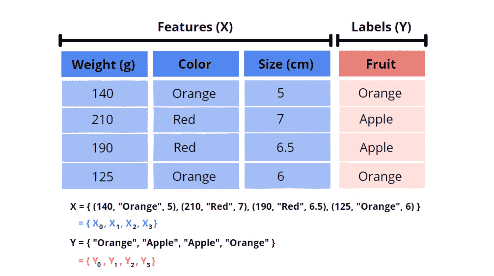

功能集和标签集(图片由作者提供)

*   然后我们有模型函数，用 **F** 表示，它是一个数学函数，将输入特征集 **X_i** 映射到输出 **ŷ_i** 。

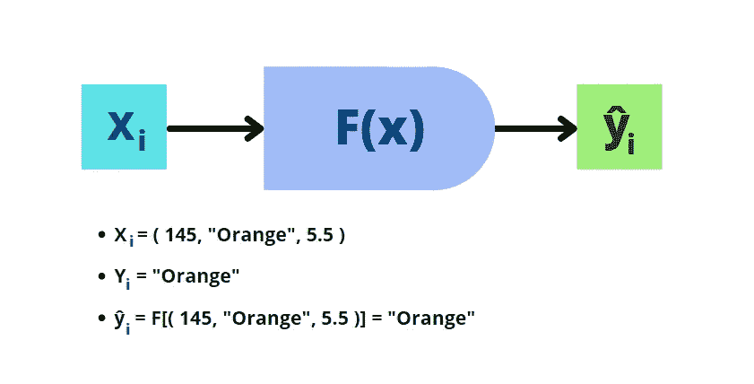

模型函数(图片由作者提供)

**通俗地说，每个有监督的最大似然算法都涉及将特征集 X_i 作为输入传递给模型函数 f，函数 f 对其进行处理以生成输出ŷ_i.**

> 然而，这只是一个模型的推断(或测试)阶段，从理论上讲，我们应该使用该模型对它从未见过的数据进行预测。
> 
> 但是“训练”模型呢？接下来我们来看看。

# 模型优化

监督 ML 算法的训练阶段可以分为两个步骤:

1.  **前向传播:**前向传播步骤类似于模型的推理阶段，这里我们有一个参数化的模型函数 f，它对输入集 **X_i** 执行转换以生成输出 **ŷ_i** 。
2.  **反向传播:**在我们了解反向传播的工作原理之前，了解我们为什么需要它是非常重要的。当我们使用参数化模型时，参数矩阵(模型权重和偏差)通常是随机初始化的。由于这种随机初始化以及与之相关的不确定性，初始模型的性能很有可能会令人失望。 ***因此，我们需要一种方法，以某种方式改变模型参数，从而提高其性能*** 。这正是反向传播的目标。在反向传播步骤中，我们首先参考实际标签 **Y_i** 通过损失函数计算总信息损失(有时也称为模型成本)来评估推断的模型输出 **ŷ_i** 。然后，基于所产生的损失，**我们*优化*模型**，使得在下一个训练周期，模型产生的总成本减少。

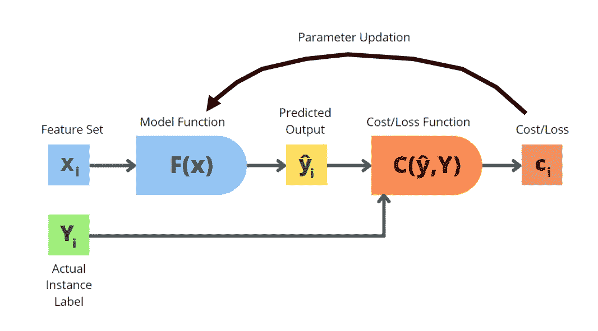

模型训练(图片由作者提供)

## 那么我们到底如何定义模型优化呢？

**模型优化**可以定义为基于一个标准(损失函数)更新模型参数(即模型权重和偏差)的过程，使得模型对训练数据进行推断时的信息损失减少。简单地说，在优化步骤中，我们迭代地更新模型参数，使得成本函数最小化。

因此，模型训练可以总结为一个迭代循环，其中我们从一些随机初始化的模型参数开始，然后通过几个反向传播步骤慢慢优化这些模型参数，目的是实现高精度和低模型成本。

现在我们知道了什么是模型优化，让我们来看看机器学习中一些最广泛使用的优化算法。

# 梯度下降算法

梯度下降是机器学习中最容易实现的(也可以说是最差的)优化算法之一。它是一阶(即，基于梯度的)优化算法，其中我们迭代地更新可微分成本函数的参数，直到达到其最小值。

在我们理解梯度下降如何工作之前，首先让我们看一下 GD 的广义公式:

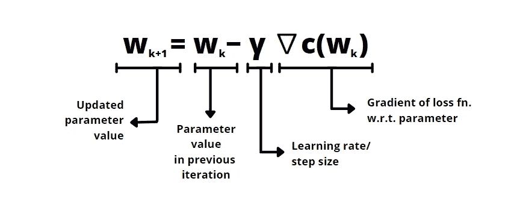

梯度下降(图片由作者提供)

这里的基本思想是在损失函数相对于参数的负梯度方向上更新模型参数。为了给你一个更好的直觉，你可以把梯度下降想成这样:

让我们假设我们的成本函数是一个山区，我们的优化函数梯度下降的目的是找到这个山区的山谷(即成本函数的最小值)。继续山区的类比，让我们假设一个被蒙住眼睛的人被丢在山上的某个地方，并被要求到达山脚。

现在，由于被蒙住了眼睛，这个人自然不知道去山脚的方向。因此，对于人来说，关于到基地的方向的最佳可用信息将是他们每走一步的最陡斜坡的**方向。因此，按照梯度下降法，我们被蒙住眼睛的人会以这样一种方式移动，他们采取的每一步都将是最陡下降的方向。**

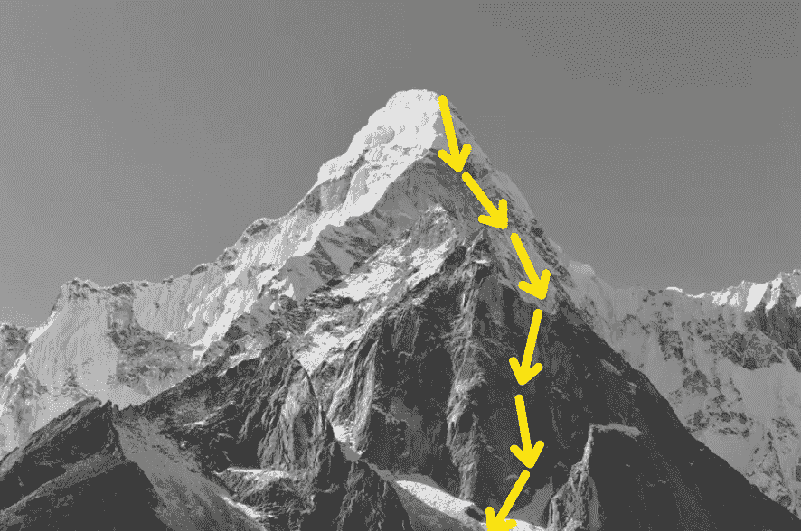

下山(图片由作者提供)

> 基本上，梯度下降算法遵循一种**贪婪搜索策略**，在其他方向可能有更好的解决方案，然而，参数仅在相对于梯度(或斜率)的方向上更新。

**然而，这种搜索策略有一个重大缺陷！**由于这是一个贪婪算法，该算法很有可能会陷入局部最小值而不是全局最小值 ，因此我们可能永远不会收敛到模型成本最小的最佳参数值。

## 学习率的影响(γ)

当涉及到梯度下降算法中的参数更新时，表示步长(或学习率)的超参数γ的值起着关键作用。

*   **如果** γ **太低**，达到最优解的几率会增加。然而，收敛速度，即多快达到最小值，将急剧下降。这仅仅意味着当学习率太低时，模型必须被训练的时期的数量将增加。

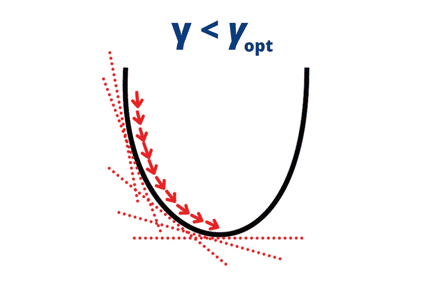

γ太小(图片由作者提供)

*   **如果** γ **太大**，由于模型参数倾向于在最小值附近振荡，获得最优值的概率降低。然而，由于更大的步长，收敛速度增加。高学习率的另一个明显的缺点是一种叫做发散的现象，简单地说就是损失爆炸。

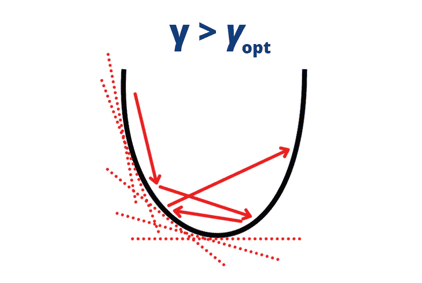

γ太大(图片由作者提供)

**处理这种高学习率和低学习率之间的权衡的一种实用方法是具有可变的学习率**——在初始时期具有较大的学习率，然后随着我们在模型训练过程中进一步进行，在以后时期具有降低的学习率。这将具有高学习率(更快的收敛)和低学习率(达到最优的更高概率)的优点。

虽然梯度下降很容易实现，但它容易频繁陷入局部最优的缺点是不容忽视的。

> 如果优化算法实际上不能最小化模型成本，那么它有什么用？

因此，研究人员提出了改进的、更优化的梯度下降版本——随机梯度下降。

# 随机梯度下降

虽然随机梯度下降与梯度下降算法属于同一类一阶迭代优化算法，但它在计算和性能方面都比梯度下降有了显著的改进。

在 SGD 中，我们不是使用整个训练集的梯度来更新权重，而是随机地从训练集中选择一个数据实例，然后基于该单个数据实例的梯度来执行权重更新。

概括的公式可以给出如下:

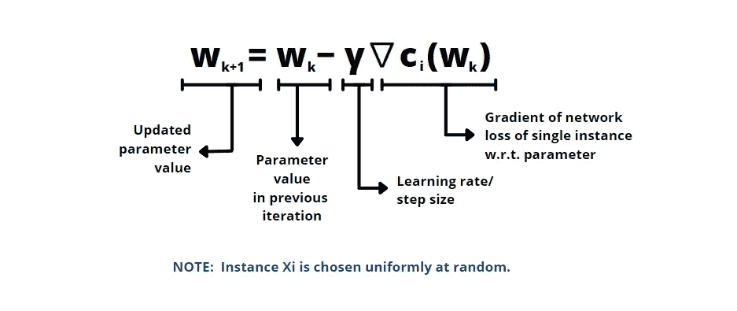

随机梯度下降公式(图片作者提供)

看一下 SGD 公式，很明显它非常类似于梯度下降算法。唯一的区别是，SGD 使用从数据集中随机均匀选择的单个数据实例的模型损失梯度，而不是采用整批数据实例的模型损失梯度。

然而，在实践中，与梯度下降相比，SGD 工作得更好，原因是 SGD 中的**噪声参数更新**。由于我们是在每个实例的前向推进后更新参数，而不是在累积整个训练集的梯度后更新参数，因此参数往往会来回波动。这在某种程度上**降低了陷入局部极小值**的概率。这种现象被称为**退火**。

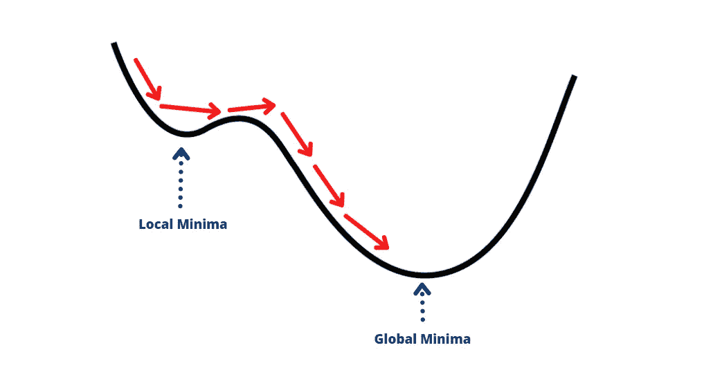

SGD 中的退火(图片由作者提供)

此外，还观察到 **SGD 与 GD 相比**的计算成本更低，因此**显著减少了训练时间**。

理论上，**我们假设数据集中的所有数据实例都是相互独立的**，即训练集中的所有实例都是唯一的。**然而，在实践中，数据集中有很多冗余(相似的数据实例)。**这有助于降低数据集中的噪声，从而确保更新的参数值接近(如果不是更好的话)从梯度下降中获得的参数值。

**注意:**在实践中，我们不是在单个数据实例上更新模型参数，而是在小批量数据上执行权重更新。这可以认为是 GD 和 SGD 的混合体。 **mini-batch-SGD** 的优势在于它针对 GPU 上的并行化进行了优化(即，模型函数可以同时处理多个数据实例)，从而允许更快的训练时间和更少的噪音。

# 基于动量的 SGD

如果我们用物理学术语来说，动量是一个物体保持其运动方向不变的属性。换句话说，动量是一个物体的物理属性，允许它保持其运动的方向和状态。

当我们在上一节讨论随机梯度下降时，我们观察到由于噪声，模型参数振荡很大。这种过多的噪声虽然在实践中对局部最小值有效，但阻止了模型损失函数达到绝对最小值。因此，成本函数可能永远不会收敛，如下图左侧所示。

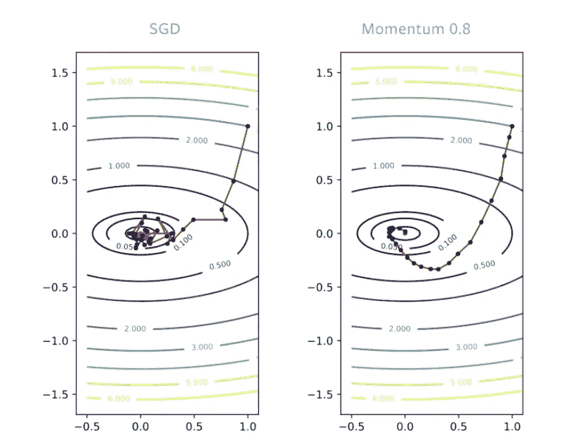

新币 vs 新币+动量(来源:[https://at cold . github . io/py torch-Deep-Learning/en/week 05/05-1/](https://atcold.github.io/pytorch-Deep-Learning/en/week05/05-1/))

因此，为了减少这些振荡，优化研究人员使用了牛顿物理学动量背后的动机，并引入了基于动量变化的随机梯度下降算法。

为了理解动量是如何起作用的，让我们看一下 SGD 带动量的通用公式。

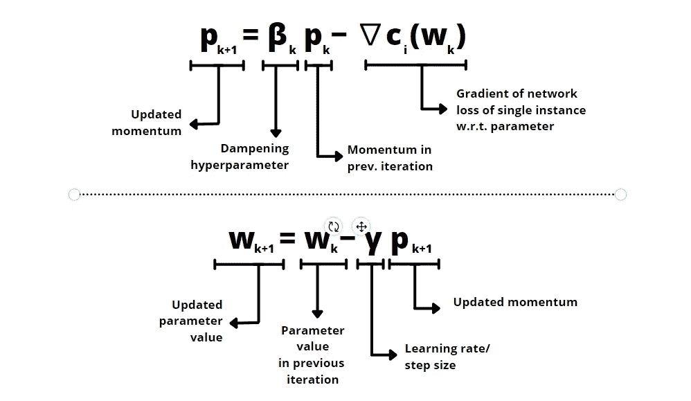

新币+动量(图片由作者提供)

**以下是 SGD+momentum 的工作原理:**

*   在非动量 SGD 中，通过梯度方向上的贪婪搜索来更新参数。
*   然而，在 SGD+动量中，来自前面步骤的动量添加剂影响斜坡的下降。结果，参数更新被迫沿着某个方向，而不是在负梯度的方向上振荡。结果，这抑制了噪声，并因此增加了模型成本达到绝对最小值的概率。

如果你仔细注意动量公式，它只是 SGD 中每个参数更新步骤后梯度的累积。然而，这里需要注意的一件重要事情是，超参数β(范围在 0-1 之间)会在每步之后衰减累积的梯度。因此，与更早的步骤中的动量相比，由于更近的步骤中的梯度而产生的动量更多地影响参数更新。

实际上，正如我们在上图中看到的，动量增加了收敛的可能性，同时计算量也不是很大。这就是为什么大多数深度学习和机器学习包使用 SGD 的基于动量的实现而不是常规实现的原因。

到此，我们来结束这篇文章。这篇文章的要点是:

*   我们看到了什么是模型优化。
*   我们概述了一些最广泛使用的优化算法，如梯度下降、随机梯度下降和基于动量的 SGD。

如果你觉得这篇文章很有帮助，并希望继续看到更多这样的文章，请确保点击“关注”按钮。

**这里是我的一些其他策划的文章:**

</ml-from-scratch-k-nearest-neighbors-classifier-3fc51438346b>  </ml-from-scratch-multinomial-logistic-regression-6dda9cbacf9d>  </linear-regression-model-with-numpy-7d270feaca63>  

你可以在 LinkedIn 上联系我:

<https://www.linkedin.com/in/amansharma2910/>  

快乐学习！