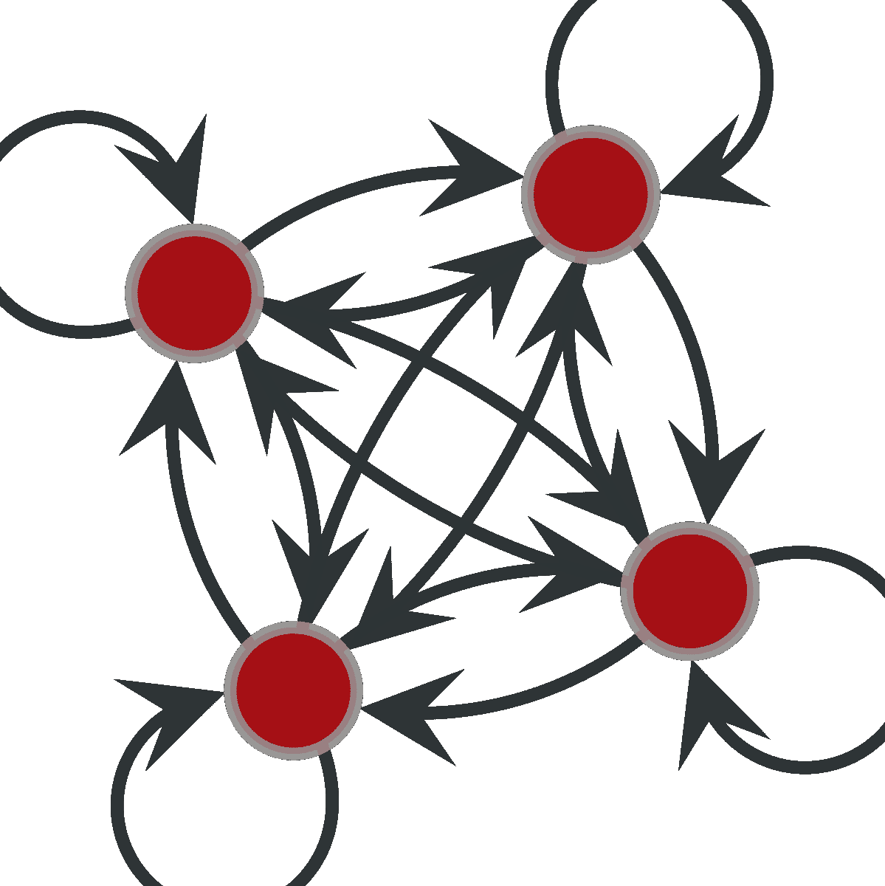
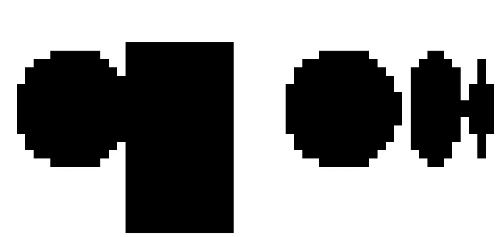
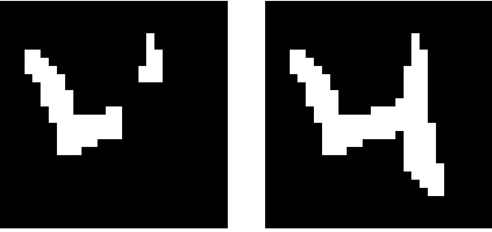
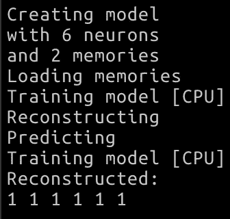

# Hopfield 网络

> 原文：<https://towardsdatascience.com/the-hopfield-network-67267d0569d2?source=collection_archive---------43----------------------->


在 [Unsplash](https://unsplash.com?utm_source=medium&utm_medium=referral) 上由 [Silas Baisch](https://unsplash.com/@silasbaisch?utm_source=medium&utm_medium=referral) 拍摄

## 一个 C++实现

# 模型

[**Hopfield 网络**](https://en.wikipedia.org/wiki/Hopfield_network) 是一种由 John Hopfield 在 1982 年描述的递归**人工神经网络**的形式。

Hopfield 网络由 **N** 个全连接神经元和 N 条加权边组成。此外，每个节点都有一个由等于+1 或-1 的自旋组成的状态。

当一个人有一组状态(即自旋向量)并且希望网络**记住它们**时，这种网络被部署。在数学术语中，我们在数据空间中建立一个哈密顿量，其最小值在我们选择的一些特定点上:存储器。

当模型建立后，可以给系统增加一点扰动，让它再次收敛到全局最小值。换句话说，如果**损坏的**存储器出现在系统中；系统本身能够修复它并回到它的原始状态之一(由其中一个存储器定义)。

在本文中，我将展示一个使用 C++中不同的并行化技术实现的模型的例子。



可以代表 Hopfield 网络的全连接网络示例。图片作者。

## 形式主义

Hopfield 网络可以用描述神经元状态的向量ᵢ和邻接矩阵ᵢⱼ.来表示

给定内存 **X** ={x₁…xₙ}用尺子 **J** ᵢⱼ=1/N xᵢxⱼ.设定重量

**训练**简单到指派**s**ᵢ=sgn(**j**ᵢⱼ***s**ⱼ)，或者取 **J** 和 **S** 之间矩阵乘积的符号。这里的关键点是 **S** ᵢ可以异步更新**。**

**很容易验证，如果 **S** = **X** 系统处于其能量最小值之一。**

**既然这样**

****s**ᵢ=sgn(**j**ᵢⱼ***x**ⱼ)，所以**

****S** ᵢ=sgn(1/N xᵢxⱼ* xⱼ)**

**并且由于 xⱼ* xⱼ总是等于 1，所以对于每一个 *i* 我们是系统的一个**吸引点**中的。**

****

**能量函数的吸引盆。来源[维基百科](https://en.wikipedia.org/wiki/Hopfield_network)**

# **一个 C++实现**

**这个模型可以用 C++高效地实现，这是我的界面。**

```
class Model : public Model_I<Memory>
{
public:
    Model(uint16_t P, uint16_t N, size_t num_threads = 4, devices device = kNull); void load_memories(std::vector<Memory>);
    void train(devices device = kNull);
    void reconstruct(Memory &);private: spin* fNeurons;
    float* fWeights;
};
```

**用户可以声明一个具有 N 个能够加载不同记忆的神经元的模型。该模型可以在多线程和不同的设备(CPU/GPU)上运行。**

**用户有方法**加载内存**、**训练**模型和**重建**内存。记忆只不过是一系列的旋转，以及操纵它们的方法。**

**私有数据成员实际上是 **S** 和 **J** ，如前一段所述。**

**注意，我选择将 **S** 定义为布尔向量**

```
typedef bool spin
```

**一个 bool 通常占用 1 个字节的内存，相反，一个 int 可以占用 4 个字节的内存，所以这个选择可以减少 75%的内存使用。**

****J** (权重)是 *float 的向量。***

**我还实现了一些助手方法来从文件中读取和写入数据。**

# **重建记忆**

**我用来自 MNIST 的一些数字和一个中等的标志来训练这个模型。**

**在设置好权重后，我给模型展示了一个损坏的内存。正如你在左边的下图中看到的，损坏是由一个黑色的矩形覆盖了图像的一半。**

**在这一点上，我调用了重建方法…瞧，模型重建了图像的**缺失部分**！**

****

**损坏的(左)和重建的(右)媒体标志。图片作者。**

**另一个例子可以用数字来说明。左边是损坏的手写 *4* ，右边是重建的版本。**

****

**来自 [MNIST](http://yann.lecun.com/exdb/mnist/) 的一个损坏和重建的数字。图片作者。**

# **一个例子**

**在下面的模块中给出了该模型的完整示例。**

## **存储数据并设置重量**

**模型中存储了两个内存({1，1，-1，-1，1，1}和{1，1，1，1，1})。**

```
std::vector<Memory> training_dataset;
training_dataset.emplace_back(Memory(6, 1, 1, -1, -1, 1, 1));
training_dataset.emplace_back(Memory(6, 1, 1, 1, 1, 1, 1));//Create a model
auto model = Model(
    training_dataset.size(), //P, number of memories
    training_dataset[0].size() //N, number of neurons
);model.load_memories(training_dataset);
```

## **训练模型并设置神经元的旋转。**

**模型被训练。(注意，用户可以选择设备；在这种情况下是 CPU)**

```
// Train the model.
model.train(kCPU);
```

## **创建损坏的内存**

**我们创建了第二个内存的损坏版本(最后一次旋转从-1 翻转到+1)。**

```
// Build a corrupted memory
spin corrupted_data[] = {1, 1, 1, 1, 1, -1};
Memory corrupted_memory;
std::memmove(corrupted_memory.fData, 
     corrupted_data,
     corrupted_memory.size_of()
);
```

## **让模型重建记忆**

**最后，记忆应该被重建并打印出来。**

```
model.reconstruct(corrupted_memory);

cout << "Reconstructed: " << endl;
for (uint8_t i = 0; i < corrupted_memory.size(); i++) 
    cout << corrupted_memory.fData[i] << " ";
```

**模型的最终输出显示了正确固定的内存。最后一次旋转恢复到其原始值，输出为{1，1，1，1，1}**

****

## **整个代码**

```
// Create a dataset with memories
std::vector<Memory> training_dataset;
training_dataset.emplace_back(Memory(6, 1, 1, -1, -1, 1, 1));
training_dataset.emplace_back(Memory(6, 1, 1, 1, 1, 1, 1));

//Create a model
auto model = Model(training_dataset.size(),training_dataset[0].size());
model.load_memories(training_dataset); // Train the model. Use can use kNull, kCPU, kGPU, kMultiThread, kOMP
    // If the chosen device is not available another one is automatically picked up
model.train(kCPU);// Build a corrupted memory
spin corrupted_data[] = {1, 1, 1, 1, 1, -1};
Memory corrupted_memory;
std::memmove(corrupted_memory.fData, 
     corrupted_data,
     corrupted_memory.size_of()
);

model.reconstruct(corrupted_memory);

cout << "Reconstructed: " << endl;
for (uint8_t i = 0; i < corrupted_memory.size(); i++) 
    cout << corrupted_memory.fData[i] << " ";

cout << model;
```

# **设备**

**该代码使用多种方法实现。当用户选择*设备*时，行为被定义。可用选项包括:**

*   ***kCPU* 在这种情况下被调用的方法没有什么特别的。这可以很容易地在**任何平台**上运行，但是性能比较差。**
*   ***k 多线程*在这种情况下，调用的方法使用 [std::thread](http://en.cppreference.com/w/cpp/thread/thread) C++实现，计算由**多线程**执行。性能与机器内核的数量成正比，但比只有一个线程的性能要好。在这种情况下，每个线程对自旋的子集进行操作。**
*   ***kOMP* 在这种情况下，借助 [**OpenMP**](https://openmp.llvm.org) 进行运算并行化。该选项要求安装 OpenMP，但代码会切换到 *kMultiThread。***
*   ***kGPU* 在这种情况下，我使用苹果[金属](https://developer.apple.com/metal/)框架，使用苹果机器的 **GPU** 执行操作。这应该是**最快的**选项。由于每个神经元可以独立于所有其他神经元进行更新，因此这个问题可以很容易地利用 GPU。**

# **结论**

> **总之，Hopfield 网络可以很容易地用来存储二进制格式的一组数据，比如图像。当内存的损坏版本呈现给模型时，它能够**修复**错误，**填充**缺失部分，并完全**重建**原始内存。**

**我用 C++实现了一个具有不同并行化形式的模型，并演示了它在重建徽标或手写数字时的作用。**

# **代码**

**这个模型的全部实现和其他例子都在我位于 https://github.com/fvalle1/hopfield/[的仓库里](https://github.com/fvalle1/hopfield/)**