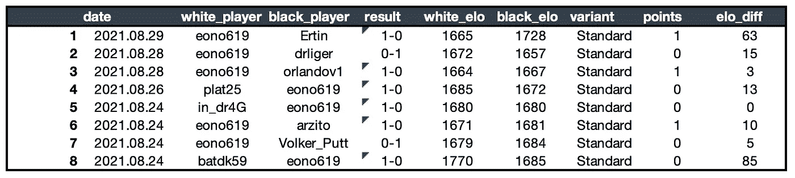
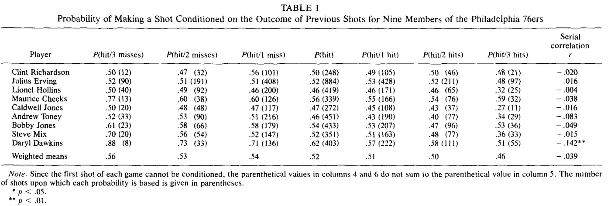
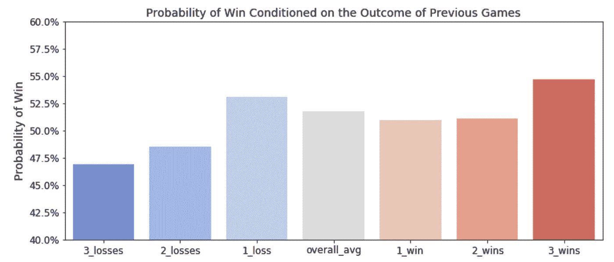
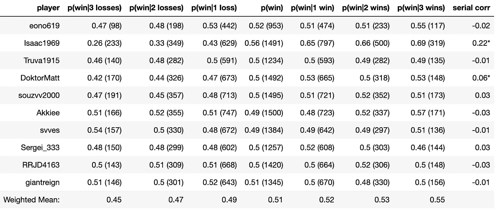
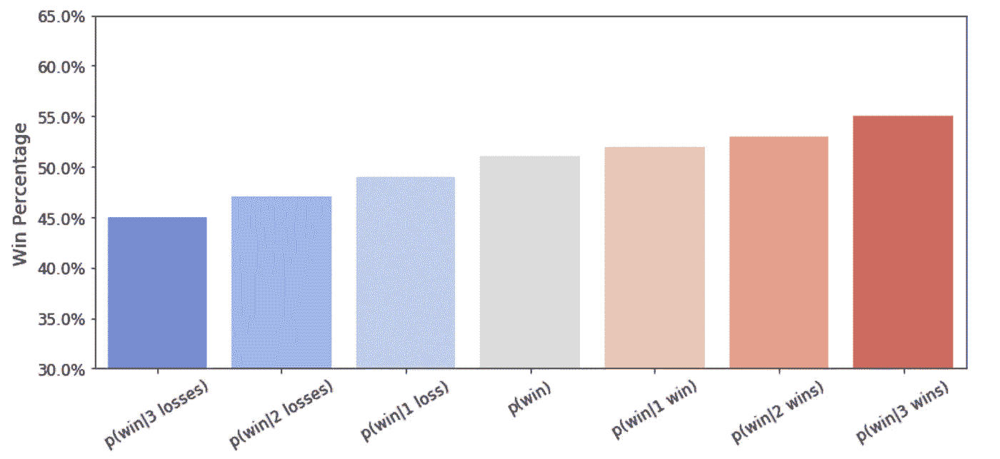
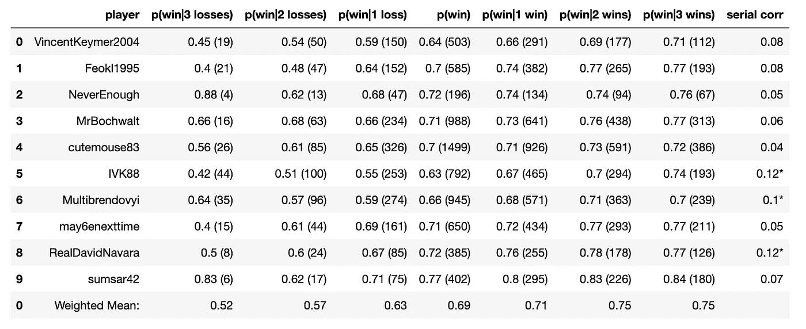
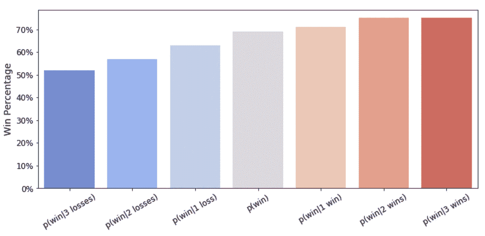

# 国际象棋中的热门牌

> 原文：<https://towardsdatascience.com/the-hot-hand-in-chess-17984b01e694?source=collection_archive---------26----------------------->

## 阿莫斯·特沃斯基热手谬误分析的再现，适用于国际象棋选手

[GR Stocks](https://unsplash.com/@grstocks?utm_source=medium&utm_medium=referral) 在 [Unsplash](https://unsplash.com?utm_source=medium&utm_medium=referral) 上拍照

# 背景

在篮球中，有一个“热门手”的概念，如果一个球员在最近的过去投了几次球，他被认为是“在状态”，更有可能在未来投篮。用稍微多一点的统计学术语来说，当以先前投篮为条件时，投篮的概率更高。

1985 年，阿莫斯·特沃斯基、托马斯·吉洛维奇和罗伯特·瓦隆[从统计学的角度分析了这一众所周知的心理现象，他们使用了 1980 年 NBA 赛季费城 76 人队和波士顿凯尔特人队的详细投篮记录。他们的分析分为 4 个部分:](https://www.sciencedirect.com/science/article/abs/pii/0010028585900106)

1.  篮球迷对投篮顺序相关性信念的调查。
2.  分析了 48 场比赛中 76 人队球员的投篮记录(除了罚球以外的任何投篮)。
3.  分析凯尔特人球员的罚球记录，以控制投篮选择，防守等。
4.  招募康奈尔大学学生进行的控制射击实验

在本文中，我们应用了 Tversky 等人用来衡量篮球热门牌局的统计技术，但重点是互联网闪电战国际象棋游戏。针对一组业余和职业玩家，我们:

> -找出玩家在之前赢了 1、2 或 3 次的情况下赢得游戏的概率
> -找出玩家在之前输了 1、2 或 3 次的情况下赢得游戏的概率
> -找出玩家赢和输的序列相关性

# 数据

这个分析的数据是使用 Lichess 非常有用的 [API](https://lichess.org/api) 提取的，该 API 允许请求者提取他们网站上任何给定玩家的数千场历史游戏。下面是一个简单的例子，我用几行代码就提取了 1000 个我自己的游戏。

不幸的是，输出非常混乱，需要大量的争论才能变成可用的形式。下面是一个游戏请求的输出示例:

然而，经过大量的解析后，我们得到了一个典型的熊猫数据帧中的数据，每个游戏占一行。为了进一步细化数据，我们只选择玩家之间的*评级*游戏，这些游戏彼此的 elo 评级在 20%以内，以确保只包括竞技游戏。最后，我们有一个如下例所示的数据框架:

# 分析

最初热手谬误分析的统计学家计算了 76 人队 9 名球员的 8 项数据。

> -他们的整体投篮命中率
> -他们投篮的概率给他们:错过了最后一次投篮，错过了最后两次投篮，或错过了最后三次投篮
> -他们投篮的概率给他们:做了最后一次投篮，做了最后两次投篮，或做了最后三次投篮
> -他们投篮的序列相关性

这是他们原始论文的截图，其中他们指出，平均而言，他们实际上看到了一手好牌的反面，一名玩家在之前出手 1、2 或 3 次后，不太可能*出手。另一方面，普通球员在投丢 1-3 个球后似乎更有可能投中，这完全否定了篮球中“手热”的说法。*

**

*[https://www . science direct . com/science/article/ABS/pii/0010028585900106](https://www.sciencedirect.com/science/article/abs/pii/0010028585900106)*

*利用我从 Lichess 的 API 中提取的 1000 款游戏的数据，我能够重现这些相同的统计数据。对于每个条件概率，我会查看自己是否连续赢了或输了 1/2/3 场比赛，然后记录下一场比赛的结果。平均每种情况的结果，我最终得到了与原始热手研究中相同的条件获胜概率(完整代码[在此为](https://github.com/eonofrey/chess_hot_hand))。看看下面的平均条件概率图，看起来有一手好牌的暗示，在我连续赢了 3 场比赛后，我赢得了 55%的比赛，但在我连续输了 3 场比赛后，我只赢得了 47%的比赛。*

**

*然而，一个样本的大小并不十分令人放心。根据我和我最近的 9 个对手的数据，我们重新制作了 1985 年 Tversky，Gilovich 和 Vallone 为 76 人队球员制作的表格。*

**

*赢得一场比赛的概率，取决于先前比赛的结果(*表示 p < .05)*

*查看加权平均获胜概率(如下图所示)，我们看到一个明显的趋势，支持国际象棋中“热门牌”的观点。随着玩家连续赢得更多游戏，他似乎更有可能赢得下一场游戏。另一方面，如果一个玩家连续输掉比赛，他更有可能输掉下一场比赛。除此之外，还有两个玩家的游戏历史的系列相关性是 stat-sig 阳性的。*

**

*上图中玩家获胜概率的加权平均值*

*诚然，我自己和我在这个分析中随机选择的对手将被认为是业余选手。下面，我进行了同样的分析，但使用的是目前在 Lichess 上 blitz 排行榜上名列前茅的 10 位大师的游戏数据。使用这些球员将更类似于最初的热手研究，使用职业篮球运动员。*

**

*赢得一场比赛的概率，取决于先前比赛的结果(*表示 p < .05)*

*虽然这些大师的平均胜率比业余选手高得多，但我们仍然看到了相同的趋势，即如果以赢得先前的比赛为条件，赢得当前比赛的概率更高(如果以先前的失败为条件，赢得的概率更低)。此外，大师级游戏的每一个序列相关性都是正的，3 具有统计显著性。*

**

*上图中特级大师获胜概率的加权平均值*

*这一分析绝非完美。可能存在混淆的变量，如一天中的时间、互联网连接，或者，正如我的朋友大卫指出的，清醒。样本量很小，而且它只是模拟了原始热手研究的一部分。抛开所有的不完美，这一分析强烈地表明，在国际象棋中有这样一种“热手”，玩家进入状态，更有可能赢得比赛。业余和职业玩家也表明，他们可能会有冷条纹，或者变得[倾斜](https://www.chess.com/forum/view/general/blunders-and-tilt3)，正如以先前的失败为条件赢得游戏的较低概率所示。*

*感谢阅读，这个分析的完整代码可以在我的 [GitHub](https://github.com/eonofrey/chess_hot_hand) 上找到。要获得所有媒体文章的完整访问权限，请点击[此处](https://eonofrey.medium.com/membership)！*