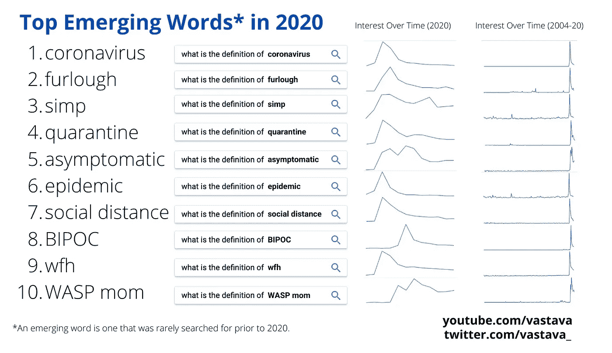
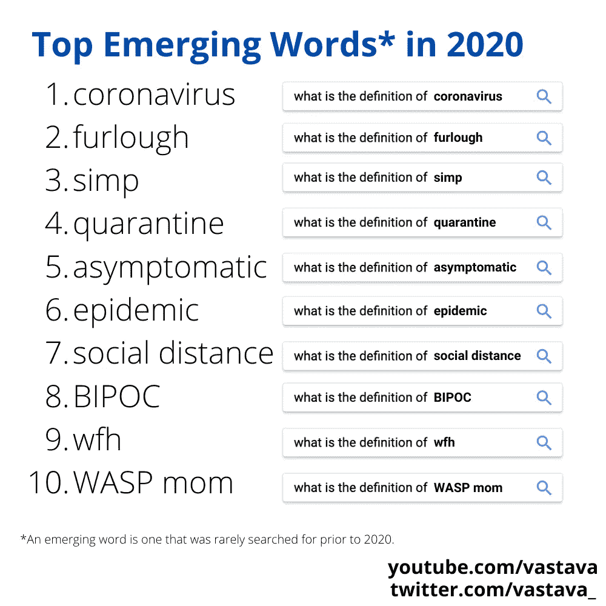

# 根据谷歌趋势数据，2020 年最热门的俚语

> 原文：<https://towardsdatascience.com/the-hottest-slang-of-2020-according-to-google-trends-data-7bae348409b4?source=collection_archive---------32----------------------->

## 从“simp”到“wfh”，这 10 个词在过去的一年里占据了互联网

谷歌趋势可以告诉我们很多关于语言的信息——它经常被用来分析地区俗语或趋势话题。对于这个项目，我想看看我是否可以使用谷歌趋势来确定全年上升的俚语词汇。

我对“俚语”的标准如下:

1.  这个词必须在 2020 年出现，这意味着它在前几年很少被搜索到
2.  人们不知道这个词的定义，这意味着人们在搜索“____ 定义”、“什么是 ___”和“____ 字典”等。

第一点确保我们的列表不会充满像“woke”或“karen”这样的既定单词——我们最终列表中的每个单词都是在 2020 年首次出现的。

第二点确保我们列表中的单词是新的*，因为人们以前没有听说过它们——例如，“选举”肯定是一个可能在 2020 年“出现”的单词，但很少有人会搜索选举的*定义*。*

*正如我在上面所说的，我使用谷歌趋势来确定十大名单。这个项目的完整代码可以在这里看到。*

*我首先建立了一个过去一年的相关查询数据集，包括以下术语:“字典”、“定义”、“定义”和“城市字典”。我使用了 Google trends API 的 Python 包装器 [pytrends](https://pypi.org/project/pytrends/) 来收集这些数据。*

```
***import** **pandas** **as** **pd**                         
**from** **pytrends.request** **import** TrendReq pytrend = TrendReq()
pytrend.build_payload(kw_list=['define', 'definition', 'dictionary', 'urban dictionary'], timeframe='2019-12-30 2020-12-29')related_queries = pytrend.related_queries()*
```

*related_queries()命令为我们的关键字列表中的每个术语返回相关查询的 pandas 数据帧的字典。输出可能如下所示:*

```
*{'define': {'top':                     query  value
  0          define synonym    100
  1          define meaning     83
  2              definition     63
  3                synonyms     27
  4   what does define mean     11
  5              dictionary      8
  6           define health      7
  7       define management      6
  8      define coronavirus      6
  9             define love      6
  10        define computer      5
  11           define force      5
  12        pandemic define      5
  13               pandemic      5
  14              thesaurus      5
  15     define environment      4
  16         define concept      4
  17       define community      3
  18          define values      3
  19            define verb      2
  20       define objective      2
  21       define essential      2
  22        define furlough      2
  23            define simp      2
  24          define racism      1,
  'rising':                              query  value
  0               define coronavirus  29400
  1                         pandemic   3450
  2                  pandemic define   3350
  3                  define furlough    850
  4                      define simp    850
  5                define quarantine    850
  6              define asymptomatic    300
  7                important synonym    180
  8                  however synonym    160
  9                       define wap    160
  10                  define synonym    150
  11                        synonyms    120
  12  the song that define your life    120
  13                  define meaning    100
  14             define asynchronous     90
  15                  define endorse     80
  16                   define racism     70
  17                define endurance     70
  18                 define parasite     70
  19                    define evoke     70
  20             define apprehension     70
  21                   define prefer     70
  22                  define deviant     60
  23                       thesaurus     60
  24                  define condemn     60},
 ...*
```

*如您所见，该调用返回了两个字典，一个名为“rising”，另一个名为“top”。出于我们项目的目的，我们对出现在‘rising’字典中的相关查询感兴趣。*

*在连接每个关键词的数据框架并过滤掉重复的术语后，最终的数据集有 95 个来自 2020 年的潜在俚语词。*

*然后，我开始量化每个词的搜索兴趣，以确定前 10 名。这是一个相当简单的过程，因为 Google trends 允许您传递多个术语进行比较。*

*经过计算，我有了我的前 10 名！这是:*

**

*图片作者。*

*上图显示了每个单词的两个图表——2020 年和 2004 年以来的利息。第一张图显示了这个词在一年中的流行程度，第二张图证实了所有这些词在 2020 年都是“新”的。*

*除了…是真的吗？像流行病，无症状这样的词肯定已经存在很长时间了。为什么他们会出现在这个名单上？*

*是的，“流行病”无论如何都不是一个新词，但是 2020 年“流行病”的搜索量绝对让前几年的搜索量相形见绌。无症状、休假和隔离也是如此。我相信我们都知道为什么会这样。*

*事实上，这个列表中不到一半是真正的俚语。我不认为这是因为方法有缺陷，而是因为今年的环境使得语言趋势几乎完全由外部事件驱动。*

*查看 2018 年布丁的一个类似项目可以发现，当年的热门词汇是“incel”、“uwu”等。——这些词大多来自互联网，并没有受到“真实世界”的巨大影响*

*2020 年名单上的几个词在某种程度上与新冠肺炎·疫情有关。让我们再来看看这个列表:*

**

*图片作者。*

*这个列表中唯一真正的俚语是 simp，BIPOC，wfh 和 WASP mom。甚至 wfh 也受到了新冠肺炎疫情的激励，而 BIPOC 可能是对黑人的命也是命抗议和呼吁种族公正的回应而变得更受欢迎。*

*2020 年是非传统年，这个榜单也证实了这一点。这些词不是在小众群体中冒出来并慢慢流行起来的——这些词是随着我们日常生活的环境突然发生巨大变化，我们被迫理解和适应的。*

*我所能说的是，“冠状病毒”在这个名单上名列前茅是恰当的，它在许多方面都被疫情打上了标记。事实上，“冠状病毒”是一个在 2020 年之前很少有人使用的词，并且在全年的日常对话中几乎占据了主导地位。*

*不确定其中一些单词的意思，或者想了解我的更多数据科学项目？考虑查看我的 youtube 视频和我的频道，我在那里发布了大量数据科学内容！*