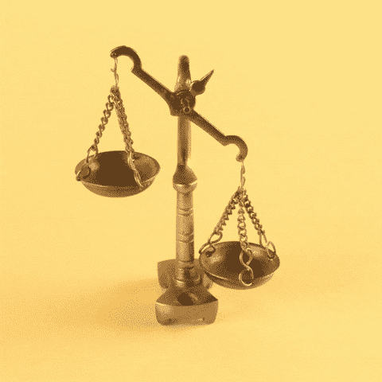
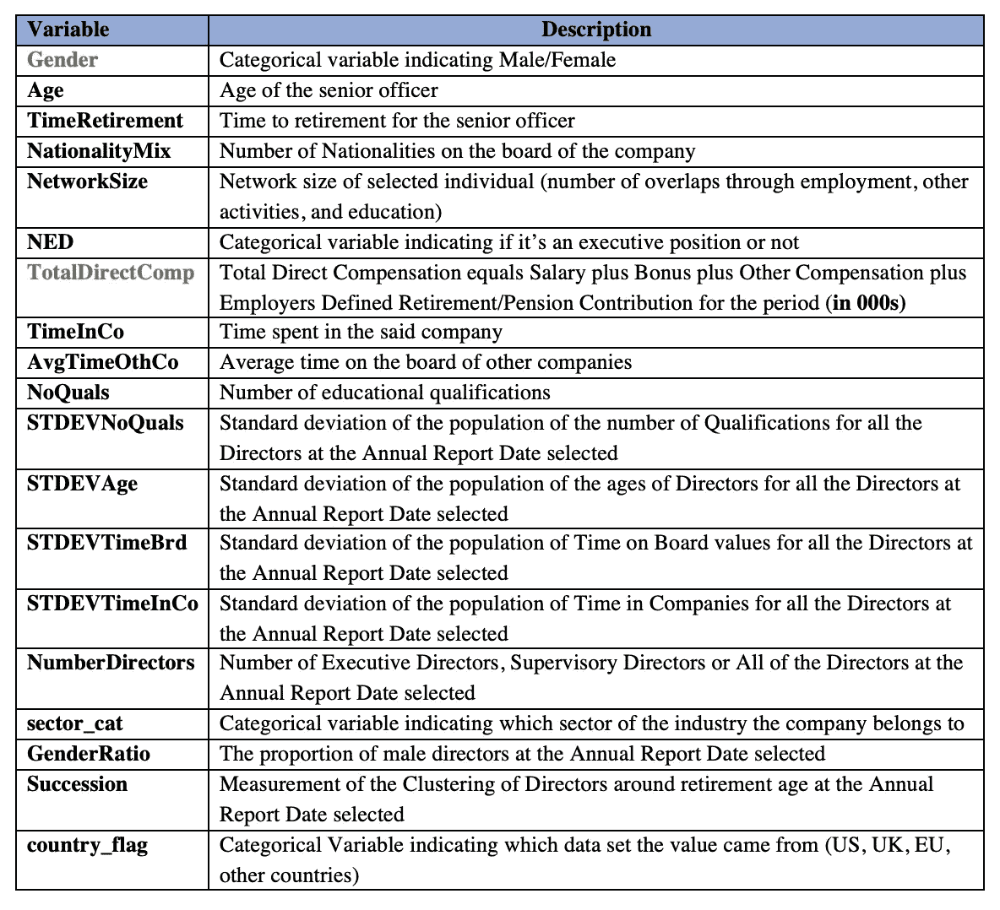
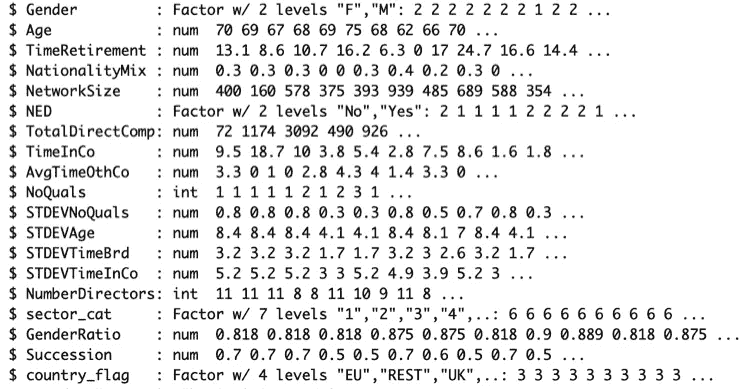
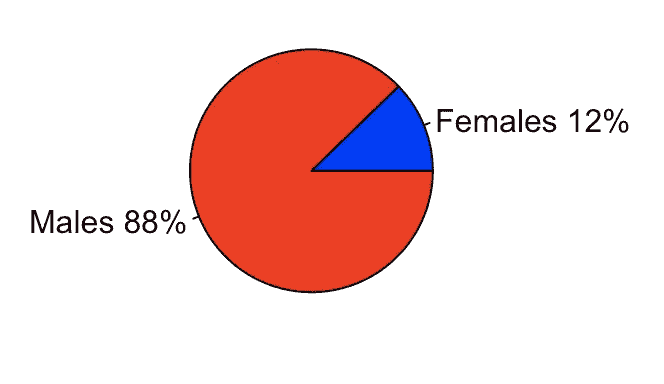
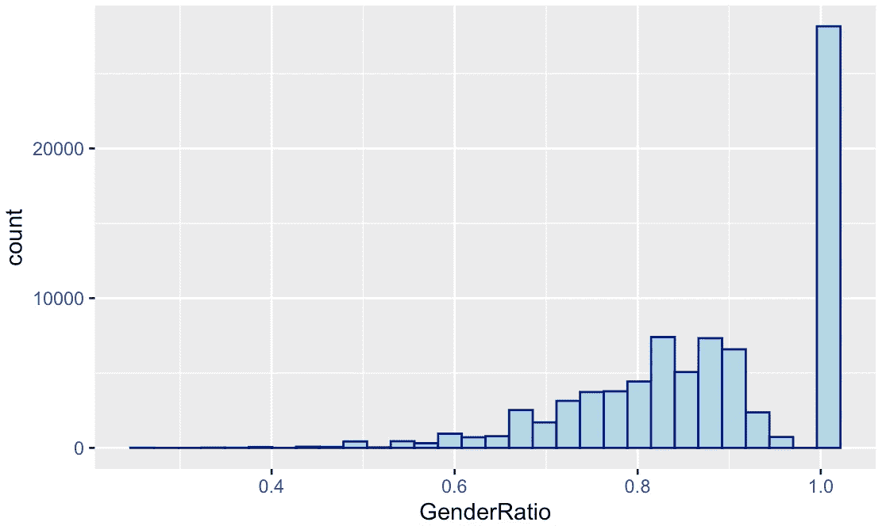
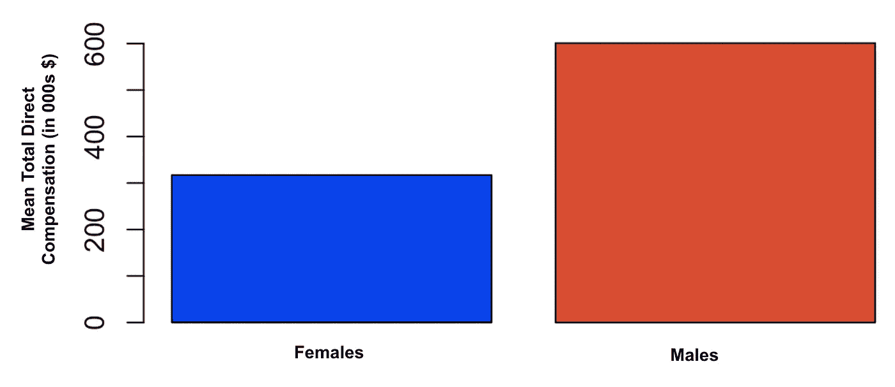
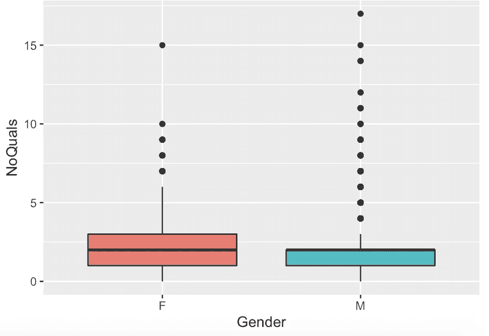
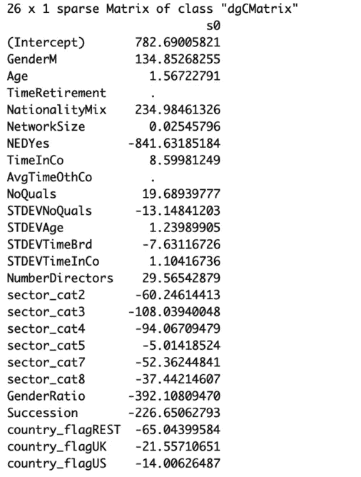

# 人类偏差-准确性权衡

> 原文：<https://towardsdatascience.com/the-human-bias-accuracy-trade-off-ad95e3c612a9?source=collection_archive---------32----------------------->

图片来源:[乔恩·泰森](https://unsplash.com/@jontyson?utm_source=unsplash&utm_medium=referral&utm_content=creditCopyText)在 [Unsplash](https://unsplash.com/?utm_source=unsplash&utm_medium=referral&utm_content=creditCopyText) 上的照片

## 理解历史数据如何导致算法偏差以薪酬预测模型为例

## 做人就是要偏心？

**“偏向”是一种*倾向或倾向*偏向或不偏向**某一组。所有的人类都有一定程度的偏见，因为我们天生就有辨别不同威胁的能力。由于这种隐性偏见，我们倾向于无意识地将特征和品质归因于社会中通常被污名化的群体。这些包括基于性别、种族、国籍或地理遗产的群体。根据斯坦福大学哲学百科全书****

> **“对‘隐性偏见’的研究表明，人们可能会基于偏见和成见行事，而并非有意为之”**

**现在，如果我们知道并理解了这个事实，我们就有办法消除这种隐性偏见，即意识到并认识到它是如何影响我们的认知决策的。这将包括有意识地努力改变陈规定型观念，调整我们的视角。**

****

**图片来源: [GIPHY](https://media.giphy.com/media/xT8qBit7YomT80d0M8/giphy.gif)**

## **对准确性无止境的追求**

**机器学习的目标是获得最准确的预测。数据科学家有几个指标可以通过最小化已知的预测误差来量化这一既定目标。在回归问题的情况下，这些度量是均方根误差、平均绝对误差、R 平方值等。对于分类算法，度量包括 AUC、准确度、精密度、灵敏度、特异性等。使用几种方法来进一步调整，然后微调参数和超参数。**

**一切都归结为优化一个特定的*权衡*——偏差-方差权衡；确保我们对人口数据的任何部分都有准确的预测。**

## **被忽视的权衡**

**在获得更高准确性的同时，一个事实被遗忘了——人类收集的数据充满了人类偏见。《卫报》很好地阐述了这一事实:**

> **虽然可以说神经网络可以编写自己的程序，但它们是朝着人类设定的目标，使用为人类目的收集的数据来这样做的。**如果数据有偏差，即使是偶然的，计算机也会放大不公正。****

**人类偏见可以在数据科学管道中的任何一点出现，并以 ***算法偏见*** 的形式出现。当然，收集的数据的多样性是最容易受到影响的一点。如前所述，这也与优化偏差-方差权衡有关。此外，这些数据要么是由人收集的，要么是由人设置的数据收集过程。这意味着，不知不觉中，数据收集的代理人也可能是进入管道的偏差的来源。此外，从所生成的预测中得出的见解也会受到解释结果的人的主观性的影响。算法偏见的直接影响可能是针对或针对特定人群的歧视行为。**

**令人惊讶的是，这并不是一个新问题。文章“[我们对人工智能中的偏见做了什么](https://hbr.org/2019/10/what-do-we-do-about-the-biases-in-ai)”(HBR，2019)讲述了早在 1988 年，一所英国医学院根据算法做出录取决定，被发现对女性和非欧洲名字的人有偏见。有趣的是，这种算法在匹配人类决策时表现出 90–95%的准确性。**

**《华盛顿邮报》在 2016 年的[这篇文章](https://www.washingtonpost.com/news/monkey-cage/wp/2016/10/17/can-an-algorithm-be-racist-our-analysis-is-more-cautious-than-propublicas/)中强调了算法偏差的一个更近的例子。它谈到了在美国全国范围内用于保释判决的软件 COMPASS，ProPublica 组织发现该软件对非裔美国被告有偏见。**

## **让我们看一个例子**

**工作场所的性别差异一直存在，并且仍然普遍存在。因此，历史员工数据必然会有不利于女性的趋势。为了理解算法偏差，让我们以上市公司高管的历史薪酬数据为例*。*我们制作有和没有*高级职员的特征 **' *性别* '** 的模型来预测他们的直接报酬。此外，我们对结果进行比较，以了解包含*对偏差敏感的特征*会如何导致歧视性结果。***

## **关于数据**

**这些数据是使用沃顿研究数据服务从 BoardEx 获得的。它涵盖四个地理类别:美国，英国，欧盟(欧盟)，所有其他国家。我们使用了两个数据集来获得与上市公司高管薪酬相关的不同特征:**

**1.**薪酬数据:**包括关于现在和过去的股票期权持有量、直接薪酬、从每个职位退休的时间、在公司服务的时间、关于董事会的信息(如果服务)、公司的部门类别、关于过去的董事会的信息(如果服务)。**

**2.**个人资料特征:**包括性别、学历、年龄、网络或关系等数据。**

**详细的数据字典可以在[这里](https://metalib.ie.edu/ayuda/Varios/BoardExWRDSDataDictionary.pdf)访问。**

****数据清理****

**由于公司拥有多个代码，数据中存在重复值，这些重复值已被删除。之后，数据中唯一 BoardIDs(公司董事会的唯一标识符)的数量为——17K 来自美国，5K 来自欧盟和英国，大约 8K 来自其他国家。最终合并数据(所有国家)包含大约 32.5 万名董事/高级管理人员的信息。**

**然而，对于每一位董事来说，这些数据都来自公司不同年份的年度报告。例如，如果一名董事从 2000 年至 2010 年为一家公司服务，则该董事-公司配对有 10 个条目。为了我们的分析，我们保留了董事-公司配对，其中董事 X 在公司 y 中的直接报酬总额最高。**

**在选择了与我们的分析最相关的变量之后，即在决定一位高级官员的报酬时最重要的变量之后，最终的数据集有 80879 行和 21 个变量。现在，我们的数据是这样的，每一行是一个独特的董事-公司配对。**

****

**数据集中变量的描述(按作者)**

*****注:*** 在我们的分析中，我们将使用直接薪酬总额作为因变量(Y)。**

****

**数据快照(按作者)**

## **探索性分析——数据真的有偏差吗？**

****

**按作者**

**仅从数据中女性和男性的数量来看，我们看到了巨大的差异。我们有 9908 名女性和 70971 名男性高级军官！**

**性别比例或男性高级官员比例的分布也证实了这一点。**

****

**按作者**

**让我们看一下按性别划分的 ***表示总直接薪酬*** 。如下所示，男性的平均直接报酬总额几乎是女性的两倍。**

****

**按作者**

**现在，让我们来看两个变量，它们可以被视为访问机会的代理。**

****

**按作者**

**令人惊讶的是，两性在公司度过的时间分布并没有太大差异。表明高级官员不分性别，给公司的时间相等，但得到的报酬不同。**

****

**按作者**

**比较按性别划分的高级官员资格数量的分布，我们看到，总体而言，女性往往拥有更多资格。这可能表明一种趋势，即要达到与男性同等的水平，女性需要更多的资格。**

## **建模方法**

****

**按作者**

**我们首先尝试 Lasso 回归，看看性别变量是否会被模型拾取。我们的 ***因变量*** 或 Y 是 ***总直接补偿*****

**该模型不仅选择性别作为特征，而且预测男性的总直接薪酬比女性多大约 135 个单位。套索的 R 平方为 0.38。因此，该模型只能解释直接薪酬总额中 38%的差异。**

**此外，为了获得更高的精度，尝试了梯度提升，其给出了 0.57 的 R 平方。因此能够在总直接薪酬中获得更高的差异。**

**与我们的预期相反，根据 GBM,“性别”并没有成为一个重要的变量。然而，男性的平均预计直接报酬总额几乎是女性高级官员的两倍。为了进一步研究这个问题，我们运行了一个 GBM 模型，没有将“性别”作为一个变量。尽管如此，女性高级官员的平均预计直接薪酬总额仍低于男性。**

## **我们例子的局限性**

**虽然我们举了预测直接薪酬总额的例子，但重要的是要考虑到没有组织使用这种使用性别、种族、国籍等变量的算法。为了这个目的。选择这个数据集是为了说明历史数据是如何促进预测中的社会偏见的！另一点要记住的是，对于大多数公司的高级管理人员来说，提供的薪酬不仅仅是直接的。薪酬有间接成分，包括股票、期权和长期激励计划。由于这些特征的稀疏性，它们没有包括在分析中。由于数据涵盖了不同国家的组织，了解不同国家的薪酬、税收优惠和公司结构也很重要。因此这可能扭曲了结果。**

**记住这些警告，即使预测的准确性提高了，简单的预测性薪酬分析也可能产生带有社会偏见的结果，这一点仍然很重要。**

## **结论**

**那么，我们能做些什么呢？我们如何利用机器学习做出道德的预测？**

**一个解决方案是使用*砝码*。**

**1.为可能受到社会偏见影响的每一类人口的隐含偏见的变量增加不同的权重。例如，在罗盘称重或归一化的情况下，可以使用非裔美国人和他们的白人同伴按人口比例的先前被捕人数。**

**2.给予其他独立于社会偏见的变量更多的权重，如犯罪的严重性，而不是之前的逮捕。**

**另一个解决方案是用实时数据监控模型结果，假设数据中的社会偏见会随着时间的推移而减少。**

**记住这一点，为了预测的公平性，向“可解释的 ML/AI”的转变将传播和产生更多社会公正的数据。这一方向的重要一步是欧盟的通用数据保护条例或 GDPR。数据的使用受到更多的监管，对敏感的人口特征，如性别、种族、民族血统、国籍、地理位置、宗教信仰、遗传、工会会员资格等进行特殊保护。根据第 9 条。**

**该法规中另一个有趣的地方是，根据第 4 条，法律甚至将消费者的在线位置数据视为个人数据；根据第 6 条，任何个人数据的使用都需要征得所有者的同意。此外，根据第 13 条，公司必须告知消费者他们的数据是如何被利用的。**

**我们仍然不知道人类的偏见在多大程度上影响了机器学习算法的公平性。但正如雪莉·桑德伯格所说的那样，“ ***我们不能改变我们不知道的，一旦我们知道，我们就不能不改变*** ”！**

## **参考**

**[1] *《欧盟一般数据保护条例》(问答)，* [人权观察](https://www.hrw.org/news/2018/06/06/eu-general-data-protection-regulation) (2018)**