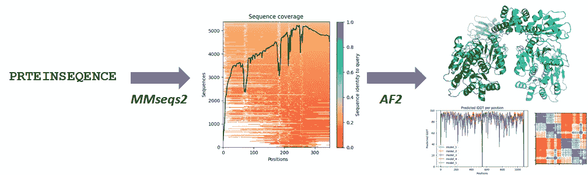
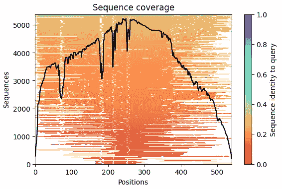
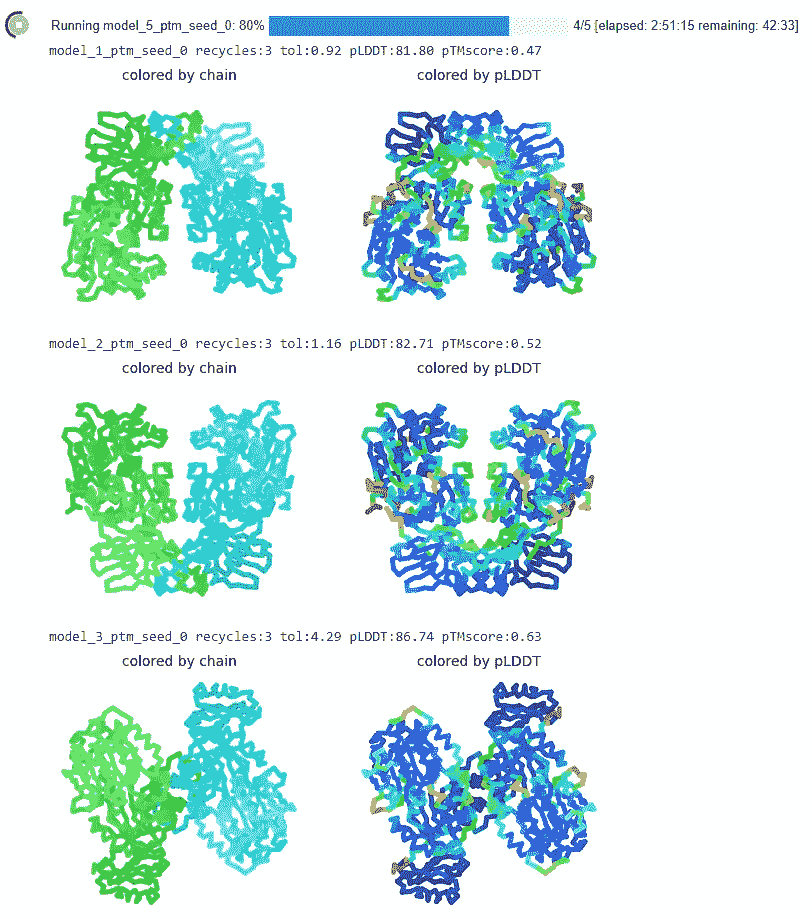
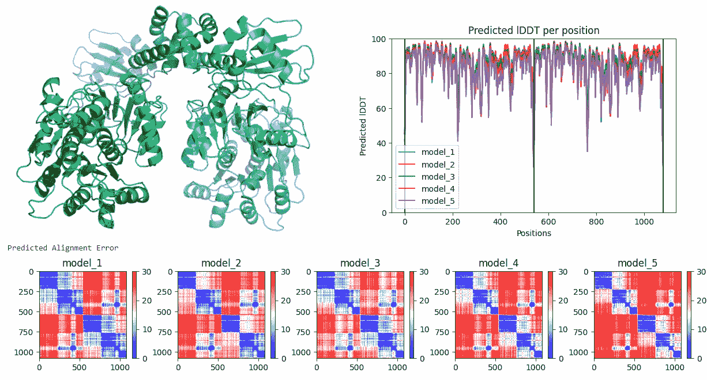

# AlphaFold 上的宣传随着这种新的预印本不断增长

> 原文：<https://towardsdatascience.com/the-hype-on-alphafold-keeps-growing-with-this-new-preprint-a8c1f21d15c8?source=collection_archive---------26----------------------->

## 查看这项新工作，通过将 AlphaFold2 与强大的蛋白质序列匹配器 MMseqs2 集成，使 alpha fold 2 的全部功能变得更加大众化。

这个故事介绍了 ColabFold，这是一套 Google Colab 笔记本，它将一种强大而快速的序列匹配方法与 AlphaFold2 相结合，同时还公开了它的所有功能，以便在全球范围内免费访问蛋白质建模的最新技术。文本“蛋白质”不是打印错误，而是代表真实的标准氨基酸的单字母代码。图由作者根据自己的截图合成。

## 通过将 AlphaFold2 与 MMseqs2 套件集成用于计算多序列比对，第一个正式发布的*cola bfold*——正如其作者所命名的——允许用户在没有任何硬件或软件负担的情况下最大限度地利用 AlphaFold:预测单体蛋白质及其同源和异源复合物的结构，通过分子动力学模拟对它们进行精炼，并通过预测模型质量的指标对它们进行评分。

我相信你在 2020 年末读到过 AlphaFold，当时它在蛋白质结构建模方面“赢得了”CASP14“竞赛”，在 2021 年 7 月同行评审论文和人工智能模型发布时也读到过。如果不是，或者如果你想更新什么是蛋白质结构，为什么生物学家几十年来祈祷程序能够准确预测它们，以及 AlphaFold 如何工作和执行，然后检查[这个故事](/google-colab-notebooks-are-already-running-deepminds-alphafold-v-2-92b4531ec127)和[这个](/alphafold-based-databases-and-fully-fledged-easy-to-use-alphafold-interfaces-poised-to-baf865c6d75e)，然后回到这里。

这个新故事给你带来了最新的消息，基于刚刚出版的预印本。

**目录**

*   [**简介**](#df75)
*   [**用 MMseqs2 优化生成蛋白质序列比对改进了模型并减少了运行时间**](#1b28)
*   [**超越单体“分离”蛋白质的简单建模**](#4aeb)
*   [**口味适合外行和高级用户**](#c338)
*   [**质量估计**](#4adb)
*   [**完全在线可视化的结果——实例运行**](#fc34)
*   [**结束语**](#d8b8)
*   [**链接到文献、代码和笔记本**](#581f)

这个故事是基于刚刚在 bioRxiv 上发布的预印本，它正式描述了一个在 moto *下被称为 *ColabFold* 的工具，该工具使所有*人都可以访问蛋白质折叠(我宁愿将其称为*使所有*人都可以访问 ***现代蛋白质结构建模*** *)。*

由德国马克斯·普朗克生物物理化学研究所的米洛特·米尔迪塔、美国哈佛大学的谢尔盖·奥夫钦尼科夫和韩国首尔国立大学的马丁·斯坦内格创建的 ColabFold 是一套从早期原型演变而来的谷歌 Colab 笔记本电脑，允许用户只拥有一台计算机、互联网连接和一个免费的谷歌帐户，在谷歌提供的硬件上使用最新的尖端机器学习技术来运行蛋白质结构预测；此外，受益于一些优化，减少了运行时间，而不影响结果的质量，并利用现代工具快速生成多个蛋白质序列比对-正如我在其他故事中解释的那样，这对确保准确的结果很重要。

更准确地说，ColabFold 允许用户运行 AlphaFold2 或 RoseTTAFold(一个基于学术人工智能的程序，来自贝克实验室，蛋白质结构预测的学术领导者之一，它出现在 CASP14 之后，因此尚未正式评估，但显然与 AlphaFold2 的性能接近)，并结合 MMseqs2 程序的快速多序列比对生成。用户也可以上传他们自己的比对，这对于非常复杂的蛋白质或蛋白质家族，或者来自专有数据(如宏基因组学项目)的比对来说可能很方便。

**使用 MMseqs2 优化生成蛋白质序列比对改进了模型并减少了运行时间**

正如近年来 CASP 论文中广泛显示的(例如参见[我的同行评审 CASP13 评估](https://onlinelibrary.wiley.com/doi/full/10.1002/prot.25787))，所有这些方法的性能的关键在于计算大量的多重序列比对，在理想情况下，大量的序列平滑地覆盖了整个靶蛋白。因此，比对的初始编译至关重要。更复杂的是，典型的蛋白质序列数据库包含数百万到数十亿个序列，但当然只有非常小的子集对应于相同结构家族的蛋白质，这些蛋白质是人们想要在多序列比对中显示的蛋白质。这就是 ColabFold 的 MMseqs2 组件的用武之地。

Martin Steinegger 和 Johannes Sö ding 的 MMseqs2 是一个在巨大的序列数据库中搜索敏感蛋白质序列的程序。我不会进入任何细节，但描述 MMSeqs2 的[论文可能会引起数据科学家的兴趣，因为该程序的核心目标是加速序列搜索。ColabFold 通过对专用服务器的 API 调用来执行 MMseqs2 程序。作者优化了他们的序列数据库中包含的蛋白质序列的大小和可变性，以便通过反复运行该程序几次，他们可以产生大量的、信息丰富但易于处理的比对。在预印本中，作者事实上表明，MMseqs2 产生的这些多序列比对导致 AlphaFold 2 比通过其定制的多序列比对获得的预测更准确，并且运行速度快一个数量级。](https://www.nature.com/articles/nbt.3988)

**超越单体“分离”蛋白质的简单建模**

绝大多数蛋白质不是作为孤立的分子工作，而是作为复合物工作，或者与自身(所谓的同二聚体、同三聚体等，或一般的同寡聚体)或者与其他蛋白质(称为异二聚体、异三聚体等)一起工作。).主要的评价是发现 AlphaFold2 在 CASP14 中“胜出”,是在模拟蛋白质自身的结构方面，但也有一些迹象表明 AlphaFold2 也正确地模拟了蛋白质复合物。Minkyung Baek 和 Yoshitaka Moriwaki 在早期的 Google Colab 笔记本中对此进行了进一步的探索，然后 ColabFold 的作者最终将这种可能性集成到了已发布的笔记本中。因此，ColabFold 用户可以很容易地模拟分离的蛋白质以及它们的同源和异源复合物。对于异源复合物来说，进行比对是很棘手的，但 ColabFold 的作者已经处理了所有这些负担，为用户制作了一个非常简单的界面，只需勾选寡聚化状态并输入相关蛋白质的不同序列。

值得注意的是，AlphaFold 本身无法辨别一种蛋白质是单体的、同二聚体的、与另一种蛋白质是异二聚体的等等。这种信息有时从生物化学或生物物理实验中得知，在这种情况下，它被用作输入。如果没有这方面的提示，那么用户可能应该在不同的模式下运行预测，并严格比较结果。

**普通用户和高级用户的口味**

正如 GitHub 官方页面中所述，ColabFold 包括为不同类型的运行定制的各种笔记本:一个用于 RoseTTAFold，一个用于 AlphaFold2 的简单模式，仅允许运行单体蛋白质，但只需做出最少的决定，另一个用于 AlphaFold2，具有完全暴露的功能，允许完全控制寡聚化状态以及用户可以尝试的其他选项。

根据用户登录 Google Colab 时分配的确切 GPU 资源，可以对多达 1000 到 1400 个氨基酸的蛋白质进行建模，这涵盖了大量感兴趣的蛋白质。对于更大的蛋白质，或者为了更多的隐私或方便，用户也可以获得生成的代码，下载整个 AlphaFold 程序和 MMseqs2 生成的比对，并使用其自己的 GPU 在本地运行一切(甚至可以受益于笔记本中的代码)。

**质量评估**

这些用户友好的界面不仅为用户提供了蛋白质结构的模型，还提供了对它们质量的估计。这样的估计是必不可少的，我认为**和预测本身一样重要，所以它们应该是准确的。这是因为最终用户应该知道模型的哪些区域是可靠的，即可能与真实结构相似，以及哪些区域可能无法很好地预测。当我在 CASP13 ( [这篇学术论文](https://pubmed.ncbi.nlm.nih.gov/31344267/))期间担任学术评估员时，我强调了产生三种质量评估的重要性:一种是测量整体折叠的整体质量，另一种是单独测量每个氨基酸的质量，另一种是测量蛋白质中任何一对氨基酸之间的相对距离和方向的质量。ColabFold 笔记本提供了所有三个指标，如下例所示。**

**结果的完全在线可视化-示例运行**

所有可调变量都输入到一个非常丰富的 GUI 的字段中，在此之上，用户当然可以手动修改代码。但是舒适的界面并不局限于输入。笔记本电脑具有丰富的图形输出，用户可以在运行过程中进行检查，并在最后检查所有的质量评估图，甚至是浏览器中的 3D 模型。

请看我对一种蛋白质进行的实际运行的结果，我知道这种蛋白质是同型二聚体，但我对它的结构知之甚少。在 ColabFold 笔记本中第一次点击安装所需的软件，然后设置蛋白质的序列并告诉笔记本我知道我的蛋白质是同型二聚体之后，我首先运行笔记本的 MMseqs2 模块以获得多序列比对，笔记本将在下一步将其输入 AlphaFold。MMseqs2 返回的校准由该总结图表征，其中我们希望顶部有更多的绿-青-蓝色调，并且理想情况下有更平坦的黑色轮廓，尽管这看起来不太坏:

对测试蛋白质运行 MMSeqs2 的结果，我知道它是同型二聚体。该图描述了 MMseqs2 可以检索的多重序列比对。理想情况下，我们会期望顶部有更多的绿-青-蓝色调，以及更平、更平滑的黑线。但这看起来还不算太糟。作者截图。

一旦比对完成(理想情况下，人们应该下载并探索其序列是否足够好，但这很难，因为 MMseqs2 返回大量的命中结果)，我就进入笔记本的下一个模块，在那里我启动 AlphaFold2。在笔记本运行时，我可以监控 5 个预测模型的生产过程:

随着 AlphaFold 的运行，笔记本显示了产生的模型的静态图像，按链(每条链是一个蛋白质分子，见左边绿色和青色各一个)或预测 LDDT(一种预测蛋白质每个氨基酸模型质量的指标)进行颜色编码。随后，用户可以在 3D 中检查所有的最终模型。作者截图。

在 AlphaFold 运行结束时，我可以在那里检查每个 3D 模型，这要感谢一个 [3Dmol 插件](https://3dmol.csb.pitt.edu/)。请注意，5 个模型中的每一个都有一个平均预测 LDDT 分数，用于对模型进行排序。在这种情况下，所有 5 个模型在整个序列中都相当好(由高 pLDDT 值表示)，并且它们彼此都非常相似，具有相当高的平均 pLDDT。然而，PAE 图确实揭示了形成二聚体的两条蛋白质链的相对位置的一些不确定性(在预测的比对误差图中白色到红色的阴影):

结果是 3D 模型和完整的质量评估指标:对于每个模型，用户得到预测的结构(左上角，在这种情况下用链着色)加上预测的 LDDT 对沿着蛋白质序列的位置的图(右上角，这里两次，因为这被建模为同型二聚体)和预测的比对误差的图(底部，其中同型二聚体的每个蛋白质链相对于自身和相对于另一个链作图)。作者截图。

**通过分子模拟对模型进行改进**

由 AlphaFold 或任何其他建模方法产生的模型可能存在各种问题，例如原子之间的冲突、未实现的相互作用等。当模型被预测为高质量时，通过分子动力学模拟进一步改进它们是有意义的。简而言之，在这种模拟中，蛋白质模型是在全原子水平上描述的，有时甚至有模拟的水分子在周围，并允许在给定的温度和压力下在现实物理中波动。目的是消除任何不切实际的冲突，优化几何结构，并满足相互作用和包装，特别是氨基酸侧链。

有几个程序允许运行分子动力学模拟。用户可以下载所有模型，并在本地计算机上用自己的方法和管道运行这些模拟。但是 ColabFold 允许用户在笔记本上运行模拟，只要模型的平衡版本在适当的位置。

**结束语**

Google Colab 中 MMseqs2 与 AlphaFold2 的结合提供了对蛋白质结构预测技术的免费访问，而不需要任何专门的、昂贵的硬件，也不需要安装任何软件。正如我[在这里](/alphafold-based-databases-and-fully-fledged-easy-to-use-alphafold-interfaces-poised-to-baf865c6d75e)所讨论的，这将会彻底改变生物学，最好的是全世界的研究人员都可以免费使用它。

**链接到文献、代码和笔记本**

预印本位于 bior XIV:[https://www . bior XIV . org/content/10.1101/2021 . 08 . 15 . 456425 v1 . full . pdf](https://www.biorxiv.org/content/10.1101/2021.08.15.456425v1.full.pdf)

ColabFold GitHub，包含所有发布版和原型笔记本的链接:[https://github.com/sokrypton/ColabFold](https://github.com/sokrypton/ColabFold)

Github 中的 MMSE QS 2:[https://github.com/soedinglab/MMseqs2](https://github.com/soedinglab/MMseqs2)

MMseqs2 论文:[https://www.nature.com/articles/nbt.3988](https://www.nature.com/articles/nbt.3988)

我以前在 AlphaFold2 上的故事:

*   查看[这个故事](/google-colab-notebooks-are-already-running-deepminds-alphafold-v-2-92b4531ec127)介绍早期的 Colab 笔记本
*   [这一篇](/alphafold-based-databases-and-fully-fledged-easy-to-use-alphafold-interfaces-poised-to-baf865c6d75e)讨论 AlphaFold2 可能对生物学和机器学习科学产生的影响。

喜欢这篇文章，想给我提示？【**】-谢谢！**

***我是一个自然、科学、技术、编程和 DIY 爱好者。生物技术专家和化学家，在潮湿的实验室和计算机里。我写我广泛兴趣范围内的一切。查看我的* [*列表*](https://lucianosphere.medium.com/lists) *了解更多故事。* [*成为媒介会员*](https://lucianosphere.medium.com/membership) *访问我和其他作家的所有故事，* [*订阅通过邮件获取我的新故事*](https://lucianosphere.medium.com/subscribe) *(平台原创附属链接)。***