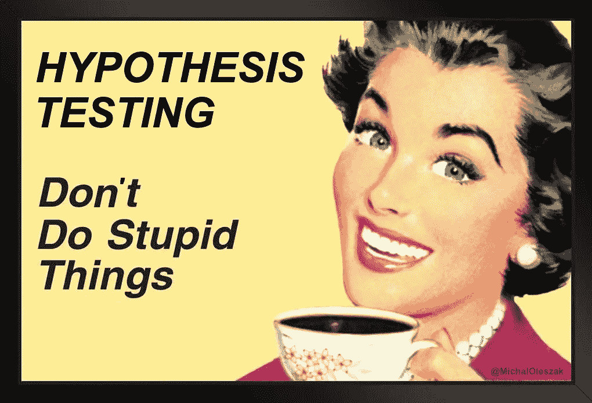
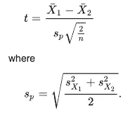
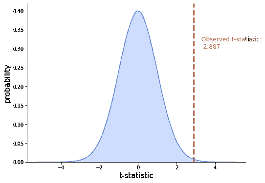
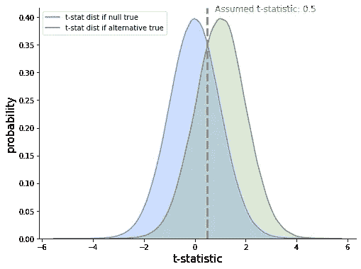

# 假设检验者指南

> 原文：<https://towardsdatascience.com/the-hypothesis-testers-guide-75f7db2e4d0d?source=collection_archive---------27----------------------->

一篇简短的介绍为什么我们可以拒绝假说，但不能接受它们的入门书，有例子和图像。

图片由作者提供。

假设检验是经典统计推断的基础。这是一个在不确定性下做出决定的框架，目标是防止你做出愚蠢的决定——前提是有数据证明他们的愚蠢。如果没有这样的数据… \_(ツ)_/

> 假设检验的目标是防止你做出愚蠢的决定——前提是有数据可以验证他们的愚蠢。

这里的问题是，你只能用假设检验来否定一个愚蠢的选择，但你不能用它来接受一个好的选择。为什么？请继续阅读，寻找答案！

## 建立假设

一切都始于做出一个决定。考虑一下这个:您有一个大型数据处理管道，您认为它太慢了。因此，您重写代码以使用更有效的数据结构，并最终得到一个新的、有希望更快的管道版本。要做的决定是:你应该用新管道替换旧管道吗？

您希望您的决策是由数据驱动的，所以您收集了一些数据。您运行每个管道 50 次，并记录运行时间。旧管道平均需要 41 分钟才能完成，差异为 25。对于新管道，相应的数字是 38 和 29。

> 旧管道运行时间:均值= 41，方差= 38
> 新管道运行时间:均值= 38，方差= 29

现在，新管道的平均运行时间短了三分钟*是因为*它确实更高效，还是这些平均值只是偶然不同？找出答案的一个方法是多次重新记录两个管道的运行时间……但是这将花费更多的时间，不值得。进入假设检验！

在这一点上，你可以制定你的假设。通常，它应该与你实际想要证明的相反，你很快就会明白为什么。在我们的例子中，假设两条管道的平均运行时间实际上是相同的，甚至旧管道更快。这被称为**无效假设**，我们将试图拒绝这种假设。然后，还有另一个**假设**，包含了所有不包含在零中的东西，这里是:新管道更快。

> 通常，零假设被定义为与我们实际想要证明的相反。

零假设通常表示为 H₀，另一个假设表示为 H₁.所以，我们有这个:

> **H₀:旧运行时≤新运行时
> H₁:旧运行时>新 _ 运行时**

很好。现在，它们为什么是这个顺序？为什么不在零假设下假设新管道更快？这是因为零假设应该反映我们的**默认行为**，即:没有任何数据或测试我们会做什么。

在没有任何数据证明新管道更快的情况下，你不会冒着浪费时间和资源的风险在整个公司实施它，是吗？你的**默认动作**是*不要将*切换到新的管道*，除非*数据让我们相信它确实更快，我们应该**拒绝零假设**。

> 零假设反映了我们的默认行为:在没有任何数据或测试的情况下我们会做什么。

我们说过，我们只能拒绝一个假设，而不能接受它。我们有我们的零假设，即新管道实际上是*而不是*更快，这反映了我们没有切换到新管道的默认行为。接下来，我们将基于数据尝试拒绝它。如果我们能做到这一点，我们去新的管道。如果不行，我们就用旧的。

现在你可以明白为什么假设检验可以防止我们做出愚蠢的决定了。另一个假设可能是一个愚蠢的决定。如果不能更快，切换到新管道将是对时间和资源的愚蠢浪费。假设检验阻止我们这样做，除非数据证明新的管道更快，切换实际上并不愚蠢。

> 另一个假设反映了一个潜在的愚蠢决定。假设检验阻止我们去做，除非数据证明不是这样。

如果新的管道确实更快，但数据并不能很好地证明这一点，而我们错误地继续使用旧系统，那该怎么办？嗯……这就是我们在这里冒的风险。稍后详细介绍。

## 数据让你的零假设看起来很蠢吗？

好的，那么我们如何决定是否拒绝零假设呢？我们这样做是基于一种叫做**测试统计**的东西。它是根据某个公式计算出来的一个数字，具体到我们正在进行的测试。一般来说，一个数字要被认为是一个检验统计量，必须满足两个条件:

*   它必须可以从我们收集的数据中计算出来。
*   如果零假设为真，我们需要知道它的分布。

第一部分很简单，我们有两条管道的运行时间，我们可以编造这些数字来得到我们的测试统计数据。第二部分可能需要一些阐述。它说的是，假设零假设是真的，那么假设新管道不是更快，我们知道我们的测试统计有一个特定的分布。我们是怎么知道的？因为已经被证明了。数学上。这就是一些统计学家的谋生之道。

在我们的例子中，我们比较两组的平均值(旧管道和新管道的运行时间)。已经证明，如果真正的平均值相等，并且我们通过偶然性和随机性观察到差异，那么下面的检验统计量具有 t 分布。

t 统计公式，截屏来自维基百科。

顶部带破折号的 *X* s 表示两组的平均值， *s* 表示方差， *n* 表示测量次数，假设两组测量次数相同。回想一下，我们已经测量了每个管道 50 个运行时，所以 *n=50* 。这里没有魔术，一些基本的计算，我们得到我们的测试统计: *t=2.887。*

现在，我们知道**这个检验统计量在零假设**下的分布是一个具有 *(2*n)-2* 自由度的 t 分布——这是学术界的统计学家已经证明的。让我们把这个分布和我们得到的数字进行比较。

98 df 的 t 分布与观察到的测试统计值。图片由作者提供。

我们在这里看到了什么？蓝色密度表示假设空值为真，测试统计值取特定值的概率。不出所料，如果平均值相同，它们之间最有可能的差异是零，而相差五几乎是不可能的。

根据我们的数据计算的 t 统计量等于 2.887。这是什么意思？如果空值为真，那么得到这个值是非常不可能的。所以这两个中的一个刚刚发生了:要么得到 2.887 的极小概率自己实现了，要么零假设是假的。

> 如果新管道不比旧管道快，那么我们得到的 t-统计量将是极不可能的。所以，最有可能的是，零假设是错误的。

考虑到我们得到的这个 2.887，零假设开始看起来很愚蠢。得到 2.887 并且空值仍然为真的几率极小。你可能会问，有多小。量化答案的数字称为 **p 值。**假设零假设为真，p 值是获得 2.887 或更大数值的概率。换句话说，p 值就是蓝色物质与红色虚线右侧的比例。

> p 值是位于红色虚线右侧的蓝色物质的比例。如果零假设为真，这是我们得到 t-统计的概率(或者更极端的概率)。

在这种情况下，p 值等于 0.00479，或 0.479%，表明零假设很可能是错误的。因此，我们拒绝它:我们宣布新的管道更快，我们高兴地切换到它！

## 我们能有多确定？

我们在这里所冒的风险是，空值实际上是真的，并且发生概率大约为 0.5%(即 200 次中有 1 次)的极不可能的事件已经发生。如果是这种情况，我们已经错误地拒绝了一个好的零假设或切换到一个新的更快的管道，这被称为**假阳性**或**类型 1 错误。**

这是我们必须接受的事实——犯这种错误的可能性只有 0.5%。如果我们一丝不苟，我们会在计算任何东西之前选择一个**显著性水平**。显著性水平是我们可以容忍的犯第一类错误的概率。特定值将取决于业务环境，例如，犯错误的成本。但是一般来说，我们可以说，错误拒绝零的概率不大于 1%。由于我们的 p 值小于这个值，我们可以安全地拒绝空值。

> 如果 p 值小于我们的显著性水平(可接受的风险水平)，我们拒绝零假设。

但是想象一下，切换到新的管道需要关闭公司的所有系统一段时间。这是一笔巨大的成本，只有新管道确实更快，我们才能接受。在这种情况下，你的重要性水平可以是，比方说，0.1%，这意味着你只接受 1/1000 的机会切换到一个没有更快的管道。在这种情况下，p 值大于显著性水平，所以不要切换！数据中没有足够的信息让你证明新管道更快。

## 为什么不能接受 null？

所以，我们可以拒绝或不拒绝空值，这取决于我们的风险承受能力。如果我们拒绝零，我们说它是假的。如果我们不这样做，我们会说数据中没有足够的信息来拒绝它。但是为什么我们谈论拒绝，我们不能我们*接受*null 并且说新管道不是更快吗？

想想这个故事。在冰岛的时候，我非常想在野外遇见一只驯鹿。尽管我去过一些高地徒步旅行，但我还没有发现一个。这是否证明冰岛没有驯鹿？

如果我的无效假设是没有，我可以通过发现一只驯鹿来否定它。但是我怎么能接受呢？我可以说:发现驯鹿的几率很小。如果我待久一点，我最终会看到一个。

回到我们的数据。看一下这个情节。

蓝色:如果零假设成立，t 统计量的分布。格林:如果另一个假设成立。图片由作者提供。

如果零假设为真，蓝色密度也是 t 统计量的密度。但是如果它不是真的，那么 t 统计量可以有任何其他的分布。假设它有绿色的(现实中我们不知道)，想象我们已经从数据中计算出我们的 t 统计量为 0.5

在零假设下，我们得到的 t 统计量是很可能的，所以我们不会拒绝它。但是在绿色分布下，这种可能性很大！因为我们不知道绿色，我们无法知道它是否更有可能在它下面。

> 当 t-统计量在空值下不太可能出现时，我们拒绝将空值作为假值。但是如果它非常有可能，在其他分布下它仍然可能更有可能。因此，我们永远不能接受零——我们只能不拒绝。

## 去贝氏是值得的！

所有这些都是所谓的经典统计学。如果它没有引起你的共鸣，并且你觉得 p 值阈值和置信水平有些武断，那可能是你本质上是贝叶斯主义者！

</the-gentlest-of-introductions-to-bayesian-data-analysis-74df448da25> 

感谢阅读！

如果你喜欢这篇文章，为什么不 [**订阅邮件更新**](https://michaloleszak.medium.com/subscribe) 我的新文章呢？并且通过 [**成为媒介会员**](https://michaloleszak.medium.com/membership) ，可以支持我的写作，获得其他作者和我自己的所有故事的无限访问权限。

需要咨询？你可以问我任何事情，也可以在这里 为我预约 1:1 [**。**](http://hiretheauthor.com/michal)

也可以试试 [**我的其他文章**](https://michaloleszak.github.io/blog/) 中的一篇。不能选择？从这些中选择一个:

</data-measurement-levels-dfa9a4564176>  </monte-carlo-dropout-7fd52f8b6571>  </handling-missing-data-5be11eddbdd> 