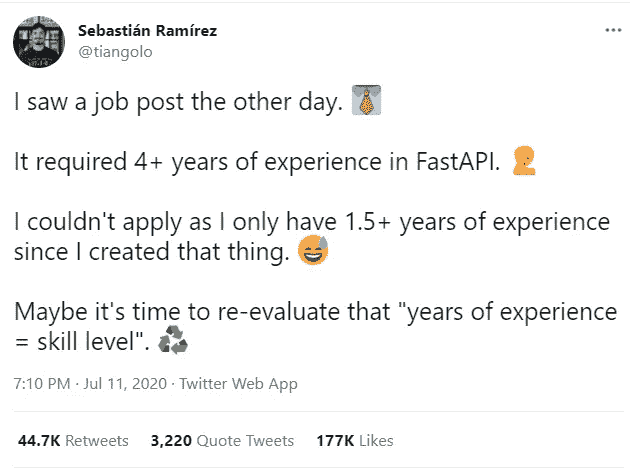
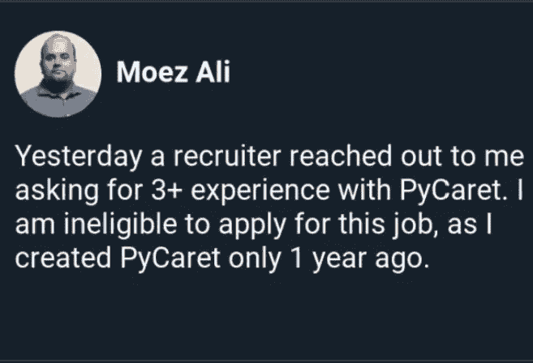

# 理想的数据科学家并不存在(招聘经理也知道这一点)

> 原文：<https://towardsdatascience.com/the-ideal-data-scientist-doesnt-exist-and-hiring-managers-know-this-d507723a9804?source=collection_archive---------17----------------------->

## [办公时间](https://towardsdatascience.com/tagged/office-hours)

## 窥探招聘经理的心思

你不能读她的想法，是吗？(Unsplash 上 Dollar Gill 的照片)

你有没有盯着招聘启事，担心自己还没有技能？

你曾经希望进入招聘经理的思维吗？

你有没有申请过多份工作却没有任何回音的经历？

我有。我有。当然，我有。

我知道你至少回答了*问题中的一个*，如果不是全部三个的话。在我旅程的不同点，我也有同样的问题。当我觉得[我已经学到了足够的数据科学知识，并建立了一个投资组合](/your-data-science-journey-kickstarts-here-9aa0253bd182)时，我开始在网上申请工作。很快，我意识到典型的策略是可怕的。

所以我稍微改变了策略。我会将我的简历定制为更少的职位，并从我的关系网中的某个人那里请求推荐。效果更好，但当我走进面试时，我不知道招聘经理在找什么。

我笨手笨脚，因为我没有信心。这种情况持续了一段时间，直到我幸运地获得了突破。进入这个领域和行业四年后，我意识到我一直是愚蠢的。是啊，*蠢*是对的词。

在这篇文章中，我将清除你头脑中所有的神话和疑虑，当我们完成时，你将有一个明确的战略来攻击你的数据科学求职。相信我，一直读到最后。

# 以下是对招聘经理想法的一次窥探

这是几年前的一个真实故事。随着新的潜在项目的出现，需要雇佣一批数据科学家。很快，我们就开始概述工作描述，并在网上发布广告。

数据科学的负责人，也是招聘经理，接手了这件事。当我们看到最终确定的职位描述时，我们很困惑。我们是一群经验不足三年的数据科学家，但新的数据科学家必须有至少五年的经验。反正广告就是这么说的。

作为一名好奇的队员，我问他发生了什么事。他告诉我的事情让我吃惊:

> “如果有人有 5 年的经验呢？你知道，有经验的人总是更好，我们可以向他们学习。如果我们只要求 3 英镑，他们绝不会申请。”

很聪明，但是有个问题。

我通知了一位正在寻找这个职位空缺机会的前同事。尽管提醒了他两次，我还是没有收到他的简历和申请。我以为他有其他的计划，就让它保持原样。

几个月后，当我见到他时，他仍然对机会敞开大门。我准备给他介绍一份他非常适合的工作，但他忽略了这一点，但他仍在寻找机会。这说不通。他为什么要这么做？

> “伙计，我看了你分享的工作细节，我想他们在找一个资深的人。我还没到那一步。我仍然需要提高我的数据科学技能。我知道我不适合，所以申请没有意义。”

你知道这是什么意思吗？一方面，招聘经理为理想的候选人创造职位描述，尽管他们知道这些职位描述并不存在。另一方面，合适的候选人因为要求的技能不合理而犹豫申请。

作为数据科学的追求者，我们无法控制招聘经理做什么，但我们可以更好地解释工作要求。

## 这对您意味着什么:

大多数职位描述都是招聘经理的愿望清单，他们不想错过理想的候选人。句号。

他们知道理想的人几乎不存在，对于那些不完全符合他们要求的人，他们完全没有意见。

该行业的大多数专业人士都知道发生了什么，但有抱负的数据科学家却不知道这一点。 [Sebastián Ramírez](https://medium.com/u/963974981597?source=post_page-----d507723a9804--------------------------------) 需要在他 1.5 年前创建的图书馆中积累 4 年的经验。[py caret 库的创建者 Moez Ali](https://medium.com/u/fba05660b60f?source=post_page-----d507723a9804--------------------------------) 也遇到了类似的情况。

作者截图(来源:[推特](https://twitter.com/tiangolo/status/1281946592459853830) & [LinkedIn](https://www.linkedin.com/feed/update/urn:li:activity:6787238044996026368?updateEntityUrn=urn%3Ali%3Afs_feedUpdate%3A%28V2%2Curn%3Ali%3Aactivity%3A6787238044996026368%29) )

那么这个问题的解决方法是什么呢？批量应用不会解决这个问题；这会让事情变得更糟。答案是一种叫做“60%规则”的东西，我们即将解读它。

# 在申请工作之前使用这个“60%规则”

我读过的关于在数据科学领域建立职业生涯的最好的书之一是 Emily Robinson 和 Jacqueline Nolis 写的。在所有有价值的信息中，有一个想法脱颖而出，与我的策略产生了共鸣。

这是 60%规则。

> “如果你达到了工作要求的 60%以上，你就已经为这份工作做好了准备。别再想了，去申请吧。”

在这个行业工作了将近 4 年，我可以保证这是真的。一旦你进入这个行业，你会直觉地理解这是可行的，但是请相信我们，暂时使用这个规则。

## 这对您意味着什么:

每当你看到一份工作描述时，要对自己诚实。

问自己一些这样的问题:

*   如果这个职位需要 3 年的工作经验，问我是否有至少 2 年的工作经验？
*   如果他们要求你了解 R、Python 和 Scala，我至少了解其中的两种吗？
*   Scikit-learn、Tensorflow 和 PyTorch。我对三分之二中的任何一个满意吗？
*   你明白了。一言以蔽之，如果他们列出了 10 项要求，我是否至少满足了其中的 6 项？

要诚实，不要想太多。

正确的应用会给你必要的自信，这对于面对接下来的面试是至关重要的。现在，你已经理解了招聘经理的心态。你也知道选择你要申请的工作。接下来你会做什么？

# 如何确保自己非常适合

[推荐帮助你最大化机会](https://pub.towardsai.net/you-will-never-succeed-if-you-keep-applying-for-jobs-online-1107ccbc9ac9)。但说实话，这并不总是可能的。在这种情况下，你应该试着定制你的简历以适应你申请的工作。

下面是如何做到这一点:

*   你可以从工作描述中列出的技能开始，选择你擅长的技能。
*   确保在你的简历中使用这些关键词。如果招聘人员通过自动申请跟踪系统(ATS)手动扫描或运行你的简历，你肯定会非常适合。
*   求职者最常犯的错误是增加他们不熟悉的技能。不要成为他们。当测试这些技能时，他们最终会在面试中笨手笨脚。你不需要知道所有的事情，但是你应该知道你简历上的所有事情。

我知道这个建议听起来很简单，但你不会相信很少有人遵循它。暂停一秒钟，试着回忆一下你最后一次为一个工作角色定制简历的时间。你可能会用同一个简历申请多份工作——我也是。

闯入数据科学的艺术在于少申请，确保你脱颖而出。

# 您可操作的外卖

打入数据科学领域很难。招聘经理不切实际的期望让情况变得更糟。我们要么继续大量申请，但没有任何回应，要么干脆不申请。

我们对该行业的运作方式无能为力，但以下是我们能做的最大化机会的回顾:

*   让我们[停止批量申请工作](/how-to-secure-your-first-data-science-internship-7bbfd8b87bdc)。这绝不会有任何好处。
*   请花时间阅读职位描述。
*   要明白这些职位描述仅仅是招聘经理的愿望清单。
*   [不要被职位名称](/5-lessons-i-wish-id-known-when-i-started-learning-data-science-1a90a4d2a7e7)所欺骗，而是要深入了解所需的技能。
*   看看你是否符合最低 60%的技能要求。什么事？你有机会做这份工作，否则就去做下一份。
*   根据你申请的职位定制你的简历。使用准确的关键字。
*   面试高手。你能行的！

我使用了这个策略，并开始得到更多的回应，并最终得到了公司的邀请。我很乐观这对你有用。你没什么可失去的，但会有很多收获。

试一试？

*想了解更多关于数据科学、真实体验和学习的有用见解，请考虑* [***加入我的电子邮件好友私人列表*** *。*](https://friends.arunnthevapalan.com/)