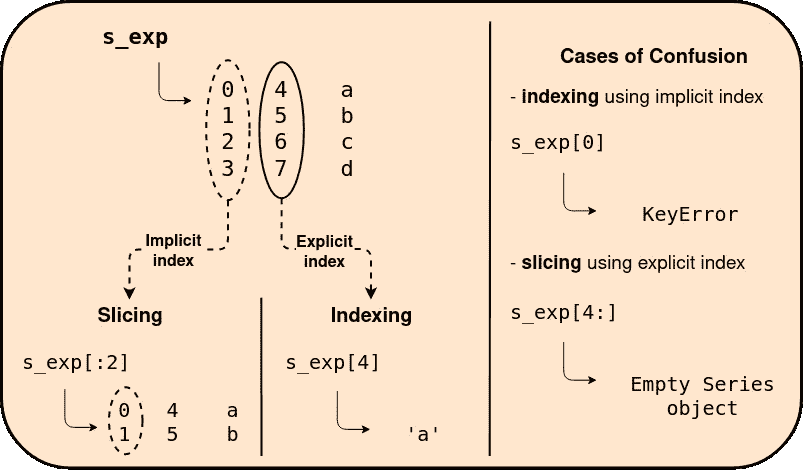

# 图示的 loc 和 iloc 事件

> 原文：<https://towardsdatascience.com/the-illustrated-loc-and-iloc-affair-75b3f378aaf0?source=collection_archive---------26----------------------->

## 熊猫基于索引的数据选择可视化指南

在这个高效咀嚼和处理数据的时代， [*熊猫*](https://pandas.pydata.org/) 库已经成为每个数据科学家的面包和黄油。该库具有过多的数据操作能力，其中，我们在这里的重点在于*系列*和*数据框架*对象中的*基于索引的数据选择*。虽然这个主题在过去已经得到了一些实际的关注，但是这里特别强调两个著名索引器存在背后的动机

图片由作者提供，使用[图](https://app.diagrams.net)制作。

首先，让我们看一下下图，其中我们构造了两个名为 *s_imp* 和 *s_exp 的**系列** 对象。*后缀 *_imp* 和 *_exp* 表示隐式和显式索引。

阐释了隐式和显式索引的 series 对象 s_imp 和 s_exp。请注意，当显示 s_imp(左)时，Jupyter notebook 输出隐式默认索引[0，1，2，3]，而在 s_exp(右)的情况下，Jupyter notebook 仅输出显式索引[4，5，6，7]和数据['a '，' b '，' c '，' d']作为输出。虚线椭圆所包围的隐式(默认)基于整数的索引只是为了清楚起见。图片由作者提供，使用[图](https://app.diagrams.net)制作。

如上所示，默认情况下，两个 series 对象都包含一个隐式生成的基于整数的索引，从 0 开始。在 *s_imp* 的情况下，默认隐式索引是其唯一的索引，而在 *s_exp* 的情况下，它最终有两个，即从 0 开始的隐式默认基于整数的索引和从 4 开始的显式用户定义索引。起初，这似乎是好的；但是，在执行基于索引的数据选择时，这可能会导致不必要的混乱。例如，让我们考虑先前定义的*系列*对象 *s_exp* 并执行一些操作，如*索引*和*切片*，见下文

演示了使用显式索引的 series 对象 s_exp 的索引和切片操作(左)，以及混淆的情况(右)。注意，由虚线椭圆包围的隐式缺省的基于整数的索引仅仅是为了清楚起见。图片由作者提供，使用[图表](https://app.diagrams.net)制作。

如上图所示， *s_exp* 使用显式用户定义索引[4，5，6，7]进行*索引*，使用隐式默认索引[0，1，2，3]进行*切片*。尽管这些隐式-显式索引选择是在幕后进行的，但记住特定于操作的索引可能会令人困惑。因此，这就是为什么*熊猫*提供两个独立的索引器的特殊原因🎉 *loc* 和 *iloc —* 一个用于使用显式用户定义索引( *loc* )，另一个用于使用隐式默认索引( *iloc* )。这非常方便，因为拥有独立索引器的主要目的是帮助避免不必要的混乱，见下文

说明了使用 loc 和 iloc 索引器的索引和切片操作。仔细观察术语 iloc，“I”可能意味着隐式或基于整数。类似地，术语“loc”也可以被认为是“locator”的残词。这里我们选择“iloc”作为隐式索引器来调用。请注意，右下角单元格中的隐式默认基于整数的索引只是为了清晰起见而举例说明的。图片由作者提供，使用[图表](https://app.diagrams.net)制作。

此外，仔细观察上面的*切片*操作，您可以观察到 *loc* 步进器包括最后一个步进 5，而 *iloc* 步进器符合标准切片规则，即不包括最后一个步进 2。这非常方便，因为显式索引也可以是 string 类型,而隐式索引默认从 0 开始基于整数。请参见下图，其中使用基于字符串的索引序列执行切片操作

说明了使用 loc 和 iloc 索引器(定位器)对具有显式定义的基于字符串的索引(标签)的序列进行切片操作。注意使用 loc 的切片操作。loc 包括标签“三”,而使用 iloc 索引器的切片操作忽略相应的基于整数的索引 2。虚线椭圆所包围的隐式默认基于整数的索引只是为了清楚起见。图片由作者提供，使用[图](https://app.diagrams.net)制作。

到目前为止，上面的插图只集中在*系列的*物体上。但是， **DataFrame** 对象中的隐式-显式索引呢？还有， *loc* 和 *iloc* 索引器如何适用于数据帧？

从技术上来说，一个简单的二维*数据帧*对象是一组*系列*对象的集合，其中每个系列都被赋予一个名称标签，也就是标签，并且，比方说，出于视觉目的，它们被放置在彼此旁边。结果，我们得到了一个包含行和列的二维数据结构，其中每行有一个索引，每列有一个标签。然而，为了一致性，让我们坚持使用列索引而不是列标签。现在，当一个*数据帧*对象建立在一个*系列*对象上时，在前面的插图中展示的隐式和显式索引的存在也可以在数据帧中观察到。事实上，在显式索引的数据帧中，*数据帧*对象包括两对索引，即隐式-显式行索引对和隐式-显式列索引对。例如，请参见下面两个插图，它们展示了隐式索引数据帧和显式索引数据帧之间的差异。第一个图示展示了具有默认的基于整数的行和列索引的隐式索引数据帧，而第二个展示包括由隐式-显式索引对组成的显式索引数据帧，即隐式默认的基于整数的索引和显式用户定义的索引。

详细说明了隐式索引的数据帧。图片由作者提供，使用[图](https://app.diagrams.net)制作。

说明了一个显式索引(带标签)的数据帧，其中显式行和列索引是字符串类型的，隐式默认行和列索引是基于整数的。请注意，虚线椭圆所包围的隐式行和列索引只是为了清晰起见而展示的。图片由作者提供，使用[图表](https://app.diagrams.net)制作。

通常，当使用显式定义的基于字符串的行和列索引时，如上所示，术语*索引*经常与*标签*互换。因此，产生了类似于*行-* 和*列-标签*的术语来代替*行-* 和*列-索引*。此外，将*数据帧*对象的构造函数中的关键字参数 index 和 columns 重命名为 *row_index* 和 *column_index* 有助于命名的一致性。然而，让我们不要在这里进入命名约定，因为这纯粹是一个品味问题，可能是一个故事本身😉

因此，继续深入，数据帧在许多方面类似于二维结构化数组。因此，为了执行传统的类似数组的索引，上述隐式索引方案起着至关重要的作用。使用 *iloc* 步进器，可以执行如下所示的阵列式步进

示例说明了使用 iloc 索引器对显式索引的数据帧 df_exp 进行类似数组的索引和切片操作。同样的类似数组的索引也适用于隐式索引的数据帧 df_imp。请注意，虚线椭圆所包围的隐式行和列索引只是为了清晰起见而展示的。图片由作者提供，使用[图](https://app.diagrams.net)制作。

当然，上述索引和切片操作也可以使用 *loc* 索引器来执行，其中它利用显式行和列索引(标签)，例如 *df_exp.loc['r1 '，' c2']* ，而不是默认的基于整数的索引。此处不提供图示，因为它被省略作为读者的练习😜然而，出于好奇， *pandas* 确实提供了一个叫做 *ix* 的混合索引器，它能够同时利用隐式和显式索引。然而，自 2018 年以来，这种新的索引器已被弃用，因为它有可能导致不必要的混乱，而这正是 *loc* 和 *iloc* 首先想要避免的😄

所以，这让我们结束了 *loc* 和 *iloc* 事件。希望上面的插图已经清楚地展示了*系列*和*数据帧*对象中隐式和显式索引之间的区别，更重要的是，帮助您理解拥有两个独立的索引器，显式( *loc* 和隐式( *iloc* )背后的真正动机。谢谢你🙏